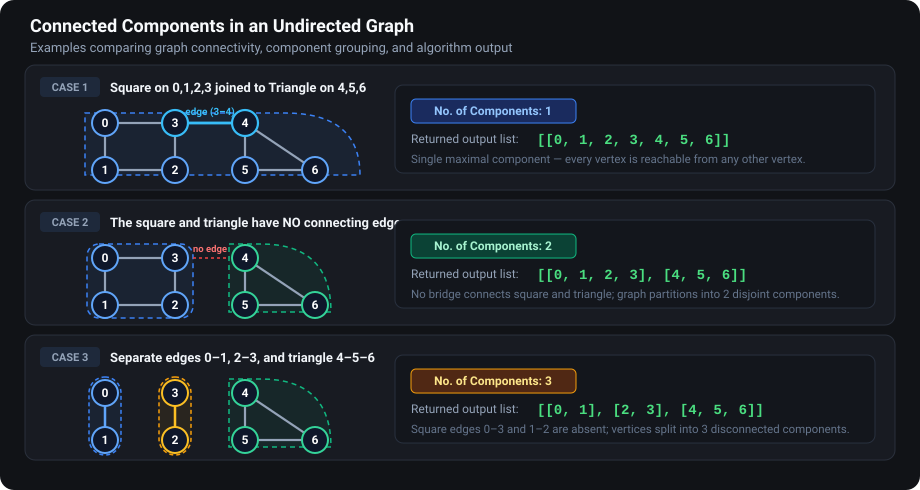

## Q1. Get Connected Components of an Undirected Graph

A connected component is a maximal group of vertices in which every vertex can be reached from every other vertex. Return a list of components, with each component containing its vertices.





### DFS approach

1. Create one visited array for the entire graph and an empty result list.
2. Scan all vertices from `0` to `V - 1`.
3. Whenever a vertex is unvisited, create a fresh temporary component list and start DFS there.
4. DFS marks the current vertex and adds it to that component, then explores its neighbours.
5. After DFS returns, append the completed component to the result.


### Java DFS

```java
static void visit(List<List<Integer>> graph, int v, boolean[] vis,
                      List<Integer> component) {
        if (vis[v]) return;
        vis[v] = true;
        component.add(v);
        for (int nbr : graph.get(v)) {
            visit(graph, nbr, vis, component);
        }
    }

    static List<List<Integer>> componentsDfs(List<List<Integer>> graph) {
        boolean[] vis = new boolean[graph.size()];
        List<List<Integer>> result = new ArrayList<>();
        for (int v = 0; v < graph.size(); v++) {
            if (!vis[v]) {
                List<Integer> component = new ArrayList<>();
                visit(graph, v, vis, component);
                result.add(component);
            }
        }
        return result;
    }
```

### C++ DFS

```cpp
void visit(const vector<vector<int>>& graph, int v, vector<bool>& vis,
           vector<int>& component) {
    if (vis[v]) return;
    vis[v] = true;
    component.push_back(v);
    for (int nbr : graph[v]) {
        visit(graph, nbr, vis, component);
    }
}

vector<vector<int>> componentsDfs(const vector<vector<int>>& graph) {
    vector<bool> vis(graph.size(), false);
    vector<vector<int>> result;
    for (int v = 0; v < (int)graph.size(); v++) {
        if (!vis[v]) {
            vector<int> component;
            visit(graph, v, vis, component);
            result.push_back(component);
        }
    }
    return result;
}
```


      
 

 ## BFS way

```java
static List<List<Integer>> components(List<List<Integer>> graph) {
    boolean[] visited = new boolean[graph.size()];
    List<List<Integer>> answer = new ArrayList<>();

    for (int start = 0; start < graph.size(); start++) {
        if (visited[start]) continue;

        List<Integer> component = new ArrayList<>();
        Queue<Integer> queue = new ArrayDeque<>();
        visited[start] = true;
        queue.offer(start);

        while (!queue.isEmpty()) {
            int u = queue.poll();
            component.add(u);
            for (int v : graph.get(u)) {
                if (!visited[v]) {
                    visited[v] = true;
                    queue.offer(v);
                }
            }
        }
        answer.add(component);
    }
    return answer;
}
```

### C++ BFS

```cpp
vector<vector<int>> componentsBfs(const vector<vector<int>>& graph) {
    vector<bool> visited(graph.size(), false);
    vector<vector<int>> answer;
    for (int start = 0; start < (int)graph.size(); start++) {
        if (visited[start]) continue;
        vector<int> component;
        queue<int> q;
        visited[start] = true;
        q.push(start);
        while (!q.empty()) {
            int u = q.front();
            q.pop();
            component.push_back(u);
            for (int v : graph[u]) {
                if (!visited[v]) {
                    visited[v] = true;
                    q.push(v);
                }
            }
        }
        answer.push_back(component);
    }
    return answer;
}
```


- Number of components: `answer.size()`
- Time: $O(V+E)$
- Space: $O(V)$ excluding the returned output


#  Q2. Count Islands in a Binary Grid


A cell containing `1` is land and `0` is water. Connected land cells form one island.

```text
1 1 0 0 0
0 1 0 0 1
1 0 0 1 1
0 0 0 0 0
```

The key conversion is:

```text
land cell       → graph vertex
allowed move    → graph edge
island          → connected component
```

Now the familiar connected-components pattern applies: scan every cell; whenever an unvisited land cell is found, increment the answer and traverse its complete component.

## Approach 1 — DFS

The lecture implementation explores all eight surrounding positions. If a problem specifies only horizontal/vertical adjacency, replace the direction arrays with the four cardinal moves.

```java
static final int[] DR = {-1,-1,-1, 0,0, 1,1,1};
static final int[] DC = {-1, 0, 1,-1,1,-1,0,1};

static int countIslands(int[][] grid) {
    int rows = grid.length;
    int cols = grid[0].length;
    boolean[][] visited = new boolean[rows][cols];
    int islands = 0;

    for (int r = 0; r < rows; r++) {
        for (int c = 0; c < cols; c++) {
            if (grid[r][c] == 1 && !visited[r][c]) {
                islands++;
                dfs(grid, r, c, visited);
            }
        }
    }
    return islands;
}

static void dfs(int[][] grid, int r, int c, boolean[][] visited) {
    visited[r][c] = true;

    for (int k = 0; k < DR.length; k++) {
        int nr = r + DR[k];
        int nc = c + DC[k];
        if (inside(grid, nr, nc)
                && grid[nr][nc] == 1
                && !visited[nr][nc]) {
            dfs(grid, nr, nc, visited);
        }
    }
}

static boolean inside(int[][] grid, int r, int c) {
    return r >= 0 && r < grid.length && c >= 0 && c < grid[0].length;
}
```

## Approach 2 — BFS

Use a queue instead of recursion. This has the same asymptotic complexity and avoids a stack overflow on a very large island.

- Time: $O(RC)$
- Space: $O(RC)$ in the worst case

## Important modelling decision

Always read the adjacency rule:

- 4-direction: up, down, left, right
- 8-direction: also includes diagonals

The same matrix can have a different island count under these two definitions.

---

 
  ## Q3. Is the Graph Connected?

An undirected graph is connected when every vertex is reachable from every other vertex. Use the same component traversal and return `true` exactly when the number of components is one.

Alternatively, run DFS from one vertex and check whether every vertex was visited. If using the outer-loop approach, finding a second unvisited starting vertex is enough to return `false`: it starts a second component. This refers to a second **outer-loop DFS start**, not to the recursive calls within the first traversal. Here an empty graph returns `false`.

### Java

```java
static boolean isConnected(List<List<Integer>> graph) {
        return componentsDfs(graph).size() == 1;
    }
```

### C++

```cpp
bool isConnected(const vector<vector<int>>& graph) {
    return componentsDfs(graph).size() == 1;
}
```

Both versions use the DFS component function above.

## Q4. Perfect Friends: Pairs from Different Components

There are `n` students with IDs `0` through `n - 1`. The next `k` pairs describe students belonging to the same club. Build an undirected graph by adding each pair in both directions. Students connected directly or indirectly belong to the same group. Count unordered pairs of students from different groups.

The input uses `n` on the first line, `k` on the second, then `k` lines containing two student IDs. The code only needs neighbours; no edge weight is required.

You need to find how many ways we can form a pair of students from different clubs.

```text
7
5
0 1
2 3
4 5
5 6
4 6
```

Output:

```text
16
```

The components are `[[0,1],[2,3],[4,5,6]]`, with sizes `2,2,3`. 


No of pairs of students from different components = 2 * 2 + 2 * 3 + 2 * 3 = 4 + 6 + 6 = 16


Students `0` and `1` can each pair with `2,3,4,5,6`, giving `10` pairs. Students `2` and `3` can each pair with `4,5,6`, giving another `6`. Reversing a pair does not create a new pair.

### Approach 1: Multiply the sizes of each pair of components

If component sizes are `s0, s1, ..., s(c-1)`, then:

```text
answer = sum(si * sj) for every i < j
       = 2*2 + 2*3 + 2*3
       = 16
```

First collect all components using DFS. For every component index `i`, loop through `j = i + 1` onward and add the product of their sizes. The `j > i` condition prevents counting the same unordered pair twice.

For five components, there are `5 choose 2 = 10` component pairs: `C1C2, C1C3, C1C4, C1C5, C2C3, C2C4, C2C5, C3C4, C3C5, C4C5`. For the drawn component sizes `3,2,4,5,3`, `C1C2` contributes `3*2 = 6`, while `C1C3` contributes `3*4 = 12`. Each product counts student pairs, not just the choice of clubs.

The pair-counting phase takes `O(c²)` time, where `c` is the number of components. Including graph traversal, total time is `O(V + E + c²)`.

### Java

```java
static long pairsByComponents(List<List<Integer>> components) {
        long pairs = 0;
        for (int i = 0; i < components.size(); i++) {
            for (int j = i + 1; j < components.size(); j++) {
                pairs += (long) components.get(i).size() * components.get(j).size();
            }
        }
        return pairs;
    }
```

### C++

```cpp
long long pairsByComponents(const vector<vector<int>>& components) {
    long long pairs = 0;
    for (int i = 0; i < (int)components.size(); i++) {
        for (int j = i + 1; j < (int)components.size(); j++) {
            pairs += (long long)components[i].size() * components[j].size();
        }
    }
    return pairs;
}
```

Pass the components returned by the DFS component function to these methods.

### Approach 2: Count each component against all remaining students

Track the number of vertices in previously processed components. For each new component:

```text
current = size of the component just visited
remaining = n - previous - current
pairs += current * remaining
previous += current
```

The handwritten counter-based implementation increments a shared `visited` count during DFS and resets that count to zero after each component. Returning the component size from DFS expresses the same counting logic without a shared counter. Use `long` in Java and `long long` in C++ for the pair total and products.

| Component | Current size | Previously processed | Remaining | New pairs |
| --- | ---: | ---: | ---: | ---: |
| `{0,1}` | 2 | 0 | `7-0-2 = 5` | 10 |
| `{2,3}` | 2 | 2 | `7-2-2 = 3` | 6 |
| `{4,5,6}` | 3 | 4 | `7-4-3 = 0` | 0 |

Total: `10 + 6 + 0 = 16`.

For components `{0,1,2,3}`, `{5,6}`, and `{7,8,9}`, only these nine vertices are included: `4*5 + 2*3 = 26`. Between the first two groups, the eight pairs are `(0,5), (0,6), (1,5), (1,6), (2,5), (2,6), (3,5), (3,6)`. If the graph instead declares vertices `0..9`, vertex `4` must also be represented, even if isolated.

For a ten-vertex graph with component sizes `4,3,3`:

| Current size | Previous | Remaining | New pairs |
| ---: | ---: | ---: | ---: |
| 4 | 0 | 6 | 24 |
| 3 | 4 | 3 | 9 |
| 3 | 7 | 0 | 0 |

Total: `24 + 9 = 33`. This method takes `O(V + E)` time and `O(V)` auxiliary space.

### Q4.1. Follow-up: Print all valid pairs

For each component, take every student in it and pair that student with every student in each later component. The `printPairs` methods below follow this order, matching the four nested loops: component, student, later component, later student. Printing takes `O(V + E + P)` time including component discovery, where `P` is the number of output pairs; `P` can be quadratic.

### Java

```java
static void printPairs(List<List<Integer>> components) {
        for (int i = 0; i < components.size(); i++) {
            for (int u : components.get(i)) {
                for (int j = i + 1; j < components.size(); j++) {
                    for (int v : components.get(j)) {
                        System.out.println(u + " " + v);
                    }
                }
            }
        }
    }
```

### C++

```cpp
void printPairs(const vector<vector<int>>& components) {
    for (int i = 0; i < (int)components.size(); i++) {
        for (int u : components[i]) {
            for (int j = i + 1; j < (int)components.size(); j++) {
                for (int v : components[j]) cout << u << " " << v << '\n';
            }
        }
    }
}
```


## Q5. Number of Islands: Zero Is Land, Four Directions

In this version, `0` represents land and `1` represents water. Each cell is connected only to its north, east, west, and south neighbours. Count the groups of connected zeroes. This convention is separate from the earlier `1`-as-land, eight-direction examples.

The grid is an **implicit (virtual) graph**: each land cell is a vertex and each allowed move is an edge. There is no need to build adjacency lists. Although stored as a two-dimensional array, this is a grid representation, not a graph adjacency matrix.

### Input and output

Read the row count, column count, and then the grid rows:

```text
8
8
0 0 1 1 1 1 1 1
0 0 1 1 1 1 1 1
1 1 1 1 1 1 1 0
1 1 0 0 0 1 1 0
1 1 1 1 0 1 1 0
1 1 1 1 0 1 1 0
1 1 1 1 1 1 1 0
1 1 1 1 1 1 1 0
```

```text
3
```


### Java program

```java
import java.io.BufferedReader;
import java.io.InputStreamReader;
import java.util.StringTokenizer;

public class ZeroLandIslands {
   
    static void visitChecked(int[][] grid, boolean[][] vis, int i, int j) {
        vis[i][j] = true;
        int[] dr = {1, -1, 0, 0};
        int[] dc = {0, 0, 1, -1};
        for (int k = 0; k < 4; k++) {
            int r = i + dr[k], c = j + dc[k];
            if (r >= 0 && r < grid.length && c >= 0 && c < grid[0].length
                    && grid[r][c] == 0 && !vis[r][c]) {
                visitChecked(grid, vis, r, c);
            }
        }
    }

     static void visit(int[][] grid, boolean[][] vis, int i, int j) {
        if (i < 0 || i >= grid.length || j < 0 || j >= grid[0].length) return;
        if (grid[i][j] == 1 || vis[i][j]) return;
        vis[i][j] = true;
        visit(grid, vis, i + 1, j);
        visit(grid, vis, i - 1, j);
        visit(grid, vis, i, j + 1);
        visit(grid, vis, i, j - 1);
    }


    static int countIslands(int[][] grid) {
        if (grid.length == 0 || grid[0].length == 0) return 0;
        boolean[][] vis = new boolean[grid.length][grid[0].length];
        int count = 0;
        for (int i = 0; i < grid.length; i++) {
            for (int j = 0; j < grid[0].length; j++) {
                if (grid[i][j] == 0 && !vis[i][j]) {
                    count++;
                    visit(grid, vis, i, j);
                }
            }
        }
        return count;
    }

    static void visitInPlace(int[][] grid, int i, int j) {
        if (i < 0 || i >= grid.length || j < 0 || j >= grid[0].length) return;
        if (grid[i][j] == 1) return;
        grid[i][j] = 1;
        visitInPlace(grid, i + 1, j);
        visitInPlace(grid, i - 1, j);
        visitInPlace(grid, i, j + 1);
        visitInPlace(grid, i, j - 1);
    }

    static int countIslandsInPlace(int[][] grid) {
        if (grid.length == 0 || grid[0].length == 0) return 0;
        int count = 0;
        for (int i = 0; i < grid.length; i++) {
            for (int j = 0; j < grid[0].length; j++) {
                if (grid[i][j] == 0) {
                    count++;
                    visitInPlace(grid, i, j);
                }
            }
        }
        return count;
    }

    public static void main(String[] args) throws Exception {
        BufferedReader br = new BufferedReader(new InputStreamReader(System.in));
        int m = Integer.parseInt(br.readLine().trim());
        int n = Integer.parseInt(br.readLine().trim());
        int[][] grid = new int[m][n];
        for (int i = 0; i < m; i++) {
            StringTokenizer tokens = new StringTokenizer(br.readLine());
            for (int j = 0; j < n; j++) grid[i][j] = Integer.parseInt(tokens.nextToken());
        }
        System.out.println(countIslands(grid));
    }
}
```

### C++ program

```cpp
#include <iostream>
#include <vector>
using namespace std;

void visit(const vector<vector<int>>& grid, vector<vector<bool>>& vis, int i, int j) {
    if (i < 0 || i >= (int)grid.size() || j < 0 || j >= (int)grid[0].size()) return;
    if (grid[i][j] == 1 || vis[i][j]) return;
    vis[i][j] = true;
    visit(grid, vis, i + 1, j);
    visit(grid, vis, i - 1, j);
    visit(grid, vis, i, j + 1);
    visit(grid, vis, i, j - 1);
}

void visitChecked(const vector<vector<int>>& grid, vector<vector<bool>>& vis,
                  int i, int j) {
    vis[i][j] = true;
    int dr[] = {1, -1, 0, 0};
    int dc[] = {0, 0, 1, -1};
    for (int k = 0; k < 4; k++) {
        int r = i + dr[k], c = j + dc[k];
        if (r >= 0 && r < (int)grid.size() && c >= 0 && c < (int)grid[0].size()
            && grid[r][c] == 0 && !vis[r][c]) {
            visitChecked(grid, vis, r, c);
        }
    }
}

int countIslands(const vector<vector<int>>& grid) {
    if (grid.empty() || grid[0].empty()) return 0;
    vector<vector<bool>> vis(grid.size(), vector<bool>(grid[0].size(), false));
    int count = 0;
    for (int i = 0; i < (int)grid.size(); i++) {
        for (int j = 0; j < (int)grid[0].size(); j++) {
            if (grid[i][j] == 0 && !vis[i][j]) {
                count++;
                visit(grid, vis, i, j);
            }
        }
    }
    return count;
}

void visitInPlace(vector<vector<int>>& grid, int i, int j) {
    if (i < 0 || i >= (int)grid.size() || j < 0 || j >= (int)grid[0].size()) return;
    if (grid[i][j] == 1) return;
    grid[i][j] = 1;
    visitInPlace(grid, i + 1, j);
    visitInPlace(grid, i - 1, j);
    visitInPlace(grid, i, j + 1);
    visitInPlace(grid, i, j - 1);
}

int countIslandsInPlace(vector<vector<int>>& grid) {
    if (grid.empty() || grid[0].empty()) return 0;
    int count = 0;
    for (int i = 0; i < (int)grid.size(); i++) {
        for (int j = 0; j < (int)grid[0].size(); j++) {
            if (grid[i][j] == 0) {
                count++;
                visitInPlace(grid, i, j);
            }
        }
    }
    return count;
}

int main() {
    int m, n;
    cin >> m >> n;
    vector<vector<int>> grid(m, vector<int>(n));
    for (int i = 0; i < m; i++) {
        for (int j = 0; j < n; j++) cin >> grid[i][j];
    }
    cout << countIslands(grid) << '\n';
    return 0;
}
```

## Q6. Number of Islands: One Is Land, Eight Directions

The following existing C++ implementations use character `'1'` as land and include diagonal neighbours. They therefore solve a different adjacency convention from the zero-land problem above. The DFS Java example earlier uses the same eight-direction land convention with integer `1` cells.          


```cpp

#include <bits/stdc++.h>
using namespace std;

class Solution{
    bool canVisit( vector<vector<char>> &grid,vector<vector<bool>> &vis,int i ,int j){
        int n=grid.size();
        int m=grid[0].size();
        if(i>=0 && i<n && j>=0 && j<m && vis[i][j]==false && grid[i][j]=='1') return true;
        return false;
    }
    void solve (vector<vector<int>> &dir, vector<vector<char>> &grid,vector<vector<bool>> &vis,int i ,int j){
        vis[i][j]=true;
        for(int k=0;k<dir.size();k++){
            int newi=i+dir[k][0];
            int newj=j+dir[k][1];
            if(canVisit(grid,vis,newi,newj)==true){
               solve(dir,grid,vis,newi,newj);
            }
        }
    }
public:
    int numIslands(vector<vector<char>> &grid){
        vector<vector<int>>dir={{-1,0},{1,0},{0,1},{0,-1},{-1,1},{1,-1},{1,1},{-1,-1}};
        vector<vector<bool>> vis(grid.size(),vector<bool>(grid[0].size(),false));
        int cnt=0;
        for(int i=0;i<grid.size();i++){
            for(int j=0;j<grid[0].size();j++){
                if(canVisit(grid,vis,i,j)==true){
                    solve(dir,grid,vis,i,j);
                    cnt++;
                }
            }
        }
        return cnt;
    }
};


```
### BFS solution
#### Cpp

```cpp
#include <bits/stdc++.h>
using namespace std;

class Solution {
private:

    bool isValid(int i, int j, int n, int m) {
        if (i < 0 || i >= n) return false;
        if (j < 0 || j >= m) return false;

        return true;
    }

    void bfs(int i, int j, vector<vector<bool>>& vis,
             vector<vector<char>>& grid) {

        vis[i][j] = true;

        queue<pair<int, int>> q;

        q.push({i, j});

        int n = grid.size();
        int m = grid[0].size();

        while (!q.empty()) {

            pair<int, int> cell = q.front();
            q.pop();

            int row = cell.first;
            int col = cell.second;

            for (int delRow = -1; delRow <= 1; delRow++) {
                for (int delCol = -1; delCol <= 1; delCol++) {

                    int newRow = row + delRow;
                    int newCol = col + delCol;

                    if (isValid(newRow, newCol, n, m)
                        && grid[newRow][newCol] == '1'
                        && !vis[newRow][newCol]) {

                        vis[newRow][newCol] = true;

                        q.push({newRow, newCol});
                    }
                }
            }
        }
    }

public:

    int numIslands(vector<vector<char>>& grid) {

        int n = grid.size();
        int m = grid[0].size();

        vector<vector<bool>> vis(n, vector<bool>(m, false));

        int count = 0;

        for (int i = 0; i < n; i++) {
            for (int j = 0; j < m; j++) {

                if (!vis[i][j] && grid[i][j] == '1') {
                    count++;
                    bfs(i, j, vis, grid);
                }
            }
        }

        return count;
    }
};

int main() {
    vector<vector<char>> grid = {
        {'1', '1', '1', '0', '1'},
        {'1', '0', '0', '0', '0'},
        {'1', '1', '1', '0', '1'},
        {'0', '0', '0', '1', '1'}
    };

    Solution sol;

    int ans = sol.numIslands(grid);

    cout << "The total islands in given grids are: " << ans << endl;

    return 0;
}

```


### Java BFS solution

This uses the same eight-direction traversal and marks cells before enqueueing, matching the C++ BFS solution. The sample returns two islands.

```java
import java.util.ArrayDeque;
import java.util.Queue;

public class IslandsBfs {
    static boolean isValid(int i, int j, int n, int m) {
        if (i < 0 || i >= n) return false;
        if (j < 0 || j >= m) return false;
        return true;
    }

    static void bfs(int i, int j, boolean[][] vis, char[][] grid) {
        vis[i][j] = true;
        Queue<int[]> q = new ArrayDeque<>();
        q.offer(new int[]{i, j});
        int n = grid.length;
        int m = grid[0].length;
        while (!q.isEmpty()) {
            int[] cell = q.poll();
            int row = cell[0];
            int col = cell[1];
            for (int delRow = -1; delRow <= 1; delRow++) {
                for (int delCol = -1; delCol <= 1; delCol++) {
                    int newRow = row + delRow;
                    int newCol = col + delCol;
                    if (isValid(newRow, newCol, n, m)
                            && grid[newRow][newCol] == '1' && !vis[newRow][newCol]) {
                        vis[newRow][newCol] = true;
                        q.offer(new int[]{newRow, newCol});
                    }
                }
            }
        }
    }

    static int numIslands(char[][] grid) {
        int n = grid.length;
        int m = grid[0].length;
        boolean[][] vis = new boolean[n][m];
        int count = 0;
        for (int i = 0; i < n; i++) {
            for (int j = 0; j < m; j++) {
                if (!vis[i][j] && grid[i][j] == '1') {
                    count++;
                    bfs(i, j, vis, grid);
                }
            }
        }
        return count;
    }

    public static void main(String[] args) {
        char[][] grid = {
            {'1', '1', '1', '0', '1'},
            {'1', '0', '0', '0', '0'},
            {'1', '1', '1', '0', '1'},
            {'0', '0', '0', '1', '1'}
        };
        System.out.println("The total islands in given grids are: " + numIslands(grid));
    }
}
```

## BFS and DFS

The following preserved fragment is incomplete and mixes C++ and Java syntax. Complete implementations of its boundary-marking logic follow it.

### Cpp
```cpp
#include <bits/stdc++.h>
using namespace std;

class Solution {
private:

	void bfs(int node, vector<int> adj[], int vis[],
	         vector<int> &ans) {

		queue<int> q;

		q.push(node);

		while(!q.empty()) {

			int node = q.front();
			q.pop();

			ans.push_back(node);

			for(auto it : adj[node]) {

				if(!vis[it]) {
					vis[it] = 1;
					q.push(it);
				}
			}
		}

		return;
	}

	void dfs(int node, vector<int> adj[], int vis[],
	         vector<int> &ans) {

		vis[node] = 1;

		ans.push_back(node);

		for(auto it : adj[node]) {

			if(!vis[it]) {

				dfs(it, adj, vis, ans);
			}
		}
	}

public:

	vector<int> dfsOfGraph(int V, vector<int> adj[]) {

		int vis[V] = {0};

		vector<int> ans;

		for(int i=0; i < V; i++) {

			if(vis[i] == 0) {

				dfs(i, adj, vis, ans);
			}
		}

		return ans;
	}

	vector<int> bfsOfGraph(int V, vector<int> adj[]) {

		int vis[V] = {0};

		vector<int> ans;

		for(int i=0; i < V; i++) {

			if(vis[i] == 0) {

                vis[i] = 1;

				bfs(i, adj, vis, ans);
			}
		}

		return ans;
	}
};

```

# Time Complexity: $O(V + E)$ Explained

The complexity $O(V + E)$ is common for both **Breadth-First Search (BFS)** and **Depth-First Search (DFS)** when using an **Adjacency List**.

### 1. The "V" (Vertices)
Every single node in the graph must be visited at least once to determine if it has neighbors or to process its data. 
* In **BFS**, each node is enqueued and dequeued exactly once.
* In **DFS**, each node is visited via one recursive call or stack push.
* **Work done:** $O(V)$.

### 2. The "E" (Edges)
Once you are "at" a node, you look at all its neighbors. In an adjacency list, this means iterating through the list of edges connected to that node.
* For every node you visit, you iterate over its specific edges.
* Over the entire course of the algorithm, **every edge is looked at exactly twice** (once from each end) in an undirected graph, or **exactly once** in a directed graph.
* **Work done:** $O(E)$.

---

### 3. Putting it Together
The total time is the sum of visiting all vertices and traversing all their edges:
$$Total\ Time = O(V) + O(E) = O(V + E)$$

---

### 4. Comparison: Adjacency List vs. Adjacency Matrix
The $O(V + E)$ complexity only holds if you use an **Adjacency List**. If you use an **Adjacency Matrix**, the complexity changes:

| Structure | Time Complexity | Why? |
| :--- | :--- | :--- |
| **Adjacency List** | $O(V + E)$ | You only visit actual existing connections. |
| **Adjacency Matrix** | $O(V^2)$ | For every node ($V$), you must scan an entire row of length $V$ to find neighbors, regardless of how many edges actually exist. |


---

### 5. Simple Analogy: The House Party
Imagine a party where **Vertices ($V$)** are people and **Edges ($E$)** are the handshakes between them.
1. To meet everyone (**BFS/DFS**), you must walk up to every person (**$V$**).
2. To know who everyone knows, you must observe every handshake (**$E$**).
3. If you do both, your "effort" is proportional to the number of people plus the number of handshakes.

---

### Summary for Interviews
> "The complexity is $O(V + E)$ because we visit every vertex exactly once and, for each vertex, we iterate over all its outgoing edges. Summing these up across the entire graph gives us total work proportional to the number of vertices plus the number of edges."

## Iterative DFS with an explicit stack

```java
static List<Integer> dfsIterative(int start, List<List<Integer>> graph) {
    boolean[] visited = new boolean[graph.size()];
    Deque<Integer> stack = new ArrayDeque<>();
    List<Integer> order = new ArrayList<>();
    stack.push(start);

    while (!stack.isEmpty()) {
        int u = stack.pop();
        if (visited[u]) continue;

        visited[u] = true;
        order.add(u);

        List<Integer> neighbours = graph.get(u);
        for (int i = neighbours.size() - 1; i >= 0; i--) {
            int v = neighbours.get(i);
            if (!visited[v]) stack.push(v);
        }
    }
    return order;
}
```

For both approaches:

- Time: $O(V+E)$
- Visited array: $O(V)$
- Recursion/stack: up to $O(V)$

Use iterative DFS when recursion depth could overflow Java's call stack.


#  Q7. Capture Regions Surrounded by `X`


Change an `O` to `X` only if its entire `O` component is surrounded by `X`.

```text
Before             After
X X X X            X X X X
X O O X            X X X X
X X O X            X X X X
X O X X            X O X X  ← boundary-connected, so it survives
```

Only `O` surrounded by `X` needs to be chnaged to `X`

## Approach 1 — Explore every `O` component separately

For each component, collect all cells and remember whether any touches the border. Flip the collected cells only if none touches the border.

- Correct, but requires repeated bookkeeping for every component.
- Time: $O(RC)$
- Space: $O(RC)$

## Approach 2 — Reverse the question

Instead of proving which cells are surrounded, find the cells that **cannot** be surrounded:

1. Start DFS/BFS from every boundary `O`.
2. Mark every `O` reachable from them as safe.
3. Scan the board:
   - unmarked `O` → `X`
   - marked safe cell → `O`

```java
static void capture(char[][] board) {
    int rows = board.length;
    int cols = board[0].length;

    for (int r = 0; r < rows; r++) {
        markSafe(board, r, 0);
        markSafe(board, r, cols - 1);
    }
    for (int c = 0; c < cols; c++) {
        markSafe(board, 0, c);
        markSafe(board, rows - 1, c);
    }

    for (int r = 0; r < rows; r++) {
        for (int c = 0; c < cols; c++) {
            if (board[r][c] == 'O') board[r][c] = 'X';
            else if (board[r][c] == '#') board[r][c] = 'O';
        }
    }
}

static void markSafe(char[][] board, int r, int c) {
    if (r < 0 || r == board.length || c < 0 || c == board[0].length
            || board[r][c] != 'O') {
        return;
    }
    board[r][c] = '#';
    markSafe(board, r - 1, c);
    markSafe(board, r + 1, c);
    markSafe(board, r, c - 1);
    markSafe(board, r, c + 1);
}
```

- Time: $O(RC)$
- Recursion/queue space: $O(RC)$ worst case

The logic works because a region is uncapturable **if and only if** it is connected to a boundary `O`.


### C++

```cpp
#include <iostream>
#include <vector>
using namespace std;

void markSafe(vector<vector<char>>& board, int r, int c) {
    if (r < 0 || r == (int)board.size() || c < 0 || c == (int)board[0].size()
        || board[r][c] != 'O') {
        return;
    }
    board[r][c] = '#';
    markSafe(board, r - 1, c);
    markSafe(board, r + 1, c);
    markSafe(board, r, c - 1);
    markSafe(board, r, c + 1);
}

void solve(vector<vector<char>>& board) {
    if (board.empty() || board[0].empty()) return;
    int rows = board.size();
    int cols = board[0].size();
    for (int r = 0; r < rows; r++) {
        markSafe(board, r, 0);
        markSafe(board, r, cols - 1);
    }
    for (int c = 0; c < cols; c++) {
        markSafe(board, 0, c);
        markSafe(board, rows - 1, c);
    }
    for (int r = 0; r < rows; r++) {
        for (int c = 0; c < cols; c++) {
            if (board[r][c] == 'O') board[r][c] = 'X';
            else if (board[r][c] == '#') board[r][c] = 'O';
        }
    }
}

```


#  Q8. How Can We Tell Whether an Undirected Graph Is a Tree?


An undirected graph is a tree exactly when it is:

1. connected, and
2. acyclic.

Equivalent tests for a graph with $V$ vertices include:

$$
\text{connected and }E=V-1.
$$

## Approach 1 — DFS connectivity plus cycle detection

Run DFS from one vertex, reject a back edge to a non-parent, then ensure every vertex was visited.

## Approach 2 — Edge count plus connectivity

If $E\ne V-1$, immediately return false. Then one BFS/DFS is enough to test connectivity.

```java
static boolean isTree(List<List<Integer>> graph, int undirectedEdges) {
    int n = graph.size();
    if (n == 0 || undirectedEdges != n - 1) return false;

    boolean[] visited = new boolean[n];
    Queue<Integer> queue = new ArrayDeque<>();
    visited[0] = true;
    queue.offer(0);
    int seen = 0;

    while (!queue.isEmpty()) {
        int u = queue.poll();
        seen++;
        for (int v : graph.get(u)) {
            if (!visited[v]) {
                visited[v] = true;
                queue.offer(v);
            }
        }
    }
    return seen == n;
}
```

### C++

```cpp
bool isTree(const vector<vector<int>>& graph, int undirectedEdges) {
    int n = graph.size();
    if (n == 0 || undirectedEdges != n - 1) return false;
    vector<bool> visited(n, false);
    queue<int> q;
    visited[0] = true;
    q.push(0);
    int seen = 0;
    while (!q.empty()) {
        int u = q.front();
        q.pop();
        seen++;
        for (int v : graph[u]) {
            if (!visited[v]) {
                visited[v] = true;
                q.push(v);
            }
        }
    }
    return seen == n;
}
```

just checked first edges=n-1 and then checked verte

- Time: $O(V+E)$
- Space: $O(V)$


#  Q9. How Do We Detect a Cycle in an Undirected Graph?


In an undirected graph, every edge is stored twice. While DFS goes from `u` to `v`, the adjacency list of `v` naturally contains `u`. That immediate return edge is not a cycle, so DFS remembers the parent.

```text
        0
       / \
      1 — 2

DFS path 0 → 1 → 2
At 2, neighbour 0 is visited and is not parent 1 ⇒ cycle.
parent means immediate parent,

else if some other alrady visited node is visted again then its cycle
```

```java
static boolean hasUndirectedCycle(List<List<Integer>> graph) {
    boolean[] visited = new boolean[graph.size()];
    for (int u = 0; u < graph.size(); u++) {
        if (!visited[u] && dfsCycle(u, -1, graph, visited)) {
            return true;
        }
    }
    return false;
}

static boolean dfsCycle(
        int u, int parent,
        List<List<Integer>> graph,
        boolean[] visited) {

    visited[u] = true;
    for (int v : graph.get(u)) {
        if (!visited[v]) {
            if (dfsCycle(v, u, graph, visited)) return true;
        } else if (v != parent) {
            return true;
        }
    }
    return false;
}
```

### C++

```cpp
bool dfsCycle(int u, int parent, const vector<vector<int>>& graph,
              vector<bool>& visited) {
    visited[u] = true;
    for (int v : graph[u]) {
        if (!visited[v]) {
            if (dfsCycle(v, u, graph, visited)) return true;
        } else if (v != parent) {
            return true;
        }
    }
    return false;
}

bool hasUndirectedCycle(const vector<vector<int>>& graph) {
    vector<bool> visited(graph.size(), false);
    for (int u = 0; u < (int)graph.size(); u++) {
        if (!visited[u] && dfsCycle(u, -1, graph, visited)) return true;
    }
    return false;
}
```

- Time: $O(V+E)$
- Space: $O(V)$

## Why this test is different for directed graphs

In a directed graph, an edge to any previously visited vertex is not automatically a cycle. Directed DFS needs three states—or a recursion-stack flag—to distinguish an ancestor from a vertex whose exploration has already finished.

### Three-state DFS

- `0`: unvisited.
- `1`: currently active in the recursion stack.
- `2`: finished; all outgoing edges have been explored.

An edge to a state-`1` vertex closes a directed cycle. An edge to a state-`2` vertex does not indicate a cycle. Mark a vertex finished only after exploring all its outgoing edges. Start DFS from every unvisited vertex so that disconnected parts are checked too.

- `state[v] = 0` → vertex `v` has never been visited
- `state[v] = 1` → vertex `v` is currently in the active DFS path
- `state[v] = 2` → DFS of vertex `v` has completely finished

The adjacency list stores only outgoing edges: for `u → v`, add `v` to `graph[u]`. Do not add the reverse edge unless it exists in the directed graph.

### C++

```cpp
#include <vector>
using namespace std;

class DirectedCycleDetection {
    bool dfs(int u, const vector<vector<int>>& graph, vector<int>& state) {
        state[u] = 1;

        for (int v : graph[u]) {
            if (state[v] == 1) return true;
            if (state[v] == 0 && dfs(v, graph, state)) return true;
        }

        state[u] = 2;
        return false;
    }

public:
    bool hasDirectedCycle(const vector<vector<int>>& graph) {
        vector<int> state(graph.size(), 0);

        for (int u = 0; u < static_cast<int>(graph.size()); u++) {
            if (state[u] == 0 && dfs(u, graph, state)) return true;
        }

        return false;
    }
};
```

### Java

```java
import java.util.List;

class DirectedCycleDetection {
    private boolean dfs(int u, List<List<Integer>> graph, int[] state) {
        state[u] = 1;

        for (int v : graph.get(u)) {
            if (state[v] == 1) return true;
            if (state[v] == 0 && dfs(v, graph, state)) return true;
        }

        state[u] = 2;
        return false;
    }

    public boolean hasDirectedCycle(List<List<Integer>> graph) {
        int[] state = new int[graph.size()];

        for (int u = 0; u < graph.size(); u++) {
            if (state[u] == 0 && dfs(u, graph, state)) return true;
        }

        return false;
    }
}
```

| Directed edges | Result | Reason |
| --- | --- | --- |
| `0 → 1`, `1 → 2`, `2 → 0` | `true` | From `2`, vertex `0` is still active. |
| `0 → 1`, `0 → 2`, `2 → 1` | `false` | If `1` is explored first, it is already finished when reached from `2`. |
| `0 → 0` | `true` | A self-loop reaches the currently active vertex. |
| `0 → 1`, `2 → 3`, `3 → 2` | `true` | The outer loop finds the cycle in the separate component. |

- Time: `O(V + E)`.
- Auxiliary space: `O(V)` for the state array and recursion stack.

## Common mistakes

- Check every component, not only vertex `0`.
- Pass the current vertex as the child's parent.
- Do not apply the parent-only rule to directed graphs.
- Parallel edges require care: two edges between the same vertices form a length-two cycle in a multigraph.


## Q10. Largest Island: Number of Land Cells

The existing `largest_island.cpp` uses `1` as land and four-direction adjacency. DFS returns `1` for the current land cell plus the sizes returned by unvisited land neighbours. The outer scan keeps the largest component size. The sample prints `8`.

Both implementations assume a nonempty rectangular matrix. Time is `O(RC)` and auxiliary space is `O(RC)` for visited marks and the recursion stack. The C++ function's existing matrix-by-value parameter is preserved.

### C++

```cpp
#include<iostream>
#include <vector>
using namespace std;

int dfs(vector<vector<int> > &matrix, vector<vector<bool> > &visited, int i,int j,int m,int n){

	visited[i][j] = true;

	int cs = 1;

	int dx[] = {1,-1,0,0};
	int dy[] = {0,0,1,-1};

	for(int k=0;k<4;k++){
		int nx = i + dx[k];
		int ny = j  + dy[k];

		if(nx>=0 and nx<m and ny>=0 and ny<n and matrix[nx][ny]==1 and !visited[nx][ny]){
			int subcomponent = dfs(matrix,visited,nx,ny,m,n);
			cs += subcomponent;
		}
	}
	return cs;
}

int largest_island(vector<vector<int> > matrix){

    int m = matrix.size();
    int n = matrix[0].size();

    vector<vector<bool> > visited(m, vector<bool>(n,false));

    int largest = 0;

    for(int i=0;i<m;i++){
    	for(int j=0;j<n;j++){
    		if(!visited[i][j] and matrix[i][j]==1){

    			int size = dfs(matrix,visited,i,j,m,n);
    			if(size>largest){
    				largest = size;
    			}

    		}

    	}
    }
    return largest;
}

int main(){
    vector<vector<int> > grid = {
                            {1, 0, 0, 1, 0},
                            {1, 0, 1, 0, 0},
                            {0, 0, 1, 0, 1},
                            {1, 0, 1, 1, 1},
                            {1, 0, 1, 1, 0}
                            };

    cout<< largest_island(grid) <<endl;

    return 0;
}
```

### Java

```java
public class LargestIsland {
    static int dfs(int[][] matrix, boolean[][] visited, int i, int j, int m, int n) {
        visited[i][j] = true;
        int cs = 1;
        int[] dx = {1, -1, 0, 0};
        int[] dy = {0, 0, 1, -1};
        for (int k = 0; k < 4; k++) {
            int nx = i + dx[k];
            int ny = j + dy[k];
            if (nx >= 0 && nx < m && ny >= 0 && ny < n
                    && matrix[nx][ny] == 1 && !visited[nx][ny]) {
                int subcomponent = dfs(matrix, visited, nx, ny, m, n);
                cs += subcomponent;
            }
        }
        return cs;
    }

    static int largest_island(int[][] matrix) {
        int m = matrix.length;
        int n = matrix[0].length;
        boolean[][] visited = new boolean[m][n];
        int largest = 0;
        for (int i = 0; i < m; i++) {
            for (int j = 0; j < n; j++) {
                if (!visited[i][j] && matrix[i][j] == 1) {
                    int size = dfs(matrix, visited, i, j, m, n);
                    if (size > largest) largest = size;
                }
            }
        }
        return largest;
    }

    public static void main(String[] args) {
        int[][] grid = {
            {1, 0, 0, 1, 0},
            {1, 0, 1, 0, 0},
            {0, 0, 1, 0, 1},
            {1, 0, 1, 1, 1},
            {1, 0, 1, 1, 0}
        };
        System.out.println(largest_island(grid));
    }
}
```

## Q11. Longest Increasing Path Sequence in a Matrix

Move up, down, left, or right only to a strictly larger value. The existing C++ logic marks cells visited and stores the maximum number of further **moves** from each cell in `cache`. A cell with no larger neighbour has cache value zero. The final `+1` converts the best number of moves to the number of cells in the sequence.

For `[[9,9,4],[6,6,8],[2,1,1]]`, one longest sequence is `1 → 2 → 6 → 9`, so the answer is `4`. Strictly increasing moves cannot form a cycle. A neighbour already visited through another completed branch has a reusable cached result.

The Java counterpart keeps the same loop order, visited/cache logic, array dimensions, and final `+1`. The existing C++ helper takes the matrix by value on each call; that copying can make its total cost `O((RC)²)`. Its visited/cache traversal without those copies, as in Java, takes `O(RC)` time and `O(RC)` auxiliary space. Both implementations assume a nonempty rectangular matrix.

### C++

The existing file provides the function below; call `longestPathSequence(matrix)` from a driver.

```cpp
#include<bits/stdc++.h>
using namespace std;

void dfs(vector<vector<int>> matrix,vector<vector<bool> > &visited, vector<vector<int> > &cache, int i,int j,int m,int n){

    visited[i][j] = 1;

    int dx[] = {-1,1,0,0};
    int dy[] = {0,0,1,-1};

    int cnt = 0;
    for(int k=0;k<4;k++){
        int nx = i + dx[k];
        int ny = j + dy[k];

        if(nx>=0 and ny>=0 and nx<m and ny<n and matrix[nx][ny]>matrix[i][j]){
            int subProblemCnt = 0;
            if(visited[nx][ny]){
                cnt = max(cnt,1+cache[nx][ny]);
            }
            else{
                dfs(matrix,visited,cache,nx,ny,m,n);
                cnt = max(cnt,1+cache[nx][ny]);
            }
        }
    }
    cache[i][j] = cnt;
    return;
}

int longestPathSequence(vector<vector<int>> matrix) {

    int m = matrix.size();
    int n = matrix[0].size();
    vector<vector<bool> > visited(m+1,vector<bool>(n+1,0));
    vector<vector<int> > cache(m+1,vector<int>(n+1,0));

    int ans = 0;
    for(int i=0;i<m;i++){
        for(int j=0;j<n;j++){
            dfs(matrix,visited,cache,i,j,m,n);
            ans = max(ans,cache[i][j]);
        }
    }
    return ans+1;
};
```

### Java

```java
public class LongestPathSequence {
    static void dfs(int[][] matrix, boolean[][] visited, int[][] cache,
                    int i, int j, int m, int n) {
        visited[i][j] = true;
        int[] dx = {-1, 1, 0, 0};
        int[] dy = {0, 0, 1, -1};
        int cnt = 0;
        for (int k = 0; k < 4; k++) {
            int nx = i + dx[k];
            int ny = j + dy[k];
            if (nx >= 0 && ny >= 0 && nx < m && ny < n
                    && matrix[nx][ny] > matrix[i][j]) {
                int subProblemCnt = 0;
                if (visited[nx][ny]) {
                    cnt = Math.max(cnt, 1 + cache[nx][ny]);
                } else {
                    dfs(matrix, visited, cache, nx, ny, m, n);
                    cnt = Math.max(cnt, 1 + cache[nx][ny]);
                }
            }
        }
        cache[i][j] = cnt;
        return;
    }

    static int longestPathSequence(int[][] matrix) {
        int m = matrix.length;
        int n = matrix[0].length;
        boolean[][] visited = new boolean[m + 1][n + 1];
        int[][] cache = new int[m + 1][n + 1];
        int ans = 0;
        for (int i = 0; i < m; i++) {
            for (int j = 0; j < n; j++) {
                dfs(matrix, visited, cache, i, j, m, n);
                ans = Math.max(ans, cache[i][j]);
            }
        }
        return ans + 1;
    }

    public static void main(String[] args) {
        int[][] matrix = {{9, 9, 4}, {6, 6, 8}, {2, 1, 1}};
        System.out.println(longestPathSequence(matrix));
    }
}
```
