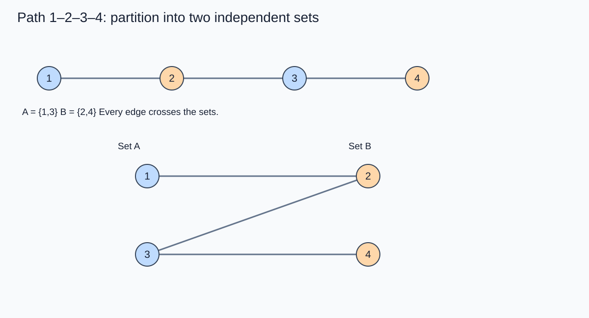
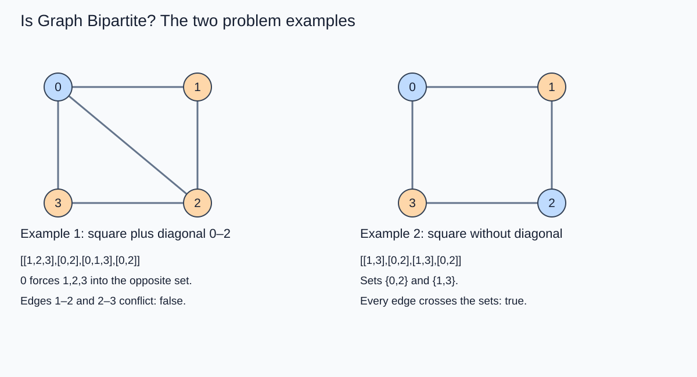
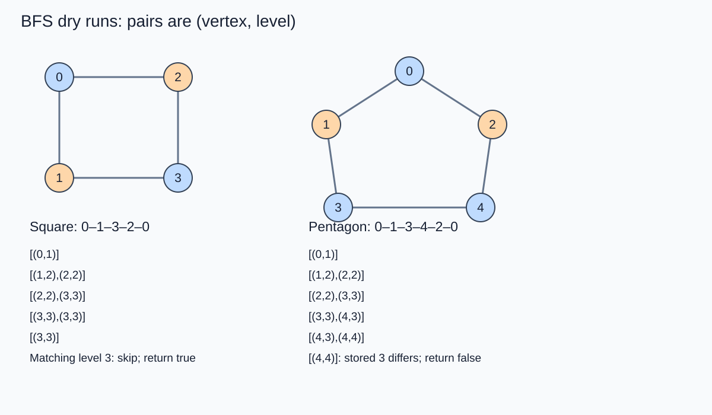
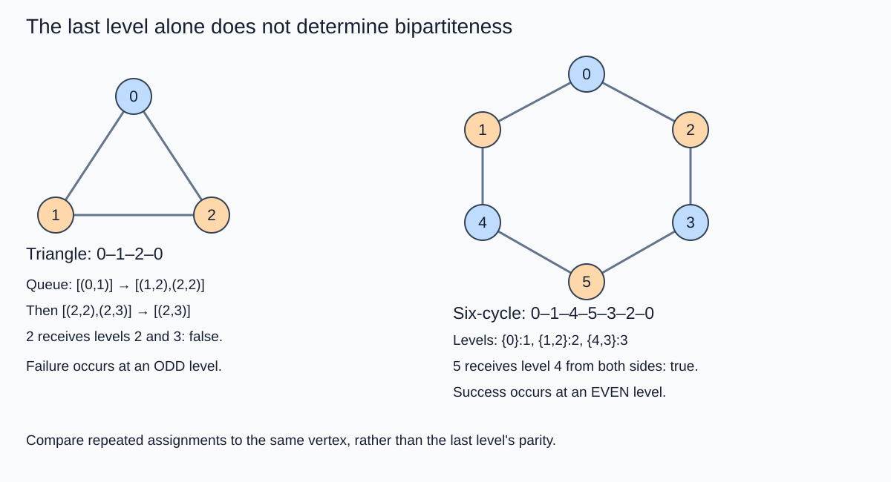
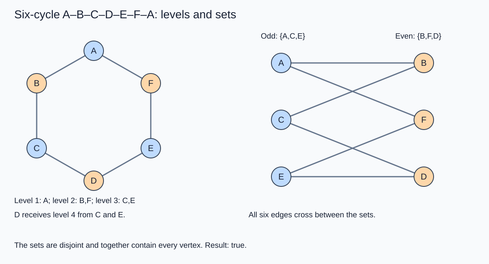

# Is Bipartite

## Bipartite graph: definition and properties

A graph is bipartite if its vertices can be divided into two independent sets A and B such that every edge connects a vertex in A to a vertex in B.

- **Mutually exclusive:** A ∩ B = ∅. No vertex belongs to both sets.
- **Exhaustive:** A ∪ B = V. Every vertex belongs to one of the sets.
- **Cross-set edges:** no edge joins two vertices within the same set.

For the path 1–2–3–4, choose A = {1,3} and B = {2,4}. All three edges cross between the sets.



Every acyclic undirected graph is bipartite. A single even cycle is bipartite; an odd cycle is not. More generally, an undirected graph is bipartite **if and only if it contains no odd cycle**. The presence of an even cycle does not make a graph bipartite if an odd cycle also exists.

For a disconnected graph, check every connected component. One non-bipartite component makes the entire graph non-bipartite. Isolated vertices can be placed in either set.

## Question 1: Detect a cycle in an undirected graph

Return true if any connected component contains a cycle. The following cycle-detection implementations are a preliminary exercise; an ordinary cycle and an odd cycle are different conditions.

### BFS approach: mark when removed from the queue

Start a BFS from each unvisited vertex. Remove a vertex, check whether it has already been visited, mark it, and add its unvisited neighbors. In this approach, a vertex may enter the queue more than once before its first removal. Removing an already visited vertex detects a cycle in a simple undirected graph.

For the square with edges 0–1, 0–2, 1–3, and 2–3, the queue becomes [1,2], then [2,3], then [3,3]. The second removal of 3 detects a cycle. The same square is still bipartite because that cycle has even length.

### Java: BFS matching the C++ implementation

```java
import java.util.*;

class Solution {
    private boolean bfsCycle(int start, List<List<Integer>> adj, boolean[] vis) {
        Queue<Integer> queue = new ArrayDeque<>();
        queue.add(start);
        while (!queue.isEmpty()) {
            int vertex = queue.remove();
            if (vis[vertex]) return true;
            vis[vertex] = true;
            for (int neighbor : adj.get(vertex)) {
                if (!vis[neighbor]) queue.add(neighbor);
            }
        }
        return false;
    }

    public boolean isCycle(int V, List<List<Integer>> adj) {
        boolean[] vis = new boolean[V];
        for (int vertex = 0; vertex < V; vertex++) {
            if (!vis[vertex] && bfsCycle(vertex, adj, vis)) return true;
        }
        return false;
    }
}
```

### Java: DFS matching the C++ implementation

Mark the current vertex before exploring its neighbors. Recurse only into unvisited neighbors. A visited neighbor indicates a cycle only when it is not the parent that led to the current vertex.

```java
import java.util.*;

class Solution {
    private boolean dfsCycle(int vertex, List<List<Integer>> adj,
                             boolean[] vis, int parent) {
        vis[vertex] = true;
        for (int neighbor : adj.get(vertex)) {
            if (!vis[neighbor]) {
                if (dfsCycle(neighbor, adj, vis, vertex)) return true;
            } else if (neighbor != parent) {
                return true;
            }
        }
        return false;
    }

    public boolean isCycle(int V, List<List<Integer>> adj) {
        boolean[] vis = new boolean[V];
        for (int vertex = 0; vertex < V; vertex++) {
            if (!vis[vertex] && dfsCycle(vertex, adj, vis, -1)) return true;
        }
        return false;
    }
}
```

### Time and space complexity

Let V be the number of vertices and E the number of undirected edges.

- **BFS time: O(V + E).** Each vertex's adjacency list is expanded at most once before returning, and each edge contributes at most two adjacency entries.
- **BFS auxiliary space: O(V + E), a conservative bound for marking on removal.** The visited array takes O(V), and the queue may hold duplicate entries contributed by edges. Marking on insertion would instead bound the queue by O(V).
- **DFS time: O(V + E).** Every vertex is visited once and every adjacency entry is examined once.
- **DFS auxiliary space: O(V).** The visited array and the recursive call stack each require at most O(V).
- Storing the input adjacency list itself requires O(V + E), separately from auxiliary space.

These implementations assume a simple undirected graph without self-loops or parallel edges.


### BFS solution

```cpp
class Solution{
 bool bfsCycle(int i,vector<int> adj[],int V,vector<bool>& vis){
    queue<int>q;
    q.push(i);
    while(q.size()>0){
        int v=q.front();
        q.pop();
        if(vis[v]==true) return true;
        vis[v]=true;
        for(auto nbr:adj[v]){
            if(vis[nbr]==false) q.push(nbr);
        }
    }
    return false;
 }
public:
    bool isCycle(int V, vector<int> adj[]) {
        vector<bool>vis(V,false);
        for(int i=0;i<V;i++){
            if(vis[i]==false){
               bool val= bfsCycle(i,adj,V,vis);
               if(val==true) return true;
            }
        }

        return false;
    }
};
```
### DFSsol

```cpp
class Solution{
 bool dfsCycle(int i,vector<int> adj[],int V,vector<bool>& vis,int par){
    vis[i]=true;
    for(auto nbr:adj[i]){
        if(vis[nbr]==false){
           bool val= dfsCycle(nbr,adj,V,vis,i);
           if(val==true) return true;
        }// If the neighbor is visited and it's NOT the parent, we found a cycle!
        else if (nbr != par) {
            return true;
        }
    }
    return false;
 }
public:
    bool isCycle(int V, vector<int> adj[]) {
        vector<bool>vis(V,false);
        for(int i=0;i<V;i++){
            if(vis[i]==false){
               bool val= dfsCycle(i,adj,V,vis,-1);
               if(val==true) return true;
            }
        }

        return false;
    }
};
```
Most recursive functions start with a base case, but in this specific algorithm, that first line(`if(vis[i]==true) return true`) actually becomes redundant (and slightly problematic) because of how we handle the neighbor loop.

Here is why you don't need it:

#### 1. The "Look Before You Leap" Strategy
In the corrected version of the code, we perform the "visited" check before making the recursive call.

```C++

for (auto nbr : adj[i]) {
    if (!vis[nbr]) { 
        // We only call the function if we KNOW vis[nbr] is false
        if (dfsCycle(nbr, adj, V, vis, i)) return true;
    } 
    else if (nbr != par) {
        // If it's already visited and NOT the parent, it's a cycle
        return true; 
    }
}
```
Because of the if `(!vis[nbr])` guard, the function dfsCycle will never be called with an i that is already visited. Therefore, checking it again at the very top of the function is redundant—it's like checking if a door is locked after you’ve already confirmed it's open and walked through it.


#### 2. Distinguishing Cycles from Back-Tracing

In an undirected graph, every edge is a two-way street. If you are at Node A and move to Node B, Node B's neighbor list contains Node A.

If you kept your original if(vis[i] == true) return true at the top, the moment the algorithm looks back from Node B to Node A, it would see Node A is "visited" and immediately declare a cycle.

By removing that top check and using the else if (nbr != par) logic inside the loop, you specifically tell the code:

"If I see a visited node and it's my parent, that's just the way I came in. Ignore it."

"If I see a visited node and it's not my parent, I've found a shortcut back to an earlier part of the path. That is a cycle."

### Summary
The check at the top is replaced by a more surgical check inside the loop that can tell the difference between a back-edge (a cycle) and the parent-edge (the path you are currently walking).

## Question 2: Is Graph Bipartite? (LeetCode 785)

Given an undirected graph with n vertices numbered 0 through n−1, return true if its vertices can be partitioned into two independent sets so that every edge crosses between the sets.

The array graph[u] lists the neighbors of u. The graph may be disconnected. It contains no self-edges or parallel edges; if v occurs in graph[u], then u occurs in graph[v].

**Constraints**

- graph.length = n and 1 ≤ n ≤ 100.
- 0 ≤ graph[u].length < n.
- Each neighbor is between 0 and n−1.
- graph[u] does not contain u or duplicate entries.
- Adjacency is symmetric.

**Example 1**

```text
graph = [[1,2,3],[0,2],[0,1,3],[0,2]]
Output: false
```

The diagonal 0–2 creates the odd cycles 0–1–2–0 and 0–3–2–0. No valid partition exists.

**Example 2**

```text
graph = [[1,3],[0,2],[1,3],[0,2]]
Output: true
Sets: {0,2} and {1,3}
```



### BFS using vertex and level pairs

Store (vertex, level) in the queue, starting each component at level 1. A first removal records the vertex's level. On a repeated removal:

- If the level matches the recorded level, skip the duplicate.
- If it differs, return false.

Record the level on the first visit before adding neighbors. Without this assignment, the level array stays at its initial values and the comparison is incorrect.

The sequence is: remove, check an earlier visit, record the level, mark visited, and add unvisited neighbors at level + 1. Do not expand matching duplicate entries again in the full-level implementation.

### Square dry run: equal levels

Edges: 0–1, 0–2, 1–3, 2–3. Queue entries are (vertex, level).

| Removed entry | Action | Queue after processing |
| :--- | :--- | :--- |
| Start | Enqueue (0,1) | [(0,1)] |
| (0,1) | Record level 1; add 1 and 2 | [(1,2),(2,2)] |
| (1,2) | Record level 2; add 3 | [(2,2),(3,3)] |
| (2,2) | Record level 2; add another 3 | [(3,3),(3,3)] |
| (3,3) | Record level 3 | [(3,3)] |
| (3,3) | Recorded level is also 3; skip | [] |

Result: true. The partition is {0,3} and {1,2}. These labels follow the square above; the problem's second example uses a different labeling.

### Pentagon dry run: conflicting levels

Edges: 0–1, 0–2, 1–3, 2–4, 3–4.

| Removed entry | Action | Queue after processing |
| :--- | :--- | :--- |
| (0,1) | Add 1 and 2 | [(1,2),(2,2)] |
| (1,2) | Add 3 | [(2,2),(3,3)] |
| (2,2) | Add 4 | [(3,3),(4,3)] |
| (3,3) | 4 has not been removed yet; add (4,4) | [(4,3),(4,4)] |
| (4,3) | Record level 3 for vertex 4 | [(4,4)] |
| (4,4) | Stored level 3 differs from 4 | Return false |

The two routes to vertex 4 contain different numbers of edges. Their opposite parities force vertex 4 into both sets, which is impossible.



### Why the final level alone is not a valid test

A triangle 0–1–2–0 produces (2,2) and (2,3), so it fails at level 3, which is odd. A six-cycle can finish with two matching entries at level 4, which is even. Therefore, neither “the last level is odd” nor “the last level is even” identifies whether the graph is bipartite. Compare the two assignments to the same vertex.




 
 
### Partitioning a six-cycle by BFS levels

For the cycle A–B–C–D–E–F–A, start at A:

| BFS level | Vertices | Partition |
| :--- | :--- | :--- |
| 1 | A | Odd |
| 2 | B, F | Even |
| 3 | C, E | Odd |
| 4 | D, reached from both C and E | Even |

The two sets are {A,C,E} and {B,F,D}. The edges A–B, A–F, C–B, C–D, E–F, and E–D all cross the sets. Both routes to D assign level 4.



An odd cycle eventually forces a vertex to receive two incompatible parity assignments. Checking bipartiteness is therefore equivalent to checking the absence of odd cycles, rather than the absence of every cycle.

### BFS storing only parity

Only the set assignment is needed, so store level % 2: 0 for an even level and 1 for an odd level. Use a third state for unvisited vertices: null in a Java Integer array, or −1 in an integer array.

For each component, enqueue its starting vertex at level 1. On removal, compare the stored parity with the new level's parity. A mismatch returns false; otherwise record the parity and add unvisited neighbors. Return true when every component passes.

The following pair of implementations follows the parity-based, mark-on-removal algorithm, including checking matching repeated entries.

#### C++

```cpp
#include <vector>
#include <queue>
#include <utility>
using namespace std;

class Solution {
    bool isComponentBipartite(const vector<vector<int>>& graph,
                              vector<int>& visited, int source) {
        queue<pair<int, int>> pending;
        pending.push({source, 1});
        while (!pending.empty()) {
            int vertex = pending.front().first;
            int level = pending.front().second;
            pending.pop();
            if (visited[vertex] != -1 && visited[vertex] != level % 2) {
                return false;
            }
            visited[vertex] = level % 2;
            for (int neighbor : graph[vertex]) {
                if (visited[neighbor] == -1) {
                    pending.push({neighbor, level + 1});
                }
            }
        }
        return true;
    }

public:
    bool isBipartite(vector<vector<int>>& graph) {
        vector<int> visited(graph.size(), -1);
        for (int source = 0; source < static_cast<int>(graph.size()); source++) {
            if (visited[source] == -1 &&
                !isComponentBipartite(graph, visited, source)) return false;
        }
        return true;
    }
};
```

#### Java

```java
import java.util.*;

class Solution {
    static class Pair {
        int vertex;
        int level;
        Pair(int vertex, int level) {
            this.vertex = vertex;
            this.level = level;
        }
    }

    private boolean isComponentBipartite(int[][] graph, Integer[] visited, int source) {
        ArrayDeque<Pair> queue = new ArrayDeque<>();
        queue.add(new Pair(source, 1));
        while (!queue.isEmpty()) {
            Pair removed = queue.remove();
            if (visited[removed.vertex] != null &&
                visited[removed.vertex] != removed.level % 2) {
                return false;
            }
            visited[removed.vertex] = removed.level % 2;
            for (int neighbor : graph[removed.vertex]) {
                if (visited[neighbor] == null) {
                    queue.add(new Pair(neighbor, removed.level + 1));
                }
            }
        }
        return true;
    }

    public boolean isBipartite(int[][] graph) {
        Integer[] visited = new Integer[graph.length];
        for (int source = 0; source < graph.length; source++) {
            if (visited[source] == null &&
                !isComponentBipartite(graph, visited, source)) return false;
        }
        return true;
    }
}
```

**Complexity of this exact parity variant:** matching duplicate removals also expand neighbors, so the usual O(V + E) traversal bound does not apply. Let Q be the total number of queue entries processed and Δ the maximum degree. Time is O(V + Q(1 + Δ)), and auxiliary space is O(V + Q). Q can grow exponentially in layered graphs because duplicate entries propagate into later layers. Skipping a matching duplicate immediately restores O(V + E) time with O(V + E) auxiliary space; marking on enqueue gives O(V) queue space. The full-level implementations below already skip matching duplicates.

### C++ BFS using full levels

This is the C++ counterpart of the existing Java BFS solution.

```cpp
#include <vector>
#include <queue>
#include <utility>
using namespace std;

class Solution {
public:
    bool isBipartite(vector<vector<int>>& graph) {
        vector<int> level(graph.size(), 0);
        vector<bool> visited(graph.size(), false);
        queue<pair<int, int>> pending;
        for (int source = 0; source < static_cast<int>(graph.size()); source++) {
            if (visited[source]) continue;
            pending.push({source, 1});
            while (!pending.empty()) {
                int vertex = pending.front().first;
                int currentLevel = pending.front().second;
                pending.pop();
                if (visited[vertex]) {
                    if (level[vertex] == currentLevel) continue;
                    return false;
                }
                level[vertex] = currentLevel;
                visited[vertex] = true;
                for (int neighbor : graph[vertex]) {
                    if (!visited[neighbor]) {
                        pending.push({neighbor, currentLevel + 1});
                    }
                }
            }
        }
        return true;
    }
};
```

**Full-level BFS time: O(V + E).** Every vertex's neighbors are expanded once, and matching duplicate removals are skipped. The outer loop covers disconnected components.

**Full-level BFS auxiliary space: O(V + E).** The level and visited arrays take O(V); marking on removal allows up to O(E) pending duplicate entries. Input graph storage is O(V + E).


### BFS solution

```java
class Solution {
     public static class Pair{
      int v;
      int lvl;
      Pair(int v,int lvl){
         this.v=v;
         this.lvl=lvl;
      }
   }
    public boolean isBipartite(int[][] graph) {
        
    int[] lvl=new int[graph.length];
    boolean[] vis=new boolean[graph.length];
    LinkedList<Pair>q=new LinkedList<>();
    for(int v=0;v<graph.length;v++){
       if(vis[v]==false){
       q.addLast(new Pair(v,1));
       while(q.size()>0){
          Pair removed=q.remove();
          if(vis[removed.v]==true) {
              if(lvl[removed.v]==removed.lvl)
              continue;
              else {
                 return false;
              }
           }
          else lvl[removed.v]=removed.lvl;
          
          vis[removed.v]=true;
          for(int i=0;i<graph[removed.v].length;i++){
            if(vis[graph[removed.v][i]]==false){
               q.addLast(new Pair(graph[removed.v][i],removed.lvl+1));
            }
         }
         
      } 
   }
      }
    return true;
    }
}
```

Non-cycle --> Always bipartite 

even len cycle --> Always Bipartite

Odd len cycle--> non-bipartite

even len cycle--> last vertex visited at odd level 

odd len cycle --> last vertex visted at even level

so in old len cycle prev level will not be same as current level henec not be bipartite.


## sol 2 Coloring solution 

### Two-color DFS approach

Use 0 for unvisited, +1 for one set, and −1 for the other set. Assign a starting color to each unvisited component. Every neighbor must have the opposite color. Recurse into an uncolored neighbor using −color; if an already colored neighbor has any other color, return false. The first contradiction propagates back through the recursive calls.

For the square 0–1–3–2–0, DFS can assign 0:+1, 1:−1, 3:+1, 2:−1. The closing edge 2–0 has opposite colors, so the square passes. For the pentagon 0–1–3–4–2–0, DFS assigns 0:+1, 1:−1, 3:+1, 4:−1, 2:+1. The closing edge 2–0 joins equal colors, so it fails.

**Time: O(V + E).** Each vertex is colored once and every adjacency entry is checked once. The outer loop ensures that disconnected components are included.

**Auxiliary space: O(V).** The color array takes O(V), and a chain of recursive calls can contain V vertices. The input adjacency list separately occupies O(V + E).

**Clarification of the preceding cycle-level statements:** a graph is bipartite exactly when it has no odd cycle. The parity of the final removed level alone is insufficient, as the triangle and six-cycle examples demonstrate. The reliable test is whether a vertex receives incompatible colors or level parities.

 
 ### Cpp

 ```cpp
class Solution{
    bool traverseDFS( vector<int>graph[],vector<int>&vis,int v,int color){
        vis[v]=color;
        for(auto nbr:graph[v]){
            if(vis[nbr]==0){
                bool isbip=traverseDFS(graph,vis,nbr,-1*color);
                if(isbip==false) return false;
            }
            else {
                int oldcolor=vis[nbr];
                int newcolor=-1*color;
                if(oldcolor!=newcolor) return false;
            }
        }
        return true;

    }
 
public:
    bool isBipartite(int V, vector<int> adj[])  {
        vector<int>vis(V);
        for(int v=0;v<V;v++){
            if(vis[v]==0){
                bool isbipartite=traverseDFS(adj,vis,v,1);
                if(isbipartite==false)
                    return false;
  
                    }
            }
        return true;
    }
};

 ```
 ### Java

```java
class Solution {

    public boolean traverseDFS(int[][]graph,int[] vis,int v,int color){
        vis[v]=color;
        for(var nbr:graph[v]){
            if(vis[nbr]==0){
                boolean isbip=traverseDFS(graph,vis,nbr,-1*color);
                if(isbip==false) return false;
            }
            else {
                int oldcolor=vis[nbr];
                int newcolor=-1*color;
                if(oldcolor!=newcolor) return false;
            }
        }
        return true;

    }
 
    

    public boolean isBipartite(int[][] graph) {
        
        int [] vis=new int[graph.length];
        for(int v=0;v<graph.length;v++){
            if(vis[v]==0){
                boolean isbipartite=traverseDFS(graph,vis,v,1);
                if(isbipartite==false)
                    return false;
  
                    }
            }
        return true;
    }
}
```
