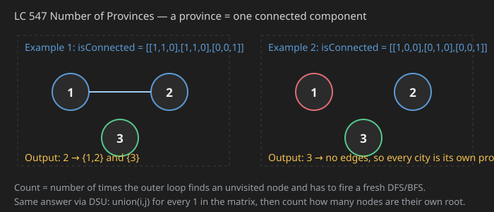
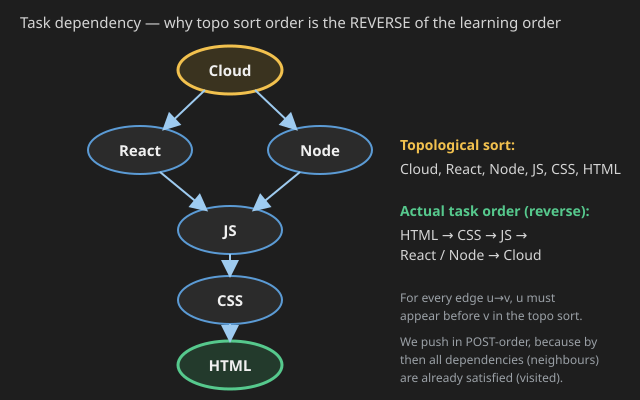
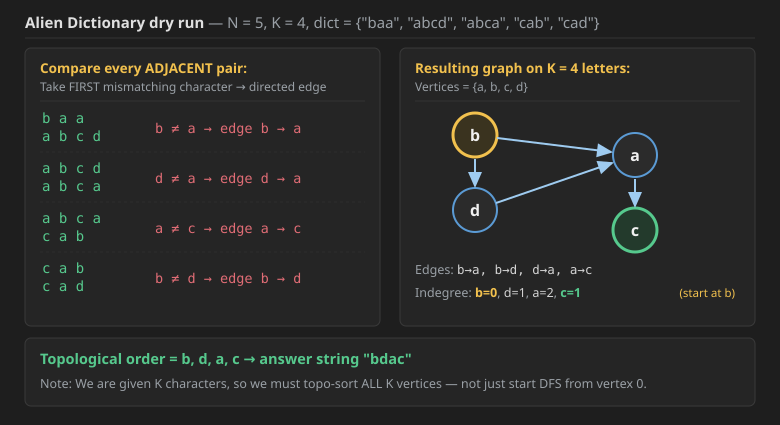
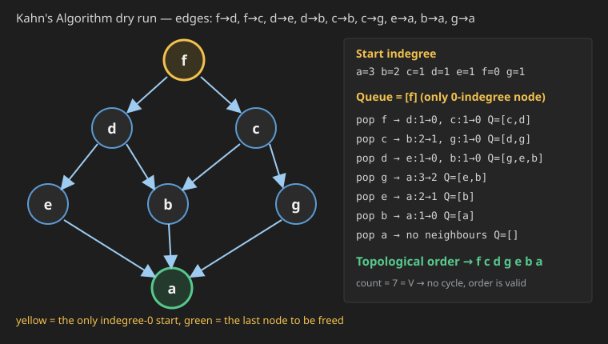
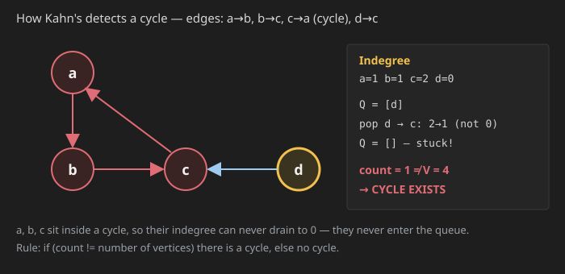
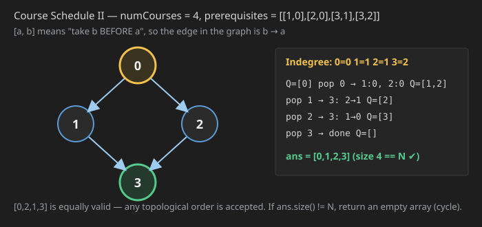

## Q1. Number of Provinces (LeetCode 547)


There are `n` cities. Some of them are connected, while some are not. If city `a` is connected directly with city `b`, and city `b` is connected directly with city `c`, then city `a` is connected **indirectly** with city `c`.

A **province** is a group of directly or indirectly connected cities and no other cities outside of the group.

You are given an `n x n` matrix `isConnected` where `isConnected[i][j] = 1` if the `i`th city and the `j`th city are directly connected, and `isConnected[i][j] = 0` otherwise.

Return *the total number of **provinces***.



### Example 1

**Input:** `isConnected = [[1,1,0],[1,1,0],[0,0,1]]`
**Output:** `2`

### Example 2

**Input:** `isConnected = [[1,0,0],[0,1,0],[0,0,1]]`
**Output:** `3`

### Constraints

* `1 <= n <= 200`
* `n == isConnected.length`
* `n == isConnected[i].length`
* `isConnected[i][j]` is `1` or `0`.
* `isConnected[i][i] == 1`
* `isConnected[i][j] == isConnected[j][i]`

This problem is the classic **"Number of Connected Components"** graph problem. 

Since you've just mastered DFS/BFS and DSU, this is the perfect playground to see how both approaches solve the same problem. The problem gives you an Adjacency Matrix (`isConnected`), where `isConnected[i][j] = 1` means city $i$ and $j$ are connected. Your goal is to count how many isolated groups (provinces) exist.

---

### Approach 1: The "Component Counting" DFS

This uses the exact logic you learned today:

1.  **Create a `vis` array** of size $N$.
2.  **Loop through every city** from $0$ to $N-1$.
3.  **If a city is NOT visited**, it means you've found a **NEW Province**.
4.  **Start a traversal (DFS/BFS)** from that city to mark all connected cities in that province as visited.
5.  **Increment your counter.**

---

### Comparison of Methods

| Method | Logic | When to use? |
| :--- | :--- | :--- |
| **DFS / BFS** | Traverse as far as possible to "exhaust" a component. | Standard choice; very easy to implement. |
| **DSU** | `union(i, j)` for every connection; count unique roots at the end. | Best if the graph is **dynamic** (edges are being added over time). |

```cpp
class Solution {
private:
    // Standard DFS to visit all nodes in the current component
    void dfs(int node, vector<vector<int>>& isConnected, vector<bool>& vis) {
        vis[node] = true;
        
        // Traverse all possible neighbors
        for (int neighbor = 0; neighbor < isConnected.size(); neighbor++) {
            // Check if connected AND not visited yet
            if (isConnected[node][neighbor] == 1 && !vis[neighbor]) {
                dfs(neighbor, isConnected, vis);
            }
        }
    }

public:
    int findCircleNum(vector<vector<int>>& isConnected) {
        int n = isConnected.size();
        vector<bool> vis(n, false);
        int provinces = 0;

        // Iterate through every city
        for (int i = 0; i < n; i++) {
            // If we find an unvisited city, it's the "Head" of a new province
            if (!vis[i]) {
                provinces++;     // Found a new group
                dfs(i, isConnected, vis); // Mark the entire group as visited
            }
        }
        
        return provinces;
    }
};
```

Time Complexity: $O(N^2)$ (You visit every cell in the matrix once).

Space Complexity: $O(N)$ (Visited array + Recursion Stack).

## DSU code

```cpp
class Solution {
    vector<int> parent;
    vector<int> size;

    int find(int x) {
        if (parent[x] == x) return x;
        return parent[x] = find(parent[x]); // Path Compression
    }

    void unionSets(int x, int y) {
        int rootX = find(x);
        int rootY = find(y);
        
        if (rootX != rootY) {
            // Union by Size
            if (size[rootX] < size[rootY]) swap(rootX, rootY);
            parent[rootY] = rootX;
            size[rootX] += size[rootY];
        }
    }

public:
    int findCircleNum(vector<vector<int>>& isConnected) {
        int n = isConnected.size();
        parent.resize(n);
        size.resize(n, 1);
        
        // Initialize DSU
        for (int i = 0; i < n; i++) parent[i] = i;

        // Iterate strictly the Upper Triangle (to avoid duplicate checks)
        for (int i = 0; i < n; i++) {
            for (int j = i + 1; j < n; j++) {
                if (isConnected[i][j] == 1) {
                    unionSets(i, j);
                }
            }
        }

        // Count unique parents (roots)
        int provinces = 0;
        for (int i = 0; i < n; i++) {
            if (parent[i] == i) provinces++;
        }
        return provinces;
    }
};
```
### Which one to use?

* **For Interviews:** **DFS/BFS (Approach 1)** is usually preferred here because the graph is static (given all at once) and the code is shorter and cleaner.
* **Use DSU if:** The graph is **dynamic** (e.g., "edges are being added one by one, tell me the province count after every addition").


## My code

```cpp
class Solution{
    void dfs(vector<bool>& vis,int v,vector<int> * graph,int n){
        vis[v]=true;
        for(int  nbr:graph[v]){
            if(vis[nbr]==false){
                dfs(vis,nbr,graph,n);
            }
        }
    }
public:
    int numProvinces(vector<vector<int>> adj) {
       int n=adj.size();
       vector<int> graph[n];
       for(int i=0;i<n;i++){
        for(int j=0;j<i;j++){
            if(adj[i][j]==1){
                graph[i].push_back(j);
                graph[j].push_back(i);
            }
        }
       }

        vector<bool> vis(n,false);
        int cnt=0;
        for(int i=0;i<n;i++){
            if(vis[i]==false){
                dfs(vis,i,graph,n);
                cnt++;
            } 
            
        }
        return cnt;

    }
};

```
This code is logically correct, but it uses a **Non-Standard C++ Feature** that might cause compilation errors in some interview environments (like Microsoft Visual Studio).

### The Issue: Variable Length Arrays (VLA)
The line `vector<int> graph[n];` tries to create a C-style array of vectors where the size `n` is a variable determined at runtime.

* **Standard C++:** Array sizes must be constant at compile time (e.g., `graph[100]`).
* **GCC/Clang:** Often allow this as an "extension," which is why it might pass on LeetCode but fail in other environments.
* **Best Practice:** Use a vector of vectors: `vector<vector<int>> graph(n);`.

### Corrected Code (Standard C++)
Here is the robust version. I also updated the DFS signature to accept the graph by reference (`&`) to avoid unnecessary copying.
## Ai code

```cpp

class Solution {
    // Pass graph by reference: vector<vector<int>>& graph
    void dfs(vector<bool>& vis, int v, vector<vector<int>>& graph) {
        vis[v] = true;
        for (int nbr : graph[v]) {
            if (!vis[nbr]) {
                dfs(vis, nbr, graph);
            }
        }
    }

public:
    int numProvinces(vector<vector<int>>& adj) {
        int n = adj.size();
        
        // Fix: Use vector of vectors instead of C-style array
        vector<vector<int>> graph(n);

        // Build Adjacency List
        for (int i = 0; i < n; i++) {
            for (int j = 0; j < i; j++) { // Loop < i handles lower triangle (avoids duplicates)
                if (adj[i][j] == 1) {
                    graph[i].push_back(j);
                    graph[j].push_back(i);
                }
            }
        }

        vector<bool> vis(n, false);
        int cnt = 0;
        
        for (int i = 0; i < n; i++) {
            if (!vis[i]) {
                dfs(vis, i, graph);
                cnt++;
            } 
        }
        return cnt;
    }
};
```


  
## Java code for Q1 (was missing — same logic as the C++ above)

```java
class Solution {
    // Standard DFS to visit all nodes in the current component
    private void dfs(int node, int[][] isConnected, boolean[] vis) {
        vis[node] = true;
        for (int neighbor = 0; neighbor < isConnected.length; neighbor++) {
            if (isConnected[node][neighbor] == 1 && !vis[neighbor]) {
                dfs(neighbor, isConnected, vis);
            }
        }
    }

    public int findCircleNum(int[][] isConnected) {
        int n = isConnected.length;
        boolean[] vis = new boolean[n];
        int provinces = 0;

        for (int i = 0; i < n; i++) {
            if (!vis[i]) {
                provinces++;              // found the head of a new province
                dfs(i, isConnected, vis); // mark the whole group visited
            }
        }
        return provinces;
    }
}
```

## Java DSU code for Q1

```java
class Solution {
    private int[] parent;
    private int[] size;

    private int find(int x) {
        if (parent[x] == x) return x;
        return parent[x] = find(parent[x]); // Path Compression
    }

    private void unionSets(int x, int y) {
        int rootX = find(x);
        int rootY = find(y);
        if (rootX != rootY) {
            // Union by Size
            if (size[rootX] < size[rootY]) {
                int tmp = rootX; rootX = rootY; rootY = tmp;
            }
            parent[rootY] = rootX;
            size[rootX] += size[rootY];
        }
    }

    public int findCircleNum(int[][] isConnected) {
        int n = isConnected.length;
        parent = new int[n];
        size = new int[n];
        for (int i = 0; i < n; i++) { parent[i] = i; size[i] = 1; }

        // Only the upper triangle, the matrix is symmetric
        for (int i = 0; i < n; i++) {
            for (int j = i + 1; j < n; j++) {
                if (isConnected[i][j] == 1) unionSets(i, j);
            }
        }

        int provinces = 0;
        for (int i = 0; i < n; i++) {
            if (parent[i] == i) provinces++;
        }
        return provinces;
    }
}
```

**Complexity (Q1):**

* **Time — `O(N²)`.** The graph is handed to you as an adjacency **matrix**, so just to discover the neighbours of one city you must scan a whole row of `N` cells. You do that once for every city, hence `N × N`. The DSU version scans the upper triangle, which is `N²/2` cells — still `O(N²)`. You can never beat `O(N²)` here, because you have to *read* `N²` input cells at least once.
* **Space — `O(N)`.** The `vis` array is `N` booleans, and the recursion stack can go `N` deep in the worst case (all cities in one long chain). For DSU it is the `parent` + `size` arrays, again `O(N)`. Note it is **not** `O(N²)` — you never build a copy of the matrix.
* *(If you first convert the matrix into an adjacency list like in "My code" above, that conversion itself costs `O(N²)` time and `O(N + E)` extra space, so it does not improve the bound — it only makes the DFS itself cheaper.)*
  
  ---
  
## Q2. Alien Dictionary


> You don't need competitive programming for Microsoft/Amazon; for Uber and Tower Research, CP is a must!

### First, a revision of Topological Sort

1st revise topological sort. **Kosaraju algo's 1st DFS is also the topological sort algorithm.** Topo sort is always applied on a **DAG (Directed Acyclic Graph)**.

> **Topological sort is just a permutation of all vertices such that for all edges `u → v`, `u` must appear before `v`.** Used in **task dependency**.



*"Topo sort ke ulte order mai task hote"* → **the tasks are actually performed in the reverse of the topological order.** Here the topo sort is `cloud, react, node, JS, CSS, HTML`, but the task order will be: first learn HTML, then CSS, then JS, after that React and Node, and after that Cloud.

Here we put an element in the stack in **postorder**, because in postorder all of its dependencies (neighbours) are already satisfied (visited).

### The new version: Kahn's Algorithm

> Now we do **another version of Topological Sort which is based on `indegree`**. This algo is called **Kahn's Algorithm**.

### The Problem (GFG — Alien Dictionary, Hard)

Given a sorted dictionary of an alien language having `N` words and `K` starting alphabets of the standard dictionary. Find the order of characters in the alien language.

**Note:** Many orders may be possible for a particular test case, thus you may return any valid order and the output will be `1` if the order of the string returned by the function is correct, else `0`.

**Example 1**

```text
Input:  N = 5, K = 4
        dict = {"baa","abcd","abca","cab","cad"}
Output: 1
Explanation: Here order of characters is 'b', 'd', 'a', 'c'.
Note that words are sorted and in the given language "baa" comes
before "abcd", therefore 'b' is before 'a' in output.
```

**Example 2**

```text
Input:  N = 3, K = 3
        dict = {"caa","aaa","aab"}
Output: 1
Explanation: Here order of characters is 'c', 'a', 'b'.
"caa" comes before "aaa", therefore 'c' is before 'a'.
```

**Your Task:** complete the function `findOrder()` which takes the string array `dict[]`, its size `N` and the integer `K` as input parameters and returns a string denoting the order of characters in the alien language.

* **Expected Time Complexity:** `O(N * |S| + K)`, where `|S|` denotes maximum length.
* **Expected Space Complexity:** `O(K)`
* **Constraints:** `1 ≤ N, M ≤ 300`, `1 ≤ K ≤ 26`, `1 ≤ Length of words ≤ 50`

### Building the graph (dry run)

* `K` → number of characters
* `N` → number of words in the dictionary

**According to the question, the words are already in dictionary order.** So take **2 words at a time** (every adjacent pair) and find the **first position where they differ** — that single mismatch is the only rule you can extract from that pair.

for adjacent words ,see 1st non matching character and for that mismatcching character draw edge from mismatching char of 1st word to mismatching char of 2nd word.



```text
b a a          b, a do not match
a b c d   →    so b comes before a   →   edge  b → a

a b c d        d, a do not match
a b c a   →    d > a, so d comes before a   →   edge  d → a

a b c a        a, c do not match
c a b     →    a > c, so a comes before c   →   edge  a → c

c a b          b, d do not match
c a d     →    b > d, so b comes before d   →   edge  b → d
```

*"Now hint: do topo sort of this graph, i.e. `b d a c`"* — and that is exactly a topological sort of the 4 edges above.

**Important catch:** we are given `K` characters, so we must topologically sort **all `K` vertices**, not just the ones reachable from vertex `0`.

### Why is this a Topological Sort problem at all?

*"Kuch ordering ki baat ho rahi hai, isliye Topo sort lag raha hai."*
→ There is some **ordering** being asked for, that is the signal for topological sort. It is not that you first put things in some order and then a state appears — **topo sort is: first solve the dependency, and then the thing itself gets solved automatically.**

> **Pattern recognition shortcut:**
> * **dependency / ordering** ⟹ **Topological Sort**
> * **sub-sequence** ⟹ **Bit manipulation / Recursion (select — not select)**

### My first (wrong) solution — 3 / 1102 test cases

```java
class Solution {
  private void toposort(int i, ArrayList<Integer>[] graph, LinkedList<Integer> stk, boolean[] vis) {
    vis[i] = true;
    for (var val : graph[i]) {
      if (vis[val] == false) {
        toposort(val, graph, stk, vis);
      }
    }
    stk.addFirst(i);
  }

  public String findOrder(String[] dict, int N, int K) {
    ArrayList<Integer>[] graph = new ArrayList[K];
    for (int i = 0; i < K; i++) graph[i] = new ArrayList<>();
    for (int i = 1; i < dict.length; i++) {
      String s1 = dict[i - 1];
      String s2 = dict[i];
      int lim = Math.min(s1.length(), s2.length());
      for (int c = 0; c < lim; c++) {
        if (s1.charAt(c) != s2.charAt(c)) {
          int c1 = s1.charAt(c) - 'a';
          int c2 = s2.charAt(c) - 'a';
          graph[c1].add(c2);
          break;
        }
      }
    }
    boolean[] vis = new boolean[K];
    LinkedList<Integer> stk = new LinkedList<>();
    toposort(0, graph, stk, vis);   // <-- BUG: only starts from vertex 0

    StringBuilder sb = new StringBuilder("");
    while (stk.size() > 0) {
      int c = stk.removeFirst();
      char ch = (char) (c + 'a');
      sb.append(ch);
    }
    return sb.toString();
  }
}
```

**Verdict:** `Wrong — 3 / 1102 test cases`. Not passing the majority of TCs.

**The bug:**  I needed the topological sort of **all** vertices, but I only fired the DFS from vertex `0`. Any character not reachable from `0` simply never made it into the stack.

**The fix** is literally one loop — wrap the `toposort` call in `for (int i = 0; i < K; i++) if (!vis[i]) toposort(i, ...)`. After that: **1102 / 1102 test cases passed, 8/8 points**.

### Fixed Code (Java, DFS + Stack)

```java
class Solution {
  private void toposort(int i, ArrayList<Integer>[] graph, LinkedList<Integer> stk, boolean[] vis) {
    vis[i] = true;
    for (var val : graph[i]) {
      if (vis[val] == false) {
        toposort(val, graph, stk, vis);
      }
    }
    stk.addFirst(i);
  }

  public String findOrder(String[] dict, int N, int K) {
    ArrayList<Integer>[] graph = new ArrayList[K];
    for (int i = 0; i < K; i++) {
      graph[i] = new ArrayList<>();
    }
    for (int i = 1; i < dict.length; i++) {
      String s1 = dict[i - 1];
      String s2 = dict[i];
      int lim = Math.min(s1.length(), s2.length());
      for (int c = 0; c < lim; c++) {
        if (s1.charAt(c) != s2.charAt(c)) {
          int c1 = s1.charAt(c) - 'a';
          int c2 = s2.charAt(c) - 'a';
          graph[c1].add(c2);
          break;
        }
      }
    }
    boolean[] vis = new boolean[K];
    LinkedList<Integer> stk = new LinkedList<>();
    for (int i = 0; i < K; i++) {
      if (vis[i] == false) {
        toposort(i, graph, stk, vis);
      }
    }

    StringBuilder sb = new StringBuilder("");
    while (stk.size() > 0) {
      int c = stk.removeFirst();
      char ch = (char) (c + 'a');
      sb.append(ch);
    }
    return sb.toString();
  }
}

```


## cpp code 
```cpp
#include <bits/stdc++.h>
using namespace std;

class Solution {
private:

    /* Function to return the topological
     sorting of given graph */
    vector<int> topoSort(int V, vector<int> adj[]) {
	    
        // To store the In-degrees of nodes
	    vector<int> inDegree(V, 0);
	    
	    // Update the in-degrees of nodes
		for (int i = 0; i < V; i++) {
		    
			for(auto it : adj[i]) {
			    // Update the in-degree
			    inDegree[it]++;
			}
		}
        
        // To store the result
        vector<int> ans;
	    
	    // Queue to facilitate BFS
	    queue<int> q;
	    
	    // Add the nodes with no in-degree to queue
	    for(int i=0; i<V; i++) {
	        if(inDegree[i] == 0) q.push(i);
	    }
	    
	    // Until the queue is empty
	    while(!q.empty()) {
	        
	        // Get the node
	        int node = q.front();
	        
	        // Add it to the answer
	        ans.push_back(node);
	        q.pop();
	        
	        // Traverse the neighbours
	        for(auto it : adj[node]) {
	            
	            // Decrement the in-degree
	            inDegree[it]--;
	            
	            /* Add the node to queue if 
	            its in-degree becomes zero */
	            if(inDegree[it] == 0) q.push(it);
	        }
	    }
	    
	    // Return the result
	    return ans;
    }
    
public:

	/* Function to determine order of 
	letters based on alien dictionary */
	string findOrder(string dict[], int N, int K) {
		
		// Initialise a graph of K nodes
		vector<int> adj[K];
		
		// Compare the consecutive words
		for(int i=0; i < N-1; i++) {
		    
		    string s1 = dict[i];
			string s2 = dict[i + 1];
			int len = min(s1.size(), s2.size());
			
			/* Compare the pair of strings letter by 
			letter to identify the differentiating letter */
			for (int ptr = 0; ptr < len; ptr++) {
			    
			    // If the differentiating letter is found
				if (s1[ptr] != s2[ptr]) {
				    
				    // Add the edge to the graph
					adj[s1[ptr] - 'a'].push_back(s2[ptr] - 'a');
					break;
				}
			}
		}
		
		/* Get the topological sort 
		of the graph formed */
		vector<int> topo = topoSort(K, adj);
		
		// To store the answer
		string ans;
		
        for(int i=0; i < K; i++) {
            // Add the letter to the result
            ans.push_back('a' + topo[i]);
            ans.push_back(' ');
        }
		
		// Return the answer
		return ans;
	}
};

int main() {
    
    int N = 5, K = 4;
    string dict[N] = {
        "baa","abcd","abca","cab","cad"
    };
    
    /* Creating an instance of 
    Solution class */
    Solution sol; 
    
    /* Function call to determine order of 
	letters based on alien dictionary */
    string ans = sol.findOrder(dict, N, K);
    
    // Output
    cout << "The order to characters as per alien dictionary is: " << ans;
    
    return 0;
}
```


## java code (Kahn's / BFS version — was missing, same logic as the C++ above)

```java
class Solution {

    /* Function to return the topological sorting of the given graph */
    private int[] topoSort(int V, ArrayList<Integer>[] adj) {
        // To store the In-degrees of nodes
        int[] inDegree = new int[V];

        // Update the in-degrees of nodes
        for (int i = 0; i < V; i++) {
            for (int it : adj[i]) {
                inDegree[it]++;
            }
        }

        // To store the result
        int[] ans = new int[V];
        int idx = 0;

        // Queue to facilitate BFS
        Queue<Integer> q = new LinkedList<>();

        // Add the nodes with no in-degree to queue
        for (int i = 0; i < V; i++) {
            if (inDegree[i] == 0) q.add(i);
        }

        // Until the queue is empty
        while (!q.isEmpty()) {
            int node = q.poll();
            ans[idx++] = node;

            // Traverse the neighbours
            for (int it : adj[node]) {
                inDegree[it]--;
                // Add the node to queue if its in-degree becomes zero
                if (inDegree[it] == 0) q.add(it);
            }
        }

        // If idx != V a cycle exists; caller decides what to do
        return Arrays.copyOf(ans, idx);
    }

    /* Function to determine order of letters based on alien dictionary */
    public String findOrder(String[] dict, int N, int K) {

        // Initialise a graph of K nodes
        ArrayList<Integer>[] adj = new ArrayList[K];
        for (int i = 0; i < K; i++) adj[i] = new ArrayList<>();

        // Compare the consecutive words
        for (int i = 0; i < N - 1; i++) {
            String s1 = dict[i];
            String s2 = dict[i + 1];
            int len = Math.min(s1.length(), s2.length());

            /* Compare the pair of strings letter by letter
               to identify the differentiating letter */
            for (int ptr = 0; ptr < len; ptr++) {
                if (s1.charAt(ptr) != s2.charAt(ptr)) {
                    // Add the edge to the graph
                    adj[s1.charAt(ptr) - 'a'].add(s2.charAt(ptr) - 'a');
                    break;
                }
            }
        }

        // Get the topological sort of the graph formed
        int[] topo = topoSort(K, adj);

        // To store the answer
        StringBuilder ans = new StringBuilder();
        for (int i = 0; i < topo.length; i++) {
            ans.append((char) ('a' + topo[i]));
        }
        return ans.toString();
    }
}
```

# Topological Sort: Alien Dictionary Showdown


You provided two distinct ways to solve the famous **Alien Dictionary** problem:
* **The C++ Code:** Uses **BFS (Breadth-First Search)**, specifically known as **Kahn’s Algorithm**.
* **The Java Code:** Uses **DFS (Depth-First Search)** with a Stack.

Both algorithms successfully map out the alien alphabet, but they behave very differently under the hood. Here is the "Senior Engineer" breakdown of how they compare.

---

### 1. The High-Level Matchup

| Feature | C++ (Kahn's BFS) | Java (DFS + Stack) |
| :--- | :--- | :--- |
| **Core Mechanism** | In-degree array + Queue | Recursion + Stack |
| **Logic** | "Who has no prerequisites? Go first." | "Go as deep as possible, then add to front." |
| **Cycle Detection** | **Easy**: Returns early/smaller size if stuck. | **Harder**: Requires 3-state coloring logic. |

---

### 2. Time Complexity (TC)

**Winner: Tie** Both algorithms have the exact same mathematical Time Complexity: **$O(N \times L + K + E)$**

* **Graph Construction:** Both codes loop through the $N$ words and compare characters up to length $L$ (the length of the shortest string in the pair). This takes **$O(N \times L)$**.
* **Graph Traversal (Topo Sort):** Whether you use a Queue (BFS) or Recursion (DFS), you visit every node ($K$ letters) and every directed edge ($E$ rules) exactly once. This takes **$O(K + E)$**.
* **Note:** Because the alphabet size $K$ is usually fixed (e.g., 26 letters), $E$ can be at most $K^2$. In strict terms, the traversal is essentially $O(1)$ relative to the input size, making the total time dominated by string comparison.

---

### 3. Space Complexity (SC)

**Winner: C++ (By a tiny margin)** Both algorithms have an asymptotic Space Complexity of **$O(K + E)$**, but the Java code hides a recursive penalty.

* **Graph Storage (Both):** An Adjacency List storing $K$ nodes and $E$ edges takes **$O(K + E)$** space.
* **Data Structures:** * **C++:** Uses an `inDegree` array of size $K$ and a queue of max size $K$.
    * **Java:** Uses a `vis` array of size $K$ and a `LinkedList` (stack) of max size $K$.
* **The Hidden Cost:** The Java DFS code uses recursion. In the worst-case scenario (a straight-line graph like $a \to b \to c \to d$), the **Call Stack** will grow to size $K$. This consumes extra memory that the iterative C++ Queue completely avoids.

---

### 4. The Senior Engineer Catch: The "Invalid Dictionary" Trap

There is a massive hidden trap in the Alien Dictionary problem: **The Paradox.** Example: `["abc", "bcd", "abc"]`
* Rule 1 implies `a` comes before `b`.
* Rule 2 implies `b` comes before `a`.
* This creates a **cycle** ($a \to b \to a$). A topological sort is impossible.

**How your codes handle it:**
* **The C++ BFS (Kahn's):** If there is a cycle, the `inDegree` of those nodes will never drop to 0. They never enter the queue. The final `ans` array will have a size smaller than $K$. (Kahn's naturally detects the cycle).
* **The Java DFS:** Your Java code has no cycle detection. If a cycle exists, the DFS will quietly skip visited nodes and return a completely incorrect alphabet order without an error. 

> **Senior Tip:** To fix the Java code, a simple `boolean[] vis` is not enough. You must use a **3-state visited array** (0 = Unvisited, 1 = Visiting, 2 = Processed) to catch if a path points back to a node currently in the call stack.

---

### The Verdict
The **C++ BFS (Kahn's Algorithm)** is the industry standard for Topological Sorting precisely because it naturally handles cycles and avoids recursive stack overflows.

### The Cycle Fix: The "Invisible" Logic Gap

While **Kahn's Algorithm** naturally gets "stuck" when there is a cycle (because the `in-degree` of the nodes in the cycle will never hit zero), your specific C++ code currently ignores the fact that it got stuck. It blindly constructs a partial string and returns it as if nothing went wrong!

If an interviewer gave you the dictionary `["abc", "bcd", "abc"]`, your C++ code would output an incomplete, "garbage" alphabet instead of returning `""` (which is the standard requirement for an invalid dictionary).

---

### 1. The Cycle Fix (The Size Check)

Because a cycle prevents the `inDegree` of trapped nodes from ever reaching 0, Kahn's algorithm will finish its `while` loop early. The fix is literally one line of code: you must check if the number of nodes you processed matches the total number of unique characters ($K$) in the graph.

In your `findOrder` function, right after calling `topoSort`, add this check:


```cpp
vector<int> topo = topoSort(K, adj);

// THE FIX: If topo size is less than K, a cycle exists. 
// The dictionary is mathematically invalid.
if (topo.size() != K) {
    return ""; 
}

string ans = "";
for (auto it : topo) {
    ans = ans + char(it + 'a');
}
return ans;
```
### 2. The "Prefix" Edge Case (The Deadly Trap)

There is one more edge case that isn't about cycles, but about **logical impossibility**. 

**Scenario:** **Words:** `["abcd", "abc"]`

In a standard dictionary, a shorter word must always come **before** a longer word if the shorter word is a prefix of the longer one. If the alien dictionary lists `"abcd"` before `"abc"`, the dictionary is **invalid**.

* **Your Current Code:** It compares `a==a`, `b==b`, `c==c`, and then the loop ends because the second string is exhausted. It finds **no** differences, so it adds **no** edges. Because no constraints were added for these words, the code then proceeds to give you a "valid" Topological Sort.
* **The Senior Fix:** You must check if the first word is longer than the second word while being its prefix. If no difference is found and the first word is longer, the dictionary is impossible.

```cpp
for (int i = 0; i < n - 1; i++) {
    string s1 = dict[i];
    string s2 = dict[i + 1];
    int len = min(s1.size(), s2.size());
    
    bool foundDifference = false;
    for (int ptr = 0; ptr < len; ptr++) {
        if (s1[ptr] != s2[ptr]) {
            adj[s1[ptr] - 'a'].push_back(s2[ptr] - 'a');
            foundDifference = true;
            break;
        }
    }
    
    // Prefix Check: If s2 is a prefix of s1 and s1 is longer, it's invalid!
    if (!foundDifference && s1.size() > s2.size()) return "";
}
```
## Java 3 state Dfs solution

### 3-State Cycle Detection: The "Active Path" Technique

This is the exact technique that separates a basic textbook DFS from production-grade graph traversal. When you use a standard `boolean[] vis` array, you only know if you have seen a node before. You don't know *when* or *how* you saw it.

To catch a cycle, we need to upgrade the `boolean[]` to an `int[]` to track three distinct states:

* **State 0 (Unvisited):** We have never seen this node.
* **State 1 (Visiting):** We are currently exploring this node's path. It is in our **active Call Stack**.
* **State 2 (Visited):** We have fully explored this node and all its children. It is completely safe.

---

### The Logic (The "Active Path" Concept)

* **If the DFS hits a node marked State 1:** It means the path just looped back onto itself while we were still exploring it. **That is a cycle.**
* **If the DFS hits a node marked State 2:** It just means another previous DFS branch already did the work here, so we can safely ignore it and move on.

---

### Java Implementation (Senior-Optimized)

Here is your Java code, supercharged with **3-State Cycle Detection** and the **Prefix Trap** fix:


```java
import java.util.*;

class Solution {
    
    // Returns true if successful, false if a cycle is detected
    private boolean toposort(int i, ArrayList<Integer>[] graph, LinkedList<Integer> stk, int[] vis) {
        // TRAP CAUGHT: We hit a node that is currently in our active path. Cycle!
        if (vis[i] == 1) return false; 
        
        // SAFE: We already fully processed this node in a previous path.
        if (vis[i] == 2) return true;  

        // Mark as 'Visiting' (State 1)
        vis[i] = 1; 

        for (int val : graph[i]) {
            // If any child detects a cycle, bubble the failure all the way up
            if (!toposort(val, graph, stk, vis)) {
                return false; 
            }
        }

        // Mark as 'Visited/Done' (State 2)
        vis[i] = 2; 
        stk.addFirst(i); // Safely add to our Topological Sort stack
        return true;
    }

    public String findOrder(String[] dict, int N, int K) {
        ArrayList<Integer>[] graph = new ArrayList[K];
        for (int i = 0; i < K; i++) {
            graph[i] = new ArrayList<>();
        }
        
        // 1. Build the Graph & Catch the Prefix Trap
        for (int i = 1; i < dict.length; i++) {
            String s1 = dict[i - 1];
            String s2 = dict[i];
            int lim = Math.min(s1.length(), s2.length());
            boolean foundDifference = false;
            
            for (int c = 0; c < lim; c++) {
                if (s1.charAt(c) != s2.charAt(c)) {
                    int c1 = s1.charAt(c) - 'a';
                    int c2 = s2.charAt(c) - 'a';
                    graph[c1].add(c2);
                    foundDifference = true;
                    break;
                }
            }
            
            // PREFIX TRAP: e.g., "abcd" comes before "abc". Invalid dictionary!
            if (!foundDifference && s1.length() > s2.length()) {
                return "";
            }
        }
        
        // 2. The 3-State Array
        int[] vis = new int[K]; 
        LinkedList<Integer> stk = new LinkedList<>();
        
        for (int i = 0; i < K; i++) {
            if (vis[i] == 0) {
                // If a cycle is detected anywhere, the whole dictionary is invalid
                if (!toposort(i, graph, stk, vis)) {
                    return ""; 
                }
            }
        }
        
        // 3. Build the final string
        StringBuilder sb = new StringBuilder("");
        while (stk.size() > 0) {
            int c = stk.removeFirst();
            char ch = (char) (c + 'a');
            sb.append(ch);
        }
        return sb.toString();
    }
}
```
### Why This Is Bulletproof

* **Memory Efficient:** Instead of creating complex hash sets or auxiliary data structures to track the "current path," you simply changed a `boolean` to an `int`. In most environments, this uses the exact same amount of memory while providing significantly more information.
* **Fail-Fast:** The moment `vis[neighbor] == 1` triggers, the code immediately returns `true` (indicating a cycle) and collapses the entire Call Stack. It doesn't waste time trying to process the rest of the broken graph once it knows the topological sort is impossible.
* **Industry Standard:** This **3-State DFS pattern** is the exact algorithm used in compilers and build systems to detect **Circular Dependencies** in your code (e.g., File A imports File B, which imports File A). 

---

### The Professional Implementation

By combining the **Prefix Check** (to catch logical length errors) and **3-State Coloring** (to catch logical cycles), your DFS implementation moves from a "basic exercise" to a robust, production-grade system.

```java
// Logic Recap:
// 0: Unvisited (White)
// 1: Visiting (Gray) -> If we hit this again, it's a CYCLE!
// 2: Visited (Black)  -> Safe; already processed.
```

### C++ 3-state DFS solution for Q2 (was missing — same logic as the Java above)

```cpp
class Solution {
private:
    // Returns true if successful, false if a cycle is detected
    bool toposort(int i, vector<vector<int>>& graph, list<int>& stk, vector<int>& vis) {
        // TRAP CAUGHT: we hit a node that is currently in our active path. Cycle!
        if (vis[i] == 1) return false;

        // SAFE: we already fully processed this node in a previous path.
        if (vis[i] == 2) return true;

        // Mark as 'Visiting' (State 1)
        vis[i] = 1;

        for (int val : graph[i]) {
            // If any child detects a cycle, bubble the failure all the way up
            if (!toposort(val, graph, stk, vis)) return false;
        }

        // Mark as 'Visited/Done' (State 2)
        vis[i] = 2;
        stk.push_front(i);  // safely add to our Topological Sort stack
        return true;
    }

public:
    string findOrder(string dict[], int N, int K) {
        vector<vector<int>> graph(K);

        // 1. Build the Graph & catch the Prefix Trap
        for (int i = 1; i < N; i++) {
            string s1 = dict[i - 1];
            string s2 = dict[i];
            int lim = min(s1.size(), s2.size());
            bool foundDifference = false;

            for (int c = 0; c < lim; c++) {
                if (s1[c] != s2[c]) {
                    graph[s1[c] - 'a'].push_back(s2[c] - 'a');
                    foundDifference = true;
                    break;
                }
            }

            // PREFIX TRAP: e.g. "abcd" comes before "abc". Invalid dictionary!
            if (!foundDifference && s1.size() > s2.size()) return "";
        }

        // 2. The 3-State array
        vector<int> vis(K, 0);
        list<int> stk;

        for (int i = 0; i < K; i++) {
            if (vis[i] == 0) {
                // If a cycle is detected anywhere, the whole dictionary is invalid
                if (!toposort(i, graph, stk, vis)) return "";
            }
        }

        // 3. Build the final string
        string ans;
        while (!stk.empty()) {
            ans.push_back((char) (stk.front() + 'a'));
            stk.pop_front();
        }
        return ans;
    }
};
```

**Complexity (Q2 — Alien Dictionary):**

* **Time — `O(N * |S| + K + E)`.** Building the graph walks every adjacent pair of words and compares at most `|S|` characters per pair, giving `O(N * |S|)`. The topological sort itself — DFS-with-stack or Kahn's, it makes no difference — touches every one of the `K` letters once and every rule-edge `E` once, giving `O(K + E)`. Since `K ≤ 26`, `E ≤ K²` is a constant in practice, so the **string comparison dominates**.
* **Space — `O(K + E)`.** The adjacency list holds `K` nodes and `E` edges. On top of that: the `vis` array (`K`), and the stack/queue (at most `K`). The **DFS version pays a hidden extra `O(K)`** for the recursion call stack in the worst case (a straight chain `a → b → c → d`), which the iterative Kahn's queue completely avoids — that is the one real difference between the two.

---

## Q3. Topological Sort via Kahn's Algorithm (indegree + BFS)




### The Algorithm

**Step 1 — First find the indegree of each and every vertex.** (Just loop over all the edges and, for every edge `u → v`, do `indegree[v]++`.)

For the graph in the diagram (`f → d`, `f → c`, `d → e`, `d → b`, `c → b`, `c → g`, `e → a`, `b → a`, `g → a`):

```text
a → 3
b → 2
c → 1
d → 1
e → 1
f → 0
g → 1
```

**Step 2 — Put every 0-indegree vertex into the Queue.** Now just do a normal BFS: pop the front, print it, and decrement the indegree of each of its neighbours by 1. If a neighbour's degree becomes `0`, push it into the queue.

### The Dry Run

```text
Queue = [f]                        (f is the only vertex with indegree 0)

pop f   →  f is printed. f's neighbours are d and c, decrement both:
           c: 1 → 0 ✔   d: 1 → 0 ✔        Queue = [c, d]

pop c   →  c's neighbours are b and g:
           b: 2 → 1     g: 1 → 0 ✔        Queue = [d, g]

pop d   →  d's neighbours are e and b:
           e: 1 → 0 ✔   b: 1 → 0 ✔        Queue = [g, e, b]

pop g   →  g's neighbour is a:
           a: 3 → 2                       Queue = [e, b]

pop e   →  a: 2 → 1                       Queue = [b]

pop b   →  a: 1 → 0 ✔                     Queue = [a]

pop a   →  a has NO neighbours, so nothing to do.   Queue = []
```

**Topological order → `f c d g e b a`**

### Verifying every edge

Every edge `u → v` must have `u` appearing before `v` in the output:

| Edge | Check |
| :--- | :--- |
| `f → d` | f comes before d ✔ |
| `f → c` | f comes before c ✔ |
| `d → e` | ✔ |
| `d → b` | ✔ |
| `c → b` | ✔ |
| `c → g` | ✔ |
| `e → a` | ✔ |
| `b → a` | ✔ |
| `g → a` | ✔ |

**All verified.**

### Java code (Kahn's)

```java
class Solution {
    // Function to return list containing vertices in Topological order.
    static int[] topoSort(int V, ArrayList<ArrayList<Integer>> adj) {
        int[] indegree = new int[V];
        for (var list : adj) {
            for (var el : list) {
                indegree[el]++;
            }
        }
        LinkedList<Integer> q = new LinkedList<>();
        for (int i = 0; i < V; i++) {
            if (indegree[i] == 0) {
                q.addLast(i);
            }
        }
        int[] res = new int[V];
        int i = 0;
        while (q.size() > 0) {
            int v1 = q.removeFirst();
            res[i] = v1;
            i++;
            for (var el : adj.get(v1)) {
                indegree[el]--;
                if (indegree[el] == 0) {
                    q.addLast(el);
                }
            }
        }
        return res;
    }
}
```

> **To detect a cycle**, just put a check before returning: `if (i == V)` then return `res`, else return `new int[1]` (or an empty array) — just to throw the error.
>
> **This is Kahn's Algorithm. Easy no?**

### Kahns algo cpp code
 
```cpp
class Solution{
public:
    vector<int> topoSort(int V, vector<int> adj[]){
        vector<int>indegree(V,0);
        for(int i=0;i<V;i++){
            for(auto el:adj[i]){
                indegree[el]++;
            }
        }
        queue<int>q;
        for(int i=0;i<V;i++){
            if(indegree[i]==0) q.push(i);
        }
        vector<int>res(V,0);
        int i=0;
        while(q.size()>0){
            int v=q.front();
            q.pop();
            res[i++]=v;
            for(int el:adj[v]){
                indegree[el]--;
                if(indegree[el]==0) q.push(el);
            }
        }
        return res;
    }
};


```
**Complexity (Q3 — Kahn's topological sort):**

* **Time — `O(V + E)`.** Two separate passes, and neither one is nested. The first pass walks every adjacency list once just to build the `indegree` array, which costs `O(V + E)`. The second pass is the BFS: every vertex is pushed into the queue **exactly once** (a vertex is pushed only at the instant its indegree hits `0`, and it can only hit `0` once), and when it is popped we walk its adjacency list once. Summed over all vertices, that walks every edge exactly once. So `O(V) + O(E)` = `O(V + E)`.
* **Space — `O(V)`.** The `indegree` array is `V`, the result array is `V`, and the queue holds at most `V` elements. The adjacency list itself is `O(V + E)` but that is the input, not extra space. **There is no recursion stack at all** — this is the whole reason Kahn's is preferred over DFS for large graphs.

---

## Q4. Detect a Cycle in a Directed Graph

Let's see how this (Kahn's) helps to **detect a cycle**.



Take the graph `a → b`, `b → c`, `c → a` (that trio is a cycle), plus one extra edge `d → c`:

```text
Indegree:
a → 1      (from c)
b → 1      (from a)
c → 2      (from b and from d)
d → 0
```

```text
Queue = [d]                (d is the only 0-indegree vertex)

pop d   →  d's neighbour is c, decrement it: c: 2 → 1
           1 is not 0, so c does NOT go into the queue.

Queue = []                 — and we are stuck.
```

**The rule:** now take the topological sort's count and check —

> **`if (count != number of vertices)` then there IS a cycle, else NOT a cycle.**

Here `count = 1` but `V = 4`, so a cycle exists. This works because `a`, `b`, `c` are all trapped inside the cycle: each of them is waiting on another one of them, so none of their indegrees can ever drain to `0`, and none of them can ever enter the queue.

### Dtetect a cycle in directed graph 

```cpp
class Solution {
    bool topoSort(int V, vector<int> adj[]) {
        vector<int> indegree(V, 0);
        for (int i = 0; i < V; i++) {
            for (auto el : adj[i]) {
                indegree[el]++;
            }
        }
        queue<int> q;
        int cnt = 0;
        for (int i = 0; i < V; i++) {
            if (indegree[i] == 0) {
                cnt++;
                q.push(i);
            }
        }
        vector<int> res(V, 0);
        int i = 0;

        while (q.size() > 0) {
            int v = q.front();
            q.pop();
            res[i++] = v;
            for (int el : adj[v]) {
                indegree[el]--;
                if (indegree[el] == 0) {
                    q.push(el);
                    cnt++;
                }
            }
        }
        return cnt < V;
    }

   public:
    bool isCyclic(int N, vector<int> adj[]) { 
        return topoSort(N, adj); }
};

```

## DFS sol

```cpp
#include <bits/stdc++.h>
using namespace std;

class Solution {
private:

    // Function to perform DFS traversal
    bool dfs(int node, vector<int> adj[], vector<bool> &visited, vector<bool> &pathVisited) {
                 
        visited[node] = true;
        pathVisited[node] = true;
        for(auto it : adj[node]) {
            if(pathVisited[it]) 
                return true;
            else if(!visited[it]) {
                if(dfs(it, adj, visited, pathVisited)) 
                    return true;
            }
        }
        
        pathVisited[node] = false;
        return false;
    }
    
public:

    // Function to detect cycle in a directed graph.
    bool isCyclic(int V, vector<int> adj[]) {
        vector<bool> visited(V, false);
        vector<bool> pathVisited(V, false);

        for(int i=0; i<V; i++) {
            if(!visited[i]) {
                if(dfs(i, adj, visited, pathVisited)) 
                    return true;
            }
        }
        return false;
    }
};

```
visited only can't tell whether it's a cycle as a node might be visited but not a cycle or not ,we need to see if we are seeing this node again in same path!!

seee 
```text
1-->2-->3<--4<--5
|                |
|________________|
```

dfs from 1 2 visited ,3 visisted  ,now when we start from 5 ,we again visit 3 ,but seee it is not cycle as it is not in our path of 1,5,4!!

# Back Edge vs. Cross Edge: Why `visited` Fails in Directed Graphs

Exactly. You have perfectly illustrated the "Cross Edge" scenario.
This specific diagram is the standard counter-example used to prove why a single visited array fails for Directed Graphs.

### 1. The "Senior Engineer" Vocabulary
You just described the difference between a **Back Edge** and a **Cross Edge**.

* **Back Edge (Cycle):** An edge pointing to a node that is currently in the recursion stack (an ancestor).
    * **Your Logic:** "We are seeing this node again in the same path."
    * **Result:** **CYCLE DETECTED.**

* **Cross Edge (Merge):** An edge pointing to a node that was visited in the past but is **NOT** in the current stack.
    * **Your Logic:** "Node might be visited but not in our path of 1, 5, 4."
    * **Result:** **SAFE.** (Just a merge point).

### 2. Tracing Your Example
Let's trace your graph `1->2->3` and `1->5->4->3` with the `pathVisited` logic.

**Phase 1: The Left Path (1 -> 2 -> 3)**
* `DFS(1)`: `vis[1]=T`, `path[1]=T`
* `DFS(2)`: `vis[2]=T`, `path[2]=T`
* `DFS(3)`: `vis[3]=T`, `path[3]=T`
* 3 finishes: `path[3]=F` (Remove from stack).
* 2 finishes: `path[2]=F`.
* Back to 1: `path[1]` is still T.

**Phase 2: The Right Path (1 -> 5 -> 4 -> 3)**
* `DFS(5)`: `vis[5]=T`, `path[5]=T`
* `DFS(4)`: `vis[4]=T`, `path[4]=T`
* **Edge 4 -> 3:**
    * Is 3 visited? **YES** (`vis[3]` is True from Phase 1).
    * Is 3 in current path? **NO** (`path[3]` is False).
    * **Verdict:** This is just a **Cross Edge**. IGNORE IT.
* **Result:** No cycle detected. **Correct!**

### 3. Why Undirected Graphs don't need this?
In an **undirected graph**, if you see a visited node X that isn't your direct parent, it **MUST** be a cycle. There is no concept of "direction," so any "alternative path" to a visited node closes a loop.

But in **Directed Graphs**, as you proved, seeing a visited node effectively asks:
> "Did I just run into my own tail (Cycle)? Or did I run into a trail someone else left behind (Cross Edge)?"

**You are ready.** This distinction is the core of Directed Graph Theory.


Let us compare both BFS and DFS approaches


This is the classic **Kahn's Algorithm (BFS)** vs. **Backtracking (DFS)** debate for Directed Acyclic Graphs (DAGs).

Given your constraint $N \le 10^4$, both are mathematically efficient ($O(V+E)$), but **Solution 1 (Kahn's BFS)** is the superior "Software Engineering" choice for modern interviews.

### 1. The Stability Factor (Stack Overflow)
As we discussed previously with Trees, DFS relies on the **System Recursion Stack**.
* **Solution 2 (DFS):** If the graph is just a long line (e.g., $1 \to 2 \to 3 \dots \to 10^4$), your recursion depth will be $10,000$. On many systems (like some GFG or LeetCode test runners), the default stack limit is small. This can trigger a **Stack Overflow crash**.
* **Solution 1 (BFS):** Uses a queue on the **Heap**. The heap is gigabytes in size. It will never crash, even if the graph is a straight line of $10^6$ nodes.

### 2. The Logic: Why BFS works for Cycles
Kahn's algorithm is based on a simple fact: A directed cycle has no "start" (node with indegree 0).
* If a graph has a cycle, the indegree of nodes in that cycle will never hit 0.
* Consequently, those nodes never enter the queue.
* Therefore, the total count of nodes processed (`cnt`) will be less than the total nodes in the graph ($V$).
* This logic is extremely clean and avoids the need for a separate `pathVisited` array.

### 3. Complexity Comparison

| Feature | Solution 1 (BFS/Kahn's) | Solution 2 (DFS) |
| :--- | :--- | :--- |
| **Time** | $O(V + E)$ | $O(V + E)$ |
| **Space** | $O(V)$ (Queue + Indegree) | $O(V)$ (Visited + PathVisited + Recursion) |
| **Safety** | **High** (Iterative) | **Low** (Recursion risk) |
| **Utility** | Also gives you the **Sorted Order** | Only tells you **Yes/No** |


see another DFS code it is called as 3-color-DFS

```cpp
class Solution {
private:
    bool dfsCheck(int node, vector<int> adj[], vector<int>& vis) {
        vis[node] = 1; // Mark as "Visiting" (Gray)
        
        for (auto neighbor : adj[node]) {
            if (vis[neighbor] == 1) {
                return true; // Cycle detected! (Gray -> Gray)
            }
            if (vis[neighbor] == 0) {
                if (dfsCheck(neighbor, adj, vis)) return true;
            }
            // If vis[neighbor] == 2 (Black), ignore it.
        }
        
        vis[node] = 2; // Mark as "Visited" (Black)
        return false;
    }

public:
    bool isCyclic(int V, vector<int> adj[]) {
        vector<int> vis(V, 0); 
        for (int i = 0; i < V; i++) {
            if (vis[i] == 0) {
                if (dfsCheck(i, adj, vis)) return true;
            }
        }
        return false;
    }
};
```
Let compare both 

# Graph Coloring: Two Arrays vs. One Array (3-Color)

These two code snippets are logically identical. They implement the exact same algorithm.

* **Code 1 (Two Arrays):** Uses `visited` (Global history) + `pathVisited` (Current Recursion Stack).
* **Code 2 (One Array / 3-Color):** Compresses both concepts into a single integer state (0, 1, 2).

Here is the "Senior Engineer" comparison of which one you should use.

### 1. The State Mapping (The Rosetta Stone)
To prove they are the same, look at how the states map to each other:

| Meaning | Code 1 (Two Arrays) | Code 2 (One Array) |
| :--- | :--- | :--- |
| **Unvisited** | `vis=false`, `pathVis=false` | `vis = 0` |
| **Visiting** | `vis=true`, `pathVis=true` | `vis = 1` |
| **Description** | Totally new node. | **DANGER ZONE.** Currently in the recursion stack. If we see this, it's a **Cycle**. |
| **Visited** | `vis=true`, `pathVis=false` | `vis = 2` |
| **Description** | **SAFE ZONE.** Finished processing node and all children. No cycle found here. | |

### 2. Which one is better for Interviews?
**Winner: Code 1 (Two Arrays)**

**Why?**
* **Readability:** `pathVisited` explicitly tells the interviewer "I am tracking the current path to detect back-edges."
* **Debuggability:** If you make a mistake, it is easier to spot `pathVisited` logic than confusing `state == 1` vs `state == 2`.
* **Cognitive Load:** You don't have to mentally translate 0, 1, 2 into meanings while you are nervous.

### 3. Which one is better for Production / Libraries?
**Winner: Code 2 (3-Color)**

**Why?**
* **Memory:** It uses 1 integer array instead of 2 boolean arrays. (Though `vector<bool>` is optimized to 1 bit, so the difference is negligible).
* **Conciseness:** Less code to write.

### 4. A Subtle Logic Note (Why `visited` alone fails)
Both solutions exist because checking `if (visited[node])` is **NOT ENOUGH** for a Directed Graph.

**Scenario:** Path `A → B → C`. (Finished). Later, Path `D → B`.
1.  When D reaches B, B is marked `visited`.
2.  **If you only check visited:** You might think "Oh, I reached B again! Cycle!"
3.  **Reality:** It's not a cycle. It's just two paths merging (Cross Edge).

**The Fix:** You must check "Is B visited **AND** currently active in the stack?"
* **Code 1** does this with `pathVisited`.
* **Code 2** does this with `state == 1`.

### Final Verdict:
Stick to **Code 1 (Two Arrays)** for your interviews. It is clearer, and explaining "Path Visited" is a great way to show you understand why Directed Cycle detection is different from Undirected.

### Java code for Q4 — DFS with `visited` + `pathVisited` (was missing)

```java
class Solution {
    // Function to perform DFS traversal
    private boolean dfs(int node, ArrayList<ArrayList<Integer>> adj,
                        boolean[] visited, boolean[] pathVisited) {
        visited[node] = true;
        pathVisited[node] = true;

        for (int it : adj.get(node)) {
            if (pathVisited[it]) {
                return true;                    // back edge → cycle
            } else if (!visited[it]) {
                if (dfs(it, adj, visited, pathVisited)) return true;
            }
        }

        pathVisited[node] = false;              // backtrack: leave the active path
        return false;
    }

    // Function to detect cycle in a directed graph.
    public boolean isCyclic(int V, ArrayList<ArrayList<Integer>> adj) {
        boolean[] visited = new boolean[V];
        boolean[] pathVisited = new boolean[V];

        for (int i = 0; i < V; i++) {
            if (!visited[i]) {
                if (dfs(i, adj, visited, pathVisited)) return true;
            }
        }
        return false;
    }
}
```

### Java code for Q4 — 3-colour DFS (was missing)

```java
class Solution {
    private boolean dfsCheck(int node, ArrayList<ArrayList<Integer>> adj, int[] vis) {
        vis[node] = 1;                          // mark as "Visiting" (Gray)

        for (int neighbor : adj.get(node)) {
            if (vis[neighbor] == 1) {
                return true;                    // Cycle detected! (Gray → Gray)
            }
            if (vis[neighbor] == 0) {
                if (dfsCheck(neighbor, adj, vis)) return true;
            }
            // If vis[neighbor] == 2 (Black), ignore it.
        }

        vis[node] = 2;                          // mark as "Visited" (Black)
        return false;
    }

    public boolean isCyclic(int V, ArrayList<ArrayList<Integer>> adj) {
        int[] vis = new int[V];
        for (int i = 0; i < V; i++) {
            if (vis[i] == 0) {
                if (dfsCheck(i, adj, vis)) return true;
            }
        }
        return false;
    }
}
```

### Java code for Q4 — Kahn's / BFS (was missing)

```java
class Solution {
    private boolean topoSort(int V, ArrayList<ArrayList<Integer>> adj) {
        int[] indegree = new int[V];
        for (int i = 0; i < V; i++) {
            for (int el : adj.get(i)) {
                indegree[el]++;
            }
        }
        Queue<Integer> q = new LinkedList<>();
        int cnt = 0;
        for (int i = 0; i < V; i++) {
            if (indegree[i] == 0) {
                cnt++;
                q.add(i);
            }
        }
        while (!q.isEmpty()) {
            int v = q.poll();
            for (int el : adj.get(v)) {
                indegree[el]--;
                if (indegree[el] == 0) {
                    q.add(el);
                    cnt++;
                }
            }
        }
        return cnt < V;                         // fewer than V processed → cycle
    }

    public boolean isCyclic(int N, ArrayList<ArrayList<Integer>> adj) {
        return topoSort(N, adj);
    }
}
```

**Complexity (Q4 — cycle detection in a directed graph):**

* **Time — `O(V + E)` for every one of the three approaches.** In the DFS versions each vertex is entered exactly once (guarded by `visited` / `vis != 0`) and its adjacency list is scanned exactly once at that moment, so all `E` edges are inspected once in total. In Kahn's it is the same accounting: one pass over all lists to compute indegrees, then each vertex queued once and its list walked once. The `pathVisited` / 3-colour bookkeeping is `O(1)` per visit and does not change the bound.
* **Space — `O(V)` for all three,** but the *kind* of space differs and that is what actually matters here:
  * DFS (two arrays): `visited` + `pathVisited` = `2V`, **plus an `O(V)` recursion call stack** — and that stack lives in the few-MB system stack, so a straight-line graph of `10⁵` nodes can genuinely crash with a `StackOverflowError`.
  * DFS (3-colour): one `int[]` of size `V` instead of two boolean arrays, same recursion risk.
  * Kahn's: `indegree` array + queue = `O(V)`, all on the **heap** (gigabytes), so it never overflows. This is why Kahn's is the safer engineering choice at scale.

---

> **0 indegree ⟹ iske upar koi nahi hai** ("nothing sits above it"), which is exactly why Kahn's algorithm gives you the topological sort. **Quite obvious algorithm.**
>
> Let's see the question **Course Schedule**. Do it by Kahn's Algorithm, as we also need to **detect a cycle** here. So let's see the question on the next page.

# Q5. Course Schedule I

There are a total of **N** tasks, labeled from **0** to **N-1**.

Given an array `arr` where `arr[i] = [a, b]` indicates that you must take course **b** first if you want to take course **a**.

Find if it is possible to finish all tasks.

### Example 1

**Input:** `N = 4, arr = [[1,0],[2,1],[3,2]]`

**Output:** `True`

**Explanation:**
It is possible to finish all the tasks in the order: `0 -> 1 -> 2 -> 3`.
First, we will finish task 0. Then we will finish task 1, task 2, and task 3.

### Example 2

**Input:** `N = 4, arr = [[0,1],[3,2],[1,3],[3,0]]`

**Output:** `False`

**Explanation:**
It is impossible to finish all the tasks. Let's analyze the pairs:
* For pair `{0, 1}` -> we need to finish task 1 first and then task 0. (order: `1 -> 0`).
* For pair `{3, 2}` -> we need to finish task 2 first and then task 3. (order: `2 -> 3`).
* For pair `{1, 3}` -> we need to finish task 3 first and then task 1. (order: `3 -> 1`).
* But for pair `{3, 0}` -> we need to finish task 0 first and then task 3 but task 0 requires task 1 and task 1 requires task 3. So, it is not possible to finish all the tasks (Cycle Detected).

### Constraints

* `1 <= N <= 2000`
* `0 <= arr.length <= 5000`
* `arr[i].length == 2`
* `0 <= arr[i][0], arr[i][1] < N`
* All the pairs `arr[i]` are unique.


```cpp
class Solution {
   public:
    bool canFinish(int N, vector<vector<int>> arr) {
        vector<vector<int>> graph(N);
        for (auto edge : arr) {
            int u = edge[0];
            int v = edge[1];
            graph[v].push_back(u);
        }
        vector<int> indegree(N, 0);
        for (int i = 0; i < N; i++) {
            for (int j = 0; j < graph[i].size(); j++) {
                indegree[graph[i][j]]++;
            }
        }
        int cnt = 0;
        queue<int> q;
        for (int i = 0; i < N; i++) {
            if (indegree[i] == 0) {
                q.push(i);
                cnt++;
            }
        }
        while (q.size() > 0) {
            int rem = q.front();
            q.pop();

            for (int j = 0; j < graph[rem].size(); j++) {
                indegree[graph[rem][j]]--;
                if (indegree[graph[rem][j]] == 0) {
                    cnt++;
                    q.push(graph[rem][j]);
                }
            }
        }
        return cnt == N;
    }
};
```


## Java code for Q5 

```java
class Solution {
    public boolean canFinish(int N, int[][] arr) {
        List<List<Integer>> graph = new ArrayList<>();
        for (int i = 0; i < N; i++) graph.add(new ArrayList<>());

        for (int[] edge : arr) {
            int u = edge[0];
            int v = edge[1];
            graph.get(v).add(u);            // must do v before u
        }

        int[] indegree = new int[N];
        for (int i = 0; i < N; i++) {
            for (int j = 0; j < graph.get(i).size(); j++) {
                indegree[graph.get(i).get(j)]++;
            }
        }

        int cnt = 0;
        Queue<Integer> q = new LinkedList<>();
        for (int i = 0; i < N; i++) {
            if (indegree[i] == 0) {
                q.add(i);
                cnt++;
            }
        }

        while (!q.isEmpty()) {
            int rem = q.poll();
            for (int j = 0; j < graph.get(rem).size(); j++) {
                int nbr = graph.get(rem).get(j);
                indegree[nbr]--;
                if (indegree[nbr] == 0) {
                    cnt++;
                    q.add(nbr);
                }
            }
        }

        return cnt == N;
    }
}
```

**Complexity (Q5 — Course Schedule I):**

* **Time — `O(N + E)`** where `E = arr.length`. Building the graph is one pass over the `E` prerequisite pairs. Computing indegrees is one pass over all adjacency lists, which is `O(N + E)` total. The BFS then queues each of the `N` courses at most once and walks each edge exactly once. Nothing is nested, so it stays linear. With `N ≤ 2000` and `E ≤ 5000` this is trivially fast.
* **Space — `O(N + E)`.** The adjacency list is the dominant term (`N` lists holding `E` entries in total); the `indegree` array and the queue are each `O(N)`. No recursion, so no call-stack cost.

---


# Q6. Course Schedule II (LeetCode 210)

**Difficulty:** Medium

There are a total of `numCourses` courses you have to take, labeled from `0` to `numCourses - 1`. You are given an array `prerequisites` where `prerequisites[i] = [a, b]` indicates that you **must** take course `b` first if you want to take course `a`.

* For example, the pair `[0, 1]` indicates that to take course `0` you have to first take course `1`.

Return *the ordering of courses you should take to finish all courses*. If there are many valid answers, return **any** of them. If it is impossible to finish all courses, return **an empty array**.

> *"→ tabhi cycle hai"* — that "return an empty array" clause is the hint that **a cycle may exist**, so Kahn's is the right tool.



### Example 1

**Input:** `numCourses = 2, prerequisites = [[1,0]]`
**Output:** `[0,1]`
**Explanation:** There are a total of 2 courses to take. To take course 1 you should have finished course 0. So the correct course order is `[0,1]`.

### Example 2

**Input:** `numCourses = 4, prerequisites = [[1,0],[2,0],[3,1],[3,2]]`
**Output:** `[0,2,1,3]`
**Explanation:** To take course 3 you should have finished both courses 1 and 2. Both courses 1 and 2 should be taken after you finished course 0. So one correct course order is `[0,1,2,3]`. Another correct ordering is `[0,2,1,3]`.

### Example 3

**Input:** `numCourses = 1, prerequisites = []`
**Output:** `[0]`

### Constraints

* `1 <= numCourses <= 2000`
* `0 <= prerequisites.length <= numCourses * (numCourses - 1)`
* `prerequisites[i].length == 2`
* `0 <= a, b < numCourses`
* `a != b`
* All the pairs `[a, b]` are **distinct**.

```cpp
class Solution {
   public:
    vector<int> findOrder(int N, vector<vector<int>> arr) {
        vector<vector<int>> graph(N);
        for (auto edge : arr) {
            int u = edge[0];
            int v = edge[1];
            graph[v].push_back(u);
        }
        vector<int> indegree(N, 0);
        for (int i = 0; i < N; i++) {
            for (int j = 0; j < graph[i].size(); j++) {
                indegree[graph[i][j]]++;
            }
        }
        vector<int> ans(N,0);
        int i=0;
        queue<int> q;
        for (int i = 0; i < N; i++) {
            if (indegree[i] == 0) {
                q.push(i);
                
            }
        }
        while (q.size() > 0) {
            int rem = q.front();
            q.pop();
            ans[i++]=rem;
            for (int j = 0; j < graph[rem].size(); j++) {
                indegree[graph[rem][j]]--;
                if (indegree[graph[rem][j]] == 0) {
                    q.push(graph[rem][j]);
                }
            }
        }
        
        return i==N?ans:vector<int>();
    }
};

```

## Ai review

```cpp
class Solution {
public:
    vector<int> findOrder(int N, vector<vector<int>>& prerequisites) {
        vector<vector<int>> graph(N);
        vector<int> indegree(N, 0);
        
        // 1. Build Graph & Indegree in ONE pass
        // Prereq[1] is the dependency, Prereq[0] is the target
        // Edge: Dependency -> Target
        for (auto& edge : prerequisites) {
            graph[edge[1]].push_back(edge[0]);
            indegree[edge[0]]++;
        }
        
        // 2. Queue for 0-indegree nodes
        queue<int> q;
        for (int i = 0; i < N; i++) {
            if (indegree[i] == 0) q.push(i);
        }
        
        // 3. Process
        vector<int> ans;
        while (!q.empty()) {
            int curr = q.front();
            q.pop();
            ans.push_back(curr);
            
            for (int neighbor : graph[curr]) {
                indegree[neighbor]--;
                if (indegree[neighbor] == 0) {
                    q.push(neighbor);
                }
            }
        }
        
        // 4. Cycle Check (Did we process everyone?)
        if (ans.size() == N) return ans;
        return {};
    }
};
````

## Java code for Q6

```java
class Solution {
    public int[] findOrder(int N, int[][] prerequisites) {
        List<List<Integer>> graph = new ArrayList<>();
        for (int i = 0; i < N; i++) graph.add(new ArrayList<>());
        int[] indegree = new int[N];

        // 1. Build graph & indegree in ONE pass
        // prereq[1] is the dependency, prereq[0] is the target
        // Edge: dependency -> target
        for (int[] edge : prerequisites) {
            graph.get(edge[1]).add(edge[0]);
            indegree[edge[0]]++;
        }

        // 2. Queue for 0-indegree nodes
        Queue<Integer> q = new LinkedList<>();
        for (int i = 0; i < N; i++) {
            if (indegree[i] == 0) q.add(i);
        }

        // 3. Process
        int[] ans = new int[N];
        int idx = 0;
        while (!q.isEmpty()) {
            int curr = q.poll();
            ans[idx++] = curr;

            for (int neighbor : graph.get(curr)) {
                indegree[neighbor]--;
                if (indegree[neighbor] == 0) q.add(neighbor);
            }
        }

        // 4. Cycle check (did we process everyone?)
        if (idx == N) return ans;
        return new int[0];
    }
}
```

**Complexity (Q6 — Course Schedule II):**

* **Time — `O(N + E)`.** Identical accounting to Course Schedule I — the only difference is that instead of counting how many nodes came out, you record them in order. Building the graph and indegree array in the same loop is one pass over `E`; the BFS queues each course once and relaxes each edge once.
* **Space — `O(N + E)`.** Adjacency list `O(N + E)`, `indegree` array `O(N)`, queue `O(N)`, answer array `O(N)`. Iterative, so no recursion stack.
* **Why the size check at the end is not optional:** if a cycle exists, the queue drains early and `idx < N`. Returning `ans` unchecked would hand back a partially-filled, meaningless order — the exact bug flagged earlier in the C++ Alien Dictionary code.

---

# Q7. Find Eventual Safe States

There is a directed graph of `n` nodes with each node labeled from `0` to `n - 1`. The graph is represented by a **0-indexed** 2D integer array `graph` where `graph[i]` is an integer array of nodes adjacent to node `i`, meaning there is an edge from node `i` to each node in `graph[i]`.

A node is a **terminal node** if there are no outgoing edges. A node is a **safe node** if every possible path starting from that node leads to a **terminal node** (or another safe node).

Return *an array containing all the **safe nodes** of the graph*. The answer should be sorted in **ascending order**.

### Example 1

**Input:** `graph = [[1,2],[2,3],[5],[0],[5],[],[]]`

**Output:** `[2,4,5,6]`

**Explanation:**
The given graph is shown below.
* Nodes 5 and 6 are terminal nodes as there are no outgoing edges from either of them.
* Every path starting at nodes 2, 4, 5, and 6 all lead to either node 5 or 6.

### Example 2

**Input:** `graph = [[1,2,3,4],[1,2],[3,4],[0,4],[]]`

**Output:** `[4]`

**Explanation:**
Only node 4 is a terminal node, and every path starting at node 4 leads to node 4.

### Constraints

* `n == graph.length`
* `1 <= n <= 10^4`
* `0 <= graph[i].length <= n`
* `0 <= graph[i][j] <= n - 1`
* `graph[i]` is sorted in a strictly increasing order.
* The graph may contain self-loops.
* The number of edges in the graph will be in the range `[1, 4 * 10^4]`.

I tried to solve by Kosaraju but failed 

## Wrong code

```cpp
class Solution{
    void dfs(int v,vector<int> adj[],vector<int>& vis,stack<int>&stk){
        vis[v]=1;
        for(auto v1:adj[v]){
            if(vis[v1]==0){
                dfs(v1,adj,vis,stk);
                    
            }
        }
        
        stk.push(v);
    }
    bool dfs2(int v,vector<int> adj[],vector<int>& vis){
        vis[v]=2;
        bool haschildren=false;
        for(auto v1:adj[v]){
            if(vis[v1]==1){
                haschildren=true;
                dfs2(v1,adj,vis);
                    
            }
        }
        return haschildren;
    }
    void transpose(int V,vector<int> adj[],vector<int> adj2[]){
       for(int i=0;i<V;i++){
           for(int n:adj[i]){
               adj2[n].push_back(i);
           }
       }
    }
public:
 vector<int> eventualSafeNodes(int V, vector<int> adj[]){
       stack<int>stk;
       vector<int>vis(V+1,0);
        for(int v=0;v<V;v++){
            if(vis[v]==0){
                dfs(v,adj,vis,stk);
            }
        }
       vector<int> adj2[V];
        transpose(V,adj,adj2);
        vector<int>res;
        while(stk.size()>0){
            int el=stk.top();
            stk.pop();
            if(vis[el]==1){
               bool haschildren= dfs2(el,adj2,vis);
               if(haschildren==false) res.push_back(el);
            }
        }
        sort(res.begin(),res.end());
        return res;
    }
};
```


# Why Kosaraju's Algorithm Fails for "Eventual Safe States"

This is a creative attempt using **Kosaraju’s Algorithm** (for Strongly Connected Components), but it will **not work** for this specific problem.

Here is the "Senior Engineer" breakdown of why your logic fails and the correct pattern to use instead.

### 1. The Logic Trap (Why your code fails)
Your code correctly identifies **SCCs (Strongly Connected Components)**. It successfully checks if a node is part of a cycle.

* If `haschildren` is false, you assume the node is "Safe".
* **However:** "Safe" $\neq$ "Not in a Cycle".

**Definition of Safe:** A node is safe if it is not in a cycle **AND** it does not lead to a cycle.

### The Failure Case (Reachability)
Imagine a graph: `A -> B` and `B -> B` (Self Loop).

* **Node B:** Is a cycle. Unsafe.
* **Node A:** Is NOT in a cycle. It is a strictly linear node.

**Your Code on A:**
1.  Finds that A is an SCC of size 1 (correct).
2.  Checks `haschildren` (false, because A doesn't loop back to itself).
3.  **Verdict:** Marks A as **SAFE**.
4.  **Reality:** A leads to B. Since B is unsafe, A is also **UNSAFE**. Your code misses this dependency.

### The Bug (Self Loops)
Your logic `if(vis[v1]==1)` also fails for self-loops (`A -> A`).
* Inside `dfs2(A)`, `vis[A]` is set to `2`.
* The neighbor is `A`. The check `if(vis[A]==1)` returns **false** (because it's 2).
* **Result:** You mark self-loops as Safe.

---

### 2. The Correct Approach: "Reverse Topological Sort"
Instead of finding SCCs, you should use the property of **Terminal Nodes**.

1.  A "Terminal Node" (out-degree 0) is always **Safe**.
2.  If you remove Safe nodes, any node that now has out-degree 0 becomes Safe.

This is exactly **Kahn's Algorithm (Topological Sort)**, but on the **Reversed Graph**.

### Summary

* **Kosaraju (Your Code):** Good for finding cycles, **bad** for finding "paths to cycles."
* **Topo Sort (My Code):** Perfect for **"Dependency Resolution."** By peeling away the terminal nodes layer by layer, only the nodes stuck in cycles (or pointing to them) are left behind.

But i still tried to detect self loops

```cpp
class Solution{
    void dfs(int v,vector<int> adj[],vector<int>& vis,stack<int>&stk){
        vis[v]=1;
        for(auto v1:adj[v]){
            if(vis[v1]==0){
                dfs(v1,adj,vis,stk);
                    
            }
        }
        
        stk.push(v);
    }
    bool dfs2(int v,vector<int> adj[],vector<int>& vis){
        vis[v]=2;
        bool haschildren=false;
        for(auto v1:adj[v]){
            if(v1==v){
                haschildren=true;
                return haschildren;
            }
            if(vis[v1]==1){
                haschildren=true;
                dfs2(v1,adj,vis);
                    
            }
        }
        return haschildren;
    }
    void transpose(int V,vector<int> adj[],vector<int> adj2[]){
       for(int i=0;i<V;i++){
           for(int n:adj[i]){
               adj2[n].push_back(i);
           }
       }
    }
public:
 vector<int> eventualSafeNodes(int V, vector<int> adj[]){
       stack<int>stk;
       vector<int>vis(V+1,0);
        for(int v=0;v<V;v++){
            if(vis[v]==0){
                dfs(v,adj,vis,stk);
            }
        }
       vector<int> adj2[V];
        transpose(V,adj,adj2);
        vector<int>res;
        while(stk.size()>0){
            int el=stk.top();
            stk.pop();
            if(vis[el]==1){
               bool haschildren= dfs2(el,adj2,vis);
               if(haschildren==false) res.push_back(el);
            }
        }
        sort(res.begin(),res.end());
        return res;
    }
};
```

Short Answer: No. It still fails.

While adding if(v1==v) correctly detects Self-Loops, your logic still has a fatal flaw: It isolates the cycle from the nodes that lead to it.

Here is the "Senior Engineer" breakdown of why this approach (Kosaraju) is fundamentally the wrong tool for this specific problem.
### The "Innocent Bystander" Failure Case

Consider this simple graph: `1 -> 2 -> 2` (Node 1 points to Node 2; Node 2 points to itself).

**Correct Logic:**
* **Node 2** is Unsafe (Cycle).
* **Node 1** leads to Node 2, so Node 1 is also **Unsafe**.
* **Result:** Both Unsafe.

**Your Code's Execution:**

1.  **DFS 1 (Stack):**
    * Starts at 1. Goes to 2.
    * 2 sees itself (cycle). 2 finishes.
    * 1 finishes.
    * **Stack:** `[2, 1]` (1 is at the top).

2.  **DFS 2 (Transpose Graph):**
    * Edges are reversed: `1 <- 2 <- 2`.
    * Pop **1** from Stack.
    * Check `adj2[1]`. (In reversed graph, does 1 have neighbors? **No.** The edge is `2 -> 1`).
    * Loop doesn't run. `haschildren` remains **false**.

**The Verdict:**
* **Your code says:** "Node 1 is a single component with no neighbors. **SAFE**."
* **Reality:** **UNSAFE**.

---

### 2. Why Kosaraju Fails Here
Kosaraju's algorithm is designed to **cut** the graph into separate, independent islands (SCCs).

* It successfully identifies that `{1}` is an island and `{2}` is an island.
* **The problem:** By cutting them apart, you **lose the information** that `{1}` flows into `{2}`.
* You need an algorithm that **tracks the flow**, not one that cuts it.

## Correct code (Kahns algo)
```cpp
class Solution {
public:
    vector<int> eventualSafeNodes(int V, vector<int> adj[]) {
        vector<vector<int>> adjRev(V);
        vector<int> indegree(V, 0);

        // 1. Reverse the Graph
        // Original: u -> v (u depends on v to be safe)
        // Reverse: v -> u (v contributes to u's safety)
        for (int u = 0; u < V; u++) {
            for (int v : adj[u]) {
                adjRev[v].push_back(u);
                indegree[u]++; // In reverse graph, indegree = original outdegree
            }
        }

        // 2. Queue for Terminal Nodes (Safe Nodes)
        queue<int> q;
        for (int i = 0; i < V; i++) {
            if (indegree[i] == 0) {
                q.push(i);
            }
        }

        // 3. Process Safe Nodes
        vector<int> safeNodes;
        while (!q.empty()) {
            int node = q.front();
            q.pop();
            safeNodes.push_back(node);

            for (int neighbor : adjRev[node]) {
                indegree[neighbor]--;
                if (indegree[neighbor] == 0) {
                    q.push(neighbor);
                }
            }
        }

        // 4. Sort result as required
        sort(safeNodes.begin(), safeNodes.end());
        return safeNodes;
    }
};
```


# Reverse Kahn’s Algorithm Intuition

Here is the "Senior Engineer" explanation of the Reverse Kahn’s Algorithm intuition.

You are asking the perfect question: **"Why does a node pointing to a Safe Node automatically become Safe?"**

The answer lies in understanding what the **Indegree** represents in the **Reversed Graph**.

### 1. The Translation Dictionary
To understand the "Why," you must translate the Reverse Graph back to the Real World.

| Feature | Original Graph | Reversed Graph |
| :--- | :--- | :--- |
| **Edge** | $A \to B$ ("A goes to B") | $B \to A$ ("B contributes to A's safety") |
| **Indegree Value** | How many nodes point to me. | How many outgoing choices I have. |
| **Indegree = 0** | Nobody points to me. | I have nowhere left to go. (I am Terminal). |

### 2. The Core Logic: "Waiting for Validation"
Think of the **Indegree** in the Reversed Graph as a **"Danger Counter."**

**Scenario:**
* **Original:** Node A points to B, C, and D ($A \to B, A \to C, A \to D$).
* **Reversed:** $B \to A, C \to A, D \to A$.
* **A's Indegree (in Reverse):** 3.

This "3" means: *"Node A has 3 outgoing paths. It is not safe until ALL 3 paths are proven safe."*

**Step 1: Node B is Terminal (Safe).**
* We process B. We go along the reversed edge $B \to A$.
* We decrement A's indegree: $3 \to 2$.
* **Meaning:** "One of A's paths is safe. A is waiting for 2 more."

**Step 2: Node C is Terminal (Safe).**
* We process C. We decrement A's indegree: $2 \to 1$.
* **Meaning:** "Two of A's paths are safe. A is waiting for 1 more."

**Step 3: Node D turns out to be part of a Cycle (Unsafe).**
* D never enters the Queue. D is never processed.
* We never traverse $D \to A$.
* **Result:** A's indegree stays at 1. It never reaches 0.
* **Meaning:** "A still has one path that leads to danger." A is **UNSAFE**.

### 3. The "Aha!" Moment
A node only enters the Queue (becomes an answer) when its Indegree hits 0.

In the reversed graph, **Indegree 0** means:
> "Every single path I originally pointed to has been processed and proven Safe. Therefore, I have no 'bad' paths left. I am now Safe."

### Summary
* **Terminal Nodes (Start of Queue):** They don't point to anyone, so they are naturally safe.
* **Reaching Indegree 0:** This is the moment a node graduates. It means all its dependencies (children) have graduated.
* **Why Safe?** You are safe if you stand on solid ground. If you stand on 3 blocks, and all 3 blocks are solid (Safe), then you are solid. If even one block is "quicksand" (Cycle), you never reach Indegree 0, and you sink.


See these lines from question 

` A node is a terminal node if there are no outgoing edges. A node is a safe node if every possible path starting from that node leads to a terminal node`

No outgoing edge=> even no self loop 

now for a node to be safe every path should lead to some terminal node.

We know cycles never enter in queue in kahns algo ,not even self loop, so whatever enters in kahns of reverse graph is safe


# Kahn's Algorithm Correctness Proof (Reverse Graph)

Bingo. You have cracked the code.
Your logic is mathematically perfect.

Here is the "Senior Engineer" stamp of approval on your derivation:

### 1. The "Base Case" (Terminal Nodes)
* **Your Logic:** "No outgoing edges => No self loop."
* **Translation:** In the Original Graph, Out-degree = 0.
* **In Reverse Graph:** This becomes **In-degree = 0**.
* **Kahn's Algo:** By definition, Kahn's algorithm starts with nodes having In-degree = 0.
* **Conclusion:** The algorithm correctly identifies and processes the "Terminal Nodes" first.

### 2. The "Inductive Step" (Path to Terminal)
* **Your Logic:** "For a node to be safe, every path should lead to a terminal node."
* **In Reverse Graph:** This means "I only point to nodes that have already been processed (removed)."
* **Kahn's Algo:** A node only enters the queue when its **In-degree drops to 0**. This only happens if all its neighbors (children in original graph) have been processed.
* **Conclusion:** If Node A points to Node B, and Node B is Safe (processed), then A becomes Safe. This propagates the "Safety" upstream.

### 3. The "Filter" (Cycles)
* **Your Logic:** "We know cycles never enter in queue in kahns algo... so whatever enters is safe."
* **The absolute truth:** Kahn's algorithm is, by definition, a **DAG (Directed Acyclic Graph) solver**.
* It naturally discards anything that is part of a cycle or leads to a cycle.
* If a node is part of a cycle, its In-degree will never reach 0.
* If a node leads to a cycle, it is waiting for the cycle to finish (which never happens), so its In-degree never reaches 0.

### Final Verdict
You just derived the correctness proof for the algorithm.
> **Reverse Graph + Kahn's = "Peel away the safe layers until only the cycles are left."**

You don't need to memorize this solution anymore. You own it.


# DFS vs. Iterative: The Stack Overflow Limit

**Short Answer:** For $V < 10^4$, DFS is usually safe. For $V > 10^5$, DFS is dangerous.

Here is the "Senior Engineer" deep dive into why you should (or shouldn't) discard DFS based on constraints.

### 1. The Math of Stack Overflow
A typical recursion stack size limit on judges (like LeetCode or Codeforces) is **8MB to 10MB**. In local environments (like standard Java), it might be as low as **1MB**.

**Cost per Recursion Frame:** Each recursive call stores:
* Return Address (8 bytes)
* Parameters (e.g., `int node`, `vector& vis` references)
* Local variables
* **Total:** Roughly 64 to 128 bytes per frame.

**The Calculation for $V = 10^4$:**
$$10,000 \text{ frames} \times 100 \text{ bytes} \approx 1 \text{ MB}$$
* **Verdict:** **Safe.** (Most judges allow 8MB+).

**The Calculation for $V = 10^5$:**
$$100,000 \text{ frames} \times 100 \text{ bytes} \approx 10 \text{ MB}$$
* **Verdict:** **Risky / Crash.** This is right at the limit. In Java, this will almost certainly throw a `StackOverflowError`. In C++, it might pass or segfault depending on the compiler settings.

### 2. Language Differences
* **C++:** Usually safer. The compiler optimizes tail calls sometimes, and the default stack is often generous on competitive platforms. You can also manually increase it locally.
* **Java:** Very risky. Java's default stack is small. If you submit a DFS solution for a graph with $10^5$ nodes (like a long linked list), you will often get a Runtime Error.
* **Pro Tip:** In Java, you often have to write BFS or Iterative DFS to avoid this.

### 3. Why Kahn's Algorithm (Iterative) Wins
Kahn's Algorithm uses a **Queue** (or Stack data structure) allocated on the **Heap**.
* **Heap Size:** GigaBytes (GBs).
* **Stack Size:** MegaBytes (MBs).

By moving the storage from the "Call Stack" to the "Heap," you effectively remove the recursion limit entirely. You can handle $V = 10^7$ without crashing.

### Senior Engineer Rule of Thumb
1.  **$N \le 5000$:** Recursion is fine. Easy to write.
2.  **$N \le 10^5$:** Recursion is gambling. Use Iterative (BFS/Kahn's) if possible.
3.  **Production Code:** Never use unchecked recursion. If a malicious user inputs a graph that is a straight line of 1 million nodes, they crash your server. Always use Iterative approaches for robustness.

**Verdict:** For this specific problem ($V < 10^4$), DFS is acceptable. But your instinct to prefer the Iterative approach (Kahn's) is the **correct engineering decision** for scalability.

## DFS logic
```cpp
class Solution {
    bool dfsCheck(int node, vector<int> adj[], int vis[], int pathVis[], int check[]) {
        vis[node] = 1;
        pathVis[node] = 1; // Mark as "currently in path"
        check[node] = 0;   // Assume Unsafe until proven Safe

        for (auto it : adj[node]) {
            // If neighbor is not visited, recurse
            if (!vis[it]) {
                if (dfsCheck(it, adj, vis, pathVis, check) == true) {
                    // My child found a cycle, so I am part of the problem.
                    return true; 
                }
            }
            // If neighbor is already in the current path, WE FOUND A CYCLE
            else if (pathVis[it]) {
                return true;
            }
        }

        // If we made it here, no children led to a cycle.
        check[node] = 1; // Mark Safe
        pathVis[node] = 0; // Remove from current path
        return false;
    }

public:
    vector<int> eventualSafeNodes(int V, vector<int> adj[]) {
        int vis[V] = {0};
        int pathVis[V] = {0};
        int check[V] = {0}; // 1 = Safe, 0 = Unsafe/Unknown
        vector<int> safeNodes;

        for (int i = 0; i < V; i++) {
            if (!vis[i]) {
                dfsCheck(i, adj, vis, pathVis, check);
            }
        }

        for (int i = 0; i < V; i++) {
            if (check[i] == 1) safeNodes.push_back(i);
        }
        return safeNodes;
    }
};
```
# DFS (Recursive) Solution for Finding Eventual Safe States

This is the DFS (Recursive) Solution for finding Eventual Safe States.
While Kahn's Algorithm (Topological Sort) peels away safe nodes from the "outside in," this DFS approach works from the "inside out" by detecting cycles.

Here is the "Senior Engineer" breakdown of how it works and the hidden trick that makes it correct.

### 1. The Core Strategy: "Guilty Until Proven Innocent"
The algorithm assumes every node is **Unsafe** (`check[node] = 0`) initially. It only marks a node as **Safe** (`check[node] = 1`) if it finishes a full DFS traversal without hitting a cycle.

### 2. The Three Arrays (The State Machine)
To make this work in $O(V+E)$, we use three arrays to track the state of each node:

* **`vis` (Visited):** "Have I ever seen this node before?" (Standard DFS).
* **`pathVis` (Path Visited):** "Is this node in the current recursion stack?"
    * This is the most critical array. It tracks the "active path."
    * If you bump into a node with `pathVis == 1`, you have found a **Cycle**.
* **`check` (The Verdict):** "Is this node essentially safe?"
    * `0`: Unsafe (or Unknown).
    * `1`: Safe.

### 3. The "Hidden Logic" (Why this works)
There is a subtle but brilliant "trick" in this code involving the `return true` statement.

```cpp
if (dfsCheck(it, ...) == true) {
    return true; // <--- The Early Exit
}
```
### The Normal Case (Safe Node):
1.  We enter `dfsCheck(A)`. Mark `pathVis[A] = 1`.
2.  We visit neighbors. No cycles found.
3.  We reach the end of the function.
4.  **Cleanup:** We set `pathVis[A] = 0`. (Backtracking).
5.  **Verdict:** We set `check[A] = 1`. (Safe).
6.  Return `false`.

### The Cycle Case (Unsafe Node):
1.  We enter `dfsCheck(B)`. Mark `pathVis[B] = 1`.
2.  We find a neighbor that is already in `pathVis`. **Cycle Detected!**
3.  We return `true` **IMMEDIATELY**.

### The Trick
Because we return early, we **skip the cleanup step**.
* `check[B]` remains `0` (Unsafe).
* `pathVis[B]` remains `1` (Forever marked as "Dangerous").

### Why is skipping cleanup important?
If a future node **C** points to **B** (`C -> B`), the DFS for C will see that `vis[B] == 1` and `pathVis[B] == 1`.

* It immediately thinks, *"B is part of a currently active cycle."*
* It returns `true` (Unsafe).
* This effectively propagates the "Unsafety" from the cycle **B** up to **C**.


```cpp
bool dfsCheck(...) {
    vis[node] = 1;
    pathVis[node] = 1; // Enter the recursion stack
    check[node] = 0;   // Assume Unsafe

    for (auto it : adj[node]) {
        // Case 1: Unvisited Neighbor
        if (!vis[it]) {
            // Recurse. If child returns true (Cycle Found), I am also unsafe.
            if (dfsCheck(it, adj, vis, pathVis, check) == true) {
                return true; // Early Exit (pathVis stays 1)
            }
        }
        // Case 2: Neighbor is Visited AND in current Path
        else if (pathVis[it]) {
            return true; // Cycle Found! Early Exit.
        }
    }

    // If we reach here, all paths are clean.
    check[node] = 1;   // Proven Safe
    pathVis[node] = 0; // Remove from stack (Cleanup)
    return false;
}
```

### Summary Comparison

| Feature | DFS Approach (This Code) | Kahn's Algo (Previous Code) |
| :--- | :--- | :--- |
| **Logic** | Cycle Detection: "Find the bad guys." | Dependency Resolution: "Find the good guys." |
| **Flow** | Recursive (Stack-based). | Iterative (Queue-based). |
| **Intuition** | If I lead to a cycle, I am unsafe. | If I only point to safe nodes, I am safe. |
| **Complexity** | $O(V+E)$ | $O(V+E)$ |

### Senior Engineer Recommendation
This DFS code is perfectly valid and is the standard way to solve "Detect Cycle in Directed Graph." Since Safe States are simply "Nodes not involved in cycles," it works here too.

* **Use this** if you are more comfortable with Recursion.
* **Use Kahn's** if you are worried about recursion depth limits (Stack Overflow) on massive graphs.

Q--> these both are same way to detect cycle in Directed graph,right??

# Cycle Detection: DFS vs. Kahn's Algorithm

Yes, exactly! Both the **DFS approach** (using `vis` and `pathVis` arrays) and **Kahn's Algorithm** (using indegree) are the two standard, canonical ways to detect cycles in a directed graph.

They just come at the problem from opposite directions:

### 1. DFS (The "Detective" Approach)
* **Method:** It explores paths deeply. If it ever sees a node that is currently in the recursion stack (`pathVis`), it screams **"CYCLE FOUND!"**
* **Directness:** It finds the cycle *directly* by bumping into it (seeing a back-edge).
* **Best For:** If you need to print the cycle or know exactly which nodes are in it.

### 2. Kahn's Algorithm (The "Process of Elimination" Approach)
* **Method:** It tries to peel away nodes that *definitely aren't* in a cycle (nodes with `Indegree == 0`).
* **Indirection:** If, after peeling away everything possible, there are still nodes left with non-zero indegree, it concludes: *"These remaining nodes must be stuck in a cycle because I couldn't remove them."*
* **Logic:** If `Count of processed nodes < Total Nodes` $\rightarrow$ **Cycle Exists**.
* **Best For:** If you want an iterative solution (no recursion stack overflow risk) or if you are already doing a Topological Sort.

### Comparison Table

| Feature | DFS (Recursive) | Kahn's (Iterative) |
| :--- | :--- | :--- |
| **Detection Logic** | Explicit: "I see a back edge to an ancestor." | Implicit: "I can't finish processing all nodes." |
| **Output** | Can easily print the cycle path itself. | Just tells you *if* a cycle exists (harder to print the exact cycle). |
| **Complexity** | $O(V+E)$ | $O(V+E)$ |

### Senior Engineer Verdict
If the interview question is just **"Detect a cycle in a Directed Graph,"** most candidates use **DFS** because it requires less setup (no need to calculate indegrees for everyone first). However, **Kahn's** is often preferred in production systems because it is iterative and robust against stack overflow.

## Java code for Q7

```java
class Solution {
    public List<Integer> eventualSafeNodes(int V, List<List<Integer>> adj) {
        List<List<Integer>> adjRev = new ArrayList<>();
        for (int i = 0; i < V; i++) adjRev.add(new ArrayList<>());
        int[] indegree = new int[V];

        // 1. Reverse the graph
        // Original: u -> v  (u depends on v to be safe)
        // Reverse:  v -> u  (v contributes to u's safety)
        for (int u = 0; u < V; u++) {
            for (int v : adj.get(u)) {
                adjRev.get(v).add(u);
                indegree[u]++;      // in reverse graph, indegree = original outdegree
            }
        }

        // 2. Queue for terminal nodes (safe nodes)
        Queue<Integer> q = new LinkedList<>();
        for (int i = 0; i < V; i++) {
            if (indegree[i] == 0) q.add(i);
        }

        // 3. Process safe nodes
        List<Integer> safeNodes = new ArrayList<>();
        while (!q.isEmpty()) {
            int node = q.poll();
            safeNodes.add(node);

            for (int neighbor : adjRev.get(node)) {
                indegree[neighbor]--;
                if (indegree[neighbor] == 0) q.add(neighbor);
            }
        }

        // 4. Sort result as required
        Collections.sort(safeNodes);
        return safeNodes;
    }
}
```

## Java code for Q7 — DFS with `pathVis` + `check` (was missing)

```java
class Solution {
    private boolean dfsCheck(int node, List<List<Integer>> adj,
                             int[] vis, int[] pathVis, int[] check) {
        vis[node] = 1;
        pathVis[node] = 1;   // mark as "currently in path"
        check[node] = 0;     // assume unsafe until proven safe

        for (int it : adj.get(node)) {
            if (vis[it] == 0) {
                if (dfsCheck(it, adj, vis, pathVis, check)) {
                    return true;   // my child found a cycle, so I am part of the problem
                }
            } else if (pathVis[it] == 1) {
                return true;       // neighbour is in the current path → CYCLE
            }
        }

        // no child led to a cycle
        check[node] = 1;     // mark safe
        pathVis[node] = 0;   // remove from current path
        return false;
    }

    public List<Integer> eventualSafeNodes(int V, List<List<Integer>> adj) {
        int[] vis = new int[V];
        int[] pathVis = new int[V];
        int[] check = new int[V];   // 1 = safe, 0 = unsafe/unknown
        List<Integer> safeNodes = new ArrayList<>();

        for (int i = 0; i < V; i++) {
            if (vis[i] == 0) dfsCheck(i, adj, vis, pathVis, check);
        }

        for (int i = 0; i < V; i++) {
            if (check[i] == 1) safeNodes.add(i);
        }
        return safeNodes;
    }
}
```

**Complexity (Q7 — Find Eventual Safe States):**

* **Time — `O(V + E)` for both approaches** (`+ O(V log V)` for the final sort in the Kahn's version, which is usually ignored since the constraint is `V ≤ 10⁴`).
  * *Reverse Kahn's:* reversing the graph is one pass over all `E` edges. Then each node enters the queue at most once and each reversed edge is relaxed once → `O(V + E)`.
  * *DFS:* each node is entered once (guarded by `vis`) and its adjacency list scanned once at that moment → `O(V + E)`. Note the DFS version does **not** need the sort at the end, because it collects answers by walking `check[]` from `0` to `V-1`, which is already ascending.
* **Space — `O(V + E)`.** The reversed adjacency list is the big term for Kahn's. The DFS version avoids building a reversed graph (so just `O(V)` for its three arrays) **but pays an `O(V)` recursion stack instead** — and with `V ≤ 10⁴` that is roughly 1 MB of call stack, which is safe on most judges but would be gambling at `V = 10⁵`.
* **Why "safe ≠ not in a cycle":** the reason Kosaraju failed here is a *reachability* problem, not a complexity one. A node outside every cycle can still point *into* one. Kahn's on the reversed graph handles this for free, because such a node's indegree never drains to zero.

# Q8. Shortest path in DAG

## Striver code (code 1)

```cpp
class Solution {
private:

    // Function to perform DFS traversal
    void topoSort(int node, vector <pair<int,int>> adj[],
                  vector<bool> &vis, stack <int> & st) {
                
        // Mark the node as visited 
        vis[node] = 1;
        
        // Traverse all the neighbors
        for (auto it: adj[node]) {
            
            // Get the node
            int v = it.first;
            
            // If not visited, recursively perform DFS.
            if (!vis[v]) {
                topoSort(v, adj, vis, st);
            }
        }
        
        /* Add the current node to stack 
        once all the nodes connected to it 
        have been processed */
        st.push(node);
    }
    
public:

    /* Function to get the shortest path 
    for every node from source node 0 */
    vector<int> shortestPath(int N, int M, 
            vector<vector<int>> &edges) {

        // To store the graph
        vector <pair<int,int>> adj[N];
        
        // Add edges to the graph
        for (int i = 0; i < M; i++) {
            int u = edges[i][0]; // node 1
            int v = edges[i][1]; // node 2
            int wt = edges[i][2]; // edge weight
            
            // Add the weighted edge 
            adj[u].push_back({v, wt}); 
        }
        
        
        // Visited array
        vector<bool> vis(N, false);
        
        /* Stack to facilitate topological 
        sorting using DFS traversal */
        stack <int> st;
        
        // Get the topological ordering
        for (int i = 0; i < N; i++) {
            if (!vis[i]) {
              topoSort(i, adj, vis, st);
            }
        }
        
        // Distance array to store the shortest paths
        vector <int> dist(N, 1e9);
        
        // Distance of source node to itself is zero
        dist[0] = 0;
        
        // Until the stack is not empty
        while (!st.empty()) {
            
            // Get the node from top of stack
            int node = st.top();
            st.pop();
            
            // Update the distances of adjacent nodes
            for (auto it: adj[node]) {
                int v = it.first; // adjacent node
                int wt = it.second; // edge weight
                
                // SAFETY CHECK: If the current node is unreachable, 
                // it cannot help anyone else. Skip it.
                 if (dist[node] == 1e9) continue;
                 
                /* Relaxing the edge, i.e., if a 
                shorter path is found, update its
                distance to new shorter distance*/
                if (dist[node] + wt < dist[v]) {
                    dist[v] = wt + dist[node];
                }
            }
        }
        
        /* If a node is unreachable, 
        updating its distance to -1 */
        for (int i = 0; i < N; i++) {
            if (dist[i] == 1e9) 
                dist[i] = -1;
        }
        
        // Return the result
        return dist;
    }
};
```

If it has negative weights then we can use Bellman-Ford

## Use of dijkstra (code 2)

```cpp
class Solution {
   public:
    vector<int> shortestPath(int N, int M, vector<vector<int>>& edges) {
        vector<vector<pair<int, int>>> adj(N);

        for (auto edge : edges) {
            int u = edge[0];
            int v = edge[1];
            int wt = edge[2];

            adj[u].push_back({v, wt});
        }

        priority_queue<pair<int, int>, vector<pair<int, int>>,
                       greater<pair<int, int>>>
            pq;
        vector<int> dist(N, 1e9);

        dist[0] = 0;
        pq.push({0, 0});

        while (!pq.empty()) {
            int d = pq.top().first;
            int node = pq.top().second;
            pq.pop();

            if (d > dist[node]) continue;

            for (auto& it : adj[node]) {
                int adjNode = it.first;
                int edgeWeight = it.second;

                if (d + edgeWeight < dist[adjNode]) {
                    dist[adjNode] = d + edgeWeight;
                    pq.push({dist[adjNode], adjNode});
                }
            }
        }
        for(int i=0;i<N;i++){
            if(dist[i]==1e9) dist[i]=-1;
        }
        return dist;
    }
};

```
Striver used topo sort now let us see why use topo sort and not dijkstra??

# Algorithm Specificity vs. Generality: Shortest Path on DAG vs. Dijkstra

This is a classic battle between Algorithm Specificity vs. Generality.

* **Code 1:** Shortest Path on DAG (Using Topological Sort).
* **Code 2:** Dijkstra’s Algorithm.

Here is the "Senior Engineer" breakdown of which one to use and why.

### 1. The Time Complexity (The Winner: Code 1)

* **Code 1 (Topo Sort):** $O(V + E)$.
    * It visits every node and edge exactly once. It is **Linear Time**.
* **Code 2 (Dijkstra):** $O(E \log V)$.
    * The Priority Queue adds a logarithmic overhead for every edge processing.

**Verdict:** If the problem guarantees the graph is a **DAG (Directed Acyclic Graph)**, **Code 1 is strictly superior** in terms of performance.

### 2. The Logic Difference

**Why Code 1 works ($O(V+E)$):**
* In a DAG, there is a strict hierarchy. If you process nodes in **Topological Order**, you guarantee that by the time you reach Node `u`, you have already processed all possible parents of `u`.
* You never need to "re-visit" or "update" a node later. You solve it in one pass.

**Why Code 2 works ($O(E \log V)$):**
* Dijkstra doesn't care about hierarchy; it cares about "current cheapest path." It is "greedy."
* It works on **Cyclic Graphs** too (as long as weights are non-negative).
* It is "overkill" for a DAG because it does extra work sorting the queue.

### 3. Critical Constraints

* **Code 1 (Topo Sort)** fails immediately if the graph has a **Cycle**. It will produce incorrect results or not visit all nodes.
* **Code 2 (Dijkstra)** fails if the graph has **Negative Edge Weights**. (It loops forever or gives wrong answers).

### Senior Engineer Recommendation

**Context Matters.**

* **Is the problem "Shortest Path in a DAG"?**
    * **Use Code 1.** It shows you understand graph theory properties. It is the optimal solution.
    * *Note:* Code 1 is slightly buggy in your snippet. The `while(!st.empty())` loop processes nodes in topo order, but if the source node `0` appears late in the topo sort (after some other nodes), the `dist` array might not propagate correctly for nodes that come before `0` in the stack but are unreachable. (Though usually, we initialize `dist[0]=0` and everything else `INF`, so reachable nodes update correctly regardless of stack position).

* **Is it a General Graph problem?**
    * **Use Code 2 (Dijkstra).** It is safer. It handles cycles. It is the "Standard Library" solution for shortest paths.
    * *Code Smell:* Your Code 2 has `vector<int> indegree(N, 0);` and logic to fill it, but never uses it. Delete that for production code.

**Final Verdict:**
For an interview, if the problem says **"DAG"**, write **Code 1**. If the problem just says **"Shortest Path with positive weights"**, write **Code 2 (Dijkstra)** because it's less prone to edge-case failures if the graph turns out to have a cycle.

## Java code for Q8 — Code 1, Topo Sort based (was missing — same logic as the C++ above)

```java
class Solution {

    // Function to perform DFS traversal
    private void topoSort(int node, List<List<int[]>> adj,
                          boolean[] vis, Deque<Integer> st) {
        // Mark the node as visited
        vis[node] = true;

        // Traverse all the neighbors
        for (int[] it : adj.get(node)) {
            int v = it[0];
            if (!vis[v]) {
                topoSort(v, adj, vis, st);
            }
        }

        /* Add the current node to the stack once all the
           nodes connected to it have been processed */
        st.push(node);
    }

    /* Function to get the shortest path for every node from source node 0 */
    public int[] shortestPath(int N, int M, int[][] edges) {

        // To store the graph
        List<List<int[]>> adj = new ArrayList<>();
        for (int i = 0; i < N; i++) adj.add(new ArrayList<>());

        // Add the weighted edges to the graph
        for (int i = 0; i < M; i++) {
            int u = edges[i][0];
            int v = edges[i][1];
            int wt = edges[i][2];
            adj.get(u).add(new int[]{v, wt});
        }

        boolean[] vis = new boolean[N];

        /* Stack to facilitate topological sorting using DFS traversal */
        Deque<Integer> st = new ArrayDeque<>();

        // Get the topological ordering
        for (int i = 0; i < N; i++) {
            if (!vis[i]) topoSort(i, adj, vis, st);
        }

        // Distance array to store the shortest paths
        int[] dist = new int[N];
        Arrays.fill(dist, (int) 1e9);

        // Distance of source node to itself is zero
        dist[0] = 0;

        while (!st.isEmpty()) {
            int node = st.pop();

            // SAFETY CHECK: an unreachable node cannot help anyone else
            if (dist[node] == (int) 1e9) continue;

            // Update the distances of adjacent nodes
            for (int[] it : adj.get(node)) {
                int v = it[0];
                int wt = it[1];

                /* Relaxing the edge: if a shorter path is found,
                   update its distance to the new shorter distance */
                if (dist[node] + wt < dist[v]) {
                    dist[v] = dist[node] + wt;
                }
            }
        }

        // If a node is unreachable, update its distance to -1
        for (int i = 0; i < N; i++) {
            if (dist[i] == (int) 1e9) dist[i] = -1;
        }

        return dist;
    }
}
```

## Java code for Q8 — Code 2, Dijkstra based (was missing — same logic as the C++ above)

```java
class Solution {
    public int[] shortestPath(int N, int M, int[][] edges) {
        List<List<int[]>> adj = new ArrayList<>();
        for (int i = 0; i < N; i++) adj.add(new ArrayList<>());

        for (int[] edge : edges) {
            int u = edge[0];
            int v = edge[1];
            int wt = edge[2];
            adj.get(u).add(new int[]{v, wt});
        }

        // min-heap ordered by distance
        PriorityQueue<int[]> pq = new PriorityQueue<>((x, y) -> x[0] - y[0]);

        int[] dist = new int[N];
        Arrays.fill(dist, (int) 1e9);

        dist[0] = 0;
        pq.add(new int[]{0, 0});   // {distance, node}

        while (!pq.isEmpty()) {
            int[] top = pq.poll();
            int d = top[0];
            int node = top[1];

            // stale entry, we already found a better path to this node
            if (d > dist[node]) continue;

            for (int[] it : adj.get(node)) {
                int adjNode = it[0];
                int edgeWeight = it[1];

                if (d + edgeWeight < dist[adjNode]) {
                    dist[adjNode] = d + edgeWeight;
                    pq.add(new int[]{dist[adjNode], adjNode});
                }
            }
        }

        for (int i = 0; i < N; i++) {
            if (dist[i] == (int) 1e9) dist[i] = -1;
        }
        return dist;
    }
}
```

**Complexity (Q8 — Shortest Path in a DAG):**

* **Code 1 (Topo Sort) — Time `O(V + E)`.** The topological DFS visits each vertex once and each edge once. The relaxation loop then pops each vertex exactly once from the stack and relaxes each of its outgoing edges exactly once. **Crucially, no vertex is ever revisited or re-relaxed** — the topological order guarantees that when you reach `u`, every possible parent of `u` has already been finalised, so `dist[u]` is already correct. That is what buys you linear time and why this beats Dijkstra on a DAG.
* **Code 1 — Space `O(V + E)`.** Adjacency list `O(V + E)`, `dist` array and stack `O(V)` each, **plus an `O(V)` recursion stack** for the DFS topological sort.
* **Code 2 (Dijkstra) — Time `O(E log V)`.** Every edge can cause at most one push into the priority queue, so the heap holds up to `E` entries; each push/pop is `log E`, and since `E ≤ V²`, `log E ≤ log V² = 2 log V = O(log V)`. Hence `O(E log V)`. The extra `log V` factor is the price of the greedy "current cheapest first" ordering — work that a DAG makes unnecessary, because the topological order already tells you the correct processing sequence for free.
* **Code 2 — Space `O(V + E)`.** Adjacency list `O(V + E)`, `dist` `O(V)`, and the priority queue can hold up to `O(E)` entries (because of the stale duplicates that the `if (d > dist[node]) continue;` guard later discards). Iterative, so no recursion stack.
* **The trade-off in one line:** Topo Sort is **faster but fragile** (breaks the instant a cycle exists, though it does handle negative weights fine); Dijkstra is **slower but general** (handles cycles, but breaks on negative weights). If the graph has both cycles and negative weights, neither works — that is Bellman-Ford's job.


