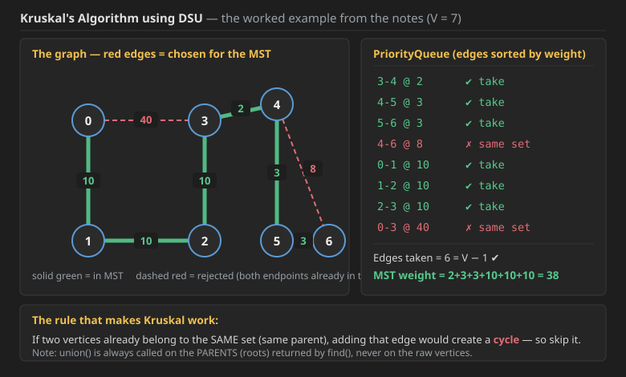
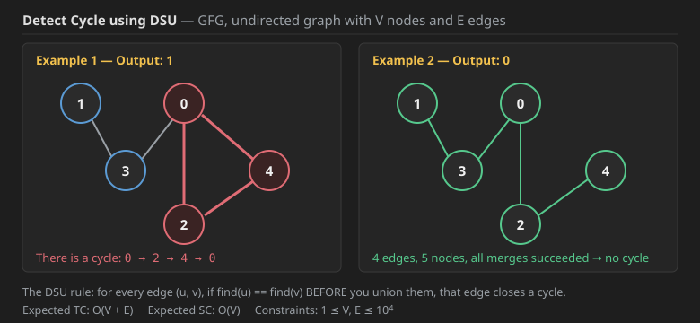
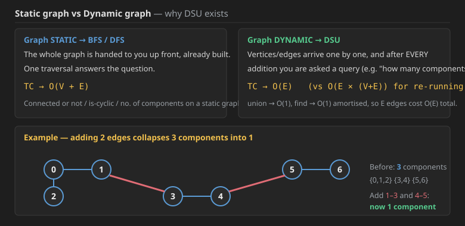
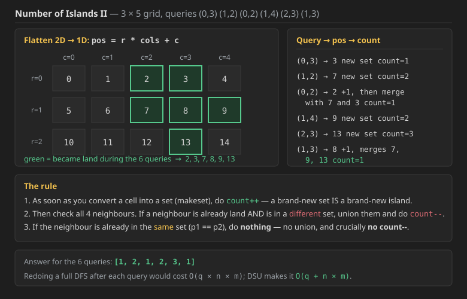
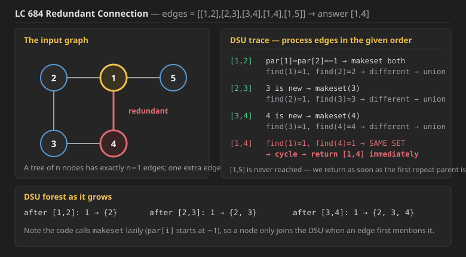
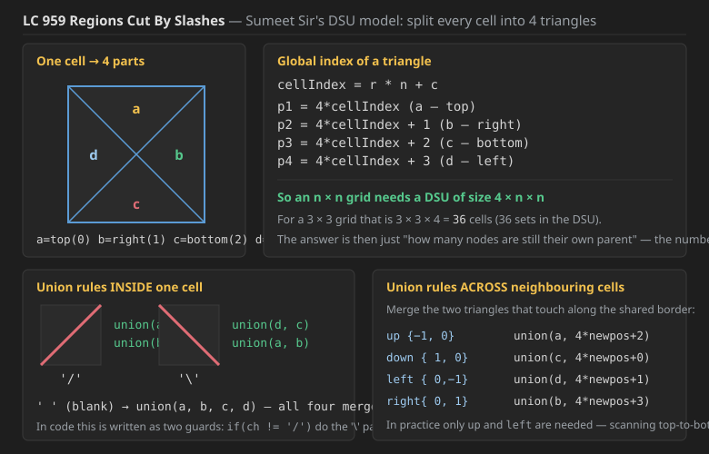
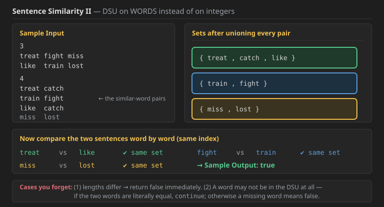

## DSU code

```cpp
class DisjointSet {
    vector<int>par;
    vector<int>rank;
    vector<int> sz;
public:
    DisjointSet(int n) {
     par.resize(n);
     rank.resize(n,0);
     sz.resize(n,1);
     for(int i=0;i<n;i++) par[i]=i;
    }
    int findPar(int x){
           if(x==par[x]) return x;
           int parent= findPar(par[x]);
           if(par[x]!=parent) par[x]=parent;//for compression
           return parent;
       }

    bool find(int u, int v) {
        return (findPar(u) == findPar(v));
    }

    void unionByRank(int u, int v) {
        int x=findPar(u);
        int y=findPar(v);
        if(x==y) return;
        if(rank[x]==rank[y]){
               par[x]=y;
               rank[y]++;
           }
           else if(rank[x]<rank[y]){
               par[x]=y;
           }
           else if(rank[x]>rank[y]){
               par[y]=x;
           }
    }

    void unionBySize(int u, int v) {
       
       int x = findPar(u);
       int y = findPar(v);
       if (x == y) return;
    
       if (sz[x] < sz[y]) {
           par[x] = y;
           sz[y] += sz[x];
       }
       else {
           par[y] = x;
           sz[x] += sz[y];
           
       }
    }
};

```

>Note: use union by size in OA and interview rounds!!as more intuitive


## What is DSU (Disjoint Set Union)?

You have two disjoint sets:

```text
S1 = { 1, 2, 3 }        S2 = { 3, 4, 5 }

S1 ∪ S2 = { 1, 2, 3, 4, 5 }     ← this operation is the "Union"
```

To understand this we do **Kruskal's Algorithm**. *(For MST we mostly use Prim's; Kruskal was never done in Level 1, so we do Kruskal now.)*

> **MST → Minimum Spanning Tree**
> * **Spanning** ⟹ connects **all** the vertices
> * **Tree** ⟹ **acyclic**

---

## Q1. Kruskal's Algorithm (MST using DSU)



### The graph and its edges

```text
Edges (u - v @ weight):
  0-3 @ 40      3-4 @ 2
  0-1 @ 10      4-5 @ 3
  1-2 @ 10      4-6 @ 8
  2-3 @ 10      5-6 @ 3
```

Put every edge into a **PriorityQueue sorted by weight**, then pop them one at a time:

```text
PQ (sorted ascending):
  3-4 @ 2
  4-5 @ 3
  5-6 @ 3
  4-6 @ 8
  0-1 @ 10
  1-2 @ 10
  2-3 @ 10
  0-3 @ 40
```

### Dry run — walking the sets (tree view)

Initially every vertex is its own set:

```text
{0}  {1}  {2}  {3}  {4}  {5}  {6}
```

**1. Remove `3-4 @ 2`.** 3 and 4 are in different sets → **union(3, 4)**. We get this edge in the required MST.

```text
{0} {1} {2} {5} {6}      3
                         └── 4
```

**2. Remove `4-5 @ 3`.** `Par(4) → 3`, `Par(5) → 5`. Different sets, so we need to do union. Obviously the *smaller* tree gets reported under the bigger one, so **5 becomes a child of 3**.

```text
{0} {1} {2} {6}          3
                        ┌┴┐
                        4 5
```

**3. Remove `5-6 @ 3`.** `Par(5) = 3`, `Par(6) = 6` → so we do union. **6 is added to 3** with **no change in the rank of 3**.

```text
{0} {1} {2}              3
                       ┌──┼──┐
                       4  5  6
```

**4. Remove `4-6 @ 8`.** `Par(4) = 3` and `Par(6) = 3`.

> **Both are in the same set — if we include this edge it will make a cycle, so we don't include it.**
>
> **If two vertices belong to the same parent, then adding that edge can lead to a cycle** *(only for undirected ka cycle)*.

**5. Remove `0-1 @ 10`.** `Par(0) = 0`, `Par(1) = 1` → both in different sets, so union them. Ranks are equal, so **1 is added to 0**, and **the rank of 0 is increased by 1**.

**6. Remove `1-2 @ 10`.** `Par(1) = 0`, `Par(2) = 2` → union. **2 is added to set 0.**

```text
        0                3
       ┌┴┐             ┌──┼──┐
       1  2            4  5  6
```

**7. Remove `2-3 @ 10`.** `Par(2) = 0`, `Par(3) = 3` → union.

> *"Ab rank dono same hai toh bade no. ko chote mai add kar do. Also rank of 0 will be increased, as equal-rank wale add hone se rank badhta hai."*
> → Now both ranks are the same, so attach the bigger-numbered root under the smaller one, and since it was an **equal-rank** merge, the rank of `0` goes up (to 2).

```text
              0
          ┌───┼───┬───┐
          1   2   3
                ┌─┼─┐
                4 5 6
```

**8. Remove `0-3 @ 40`.** Both now belong to the same set, so **don't add it**.

**PQ is empty → STOP.**

**MST = `3-4(2)`, `4-5(3)`, `5-6(3)`, `0-1(10)`, `1-2(10)`, `2-3(10)` — total weight 38, exactly `V - 1 = 6` edges.**

### The same dry run on the `par[]` / `rank[]` arrays

This is the identical example, just tracked as arrays instead of pictures. *(Note: on an equal-rank tie either root may become the parent — this array pass happens to pick the opposite direction from the tree pass above for the very first union. Both are valid.)*

```text
index:      0   1   2   3   4   5   6
par   :     0   1   2   3   4   5   6
rank  :     0   0   0   0   0   0   0
```

| Edge popped | findPar(u), findPar(v) | Decision | `par[]` after | `rank[]` after |
| :--- | :--- | :--- | :--- | :--- |
| `3-4 @ 2` | 3, 4 — different, ranks equal | union → `par[4]=3`, `rank[3]++` | `0 1 2 3 3 5 6` | `0 0 0 1 0 0 0` |
| `4-5 @ 3` | 3, 5 — `rank[5]=0 < rank[3]=1` | union → `par[5]=3` | `0 1 2 3 3 3 6` | `0 0 0 1 0 0 0` |
| `5-6 @ 3` | 3, 6 — `rank[6]=0 < rank[3]=1` | union → `par[6]=3` | `0 1 2 3 3 3 3` | `0 0 0 1 0 0 0` |
| `4-6 @ 8` | `findPar(4)=3`, `findPar(6)=3` | **same → skip** (cycle) | unchanged | unchanged |
| `0-1 @ 10` | 0, 1 — different, ranks equal | union → `par[0]=1`, `rank[1]++` | `1 1 2 3 3 3 3` | `0 1 0 1 0 0 0` |
| `1-2 @ 10` | 1, 2 — `rank[2]=0 < rank[1]=1` | union → `par[2]=1` | `1 1 1 3 3 3 3` | `0 1 0 1 0 0 0` |
| `2-3 @ 10` | `findPar(2)=1`, `findPar(3)=3` — ranks equal (1 == 1) | union → `par[1]=3`, `rank[3]++` | `1 3 1 3 3 3 3` | `0 1 0 2 0 0 0` |
| `0-3 @ 40` | `findPar(0)`: 0→1→3 = 3, `findPar(3)=3` | **same → skip** (cycle) | unchanged | unchanged |

Now we don't have anything in the PQ, so **stop**.

### Union by Rank — the "who goes under whom" question

*"Kisko kiske neeche lagana hai?"* → **This is decided on the basis of rank; the smaller one goes under.**

Rank is **not** the height and **not** the size — **rank is something different**. It only goes up when you merge two roots of **equal** rank:

* *"Chote bande ke add hone se rank nahi badhta; equal-wale bande ke add hone se rank badhta hai."*
  → Attaching a **shorter** tree does **not** raise the rank. Attaching an **equal-rank** tree **does** raise it by 1.

### Path Compression — what `findPar(x)` really does

There is something we call **Path Compression**, which happens while we do `findPar(x)`.

```text
Before:                 After findPar(1):

      3                       3
   ┌──┼──┬──┐            ┌──┬─┼─┬──┬──┐
   0  4  5  6            0  4 5  6  1
  ┌┴┐                   ┌┘
  1 2                   2
```

We ask `findPar(1)`:

```text
findPar(1) → findPar(0) → 3
```

Now **1 is directly attached to 3**, because on the way back out of the recursion `findPar(0)` returned 3 and we wrote it into `par[1]`.

> **The point:** `findPar()` for a case like this becomes **easy next time** — the next lookup is one hop instead of two.

### Path Compression — what it buys you

```text
Path compression se kya hua?           TC of 1 find  →  O(α)
                                       TC of n finds →  O(nα)
                                                           └→ Ackermann Constant(α), for N = 10^600 it is still 4
```

| | 1 find | n finds |
| :--- | :--- | :--- |
| **Without path compression** | `O(log n)` | `O(n log n)` |
| **With path compression** | `O(α) ≈ O(4)` | `O(4n) ≈ O(n)` |

### The two DSU optimisations

```text
DSU two algorithms ──┬──→ find()  ──→ Path Compression
                     └──→ union() ──→ by Rank
```

* **Application of DSU is Kruskal's algorithm.** DSU is used in graphs but is **very different from graphs** and is **independent apart from graphs**.
* `find()` is the same as `findPar()`.
* `find()` by **Path Compression** && `union()` by **Rank** are *the* optimisations in DSU.

### When to use Kruskal vs Prim's, and when DSU at all?

```text
More edges  →  use Prim's        ┐  although both have
Less edges  →  use Kruskal       ┘  the same TC
```

> **DSU kab use kare?**
> DFS/BFS is used when the **graph is already built** beforehand.
> But **DSU** is used when the graph is being **built slowly, step by step**, and you are told to **run queries on it** as it grows.

### Java Code — Kruskal + DSU (from the notes)

```java
public class Main {
    static class Edge {
        int src;
        int nbr;
        int wt;

        Edge(int src, int nbr, int wt) {
            this.src = src;
            this.nbr = nbr;
            this.wt = wt;
        }
    }

    static class DSU {
        int[] par;
        int[] rank;

        DSU(int v) {
            par = new int[v];
            rank = new int[v];
            for (int i = 0; i < par.length; i++) {
                par[i] = i;
            }
        }

        public int find(int x) {
            if (par[x] == x) return x;

            int parent = find(par[x]);
            par[x] = parent;   // for compression
            return parent;
        }

        public void union(int x, int y) {
            if (rank[x] == rank[y]) {
                par[x] = y;
                // kisi ko bii parent bna skte
                rank[y]++;
            } else if (rank[x] < rank[y]) {
                par[x] = y;
            } else if (rank[x] > rank[y]) {
                par[y] = x;
            }
        }
    }

    public static void kruskal(ArrayList<Edge>[] graph) {
        PriorityQueue<Edge> pq = new PriorityQueue<>((v1, v2) -> v1.wt - v2.wt);
        for (int i = 0; i < graph.length; i++) {
            for (Edge e : graph[i]) {
                pq.add(e);
            }
        }
        DSU d = new DSU(graph.length);
        while (pq.size() > 0) {
            Edge e = pq.remove();
            int srcSet = d.find(e.src);
            int destSet = d.find(e.nbr);
            if (srcSet == destSet) continue;
            System.out.println(e.src + "-" + e.nbr + "@" + e.wt);
            d.union(srcSet, destSet);
        }
    }
}
```

> **See — `union` is always done on the PARENTS**, never on the raw vertices.

### C++ Code — Kruskal + DSU (was missing — same logic as the Java above)

```cpp
#include <bits/stdc++.h>
using namespace std;

struct Edge {
    int src;
    int nbr;
    int wt;
    Edge(int src, int nbr, int wt) : src(src), nbr(nbr), wt(wt) {}
};

class DSU {
    vector<int> par;
    vector<int> rank_;

public:
    DSU(int v) {
        par.resize(v);
        rank_.assign(v, 0);
        for (int i = 0; i < v; i++) par[i] = i;
    }

    int find(int x) {
        if (par[x] == x) return x;

        int parent = find(par[x]);
        par[x] = parent;   // for compression
        return parent;
    }

    void unionSets(int x, int y) {
        if (rank_[x] == rank_[y]) {
            par[x] = y;
            // kisi ko bhi parent bana sakte
            rank_[y]++;
        } else if (rank_[x] < rank_[y]) {
            par[x] = y;
        } else if (rank_[x] > rank_[y]) {
            par[y] = x;
        }
    }
};

void kruskal(vector<vector<Edge>>& graph) {
    auto cmp = [](const Edge& v1, const Edge& v2) { return v1.wt > v2.wt; };  // min-heap
    priority_queue<Edge, vector<Edge>, decltype(cmp)> pq(cmp);

    for (int i = 0; i < (int) graph.size(); i++) {
        for (Edge& e : graph[i]) {
            pq.push(e);
        }
    }

    DSU d(graph.size());
    while (!pq.empty()) {
        Edge e = pq.top();
        pq.pop();
        int srcSet = d.find(e.src);
        int destSet = d.find(e.nbr);
        if (srcSet == destSet) continue;
        cout << e.src << "-" << e.nbr << "@" << e.wt << endl;
        d.unionSets(srcSet, destSet);
    }
}
```

**Complexity (Q1 — Kruskal using DSU):**

```text
PQ addition of Edges  ⟹  O(E log E)
Rest (union, find)    ⟹  O(1)

O(E log E)  ⟹  O(E log V)
```

* **Time — `O(E log E)` = `O(E log V)`.** The `log` comes **entirely from the priority queue**, not from the DSU. Pushing all `E` edges into the heap costs `E log E`, and popping them all costs the same. Since `E ≤ V²`, `log E ≤ log V² = 2 log V`, so `O(E log E) = O(E log V)`. Every `find` and `union` after that is amortised `O(α(N)) ≈ O(1)`, so the `E` DSU operations contribute only `O(E)` — completely dominated by the sort/heap.
* **Space — `O(V + E)`.** The priority queue holds all `E` edges, and the DSU holds `par[]` + `rank[]` of size `V`. Iterative outer loop, but `find()` is recursive, so add an `O(log V)` recursion stack in the worst case (which path compression keeps tiny in practice).

---


---

## Q2. Detect Cycle using DSU


Given an undirected graph with **V** nodes and **E** edges. The task is to check if there is any cycle in the undirected graph.

**Note:** Solve the problem using **disjoint set union (dsu)**.



### Example 1

**Input:** the graph with edges `1-3, 3-0, 0-2, 0-4, 2-4`
**Output:** `1`
**Explanation:** There is a cycle between `0 -> 2 -> 4 -> 0`.

### Example 2

**Input:** the graph with edges `1-3, 3-0, 0-2, 2-4`
**Output:** `0`
**Explanation:** The graph doesn't contain any cycle.

* **Expected Time Complexity:** `O(V + E)`
* **Expected Space Complexity:** `O(V)`
* **Constraints:** `1 ≤ V, E ≤ 10⁴`

```java
//Link--> https://www.geeksforgeeks.org/problems/detect-cycle-using-dsu/1

class Solution
{
    //Function to detect cycle using DSU in an undirected graph.
      class DSU{
       int[] par;
       int[] rank;
       DSU(int v){
         par=new int[v];
         rank=new int[v];
         for(int i=0;i<par.length;i++){
             par[i]=i;
             rank[i]=0;
         }
       }
       public int find(int x){
           if(x==par[x]) return x;
           int parent= find(par[x]);
           if(par[x]!=parent) par[x]=parent;//for compression
           return parent;
       }
       
       public void union(int u,int v){
            int x=findPar(u);
            int y=findPar(v);
           if(rank[x]==rank[y]){
               par[x]=y;
               rank[y]++;
           }
           else if(rank[x]<rank[y]){// to remember ,remember less than pe same order
               par[x]=y;
           }
           else if(rank[x]>rank[y]){//greater than pe last vala phle
               par[y]=x;
           }
       }
   }
    public int detectCycle(int V, ArrayList<ArrayList<Integer>> adj)
    {
        DSU d=new DSU(adj.size());
        
       for(int i=0;i<adj.size();i++){
            for(var v:adj.get(i)){
                int srcPar=d.find(i);
                int destPar=d.find(v);
                if(v>i){ if(srcPar==destPar) return 1;}
                  d.union(srcPar,destPar); 
                    
                  
            }
        }
        return 0; 
    }
}

```
## Is connected code only but have union by size too Cpp code

```cpp
class DisjointSet {
    vector<int>par;
    vector<int>rank;
    vector<int> sz;
public:
    DisjointSet(int n) {
     par.resize(n);
     rank.resize(n,0);
     sz.resize(n,1);
     for(int i=0;i<n;i++) par[i]=i;
    }
    int findPar(int x){
           if(x==par[x]) return x;
           int parent= findPar(par[x]);
           if(par[x]!=parent) par[x]=parent;//for compression
           return parent;
       }

    bool find(int u, int v) {
        return (findPar(u) == findPar(v));
    }

    void unionByRank(int u, int v) {
        int x=findPar(u);
        int y=findPar(v);
        if(x==y) return;
        if(rank[x]==rank[y]){
               par[x]=y;
               rank[y]++;
           }
           else if(rank[x]<rank[y]){
               par[x]=y;
           }
           else if(rank[x]>rank[y]){
               par[y]=x;
           }
    }

    void unionBySize(int u, int v) {
       
       int x = findPar(u);
       int y = findPar(v);
       if (x == y) return;
    
       if (sz[x] < sz[y]) {
           par[x] = y;
           sz[y] += sz[x];
       }
       else {
           par[y] = x;
           sz[x] += sz[y];
           
       }
    }
};

```

### Correct & Submitted Java code for Q2

```java
class Solution {
    // Function to detect cycle using DSU in an undirected graph.
    class DSU {
        int[] par;
        int[] rank;

        DSU(int v) {
            par = new int[v];
            rank = new int[v];
            for (int i = 0; i < par.length; i++) {
                par[i] = i;
                rank[i] = 0;
            }
        }

        public int find(int x) {
            if (x == par[x]) return x;
            int parent = find(par[x]);
            if (par[x] != parent) par[x] = parent;   // for compression
            return parent;
        }

        public void union(int x, int y) {
            if (rank[x] == rank[y]) {
                par[y] = x;
                rank[x]++;
            } else if (rank[x] < rank[y]) {
                par[x] = y;
            } else if (rank[x] > rank[y]) {
                par[y] = x;
            }
        }
    }

    public int detectCycle(int V, ArrayList<ArrayList<Integer>> adj) {
        DSU d = new DSU(adj.size());

        for (int i = 0; i < adj.size(); i++) {
            for (var v : adj.get(i)) {
                int srcPar = d.find(i);
                int destPar = d.find(v);
                if (v > i) { if (srcPar == destPar) return 1; }
                d.union(srcPar, destPar);
            }
        }
        return 0;
    }
}
```

> **Note on the `union` here:** it happens to write `par[y] = x; rank[x]++;` on a tie, whereas the version at the top of these notes writes `par[x] = y; rank[y]++;`. On an equal-rank merge **either root may become the parent** — both are correct, it works.

### The `find(i)` placement gotcha (Stack Overflow)

> Now if we hoist line 75 (`int srcPar = d.find(i);`) **above** line 74 (the inner `for` loop over the neighbours), then it shows **Stack Overflow** — don't know why. We have tried over several test cases, but what we will see later, we have done a dry run over these to just see **what if you still don't get it**.
>
> *"Andar hi dekhte hai, we as structure change hoga toh iska dry run union hone par..."*
> → The reason is that the parent found once at the top goes **stale**: every `d.union(...)` inside the inner loop can change the root of `i`, so `srcPar` must be recomputed for each neighbour, otherwise `union` gets handed a non-root and the tree can grow into a chain.

### Dry run for Q2

**Input:**

```text
7 14
0 2
0 5   
1 2   
1 3   
1 5   
1 6   
2 3
2 4   
2 5   
2 6   
3 4   
3 6   
4 6   
5 6
```

**Adjacency list:**

```text
0 --> 2 5
1 --> 2 3 5 6
2 --> 0 1 3 4 5 6
3 --> 1 2 4 6
4 --> 2 3 6
5 --> 0 1 2 6
6 --> 1 2 3 4 5
```

**Initial DSU:**

```text
index:   0  1  2  3  4  5  6
par  :   0  1  2  3  4  5  6
rank :   0  0  0  0  0  0  0
```

**Step 1 — `i = 0`, neighbour `v = 2`:**

```text
srcPar  = find(0) = 0
destPar = find(2) = 2
v > i  →  2 > 0  ✔    srcPar == destPar ?  NO
so do union(0, 2)  →  par[2] = 0 ,  rank[0]++ = 1
```

**Step 2 — `i = 0`, neighbour `v = 5`:**

```text
srcPar  = 0        destPar = find(5) = 5
v > i  →  5 > 0  ✔    not equal
so do union(0, 5)  →  rank[0] = 1 > rank[5] = 0
                   →  par[5] = 0
```

**Step 3 — `i = 1`, neighbour `v = 2`:**

```text
destPar = find(2)  →  par[2] = 0  →  find(0) = 0
```

…and so on. *(This is the version that still throws Stack Overflow if you hoist the `find(i)` out of the inner loop.)*

### The `if (v > i)` guard — why it is there

The graph is **undirected**, so every edge appears **twice** in the adjacency list (once as `u → v` and once as `v → u`). Without a guard, the second copy of an edge would look like "both endpoints are already in the same set" and be reported as a false cycle. The condition `v > i` makes sure each undirected edge is *checked* exactly once — from the smaller endpoint to the larger one.

### C++ code for Q2 (was missing — same logic as the Java above)

```cpp
class Solution {
    class DSU {
        vector<int> par;
        vector<int> rank_;

    public:
        DSU(int v) {
            par.resize(v);
            rank_.assign(v, 0);
            for (int i = 0; i < v; i++) par[i] = i;
        }

        int find(int x) {
            if (x == par[x]) return x;
            int parent = find(par[x]);
            if (par[x] != parent) par[x] = parent;   // for compression
            return parent;
        }

        void unionSets(int x, int y) {
            if (rank_[x] == rank_[y]) {
                par[y] = x;
                rank_[x]++;
            } else if (rank_[x] < rank_[y]) {
                par[x] = y;
            } else if (rank_[x] > rank_[y]) {
                par[y] = x;
            }
        }
    };

public:
    int detectCycle(int V, vector<vector<int>>& adj) {
        DSU d(adj.size());

        for (int i = 0; i < (int) adj.size(); i++) {
            for (int v : adj[i]) {
                int srcPar = d.find(i);
                int destPar = d.find(v);
                if (v > i) { if (srcPar == destPar) return 1; }
                d.unionSets(srcPar, destPar);
            }
        }
        return 0;
    }
};
```

**Complexity (Q2 — Detect Cycle using DSU):**

* **Time — `O(V + E)`** (technically `O((V + E) · α(V))`, but `α(V) ≤ 4` for any `V` that fits in a computer, so it is treated as linear). You walk every adjacency list exactly once — that is `V` list headers plus `2E` entries — and each entry costs two `find`s and at most one `union`, all amortised `O(α)` thanks to **path compression + union by rank together**. Drop either optimisation and each operation degrades to `O(log V)`, making the whole thing `O((V+E) log V)`.
* **Space — `O(V)`.** Just `par[]` and `rank[]`, both of size `V`. There is no queue, no visited array and no auxiliary graph copy — this is exactly why DSU beats a BFS/DFS cycle check on memory. The only hidden cost is the recursion inside `find()`, which path compression keeps at `O(log V)` at worst and effectively `O(1)` after the first few calls.

### Union by Rank vs. Union by Size

Both are optimization strategies to keep the Disjoint Set Union (DSU) trees **flat**.
Without these optimizations, the tree could look like a linked list (Height $N$), making operations $O(N)$.
With either optimization + Path Compression, operations become **$O(\alpha(N))$** (nearly constant).

---

#### 1. Union by Rank (Based on Height)
**Concept:**
* **Rank** $\approx$ **Height** of the tree.
* **Strategy:** Always attach the **Shorter** tree to the **Taller** tree.
* **Why?** Attaching a short tree under a tall root usually doesn't increase the total height.

**Logic:**
```cpp
if (rank[u] < rank[v]) {
    parent[u] = v;          // Attach short to tall
} else if (rank[v] < rank[u]) {
    parent[v] = u;          // Attach short to tall
} else {
    parent[u] = v;          // Same height?
    rank[v]++;              // Height increases by 1
}
```
* **Pros:** Slightly more intuitive regarding tree depth.
* **Cons:** The "Rank" is only an upper bound. Once you use Path Compression, the rank is no longer the true height, but we don't bother correcting it because it still works as a relative measure.

### 2. Union by Size (Based on Node Count)

**Concept:**
* **Size** = Number of nodes in the component.
* **Strategy:** Always attach the **Smaller** tree (fewer nodes) to the **Larger** tree.
* **Why?** We want to minimize the number of nodes that get "moved" to a new parent.

**Logic:**
```cpp
if (size[u] < size[v]) {
    parent[u] = v;          // Attach small to big
    size[v] += size[u];     // Add sizes
} else {
    parent[v] = u;
    size[u] += size[v];     // Add sizes
}
```
* **Pros:**
    * **More Info:** You always know exactly how many nodes are in a connected component. This is extremely useful for many CP problems (e.g., "Find the size of the largest group").
    * **Simple Update:** You always just add `size[a] + size[b]`. No "if equal" edge cases.

### Comparison Summary

| Feature | Union by Rank | Union by Size |
| :--- | :--- | :--- |
| **Metric** | Approximate Height | Exact Node Count |
| **Update Rule** | Increment only if rank is equal | Always sum: `size[root] += size[child]` |
| **Usefulness** | Just for efficiency | Efficiency + Component Size Info |
| **Code Simplicity** | Medium (requires 3 branches) | High (requires 2 branches) |


---

## Static graph vs Dynamic graph — the real reason DSU exists



```text
Graph STATIC   →  BFS
                  DFS      ⟹  O(V + E)

Graph DYNAMIC  →  vertices/edges are being added one by one,
                  and you have to answer a query after each one
```

**Number of components** — *"poochh rahe hai toh hum use DSU!!"* → if they keep asking you the number of components while the graph is still being built, use DSU.

Example: `{0,1,2}`, `{3,4}`, `{5,6}` are 3 components. Now add the edges `1-3` and `4-5` → **now tell the number of components?** (Answer: 1.)

> **If we use BFS/DFS on adding every edge then TC = `O(E(V+E))`, but if you use Disjoint Set then TC → `O(E)`.**

```text
union       →  O(1)
n find()    →  n        so 1 find() on avg  →  O(1)      ⟹ so DSU overall O(1)

For every edge we do union, find, so TC → O(E)
```

Let's see a question on this, on **Pepcoding**.

---

## Q3. Number of Islands II (dynamic island counting)



### The problem

You are given an `n × m` matrix which is **initially all 0** (all water), and a list of **queries**. Each query turns one cell into land (`1`). After each query, report **how many islands** currently exist.

**Small example — a `3 × 3` matrix with 4 queries:**

```text
3 3 4
0 0
0 1
1 2
2 1
```

Initially the whole matrix is 0. Label the 9 cells `a` … `i`:

```text
a b c
d e f
g h i
```

* `0,0` — put a 1 there → **number of islands becomes 1**
* `0,1` — put a 1 there, and now the number of islands is…
* `1,2` — put a 1 there, and now the number of islands is…
* `2,1` — put a 1 there, and now the number of islands is…

**Walking it:**

1. `0,0` → make `a` a set. Check `a`'s 4 sides — nothing there. **1 island.**
2. `0,1` → make `b` a set. `b`'s four neighbours include `a`, and we found it, so do **union(a, b)**. They merge into one, so it **remains 1 island**.
3. `1,2` → make `f` a set. All around `f` is 0, so it stays alone. Now `{a,b}` and `{f}` → **2 islands.**
4. `2,1` → make `h` a set. None of `h`'s 4 neighbours is a 1, so → **3 islands.**

### The bigger dry run — a `3 × 5` grid

This question does **not** give you a grid, only `n`, `m` and the queries. *(Solution from Subhash's video on YouTube.)*

```text
DFS on every query  →  O(q × (n × m))
DSU                 →  O(q + (n × m))
```

> Without DSU any other approach is one of these: if the island size / island count / island is the thing you want, you *can* do it with DFS, but the TC goes way up and the other approach can be **very complex**.

### DSU of a 2D matrix

*"Ab dekho"* — flatten the 2D matrix into 1D:

```text
pos = r × col.length + c
```

For a `3 × 5` grid the cells become the 1D indices `0 … 14`:

```text
       c=0  c=1  c=2  c=3  c=4
r=0     0    1    2    3    4
r=1     5    6    7    8    9
r=2    10   11   12   13   14
```

Queries: `(0,3)`, `(1,2)`, `(0,2)`, `(1,4)`, `(2,3)`, `(1,3)`.

### The rule

> **As soon as you convert a cell into a set, we do `count++`, as we have a set = an island.**
>
> **Now check the neighbours. If we set any neighbour as a 1, then do `count--`, as `count` was for the neighbour's parent too.**

### The trace

**Query `(0,3)` → `0×5 + 3 = 3`.** Make a set for 3. `count = 1`. No neighbours are land.

**Query `(1,2)` → `1×5 + 2 = 7`.** Make a set for 7 and `count++` → `count = 2`. Then check all four sides of 7 — *nobody is there at all*. So `count = 2` till now.

**Query `(0,2)` → `0×5 + 2 = 2`.** `count = 3` as 1 hai.

* Now check all four sides of 2.
* Look **below**, `1` cell down: there is 7, so **union** them and `count--`.
* Then look **right**: there is 3, so **union** and `count--`.
* **New `count = 1`.**

```text
       ↗   ↑
       2   3        both now hang off 7
        ↘ ↙
         7
```

**Query `(1,4)` → `1×5 + 4 = 9`.** `count = 2`. Nobody beside it.

**Query `(2,3)` → `2×5 + 3 = 13`.** `count++` so `count = 3`. But here also nobody is beside it.

**Query `(1,3)` → `1×5 + 3 = 8`.** Make a set for 8, so `count++` → `count = 4`. Now check the neighbours:

```text
left cell 7 & cell 8:   par(7) = 7 , par(8) = 8   →  different, so union(7, 8)  &  count--
upper cell 3:           par(3) = 7 , par(8) = 7   →  SAME, so no union & no count--
right cell 9:           par(9) = 9 , par(8) = 7   →  different, so union & count--
lower cell 13:          par(13) = 13, par(8) = 7  →  different, so union & count--
```

Final tree:

```text
            7
       ┌──┬─┼─┬──┐
       2  3 8 9  13
```

**Answer for the 6 queries: `[1, 2, 1, 2, 3, 1]`.**

### Java Code for Q3 — the correct code

```java
class Solution {
    public class DSU {
        int[] par;
        int[] rank;

        DSU(int v) {
            par = new int[v];
            rank = new int[v];
            for (int i = 0; i < par.length; i++) {
                par[i] = -1;
                rank[i] = 0;
            }
        }

        public void makeset(int i) {
            par[i] = i;
        }

        public int find(int x) {
            if (x == par[x]) return x;
            int parent = find(par[x]);
            par[x] = parent;   // for compression
            return parent;
        }

        public int getparent(int i) {
            return par[i];
        }

        public void union(int x, int y) {
            if (rank[x] == rank[y]) {
                par[x] = y;
                rank[y]++;
            } else if (rank[x] < rank[y]) {
                par[x] = y;
            } else if (rank[x] > rank[y]) {
                par[y] = x;
            }
        }
    }

    public List<Integer> numOfIslands(int n, int m, int[][] q) {
        DSU d = new DSU(n * m);
        List<Integer> res = new ArrayList<>();
        int count = 0;
        int[][] dir = {{-1, 0}, {1, 0}, {0, 1}, {0, -1}};

        for (int i = 0; i < q.length; i++) {
            int r = q[i][0];
            int c = q[i][1];
            int pos = r * m + c;

            if (d.getparent(pos) != -1) {   // already land, nothing changes
                res.add(count);
                continue;
            }
            d.makeset(pos);
            count++;

            for (int di = 0; di < dir.length; di++) {
                int p1 = d.find(pos);                 // MUST be re-found each time
                int newr = r + dir[di][0];
                int newc = c + dir[di][1];
                int newpos = newr * m + newc;

                if (newr >= 0 && newr < n && newc >= 0 && newc < m
                        && d.getparent(newpos) != -1) {
                    int p2 = d.find(newpos);
                    if (p1 != p2) {
                        d.union(p1, p2);
                        count--;
                    }
                }
            }
            res.add(count);
        }
        return res;
    }
}
```

### The bug in the previous version — read this carefully

*"Ab galti dekho!! Aakhir mein hai bold."*

```java
d.makeset(pos);
count++;
int p1 = d.find(pos);          // <-- hoisted OUTSIDE the loop: WRONG
for (int di = 0; di < dir.length; di++) {
    ...
    if (newpos >= 0 && newpos < n * m && d.getparent(newpos) != -1) {   // <-- also wrong
        ...
    }
}
```

**Bug 1 — the stale parent.** *"Ye andar daalo, as union ke baad `find(pos)` bhi update ho sakta. Isliye pichle question mein bhi andar lena bada tha, warna wo hi chale."*
→ Move `find(pos)` **inside** the loop, because after a `union` the parent of `pos` **can change**. This is the *same* bug as in the previous question.

**Bug 2 — the bounds check.** Checking `newpos >= 0 && newpos < n*m` is **not** enough:

> Suppose the number of columns = 5. Now if we go to `(0, 6)`, then `newpos = 0×5 + 6 = 6`, which tells us it's valid — **but it's not**. So put the check on `newr` and `newc` here.

*(A column overflow wraps around into the next row, which the flat index can never detect.)*

### C++ Code for Q3 (was missing — same logic as the Java above)

```cpp
class Solution {
    class DSU {
        vector<int> par;
        vector<int> rank_;

    public:
        DSU(int v) {
            par.assign(v, -1);
            rank_.assign(v, 0);
        }

        void makeset(int i) { par[i] = i; }

        int find(int x) {
            if (x == par[x]) return x;
            int parent = find(par[x]);
            par[x] = parent;   // for compression
            return parent;
        }

        int getparent(int i) { return par[i]; }

        void unionSets(int x, int y) {
            if (rank_[x] == rank_[y]) {
                par[x] = y;
                rank_[y]++;
            } else if (rank_[x] < rank_[y]) {
                par[x] = y;
            } else if (rank_[x] > rank_[y]) {
                par[y] = x;
            }
        }
    };

public:
    vector<int> numOfIslands(int n, int m, vector<vector<int>>& q) {
        DSU d(n * m);
        vector<int> res;
        int count = 0;
        int dir[4][2] = {{-1, 0}, {1, 0}, {0, 1}, {0, -1}};

        for (int i = 0; i < (int) q.size(); i++) {
            int r = q[i][0];
            int c = q[i][1];
            int pos = r * m + c;

            if (d.getparent(pos) != -1) {   // already land
                res.push_back(count);
                continue;
            }
            d.makeset(pos);
            count++;

            for (int di = 0; di < 4; di++) {
                int p1 = d.find(pos);              // re-find every time
                int newr = r + dir[di][0];
                int newc = c + dir[di][1];
                int newpos = newr * m + newc;

                if (newr >= 0 && newr < n && newc >= 0 && newc < m
                        && d.getparent(newpos) != -1) {
                    int p2 = d.find(newpos);
                    if (p1 != p2) {
                        d.unionSets(p1, p2);
                        count--;
                    }
                }
            }
            res.push_back(count);
        }
        return res;
    }
};
```

**Complexity (Q3 — Number of Islands II):**

* **Time — `O(q + n·m)`.** Building the DSU arrays is `O(n·m)` once. Each of the `q` queries then does **at most 5 DSU operations** (one `makeset` plus 4 neighbour `find`/`union` pairs) — a **constant** amount of work per query, each amortised `O(α)`. That is the whole point: re-running a full DFS after every query would cost `O(q × n × m)`, because you would repaint the entire grid `q` times just to re-count what you already knew.
* **Space — `O(n·m)`.** `par[]` and `rank[]` are each `n·m` entries. The answer list adds `O(q)`. Note you never actually materialise the grid itself — the DSU *is* the grid.
* **Why `count` is maintained incrementally:** a fresh `makeset` is by definition a new island, so `count++`. Each successful `union` destroys exactly one island (two merge into one), so `count--`. A neighbour already in the same set merges nothing, so it must **not** decrement — that single `if (p1 != p2)` guard is the whole correctness of the algorithm.

---

> **Number of Islands 2 submitted on each & every platform. Isme galti baar-baar nikalti hamesha.**
>
> **Set jaise lage ya ye Dynamic Graph ya Relation-based model ho, toh use DSU.**


## Q4. Redundant Connection (LeetCode 684)

**Difficulty:** Medium

In this problem, a **tree** is an **undirected graph** that is connected and has no cycles.

You are given a graph that started as a tree with `n` nodes labeled from `1` to `n`, with one **additional edge added**. The added edge has two **different** vertices chosen from `1` to `n`, and was not an edge that already existed. The graph is represented as an array `edges` of length `n` where `edges[i] = [aᵢ, bᵢ]` indicates that there is an edge between nodes `aᵢ` and `bᵢ` in the graph.

Return *an edge that can be removed so that the resulting graph is a tree of `n` nodes*. If there are multiple answers, return the answer that occurs **last** in the input.

### Example 1

**Input:** `edges = [[1,2],[1,3],[2,3]]`
**Output:** `[2,3]`

### Example 2

**Input:** `edges = [[1,2],[2,3],[3,4],[1,4],[1,5]]`
**Output:** `[1,4]`

### Constraints

* `n == edges.length`
* `3 <= n <= 1000`
* `edges[i].length == 2`
* `1 <= aᵢ < bᵢ <= edges.length`
* `aᵢ != bᵢ`
* There are no repeated edges.
* The given graph is connected.



### Dry run on Example 2 — `edges = [[1,2],[2,3],[3,4],[1,4],[1,5]]`

**At `1-2`:**

```text
par[1] = -1
par[2] = -1     →  so inko set bana lo (makeset both)

find(1) , find(2)  →  union(1, 2) if dono ka parent same nahi
```

```text
   1
   └── 2
```

**At `2-3`:**

```text
par[2] = 1      (already in a set)
par[3] = -1     →  so 3 ko set bana lo

& then union(1, 3) as dono ka parent same nahi
```

```text
      1
     ┌┴┐
     2 3
```

**At `3-4`:**

> 4 abhi set mein hi nahi hai, as `par = -1`, so usko pehle set banao. And then dono ka find karo:

```text
find(3) = 1        find(4) = 4        →  so do union
```

```text
       1
    ┌──┼──┐
    2  3  4
```

**Now at `1-4`:**

> 1 aur 4 ke set hai toh:

```text
find(1) = 1        find(4) = 1        →  SAME  →  cycle
```

**So isko remove kar do — answer = `[1, 4]`.** *(We never even reach `[1,5]`.)*

```java

class Solution {
 public class DSU{
       int[] par;
       int[] rank;
       DSU(int v){
         par=new int[v];
         rank=new int[v];
         for(int i=0;i<par.length;i++){
             par[i]=-1;
             rank[i]=0;
         }
       }
       public void makeset(int i){
           par[i]=i;
       }
       public int find(int x){
           if(x==par[x]) return x;
           int parent= find(par[x]);
           par[x]=parent;//for compression
           return parent;
       }
       public int getparent(int i){
           return par[i];
       }
       
       public void union(int x,int y){
           if(rank[x]==rank[y]){
               par[x]=y;
               rank[y]++;
           }
           else if(rank[x]<rank[y]){
               par[x]=y;
           }
           else if(rank[x]>rank[y]){
               par[y]=x;
           }
       }
        }
    public int[] findRedundantConnection(int[][] edges) {
        DSU d=new DSU(edges.length+1);
        int[] res=new int[2];
        for(int i=0;i<edges.length;i++){
            int v1=edges[i][0];
            int v2=edges[i][1];
            
            if(d.getparent(v1)==-1){
                d.makeset(v1);
            }
              if(d.getparent(v2)==-1){
                d.makeset(v2);
            }
            int p1=d.find(v1);
            int p2=d.find(v2);
            if(p1!=p2){
                d.union(p1,p2);
            }
            else{
                res[0]=v1;
                res[1]=v2;
                return res;
            }
        }
        return res;
    }
}


```


> **BFS/DFS ke liye pehle ArrayList of ArrayList of int mein convert karo, & then DFS se cycle detect karo — else this DSU.**
>
> **If multiple answers chahiye toh last edge jo cycle wale return hoga** — because we return the *first* edge that closes a cycle while scanning in input order, and the problem guarantees exactly one extra edge.

### Why DSU and not BFS/DFS here?

```text
AP, Dijkstra, BFS        ⟩  Ek se min Path
Total cost minimise      ⟩  Prim's, Kruskal
Connected or not,        ⟩
Is cyclic,               ⟩  Static Graph  →  DFS / BFS
  "     "     "          ⟩  Dynamic Graph →  DSU
```

> **Pichle question mein last wale cheez edges jo cycle banayenge — BFS/DFS se karte, we add each edge & then see `isCyclic()` there or not. But TC → `O(E(V+E))`, so we use DSU.**

### C++ Code for Q4 

```cpp
class Solution {
    class DSU {
        vector<int> par;
        vector<int> rank_;

    public:
        DSU(int v) {
            par.assign(v, -1);
            rank_.assign(v, 0);
        }

        void makeset(int i) { par[i] = i; }

        int find(int x) {
            if (x == par[x]) return x;
            int parent = find(par[x]);
            par[x] = parent;   // for compression
            return parent;
        }

        int getparent(int i) { return par[i]; }

        void unionSets(int x, int y) {
            if (rank_[x] == rank_[y]) {
                par[x] = y;
                rank_[y]++;
            } else if (rank_[x] < rank_[y]) {
                par[x] = y;
            } else if (rank_[x] > rank_[y]) {
                par[y] = x;
            }
        }
    };

public:
    vector<int> findRedundantConnection(vector<vector<int>>& edges) {
        DSU d(edges.size() + 1);
        vector<int> res(2, 0);

        for (int i = 0; i < (int) edges.size(); i++) {
            int v1 = edges[i][0];
            int v2 = edges[i][1];

            if (d.getparent(v1) == -1) d.makeset(v1);
            if (d.getparent(v2) == -1) d.makeset(v2);

            int p1 = d.find(v1);
            int p2 = d.find(v2);
            if (p1 != p2) {
                d.unionSets(p1, p2);
            } else {
                res[0] = v1;
                res[1] = v2;
                return res;
            }
        }
        return res;
    }
};
```

**Complexity (Q4 — Redundant Connection):**

* **Time — `O(n · α(n)) ≈ O(n)`.** There are exactly `n` edges (`n == edges.length`), and each one costs two `find`s plus at most one `union`, all amortised near-constant. We return the instant the first repeat-parent is found, so in practice it is often even less. Compare this with the BFS/DFS approach, where you would add an edge and re-run a full cycle check each time: `O(E · (V + E))` = `O(n²)` here.
* **Space — `O(n)`.** `par[]` + `rank[]` sized `n+1` (nodes are labelled `1..n`, so index 0 is wasted). No adjacency list is built at all — the DSU replaces it entirely, which is why the memory beats most graph-building solutions.
* **Why lazy `makeset` (`par[i] = -1`) matters:** it lets `getparent(v) == -1` act as an "is this node known yet?" test without a separate `visited` array — the same trick reused in Q3 and Q6.

---

> **Think about DSU in a directed graph & Kahn's algo for cycle. & also think about LeetCode 685. Let's do it in the next class.**
>
> And now let's see another question.

---

## Q5. Regions Cut By Slashes (LeetCode 959)

**Difficulty:** Medium

An `n x n` grid is composed of `1 x 1` squares where each `1 x 1` square consists of a `'/'`, `'\'`, or blank space `' '`. These characters divide the square into contiguous regions.

Given the grid `grid` represented as a string array, return *the number of regions*.

**Note** that backslash characters are escaped, so a `'\'` is represented as `'\\'`.

### Constraints

* `n == grid.length == grid[i].length`
* `1 <= n <= 30`
* `grid[i][j]` is either `'/'`, `'\'`, or `' '`.

### Example 1

**Input:** `grid = [" /","/ "]` → **Output:** `2`

### Example 2

**Input:** `grid = [" /","  "]` → **Output:** `1`
*(Poora ek hi area hai — the whole thing is one single region.)*

### Example 3

**Input:** `grid = ["/\\","\\/"]` → **Output:** `5`
**Explanation:** Recall that because `\` characters are escaped, `"\\/"` refers to `\/`, and `"/\\"` refers to `/\`.

> **You have to tell the number of Areas / regions because of the `/`'s.**

### Approach 1 (from the LeetCode discussion) — "DFS on upscaled grid"

> *votrubac, Dec 16, 2018:* We can upscale the input grid to an `[n*3][n*3]` grid and draw "lines" there. Then we can paint empty regions using DFS and count them. Note that an `[n*2][n*2]` grid does **not** work as "lines" are too thick to identify empty areas correctly.
>
> This transforms this problem into **200. Number of Islands**, where lines (`'1'`) are the water, and the rest (`'0'`) is the land.

*"Kisi ka code hai — usne `'\'` ya `'/'` ki jagah 1 daal ke number of connected components chale diye."*
→ Somebody's solution: replace each `'/'` or `'\'` by 1s in the upscaled grid and then just count the connected components.

```cpp
public:
    void dfs(vector<vector<int>> &arr, int i, int j){
        int n = int(arr.size());
        int m = int(arr[0].size());
        if(i < 0 || j < 0 || i >= n || j >= m || arr[i][j] == 1) return;

        arr[i][j] = 1;
        dfs(arr, i - 1, j);
        dfs(arr, i + 1, j);
        dfs(arr, i, j - 1);
        dfs(arr, i, j + 1);
    }
    int regionsBySlashes(vector<string>& grid){
        int n = int(grid.size());
        int m = int(grid[0].size());
        vector<vector<int>> arr(n * 3, vector<int> (m * 3, 0));

        for(int i = 0; i < n; i++){
            for(int j = 0; j < m; j++){
                if(grid[i][j] == '/'){
                    arr[i * 3][j * 3 + 2] = 1;
                    arr[i * 3 + 1][j * 3 + 1] = 1;
                    arr[i * 3 + 2][j * 3] = 1;
                }
                else if(grid[i][j] == '\\'){
                    arr[i * 3][j * 3] = 1;
                    arr[i * 3 + 1][j * 3 + 1] = 1;
                    arr[i * 3 + 2][j * 3 + 2] = 1;
                }
            }
        }
        int count = 0;
        for(int i = 0; i < n * 3; i++){
            for(int j = 0; j < m * 3; j++){
                if(arr[i][j] == 0){
                    dfs(arr, i, j);
                    count++;
                }
            }
        }
        return count;
    }
```

Java version of the same idea *(that's why you should always read the LeetCode discussion)*:

```java
int dfs(int[][] g, int i, int j) {
    if (Math.min(i, j) < 0 || Math.max(i, j) >= g.length || g[i][j] != 0)
        return 0;
    g[i][j] = 1;
    return 1 + dfs(g, i - 1, j) + dfs(g, i + 1, j) + dfs(g, i, j - 1) + dfs(g, i, j + 1);
}
public int regionsBySlashes(String[] grid) {
    int n = grid.length, regions = 0;
    int[][] g = new int[n * 3][n * 3];
    for (int i = 0; i < n; ++i)
        for (int j = 0; j < n; ++j)
            if (grid[i].charAt(j) == '/')
                g[i * 3][j * 3 + 2] = g[i * 3 + 1][j * 3 + 1] = g[i * 3 + 2][j * 3] = 1;
            else if (grid[i].charAt(j) == '\\')
                g[i * 3][j * 3] = g[i * 3 + 1][j * 3 + 1] = g[i * 3 + 2][j * 3 + 2] = 1;
    for (int i = 0; i < n * 3; ++i)
        for (int j = 0; j < n * 3; ++j)
            regions += dfs(g, i, j) > 0 ? 1 : 0;
    return regions;
}
```

> **See "New number of Components" — you will easily get the intuition now.**

### Approach 2 — Sumeet Sir's DSU solution

*"Let's say a more theme problem: slashes."*



**Assume 1 cell is divided into 4 parts like this:**

```text
        ┌─────────┐
        │ \   a  /│
        │  \    / │
        │ d  \/  b│
        │    /\   │
        │  /    \ │
        │/   c   \│
        └─────────┘

a = top (0)   b = right (1)   c = bottom (2)   d = left (3)
```

**Numbering:** for a `3 × 3` grid, `3 × 3 × 4 = 36 cells` — or **36 sets** in the DSU. The global index of a triangle is:

```text
cellIndex = r * n + c
p1 = 4 * cellIndex       (a — top)
p2 = 4 * cellIndex + 1   (b — right)
p3 = 4 * cellIndex + 2   (c — bottom)
p4 = 4 * cellIndex + 3   (d — left)
```

**Union rules inside a cell:**

```text
If '/'    then do  union(a, d)  &  union(b, c)
If '\'    then do  union(d, c)  &  union(a, b)
If empty  then     union(a, b, c, d)   — all four merge
```

**Worked example** — see cell 0 has a `/` (parts `0,1,2,3`), so we do `union(0, 3)` and `union(1, 2)`.

Suppose the next cell has a `\` — do `union(4, 5)` and `union(7, 6)`.

And then on the 3rd column we have a `/`, so `union(11, 8)` and `union(10, 9)`.

**Union rules across neighbouring cells** — *"Ab side wale se union karte hai."* Merge the two triangles that touch along the shared border:

```text
If we go {0, -1}  (left)   →  do union(d, h)   where h = 4*newpos + 1
If      {-1, 0}  (upper)   →  do union(a, b')  where b' = 4*newpos + 2
If      { 1, 0}  (neeche)  →  do union(c, g)   where g = 4*newpos + 0
If      { 0, 1}  (right)   →  do union(b, f)   where f = 4*newpos + 3

newpos = newr * n + newc      ← n = col length
```

**Counting the answer:** *"At least do count all nodes having parent as itself in DSU — that will tell the number of sets."*

> **See here we are hiding `parent` in the class only. Added one more function to get the set number of parents.**

### Java Code for Q5

```java
class Solution {
    public class DSU {
        int[] par;
        int[] rank;

        DSU(int v) {
            par = new int[v];
            rank = new int[v];
            for (int i = 0; i < par.length; i++) {
                par[i] = -1;
                rank[i] = 0;
            }
        }

        public void makeset(int i) {
            par[i] = i;
        }

        public int find(int x) {
            if (x == par[x]) return x;
            int parent = find(par[x]);
            par[x] = parent;   // for compression
            return parent;
        }

        public int getparent(int i) {
            return par[i];
        }

        public void union(int x, int y) {
            int p1 = this.find(x);
            int p2 = this.find(y);
            unionparent(p1, p2);
        }

        public int getNoOfParent() {
            int count = 0;
            for (int i = 0; i < par.length; i++) {
                if (par[i] == i) {
                    count++;
                }
            }
            return count;
        }

        private void unionparent(int x, int y) {
            if (rank[x] == rank[y]) {
                par[x] = y;
                rank[y]++;
            } else if (rank[x] < rank[y]) {
                par[x] = y;
            } else if (rank[x] > rank[y]) {
                par[y] = x;
            }
        }
    }

    public int regionsBySlashes(String[] grid) {
        int n = grid.length;
        DSU d = new DSU(4 * n * n);
        for (int k = 0; k < n; k++) {
            String s1 = grid[k];
            for (int j = 0; j < s1.length(); j++) {
                char ch = s1.charAt(j);
                int i = k * n + j;
                int p1 = 4 * i;
                int p2 = 4 * i + 1;
                int p3 = 4 * i + 2;
                int p4 = 4 * i + 3;
                if (d.getparent(p1) == -1) d.makeset(p1);
                if (d.getparent(p2) == -1) d.makeset(p2);
                if (d.getparent(p3) == -1) d.makeset(p3);
                if (d.getparent(p4) == -1) d.makeset(p4);
                if (ch != '/') {
                    d.union(p1, p2);
                    d.union(p3, p4);
                }
                if (ch != '\\') {
                    d.union(p1, p4);
                    d.union(p2, p3);
                }
                if (k > 0) {
                    int upperbox = (k - 1) * n + j;
                    int uppercell = 4 * upperbox + 2;
                    d.union(p1, uppercell);
                }
                if (j > 0) {
                    int leftbox = k * n + (j - 1);
                    int leftcell = 4 * leftbox + 1;
                    d.union(p4, leftcell);
                }
            }
        }
        return d.getNoOfParent();
    }
}
```

> **As hum top-down, left-right jaa rahe hai, toh right cell & down dekhne ki zaroorat nahi** — by the time you reach a cell, its *up* and *left* neighbours have already been processed, so those two merges are enough. Every shared border still gets merged exactly once.
>
> * *"Humare 0th cell ⟹ p1, merge hoga upper wale ke 2 se, so `4 * upperbox + 2`."*
> * *"Humara 3rd cell left-side wale ke 1 se merge hoga, so `union(p4, leftcell)`."*

```text
Submission:  Runtime 9 ms  Beats 67.47%   Memory 43.6 MB  Beats 19.58%
```

### C++ Code for Q5 (was missing — same logic as the Java above)

```cpp
class Solution {
    class DSU {
        vector<int> par;
        vector<int> rank_;

        void unionparent(int x, int y) {
            if (rank_[x] == rank_[y]) {
                par[x] = y;
                rank_[y]++;
            } else if (rank_[x] < rank_[y]) {
                par[x] = y;
            } else if (rank_[x] > rank_[y]) {
                par[y] = x;
            }
        }

    public:
        DSU(int v) {
            par.assign(v, -1);
            rank_.assign(v, 0);
        }

        void makeset(int i) { par[i] = i; }

        int find(int x) {
            if (x == par[x]) return x;
            int parent = find(par[x]);
            par[x] = parent;   // for compression
            return parent;
        }

        int getparent(int i) { return par[i]; }

        void unionSets(int x, int y) {
            int p1 = find(x);
            int p2 = find(y);
            unionparent(p1, p2);
        }

        int getNoOfParent() {
            int count = 0;
            for (int i = 0; i < (int) par.size(); i++) {
                if (par[i] == i) count++;
            }
            return count;
        }
    };

public:
    int regionsBySlashes(vector<string>& grid) {
        int n = grid.size();
        DSU d(4 * n * n);
        for (int k = 0; k < n; k++) {
            string s1 = grid[k];
            for (int j = 0; j < (int) s1.size(); j++) {
                char ch = s1[j];
                int i = k * n + j;
                int p1 = 4 * i;
                int p2 = 4 * i + 1;
                int p3 = 4 * i + 2;
                int p4 = 4 * i + 3;
                if (d.getparent(p1) == -1) d.makeset(p1);
                if (d.getparent(p2) == -1) d.makeset(p2);
                if (d.getparent(p3) == -1) d.makeset(p3);
                if (d.getparent(p4) == -1) d.makeset(p4);
                if (ch != '/') {
                    d.unionSets(p1, p2);
                    d.unionSets(p3, p4);
                }
                if (ch != '\\') {
                    d.unionSets(p1, p4);
                    d.unionSets(p2, p3);
                }
                if (k > 0) {
                    int upperbox = (k - 1) * n + j;
                    int uppercell = 4 * upperbox + 2;
                    d.unionSets(p1, uppercell);
                }
                if (j > 0) {
                    int leftbox = k * n + (j - 1);
                    int leftcell = 4 * leftbox + 1;
                    d.unionSets(p4, leftcell);
                }
            }
        }
        return d.getNoOfParent();
    }
};
```

**Complexity (Q5 — Regions Cut By Slashes):**

* **Time — `O(n² · α)` ≈ `O(n²)`.** There are `n²` cells, and each one does a **fixed** amount of work: 4 `makeset`s, at most 2 in-cell unions, and at most 2 cross-cell unions — 8 DSU operations, all amortised `O(α)`. The final `getNoOfParent()` scan is one pass over the `4n²` entries. Nothing here is nested beyond the grid itself. With `n ≤ 30` that is at most 3600 DSU nodes, which is why this runs in single-digit milliseconds.
* **Space — `O(n²)`.** The DSU holds `4n²` entries in `par[]` and `rank[]`. That is 4× more nodes than the grid has cells, but still asymptotically the same — and notably **less** than the upscaled-DFS approach, which allocates a `3n × 3n = 9n²` integer grid **plus** an `O(n²)` recursion stack.
* **Why 4 triangles and not 2 or 3:** a `/` and a `\` cut a cell along *different* diagonals, so you need a partition fine enough that both cuts are representable. Two halves cannot express both diagonals; four quadrants can, and each quadrant touches exactly one of the cell's four borders — which is what makes the neighbour-merge rules a clean one-liner each.

---

Now let's see another question.

---

## Q6. Sentence Similarity II

Two sentences are given — **tell whether they are similar or not**, based on a list of word pairs that are declared similar. Similarity is **transitive**: if `a` is similar to `b` and `b` is similar to `c`, then `a` is similar to `c`.



### Sample Input

```text
3
treat fight miss
like train lost
4
treat catch
train fight
like catch
miss lost
```

### Sample Output

```text
true
```

### Dry run

From the pairs we build these groups:

```text
treat = catch          train = fight          miss = lost
     ↓ (like = catch)
treat = catch = like
```

So the sets are `{treat, catch, like}`, `{train, fight}` and `{miss, lost}`.

Now line up the two sentences word by word (same index):

```text
treat  fight  miss
 ‖       ‖      ‖
like   train  lost
```

Every column is inside one set, so **based on this information tell whether the sentence is similar or not → `true`**.

### My question — how to create a DSU of *words*?

> **Sir's hint → HashMap hi use karo.**
>
> `int[] par` ki jagah `HashMap<String, String>`.

**Another example:**

```text
3
i like naruto
i love pepcoding
5
anime naruto
edtech pepcoding
anime pepcoding
like hate
hate love
```

Grouping:

```text
anime = naruto = edtech = pepcoding
like  = hate   = love
```

```text
        1                    3
      ┌─┘                  ┌─┘
      2                    4        (par(1) = 1 ,  par(4) = 3  →  union(1, 3))
```

Comparing `i like naruto` with `i love pepcoding`: `i == i` ✔, `like`/`love` same set ✔, `naruto`/`pepcoding` same set ✔ → **true**.

If instead the pairs were `anime naruto`, `edtech pepcoding`, `anime pepcoding`, `like hate`, `hate anime`, then **everything collapses into one group**:

```text
anime = naruto = edtech = pepcoding = hate = like
```

### Cases you forget

> * **Koi aisa word aa jaye jo dono DSU mein hi nahi hai toh?**
>   → What if a word appears that is in neither DSU set?
> * **If ab woh equal hai toh sentence than continue** — if the two words are literally equal, just `continue`, no lookup needed.
> * **If dono sentence mein equal nahi toh return `false`.**

### Java Code for Q6

```java
public class Main {
    public static class DSU {
        Map<String, String> par;
        Map<String, Integer> rank;

        DSU() {
            par = new HashMap<>();
            rank = new HashMap<>();
        }

        public void makeset(String s) {
            par.put(s, s);
            rank.put(s, 0);
        }

        public String find(String x) {
            if (x.equals(par.get(x))) return x;
            String parent = find(par.get(x));
            par.put(x, parent);   // for compression
            return parent;
        }

        public boolean getparent(String s) {
            return par.containsKey(s);
        }

        public void union(String x, String y) {
            String p1 = this.find(x);
            String p2 = this.find(y);
            unionparent(p1, p2);
        }

        private void unionparent(String x, String y) {
            if (rank.get(x) == rank.get(y)) {
                par.put(x, y);
                rank.put(y, rank.get(y) + 1);
            } else if (rank.get(x) < rank.get(y)) {
                par.put(x, y);
            } else if (rank.get(x) > rank.get(y)) {
                par.put(y, x);
            }
        }
    }

    public static boolean areSentencesSimilarTwo(String[] Sentence1, String[] Sentence2, String[][] pairs) {
        if (Sentence1.length != Sentence2.length) return false;
        DSU d = new DSU();
        for (int i = 0; i < pairs.length; i++) {
            String s1 = pairs[i][0];
            String s2 = pairs[i][1];
            if (d.getparent(s1) == false) d.makeset(s1);
            if (d.getparent(s2) == false) d.makeset(s2);
            String p1 = d.find(s1);
            String p2 = d.find(s2);
            if (p1.equals(p2) == false) {
                d.union(s1, s2);
            }
        }

        for (int i = 0; i < Sentence1.length; i++) {
            String s1 = Sentence1[i];
            String s2 = Sentence2[i];
            if (s1.equals(s2)) continue;
            if (d.getparent(s1) == false) return false;
            if (d.getparent(s2) == false) return false;
            String p1 = d.find(s1);
            String p2 = d.find(s2);
            // System.out.println(s1+" "+s2+" "+p1+" "+p2);
            if (p1.equals(p2) == false) {
                return false;
            }
        }
        return true;
    }
}
```

> * *"Equal hai toh kyu compute karna hai"* → if the two words are already equal, why compute anything — just `continue`.
> * *"Ab equal nahi, so aage badhte hai. Equal bhi nahi & DSU mein bhi nahi, toh return `false`."*

### C++ Code for Q6 

```cpp
class Solution {
    class DSU {
        unordered_map<string, string> par;
        unordered_map<string, int> rank_;

        void unionparent(const string& x, const string& y) {
            if (rank_[x] == rank_[y]) {
                par[x] = y;
                rank_[y] = rank_[y] + 1;
            } else if (rank_[x] < rank_[y]) {
                par[x] = y;
            } else if (rank_[x] > rank_[y]) {
                par[y] = x;
            }
        }

    public:
        void makeset(const string& s) {
            par[s] = s;
            rank_[s] = 0;
        }

        string find(const string& x) {
            if (x == par[x]) return x;
            string parent = find(par[x]);
            par[x] = parent;   // for compression
            return parent;
        }

        bool getparent(const string& s) {
            return par.count(s) > 0;
        }

        void unionSets(const string& x, const string& y) {
            string p1 = find(x);
            string p2 = find(y);
            unionparent(p1, p2);
        }
    };

public:
    bool areSentencesSimilarTwo(vector<string>& Sentence1, vector<string>& Sentence2,
                                vector<vector<string>>& pairs) {
        if (Sentence1.size() != Sentence2.size()) return false;

        DSU d;
        for (int i = 0; i < (int) pairs.size(); i++) {
            string s1 = pairs[i][0];
            string s2 = pairs[i][1];
            if (d.getparent(s1) == false) d.makeset(s1);
            if (d.getparent(s2) == false) d.makeset(s2);
            string p1 = d.find(s1);
            string p2 = d.find(s2);
            if (p1 != p2) {
                d.unionSets(s1, s2);
            }
        }

        for (int i = 0; i < (int) Sentence1.size(); i++) {
            string s1 = Sentence1[i];
            string s2 = Sentence2[i];
            if (s1 == s2) continue;
            if (d.getparent(s1) == false) return false;
            if (d.getparent(s2) == false) return false;
            string p1 = d.find(s1);
            string p2 = d.find(s2);
            if (p1 != p2) {
                return false;
            }
        }
        return true;
    }
};
```

**Complexity (Q6 — Sentence Similarity II):**

* **Time — `O((P + N) · L)`** where `P` = number of pairs, `N` = sentence length and `L` = average word length. Structurally it is still just `O(P + N)` DSU operations, but here **each operation is no longer `O(1)`**: every `find`/`makeset` hashes and compares a *string*, which costs `O(L)`. That hidden `L` factor is the entire difference between an integer DSU and a word DSU, and it is why you should never call `find` more times than necessary (hence the `if (s1.equals(s2)) continue;` fast path).
* **Space — `O(P · L)`.** The two hash maps hold at most `2P` distinct words, each storing a string key of length `L`. There is no array of size `n` here because the "universe" isn't numbered — that is exactly the problem the `HashMap<String, String>` is solving.
* **Why `HashMap` instead of `int[]`:** a classic DSU needs its elements to be `0 … n-1` so they can index an array. Words have no such numbering, so the map *is* the numbering. An equivalent trick is to first assign each distinct word an integer id and then use a normal `int[]` DSU — same complexity, one extra pass.


