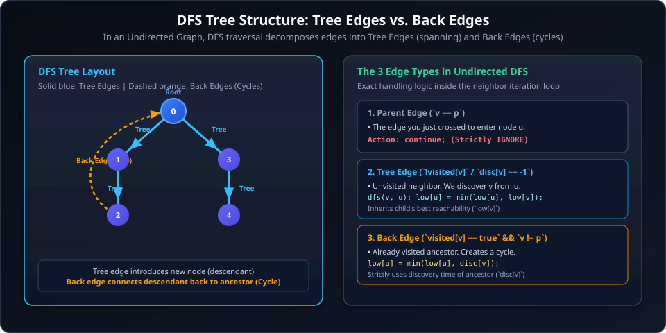
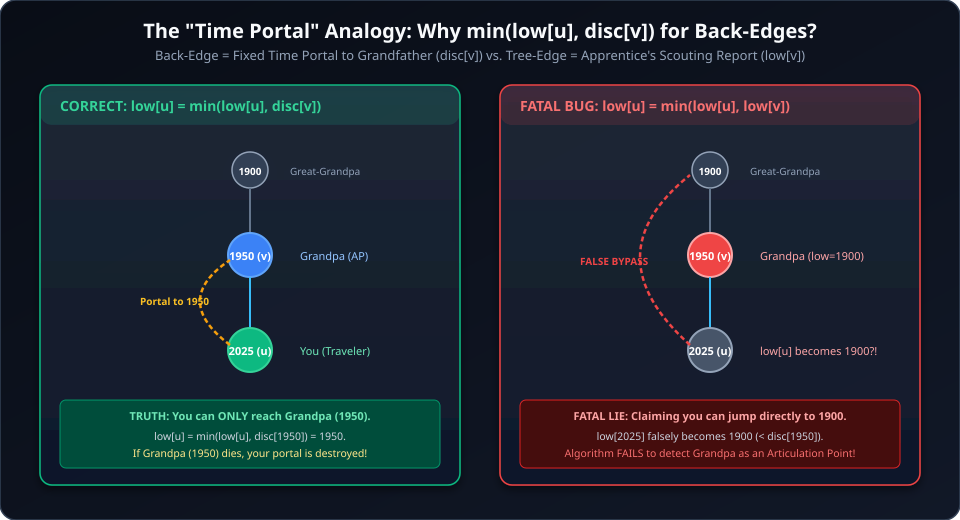
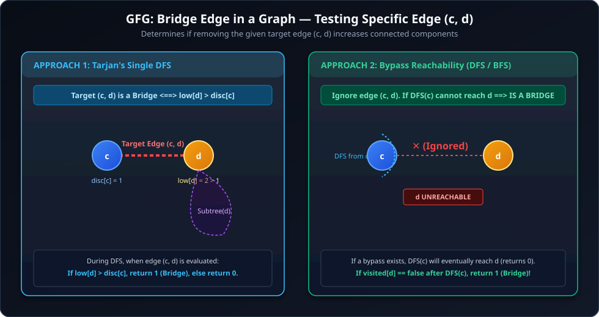
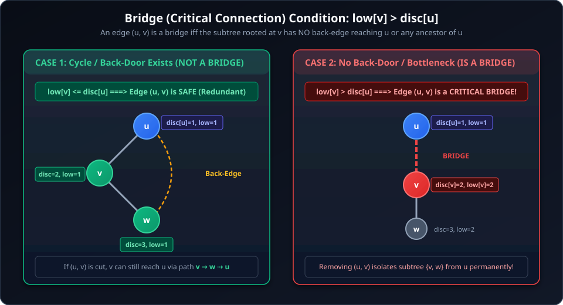
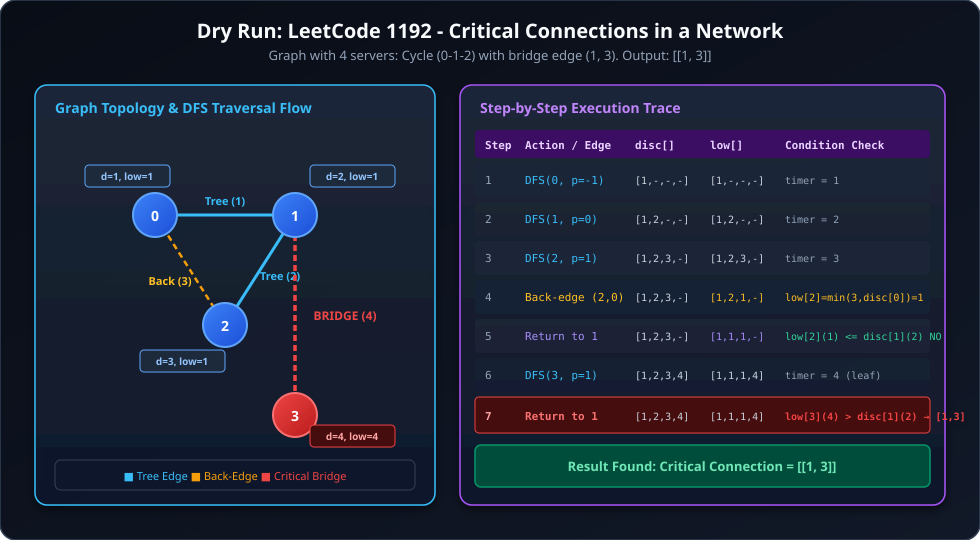
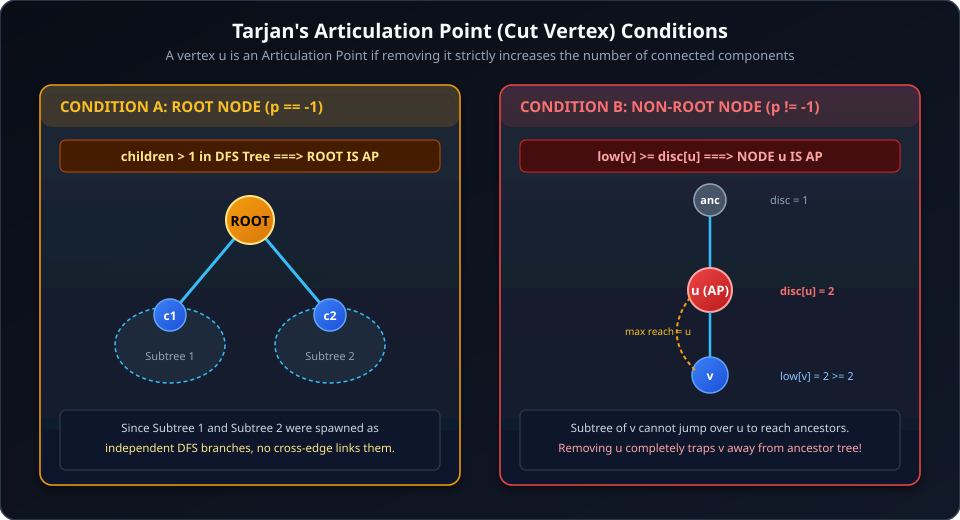
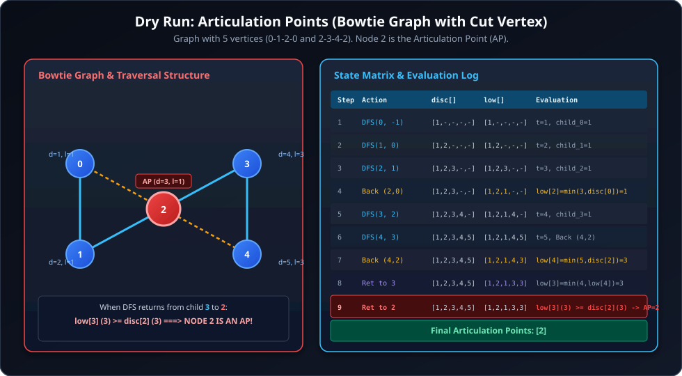

# Articulation Points and Bridges (Tarjan's Algorithm)

## 1. Core Foundations: Tarjan's Graph Traversal

Tarjan's algorithm uses a single Depth First Search (DFS) traversal to find **Bridges** (Critical Connections) and **Articulation Points** (Cut Vertices) in an undirected connected/disconnected graph in $\mathcal{O}(V + E)$ time.



---

### 1.1 DFS Tree and Edge Classifications in Undirected Graphs

When running DFS on an undirected graph, every edge $(u, v)$ falls strictly into one of two categories:

1. **Tree Edges (Spanning Tree Edges):**
   - **Condition:** Node $v$ is unvisited (`disc[v] == -1` or `!visited[v]`).
   - **Meaning:** Exploring $(u, v)$ leads to the first-time discovery of vertex $v$.
   - **Role:** Forms the backbone DFS spanning tree / forest.
   
2. **Back-Edges (Cycle-forming Shortcuts):**
   - **Condition:** Node $v$ is already visited (`disc[v] != -1`) and $v \neq \text{parent}(u)$.
   - **Meaning:** Edge $(u, v)$ connects a descendant node $u$ directly back to an ancestor node $v$ already present on the DFS recursion stack.
   - **Role:** Back-edges provide alternative paths (back-doors) that bypass intermediate tree edges.

> [!IMPORTANT]
> **No Cross or Forward Edges in Undirected DFS Trees:**
> In an undirected graph, an edge between two branches cannot be a "cross edge" because the moment DFS reaches the first endpoint, it would immediately traverse that undirected edge to the other endpoint, making it a tree edge or back-edge. Thus, every non-tree edge is strictly a **Back-Edge**.

---

### 1.2 State Arrays: `disc[]` and `low[]`

To determine connectivity bottlenecks, Tarjan's algorithm maintains two tracking arrays:

| Array | Name | Definition & Purpose |
| :--- | :--- | :--- |
| **`disc[u]`** | **Discovery Time** | The global timestamp/step counter when node $u$ was first visited during DFS traversal. Assigned as `++timer`. |
| **`low[u]`** | **Low-Link Value** | The earliest discovery time (`disc`) reachable from node $u$ or any node in the subtree rooted at $u$, using tree edges and at most **one** back-edge. |

---

### 1.3 The "Time Portal" Analogy & The Fatal Error Proof



Think of DFS traversal as moving along a historical timeline:
- **`disc[u]` (The Current Year):** The timestamp you are currently standing at.
- **`low[u]` (The Escape Record):** The earliest year in the past you or your team can reach.

#### 1. The Parent: "The Front Door" (Don't Look Back)
- **Code:** `if (v == p) continue;`
- **Why ignore:** You arrived at $u$ directly through the tree edge from parent $p$. `low[u]` measures alternative secret paths (back-doors). Using the front door as a "secret escape" would be circular logic.

#### 2. The Back-Edge: "The Fixed Portal to Grandfather"
- **Code:** `low[u] = min(low[u], disc[v]);`
- **Analogy:** At year 2025 (node $u$), you find a fixed time portal leading directly to your Grandfather in year 1950 (node $v$).
- **Why `disc[v]` and NOT `low[v]`?** The portal has a fixed destination at year 1950. You cannot ask the portal to chain through Grandfather's other portals. You only have a direct connection to year 1950.

#### 3. The Child (Tree-Edge): "The Apprentice's Scouting Report"
- **Code:** `low[u] = min(low[u], low[v]);`
- **Analogy:** You send your apprentice (node $v$) forward into future years. The apprentice explores and returns with their best discovery: *"Master, my subtree found a wormhole reaching all the way back to year 1800 (`low[v] = 1800`)!"*
- **Why `low[v]`?** Because you control your apprentice, any escape route found within their entire subordinate branch is valid for your subtree.

---

### 1.4 The "Fatal Error": Why `min(low[u], disc[v])` for Back-Edges?

> [!CAUTION]
> **What goes wrong if you write `low[u] = min(low[u], low[v])` on a Back-Edge?**
>
> 1. Suppose node $u$ (year 2025) has a back-edge to Grandfather $v$ (year 1950).
> 2. Grandfather $v$ has a separate path reaching Great-Grandfather at year 1900 (`low[v] = 1900`).
> 3. If you set `low[u] = min(low[u], low[v])`, you claim that node $u$ can reach year 1900 directly!
> 4. **Why this is fatal:** Your only path to 1900 goes **through** Grandfather $v$. If Grandfather $v$ is removed/destroyed, your link to 1900 is severed.
> 5. Setting `low[u] = 1900` creates a false bypass that makes `low[u] < disc[v]`, which fools the algorithm into believing Grandfather $v$ is not a bottleneck. Consequently, the algorithm **fails to detect Grandfather as an Articulation Point**!

---

### 1.5 Standalone Implementation: Tarjan's Articulation Points Algorithm

#### C++ Implementation
```cpp
#include <iostream>
#include <vector>
#include <algorithm>

using namespace std;

class Solution {
    void findAPs(int u, int p, int& timer, vector<int> adj[], vector<int>& disc,
                 vector<int>& low, vector<bool>& isAP) {
        disc[u] = low[u] = ++timer;
        int children = 0;

        for (int v : adj[u]) {
            if (v == p) continue;  // Skip parent

            if (disc[v] != -1) {
                // Back-edge found: update low-link using discovery time of v
                low[u] = min(low[u], disc[v]);
            } else {
                // Tree-edge: recurse
                children++;
                findAPs(v, u, timer, adj, disc, low, isAP);

                // Check if subtree rooted at v has a back-link to u or its ancestors
                low[u] = min(low[u], low[v]);

                // Condition for non-root nodes
                if (p != -1 && low[v] >= disc[u]) {
                    isAP[u] = true;
                }
            }
        }

        // Condition for root node
        if (p == -1 && children > 1) {
            isAP[u] = true;
        }
    }

public:
    vector<int> articulationPoints(int n, vector<int> adj[]) {
        vector<int> disc(n, -1), low(n, -1);
        vector<bool> isAP(n, false);
        int timer = 0;

        // Run DFS for all components
        for (int i = 0; i < n; i++) {
            if (disc[i] == -1) {
                findAPs(i, -1, timer, adj, disc, low, isAP);
            }
        }

        vector<int> res;
        for (int i = 0; i < n; i++) {
            if (isAP[i]) res.push_back(i);
        }

        if (!res.empty())
            return res;
        else
            return {-1};
    }
};
```

#### Java Implementation
```java
import java.util.*;

class Solution {
    private void findAPs(
        int u, 
        int p, 
        ArrayList<ArrayList<Integer>> adj, 
        int[] disc, 
        int[] low, 
        boolean[] isAP, 
        int[] timer
    ) {
        disc[u] = low[u] = ++timer[0];
        int children = 0;

        for (int v : adj.get(u)) {
            if (v == p) continue; // Skip parent

            if (disc[v] != -1) {
                // Back-edge found: update low-link using discovery time of v
                low[u] = Math.min(low[u], disc[v]);
            } else {
                // Tree-edge: recurse
                children++;
                findAPs(v, u, adj, disc, low, isAP, timer);

                // Check if subtree rooted at v has a back-link to u or its ancestors
                low[u] = Math.min(low[u], low[v]);

                // Condition for non-root nodes
                if (p != -1 && low[v] >= disc[u]) {
                    isAP[u] = true;
                }
            }
        }

        // Condition for root node
        if (p == -1 && children > 1) {
            isAP[u] = true;
        }
    }

    public ArrayList<Integer> articulationPoints(int n, ArrayList<ArrayList<Integer>> adj) {
        int[] disc = new int[n];
        int[] low = new int[n];
        Arrays.fill(disc, -1);
        Arrays.fill(low, -1);
        boolean[] isAP = new boolean[n];
        int[] timer = new int[]{0};

        // Run DFS for all components
        for (int i = 0; i < n; i++) {
            if (disc[i] == -1) {
                findAPs(i, -1, adj, disc, low, isAP, timer);
            }
        }

        ArrayList<Integer> res = new ArrayList<>();
        for (int i = 0; i < n; i++) {
            if (isAP[i]) res.add(i);
        }

        if (!res.isEmpty())
            return res;
        else {
            res.add(-1);
            return res;
        }
    }
}
```

---

## 2. Q1 GFG: Bridge edge in a Graph (Testing Specific Edge)

### 2.1 Problem Description

Given an undirected graph of $V$ vertices and $E$ edges and an edge consisting of two vertices $c$ and $d$, find whether the edge between $c$ and $d$ is a **bridge** or not.

A **Bridge** is an edge in a graph whose removal disconnects the graph or increases its number of connected components.

Return `1` if the given edge $(c, d)$ is a bridge, else return `0`.



---

### 2.2 Examples & Constraints

#### Example 1
```text
Input: V = 4, E = 3, edges = [[0, 1], [1, 2], [2, 3]], c = 1, d = 2
Output: 1
Explanation: Removing the edge between 1 and 2 disconnects the graph into {0, 1} and {2, 3}. Thus, it is a bridge.
```

#### Example 2
```text
Input: V = 5, E = 5, edges = [[0, 1], [1, 2], [2, 0], [0, 3], [3, 4]], c = 0, d = 2
Output: 0
Explanation: Edge (0, 2) is part of cycle 0-1-2-0. Removing it still allows 0 to reach 2 via path 0 -> 1 -> 2. Thus, it is NOT a bridge.
```

#### Constraints
- $1 \le V \le 10^5$
- $0 \le E \le 10^5$
- $0 \le c, d \le V - 1$
- $c \neq d$

---

### 2.3 Mathematical Logic & Tarjan's Bridge Check

Using Tarjan's algorithm:
1. Maintain global `timer`, `disc[]` (discovery time), and `low[]` (lowest reachable ancestor).
2. Traverse the graph with DFS. For every tree edge $(u, v)$, after returning from DFS on $v$, update `low[u] = min(low[u], low[v])`.
3. Check the Bridge condition:
   $$\text{If } low[v] > disc[u] \text{ and } ((u == c \land v == d) \lor (u == d \land v == c)) \implies \text{Target edge } (c, d) \text{ is a Bridge!}$$
4. Loop through all components from $i = 0 \dots V - 1$ to ensure disconnected graphs are handled properly.

---

### 2.4 Java Implementation (GFG: Bridge edge in a Graph)

```java
import java.util.*;

class Solution {
    private static void dfs(
        int u, 
        int p, 
        ArrayList<ArrayList<Integer>> adj, 
        int[] disc, 
        int[] low, 
        int[] timer, 
        int c, 
        int d, 
        int[] bridgeFound
    ) {
        disc[u] = low[u] = ++timer[0];

        for (int v : adj.get(u)) {
            if (v == p) {
                // Skip direct parent edge
                continue;
            }

            if (disc[v] != -1) {
                // Back-edge: update low-link with ancestor's discovery time
                low[u] = Math.min(low[u], disc[v]);
            } else {
                // Tree-edge: recurse into child v
                dfs(v, u, adj, disc, low, timer, c, d, bridgeFound);

                // Propagate child's low-link value back to u
                low[u] = Math.min(low[u], low[v]);

                // Bridge Condition
                if (low[v] > disc[u]) {
                    if ((u == c && v == d) || (u == d && v == c)) {
                        bridgeFound[0] = 1;
                    }
                }
            }
        }
    }

    // Function to find if the given edge (c, d) is a bridge
    static int isBridge(int V, ArrayList<ArrayList<Integer>> adj, int c, int d) {
        int[] disc = new int[V];
        int[] low = new int[V];
        Arrays.fill(disc, -1);
        Arrays.fill(low, -1);

        int[] timer = new int[]{0};
        int[] bridgeFound = new int[]{0};

        // Run DFS across all components
        for (int i = 0; i < V; i++) {
            if (disc[i] == -1) {
                dfs(i, -1, adj, disc, low, timer, c, d, bridgeFound);
            }
        }

        return bridgeFound[0];
    }
}
```

---

### 2.5 C++ Implementation (GFG: Bridge edge in a Graph)

```cpp
#include <vector>
#include <algorithm>

using namespace std;

class Solution {
private:
    void dfs(
        int u, 
        int p, 
        const vector<vector<int>>& adj, 
        vector<int>& disc, 
        vector<int>& low, 
        int& timer, 
        int c, 
        int d, 
        int& bridgeFound
    ) {
        disc[u] = low[u] = ++timer;

        for (int v : adj[u]) {
            if (v == p) {
                // Skip direct parent edge
                continue;
            }

            if (disc[v] != -1) {
                // Back-edge: strictly use disc[v]
                low[u] = min(low[u], disc[v]);
            } else {
                // Tree-edge: recurse
                dfs(v, u, adj, disc, low, timer, c, d, bridgeFound);

                // Update low on return
                low[u] = min(low[u], low[v]);

                // Bridge Condition
                if (low[v] > disc[u]) {
                    if ((u == c && v == d) || (u == d && v == c)) {
                        bridgeFound = 1;
                    }
                }
            }
        }
    }

public:
    int isBridge(int V, vector<vector<int>>& adj, int c, int d) {
        vector<int> disc(V, -1), low(V, -1);
        int timer = 0;
        int bridgeFound = 0;

        // Traverse all components
        for (int i = 0; i < V; i++) {
            if (disc[i] == -1) {
                dfs(i, -1, adj, disc, low, timer, c, d, bridgeFound);
            }
        }

        return bridgeFound;
    }
};
```

---

### 2.6 Complexity Analysis

- **Time Complexity:** $\mathcal{O}(V + E)$
  - The DFS traversal visits each vertex at most once and scans incident edges at most once while ignoring the target edge $(c, d)$, taking strictly linear $\mathcal{O}(V + E)$ time.
- **Space Complexity:** $\mathcal{O}(V)$
  - `vis` array takes $\mathcal{O}(V)$ memory, and the recursion stack depth is at most $\mathcal{O}(V)$.

---

## 3. Q2 LeetCode 1192: Critical Connections in a Network (Find ALL Bridges)

### 3.1 Problem Description

There are $n$ servers numbered from `0` to `n - 1` connected by undirected server-to-server `connections` forming a network where `connections[i] = [ai, bi]` represents a connection between servers `ai` and `bi`. Any server can reach other servers directly or indirectly through the network.

A **critical connection** (Bridge) is a connection that, if removed, will make some servers unable to reach some other servers.

Return all critical connections in the network in any order.

---

### 3.2 Examples & Constraints

#### Example 1
```text
Input: n = 4, connections = [[0,1],[1,2],[2,0],[1,3]]
Output: [[1,3]]
Explanation: [[3,1]] is also accepted. Removing [1,3] disconnects server 3 from {0, 1, 2}.
```

#### Example 2
```text
Input: n = 2, connections = [[0,1]]
Output: [[0,1]]
Explanation: Removing [0,1] disconnects server 0 and server 1.
```

#### Constraints
- $2 \le n \le 10^5$
- $n - 1 \le \text{connections.length} \le 10^5$
- $0 \le a_i, b_i \le n - 1$
- $a_i \neq b_i$
- There are no repeated connections (simple graph).
- The graph is connected.

---

### 3.3 Mathematical Bridge Condition



For a tree edge $(u, v)$ where $u$ is the parent and $v$ is the child:

$$\text{Edge } (u, v) \text{ is a Bridge} \iff low[v] > disc[u]$$

- **If $low[v] \le disc[u]$:** The subtree rooted at $v$ has at least one back-edge reaching $u$ or an ancestor of $u$. Thus, alternative paths exist and $(u, v)$ is not critical.
- **If $low[v] > disc[u]$:** The earliest node reachable from $v$'s subtree was discovered strictly **after** $u$. There is no back-door to $u$ or above; cutting $(u, v)$ completely isolates $v$'s subtree.

---

### 3.4 Java Implementation (LeetCode 1192)

```java
import java.util.*;

class Solution {
    private void dfs(
        int u, 
        int p, 
        ArrayList<ArrayList<Integer>> adj, 
        boolean[] vis, 
        int[] disc, 
        int[] low, 
        int[] timer, 
        List<List<Integer>> bridges
    ) {
        vis[u] = true;
        disc[u] = low[u] = ++timer[0];

        for (int v : adj.get(u)) {
            if (v == p) {
                // Skip the direct parent edge (front door)
                continue;
            }

            if (vis[v]) {
                // Back-edge found: update low-link with discovery time of ancestor v
                low[u] = Math.min(low[u], disc[v]);
            } else {
                // Tree-edge: recurse into child v
                dfs(v, u, adj, vis, disc, low, timer, bridges);

                // Propagate the lowest reachable ancestor from child v back to u
                low[u] = Math.min(low[u], low[v]);

                // Bridge condition: child v cannot reach u or any ancestor of u
                if (low[v] > disc[u]) {
                    bridges.add(Arrays.asList(u, v));
                }
            }
        }
    }

    public List<List<Integer>> criticalConnections(int n, List<List<Integer>> connections) {
        // 1. Build adjacency list representation
        ArrayList<ArrayList<Integer>> adj = new ArrayList<>();
        for (int i = 0; i < n; i++) {
            adj.add(new ArrayList<>());
        }
        for (List<Integer> edge : connections) {
            int u = edge.get(0);
            int v = edge.get(1);
            adj.get(u).add(v);
            adj.get(v).add(u);
        }

        // 2. Initialize DFS state arrays
        boolean[] vis = new boolean[n];
        int[] disc = new int[n];
        int[] low = new int[n];
        int[] timer = new int[]{0};
        List<List<Integer>> bridges = new ArrayList<>();

        // 3. Run DFS for all components
        for (int i = 0; i < n; i++) {
            if (!vis[i]) {
                dfs(i, -1, adj, vis, disc, low, timer, bridges);
            }
        }

        return bridges;
    }
}
```

---

### 3.5 C++ Implementation (LeetCode 1192)

```cpp
#include <vector>
#include <algorithm>

using namespace std;

class Solution {
private:
    void dfs(
        int u, 
        int p, 
        const vector<vector<int>>& adj, 
        vector<int>& vis, 
        vector<int>& disc, 
        vector<int>& low, 
        int& timer, 
        vector<vector<int>>& bridges
    ) {
        vis[u] = 1;
        disc[u] = low[u] = ++timer;

        for (int v : adj[u]) {
            if (v == p) {
                // Skip the direct parent edge
                continue;
            }

            if (vis[v]) {
                // Back-edge: strictly use disc[v] for mathematical correctness
                low[u] = min(low[u], disc[v]);
            } else {
                // Tree-edge: recurse into child v
                dfs(v, u, adj, vis, disc, low, timer, bridges);

                // Subtree of v reports its best reachable ancestor
                low[u] = min(low[u], low[v]);

                // Bridge condition
                if (low[v] > disc[u]) {
                    bridges.push_back({u, v});
                }
            }
        }
    }

public:
    vector<vector<int>> criticalConnections(int n, vector<vector<int>>& connections) {
        // 1. Build adjacency list
        vector<vector<int>> adj(n);
        for (const auto& edge : connections) {
            adj[edge[0]].push_back(edge[1]);
            adj[edge[1]].push_back(edge[0]);
        }

        // 2. State tracking vectors
        vector<int> vis(n, 0), disc(n, 0), low(n, 0);
        vector<vector<int>> bridges;
        int timer = 0;

        // 3. DFS Traversal across all components
        for (int i = 0; i < n; i++) {
            if (!vis[i]) {
                dfs(i, -1, adj, vis, disc, low, timer, bridges);
            }
        }

        return bridges;
    }
};
```

---

### 3.6 Step-by-Step Dry Run (LeetCode 1192)



Consider the network: $n = 4$, $\text{connections} = [[0, 1], [1, 2], [2, 0], [1, 3]]$.

| Step | Action | Node $u$ | Parent $p$ | `timer` | `disc[]` | `low[]` | Condition Evaluation & Decision |
| :---: | :--- | :---: | :---: | :---: | :---: | :---: | :--- |
| **1** | Call `DFS(0, -1)` | $0$ | $-1$ | $1$ | $[1, -, -, -]$ | $[1, -, -, -]$ | Starts DFS traversal from root node $0$. |
| **2** | Call `DFS(1, 0)` | $1$ | $0$ | $2$ | $[1, 2, -, -]$ | $[1, 2, -, -]$ | Tree edge $(0 \to 1)$. |
| **3** | Call `DFS(2, 1)` | $2$ | $1$ | $3$ | $[1, 2, 3, -]$ | $[1, 2, 3, -]$ | Tree edge $(1 \to 2)$. |
| **4** | Inspect neighbor $0$ | $2$ | $1$ | $3$ | $[1, 2, 3, -]$ | $[1, 2, 1, -]$ | **Back-edge $(2 \to 0)$**: `low[2] = min(3, disc[0]) = min(3, 1) = 1`. |
| **5** | Return to node $1$ | $1$ | $0$ | $3$ | $[1, 2, 3, -]$ | $[1, 1, 1, -]$ | `low[1] = min(2, low[2]) = 1`. Check `low[2] > disc[1]` $\implies 1 > 2$ (False). Not a bridge. |
| **6** | Call `DFS(3, 1)` | $3$ | $1$ | $4$ | $[1, 2, 3, 4]$ | $[1, 1, 1, 4]$ | Tree edge $(1 \to 3)$. Leaf node with no further neighbors. |
| **7** | Return to node $1$ | $1$ | $0$ | $4$ | $[1, 2, 3, 4]$ | $[1, 1, 1, 4]$ | `low[1] = min(1, low[3]) = 1`. Check `low[3] > disc[1]` $\implies 4 > 2$ (**TRUE**). **Bridge Found: $[1, 3]$**. |
| **8** | Return to node $0$ | $0$ | $-1$ | $4$ | $[1, 2, 3, 4]$ | $[1, 1, 1, 4]$ | `low[0] = min(1, low[1]) = 1`. Check `low[1] > disc[0]` $\implies 1 > 1$ (False). |

**Final Result:** `[[1, 3]]`

---

### 3.7 Complexity Analysis

- **Time Complexity:** $\mathcal{O}(V + E)$
  - *Graph Construction:* Iterating over $E$ connections takes $\mathcal{O}(E)$ time.
  - *DFS Traversal:* Every vertex $u$ is visited exactly once ($\mathcal{O}(V)$).
  - *Edge Examination:* Every undirected edge is checked twice (once from each endpoint), doing constant $\mathcal{O}(1)$ operations per edge ($\mathcal{O}(E)$).
  - *Total Time:* $\mathcal{O}(V + E)$.

- **Space Complexity:** $\mathcal{O}(V + E)$
  - *Adjacency List:* Stores $V$ vertices and $2E$ directed edge entries ($\mathcal{O}(V + E)$).
  - *State Arrays:* `vis`, `disc`, and `low` each take $\mathcal{O}(V)$ memory.
  - *Call Stack:* In the worst-case skewed tree graph, recursion depth reaches $\mathcal{O}(V)$.
  - *Total Auxiliary Space:* $\mathcal{O}(V + E)$.

---

## 4. Q3 GFG: Articulation Point - I (Cut Vertices)

### 4.1 Problem Description

Given an undirected connected graph with $V$ vertices and $E$ edges represented by an adjacency list `adj`, find all the **Articulation Points** (Cut Vertices) in the graph.

An **Articulation Point** is a vertex whose removal increases the number of connected components in the graph.

Return a sorted list of all articulation points (0-indexed). If no articulation point exists, return `[-1]`.

---

### 4.2 Examples & Constraints

#### Example 1
```text
Input: V = 5, adj = [[1, 2, 3], [0, 2], [0, 1], [0, 4], [3]]
Output: [0, 3]
Explanation: Removing node 0 isolates node 4 from nodes {1, 2}. Removing node 3 isolates node 4.
```

#### Example 2
```text
Input: V = 4, adj = [[1, 2], [0, 2], [0, 1, 3], [2]]
Output: [2]
Explanation: Removing node 2 isolates node 3.
```

#### Constraints
- $1 \le V \le 10^5$
- $0 \le E \le 10^5$
- $0 \le u, v \le V - 1$
- Graph may contain multiple disconnected components.

---

### 4.3 The Articulation Point Conditions



A vertex $u$ is an Articulation Point if and only if it satisfies one of the following two rules:

#### Condition A: The Root Case (`p == -1`)
- **Rule:** $\text{Root } u \text{ is an Articulation Point} \iff \text{children} > 1$ in the DFS tree.
- **Why?** Since non-tree edges in undirected DFS trees are strictly back-edges (pointing to ancestors), there are no cross-edges between independent subtrees of the root. Removing the root cuts off communication between these subtrees entirely.

#### Condition B: The Non-Root Case (`p != -1`)
- **Rule:** $\text{Non-root } u \text{ is an Articulation Point} \iff \exists \text{ child } v \text{ such that } low[v] \ge disc[u]$.
- **Why?** 
  - If $low[v] < disc[u]$, $v$'s subtree has a back-edge to a strict ancestor of $u$, meaning $v$ can reach the rest of the graph even if $u$ is deleted.
  - If $low[v] \ge disc[u]$, the furthest up that $v$'s subtree can reach is $u$ itself. Removing $u$ completely traps $v$'s subtree.

> [!TIP]
> **Why check only 1 child rather than waiting for the entire loop?**
> If any single child $v$ has $low[v] \ge disc[u]$, removing $u$ immediately disconnects $v$'s subtree from $u$'s parent. Finding more children with the same condition only confirms that removing $u$ creates even more disconnected pieces. Hence, $u$ is definitively marked as an AP on the very first child where this holds. We use a boolean array `isAP[u] = true` to avoid duplicate insertions.

---

### 4.4 Java Implementation (GFG Articulation Point - I)

```java
import java.util.*;

class Solution {
    private void findAPs(
        int u, 
        int p, 
        ArrayList<ArrayList<Integer>> adj, 
        int[] disc, 
        int[] low, 
        boolean[] isAP, 
        int[] timer
    ) {
        disc[u] = low[u] = ++timer[0];
        int children = 0;

        for (int v : adj.get(u)) {
            if (v == p) {
                // Skip the direct edge to parent
                continue;
            }

            if (disc[v] != -1) {
                // Back-edge: update low-link with discovery time of v
                low[u] = Math.min(low[u], disc[v]);
            } else {
                // Tree-edge: discover new child
                children++;
                findAPs(v, u, adj, disc, low, isAP, timer);

                // Propagate child's lowest reachable ancestor back to u
                low[u] = Math.min(low[u], low[v]);

                // Condition B: Non-root vertex
                if (p != -1 && low[v] >= disc[u]) {
                    isAP[u] = true;
                }
            }
        }

        // Condition A: Root vertex with more than 1 independent DFS subtree
        if (p == -1 && children > 1) {
            isAP[u] = true;
        }
    }

    public ArrayList<Integer> articulationPoints(int V, ArrayList<ArrayList<Integer>> adj) {
        int[] disc = new int[V];
        int[] low = new int[V];
        Arrays.fill(disc, -1);
        Arrays.fill(low, -1);

        boolean[] isAP = new boolean[V];
        int[] timer = new int[]{0};

        // Run DFS for all connected components
        for (int i = 0; i < V; i++) {
            if (disc[i] == -1) {
                findAPs(i, -1, adj, disc, low, isAP, timer);
            }
        }

        // Collect all marked cut vertices
        ArrayList<Integer> result = new ArrayList<>();
        for (int i = 0; i < V; i++) {
            if (isAP[i]) {
                result.add(i);
            }
        }

        if (result.isEmpty()) {
            result.add(-1);
        }
        return result;
    }
}
```

---

### 4.5 C++ Implementation (GFG Articulation Point - I)

```cpp
#include <iostream>
#include <vector>
#include <algorithm>

using namespace std;

class Solution {
private:
    void findAPs(
        int u, 
        int p, 
        const vector<vector<int>>& adj, 
        vector<int>& disc, 
        vector<int>& low, 
        vector<bool>& isAP, 
        int& timer
    ) {
        disc[u] = low[u] = ++timer;
        int children = 0;

        for (int v : adj[u]) {
            if (v == p) {
                // Skip parent edge
                continue;
            }

            if (disc[v] != -1) {
                // Back-edge: strictly use disc[v]
                low[u] = min(low[u], disc[v]);
            } else {
                // Tree-edge
                children++;
                findAPs(v, u, adj, disc, low, isAP, timer);

                // Update low on return
                low[u] = min(low[u], low[v]);

                // Condition B for non-root nodes
                if (p != -1 && low[v] >= disc[u]) {
                    isAP[u] = true;
                }
            }
        }

        // Condition A for root node
        if (p == -1 && children > 1) {
            isAP[u] = true;
        }
    }

public:
    vector<int> articulationPoints(int V, vector<vector<int>>& adj) {
        vector<int> disc(V, -1), low(V, -1);
        vector<bool> isAP(V, false);
        int timer = 0;

        // Run DFS across all components
        for (int i = 0; i < V; i++) {
            if (disc[i] == -1) {
                findAPs(i, -1, adj, disc, low, isAP, timer);
            }
        }

        vector<int> result;
        for (int i = 0; i < V; i++) {
            if (isAP[i]) {
                result.push_back(i);
            }
        }

        if (result.empty()) {
            return {-1};
        }
        return result;
    }
};
```

---

### 4.6 Step-by-Step Dry Run (Bowtie Graph)



Consider a Bowtie graph: $V = 5$, $\text{edges} = [[0, 1], [1, 2], [2, 0], [2, 3], [3, 4], [4, 2]]$.

| Step | Action | Node $u$ | Parent $p$ | `timer` | `disc[]` | `low[]` | Condition Evaluation & Decision |
| :---: | :--- | :---: | :---: | :---: | :---: | :---: | :--- |
| **1** | Call `findAPs(0, -1)` | $0$ | $-1$ | $1$ | $[1, -, -, -, -]$ | $[1, -, -, -]$ | Root node $0$. Child count for $0 = 1$. |
| **2** | Call `findAPs(1, 0)` | $1$ | $0$ | $2$ | $[1, 2, -, -, -]$ | $[1, 2, -, -]$ | Tree edge $(0 \to 1)$. Child count for $1 = 1$. |
| **3** | Call `findAPs(2, 1)` | $2$ | $1$ | $3$ | $[1, 2, 3, -, -]$ | $[1, 2, 3, -]$ | Tree edge $(1 \to 2)$. Child count for $2 = 1$. |
| **4** | Back-edge $(2 \to 0)$ | $2$ | $1$ | $3$ | $[1, 2, 3, -, -]$ | $[1, 2, 1, -]$ | Node $0$ is visited ($0 \neq 1$). `low[2] = min(3, disc[0]) = 1`. |
| **5** | Call `findAPs(3, 2)` | $3$ | $2$ | $4$ | $[1, 2, 3, 4, -]$ | $[1, 2, 1, 4]$ | Tree edge $(2 \to 3)$. Child count for $3 = 1$. |
| **6** | Call `findAPs(4, 3)` | $4$ | $3$ | $5$ | $[1, 2, 3, 4, 5]$ | $[1, 2, 1, 4, 5]$ | Tree edge $(3 \to 4)$. |
| **7** | Back-edge $(4 \to 2)$ | $4$ | $3$ | $5$ | $[1, 2, 3, 4, 5]$ | $[1, 2, 1, 4, 3]$ | Node $2$ is visited ($2 \neq 3$). `low[4] = min(5, disc[2]) = 3`. |
| **8** | Return to node $3$ | $3$ | $2$ | $5$ | $[1, 2, 3, 4, 5]$ | $[1, 2, 1, 3, 3]$ | `low[3] = min(4, low[4]) = 3`. Check `low[4] >= disc[3]` $\implies 3 \ge 4$ (False). |
| **9** | Return to node $2$ | $2$ | $1$ | $5$ | $[1, 2, 3, 4, 5]$ | $[1, 2, 1, 3, 3]$ | `low[2] = min(1, low[3]) = 1`. Check `low[3] >= disc[2]` $\implies 3 \ge 3$ (**TRUE**)! **Mark `isAP[2] = true`**. |
| **10** | Return to node $1$ | $1$ | $0$ | $5$ | $[1, 2, 3, 4, 5]$ | $[1, 1, 1, 3, 3]$ | `low[1] = min(2, low[2]) = 1`. Check `low[2] >= disc[1]` $\implies 1 \ge 2$ (False). |
| **11** | Return to root $0$ | $0$ | $-1$ | $5$ | $[1, 2, 3, 4, 5]$ | $[1, 1, 1, 3, 3]$ | Root has `children == 1`. Not an AP. |

**Final Output:** `[2]`

---

### 4.7 Complexity Analysis

- **Time Complexity:** $\mathcal{O}(V + E)$
  - *Traversal:* Standard DFS traverses each vertex once ($\mathcal{O}(V)$) and each undirected edge twice ($\mathcal{O}(E)$).
  - *Post-processing:* Scanning `isAP[]` to gather indices takes $\mathcal{O}(V)$.
  - *Total Time:* $\mathcal{O}(V + E)$.

- **Space Complexity:** $\mathcal{O}(V)$
  - *Tracking Arrays:* `disc`, `low`, and `isAP` each consume $\mathcal{O}(V)$ storage.
  - *Recursion Stack:* At most $\mathcal{O}(V)$ stack frames in the deepest recursive chain.
  - *Adjacency List:* $\mathcal{O}(V + E)$ space.

---

## 5. Bridges vs. Articulation Points: Complete Comparison

| Feature | Bridges (Critical Connections) | Articulation Points (Cut Vertices) |
| :--- | :--- | :--- |
| **Target Element** | An **Edge** $(u, v)$ | A **Vertex** $u$ |
| **Removal Consequence** | Increases connected components by removing an edge | Increases connected components by removing a vertex & its incident edges |
| **Mathematical Condition** | $low[v] > disc[u]$ | Non-Root: $low[v] \ge disc[u]$<br>Root: $\text{children} > 1$ |
| **Why `>` vs. `>=`?** | If $low[v] == disc[u]$, $v$ can reach $u$. Edge $(u, v)$ is part of a cycle, so cutting the edge leaves alternative routes. | If $low[v] == disc[u]$, $v$ can ONLY reach $u$. Removing vertex $u$ destroys the meeting point and strands $v$. |
| **Root Special Case?** | **No.** The root's tree edges are evaluated with the identical formula $low[v] > disc[u]$. | **Yes.** The root has no ancestors, so $low[v] \ge disc[\text{root}]$ is always trivially true. Root is evaluated strictly by `children > 1`. |
| **Duplicate Prevention** | Each bridge edge is detected exactly once during DFS traversal. | Multiple child subtrees may qualify vertex $u$. Requires `boolean isAP[]` flag. |
| **Time & Space Complexity** | $\mathcal{O}(V + E)$ Time, $\mathcal{O}(V + E)$ Space | $\mathcal{O}(V + E)$ Time, $\mathcal{O}(V + E)$ Space |


