# Advanced Graph Algorithms: Bellman-Ford, Floyd-Warshall, DSU Applications, Network Flow & Spanning Trees

---

## 1. Bellman-Ford Algorithm (Single-Source Shortest Path)

### Why Dijkstra Fails with Negative Edge Weights & Negative Cycles
1. **Dijkstra's Greedy Choice Property**: Dijkstra assumes that once a vertex $u$ is popped from the Priority Queue (marked finalized/visited), its shortest distance from the source is permanently settled because all subsequent edge weights are non-negative ($\ge 0$).
2. **Negative Edge Weights**: A path discovered later with a negative edge could reduce the shortest distance to an already "visited" node. Since standard Dijkstra does not re-relax visited vertices, it produces incorrect distances.
3. **Negative Weight Cycles**: A cycle whose edge weight sum is negative ($\sum w < 0$). Every traversal through the cycle decreases the total path cost infinitely (distance $\to -\infty$). In such graphs, shortest paths are mathematically undefined.

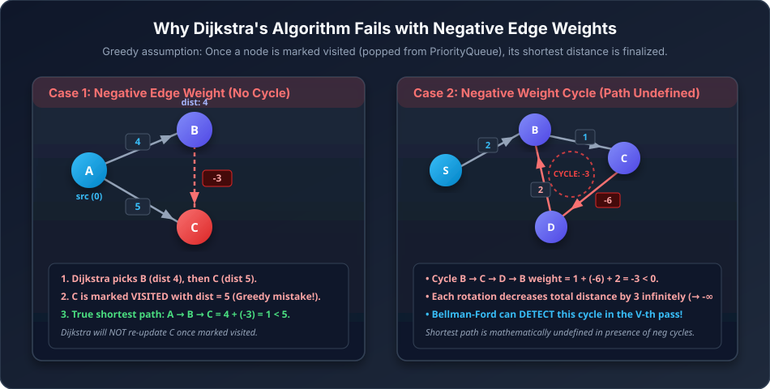

---

### Bellman-Ford Core Concept & $(V - 1)$ Iterations Proof
- **Single Source Shortest Path (SSSP)** algorithm that works with **negative edge weights** and can **detect negative weight cycles**.
- **Edge Relaxation**: For an edge $(u, v)$ with weight $w$:
  $$\text{if } dist[u] \neq \infty \text{ and } dist[u] + w < dist[v] \implies dist[v] = dist[u] + w$$
- **Why $(V - 1)$ relaxations?**
  - In a graph with $V$ vertices, any simple shortest path contains at most $V - 1$ edges.
  - In the worst possible edge relaxation order (e.g., edges ordered in reverse along a linear chain $0 \to 1 \to 2 \dots \to V-1$), each pass over all $E$ edges guarantees that the shortest distance propagates at least **one edge further**.
  - Hence, after $(V - 1)$ passes, shortest paths to all reachable vertices are guaranteed to be optimal.
- **Negative Cycle Detection ($V$-th Pass)**:
  - If we perform one more relaxation pass (the $V$-th pass) and any distance $dist[v]$ can still be reduced ($dist[u] + w < dist[v]$), a **negative weight cycle** exists that is reachable from the source.
- **Space Optimization (1D vs 2D Array)**:
  - Traditional Dynamic Programming formulation uses $dp[k][i]$ (shortest distance to $i$ using at most $k$ edges).
  - In practice, we only need a 1D array $dist[i]$ of size $V$, updated in-place.
- **Complexity**:
  - **Time Complexity**: $O(V \times E)$
  - **Space Complexity**: $O(V)$

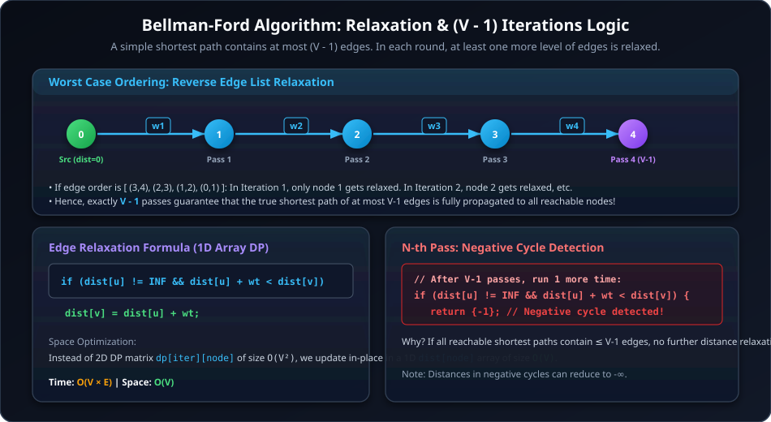

---

## Q1 GFG: Distance from the Source (Bellman-Ford Algorithm)

### Problem Statement
Given a weighted, directed and connected graph of $V$ vertices and $E$ edges, find the shortest distance of all the vertices from the source vertex $S$. If a vertex is unreachable from $S$, mark its distance as $10^8$. If the graph contains a negative weight cycle, then return an array consisting of only one element `-1`.

### Examples
**Example 1:**
```text
Input:
V = 3, edges = [[0, 1, 5], [1, 0, 3], [1, 2, -1], [2, 0, 1]], S = 2
Output:
1 6 0
Explanation:
For vertex 0: Shortest path 2 -> 0 with distance 1.
For vertex 1: Shortest path 2 -> 0 -> 1 with distance 1 + 5 = 6.
For vertex 2: Distance from source 2 is 0.
```

**Example 2 (Negative Weight Cycle):**
```text
Input:
V = 2, edges = [[0, 1, 9], [1, 0, -10]], S = 0
Output:
-1
Explanation:
0 -> 1 (9) -> 0 (-10) gives cycle weight = -1 < 0. Returns [-1].
```

### Constraints
- $1 \le V \le 500$
- $1 \le E \le V \times (V - 1)$
- $-1000 \le \text{weight}_i \le 1000$
- $0 \le S < V$

---

### Java Implementation
```java
import java.util.*;

class Solution {
    static int[] bellmanFord(int V, int[][] edges, int src) {
        int[] dist = new int[V];
        int INF = 100000000; // 10^8 as defined in problem statement
        Arrays.fill(dist, INF);
        dist[src] = 0;

        // Relax all edges V - 1 times
        for (int i = 0; i < V - 1; i++) {
            for (int[] edge : edges) {
                int u = edge[0];
                int v = edge[1];
                int wt = edge[2];

                if (dist[u] != INF && dist[u] + wt < dist[v]) {
                    dist[v] = dist[u] + wt;
                }
            }
        }

        // V-th iteration to detect negative weight cycle
        for (int[] edge : edges) {
            int u = edge[0];
            int v = edge[1];
            int wt = edge[2];

            if (dist[u] != INF && dist[u] + wt < dist[v]) {
                return new int[]{-1}; // Negative cycle exists
            }
        }

        return dist;
    }
}
```

### C++ Implementation
```cpp
#include <vector>
using namespace std;

class Solution {
public:
    vector<int> bellmanFord(int V, vector<vector<int>>& edges, int src) {
        int INF = 100000000; // 10^8
        vector<int> dist(V, INF);
        dist[src] = 0;

        // Relax all edges V - 1 times
        for (int i = 0; i < V - 1; i++) {
            for (const auto& edge : edges) {
                int u = edge[0];
                int v = edge[1];
                int wt = edge[2];

                if (dist[u] != INF && dist[u] + wt < dist[v]) {
                    dist[v] = dist[u] + wt;
                }
            }
        }

        // V-th pass to detect negative weight cycle
        for (const auto& edge : edges) {
            int u = edge[0];
            int v = edge[1];
            int wt = edge[2];

            if (dist[u] != INF && dist[u] + wt < dist[v]) {
                return {-1}; // Negative cycle detected
            }
        }

        return dist;
    }
};
```

---

### In-Depth Dry Run & Code Trace (3 Scenarios)

Here is the exact step-by-step dry run of `Solution.bellmanFord(V, edges, src)` across three key graph topologies:

---

#### Scenario 1: Simple Graph (Positive Edge Weights)

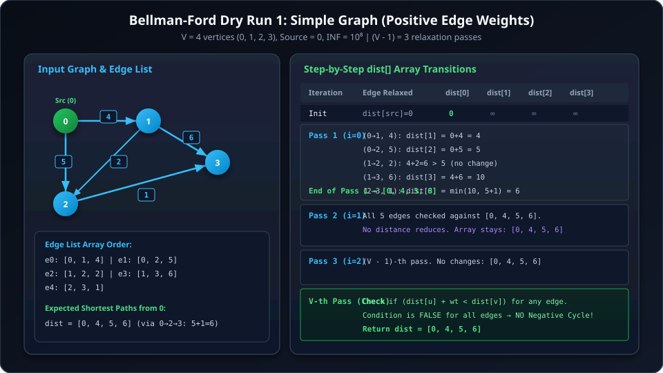

- **Parameters**: $V = 4$ (nodes $0, 1, 2, 3$), $src = 0$, $INF = 10^8$.
- **Edge List Array**:
  ```text
  edges = [
    [0, 1, 4], // e0: u=0, v=1, wt=4
    [0, 2, 5], // e1: u=0, v=2, wt=5
    [1, 2, 2], // e2: u=1, v=2, wt=2
    [1, 3, 6], // e3: u=1, v=3, wt=6
    [2, 3, 1]  // e4: u=2, v=3, wt=1
  ]
  ```

##### Step 1: Initialization
- `int[] dist = new int[4];`
- `Arrays.fill(dist, 100000000);` $\to$ `dist = [10^8, 10^8, 10^8, 10^8]`
- `dist[0] = 0;` $\to$ `dist = [0, 10^8, 10^8, 10^8]`

##### Step 2: Main Relaxation Loop (`for (int i = 0; i < V - 1; i++)` $\to i \in [0, 2]$)

1. **Pass 1 ($i = 0$)**:
   - Process `e0: [0, 1, 4]`:
     `dist[0] != INF` ($0 \ne 10^8$) and $0 + 4 < dist[1] (10^8)$ $\implies dist[1] = 4$.
     `dist` is now `[0, 4, 10^8, 10^8]`.
   - Process `e1: [0, 2, 5]`:
     `dist[0] != INF` ($0 \ne 10^8$) and $0 + 5 < dist[2] (10^8)$ $\implies dist[2] = 5$.
     `dist` is now `[0, 4, 5, 10^8]`.
   - Process `e2: [1, 2, 2]`:
     `dist[1] != INF` ($4 \ne 10^8$) and $4 + 2 = 6 < dist[2] (5)$ is **FALSE** ($6 \not< 5$). No update.
   - Process `e3: [1, 3, 6]`:
     `dist[1] != INF` ($4 \ne 10^8$) and $4 + 6 = 10 < dist[3] (10^8)$ $\implies dist[3] = 10$.
     `dist` is now `[0, 4, 5, 10]`.
   - Process `e4: [2, 3, 1]`:
     `dist[2] != INF` ($5 \ne 10^8$) and $5 + 1 = 6 < dist[3] (10)$ $\implies dist[3] = 6$.
     `dist` at end of Pass 1 = `[0, 4, 5, 6]`.

2. **Pass 2 ($i = 1$)**:
   - Check all 5 edges against `dist = [0, 4, 5, 6]`:
     - `e0 [0, 1, 4]`: $0 + 4 = 4 \not< 4$
     - `e1 [0, 2, 5]`: $0 + 5 = 5 \not< 5$
     - `e2 [1, 2, 2]`: $4 + 2 = 6 \not< 5$
     - `e3 [1, 3, 6]`: $4 + 6 = 10 \not< 6$
     - `e4 [2, 3, 1]`: $5 + 1 = 6 \not< 6$
   - No distance changes $\implies dist$ remains `[0, 4, 5, 6]`.

3. **Pass 3 ($i = 2$)**:
   - $(V - 1)$-th pass: No distance changes $\implies dist = [0, 4, 5, 6]$.

##### Step 3: $V$-th Iteration (Negative Cycle Detection)
- For every edge `[u, v, wt]`, evaluate `dist[u] != INF && dist[u] + wt < dist[v]`.
- All edges evaluate to `false`.
- **Final Return**: `dist = [0, 4, 5, 6]`.

---

#### Scenario 2: Graph with Negative Edge Weights (No Negative Cycle)

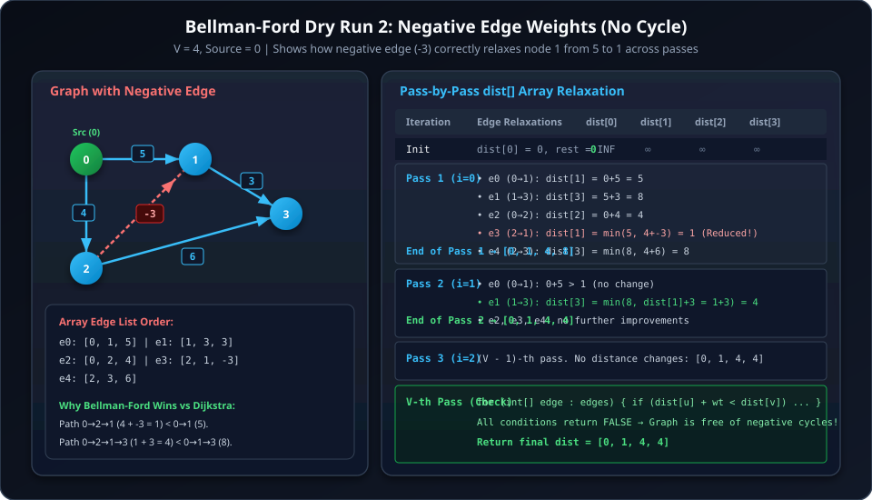

- **Parameters**: $V = 4$ (nodes $0, 1, 2, 3$), $src = 0$.
- **Edge List Array**:
  ```text
  edges = [
    [0, 1, 5],  // e0: u=0, v=1, wt=5
    [1, 3, 3],  // e1: u=1, v=3, wt=3
    [0, 2, 4],  // e2: u=0, v=2, wt=4
    [2, 1, -3], // e3: u=2, v=1, wt=-3  <-- Negative Edge
    [2, 3, 6]   // e4: u=2, v=3, wt=6
  ]
  ```

##### Step 1: Initialization
- `dist = [0, 10^8, 10^8, 10^8]`

##### Step 2: Main Relaxation Loop

1. **Pass 1 ($i = 0$)**:
   - `e0 [0, 1, 5]`: $0 + 5 < 10^8 \implies dist[1] = 5$.
   - `e1 [1, 3, 3]`: $5 + 3 < 10^8 \implies dist[3] = 8$.
   - `e2 [0, 2, 4]`: $0 + 4 < 10^8 \implies dist[2] = 4$.
   - `e3 [2, 1, -3]`: $dist[2] + (-3) = 4 - 3 = 1 < dist[1] (5) \implies dist[1] = 1$ *(Negative edge relaxes node 1!)*.
   - `e4 [2, 3, 6]`: $dist[2] + 6 = 4 + 6 = 10 \not< dist[3] (8)$.
   - `dist` at end of Pass 1 = `[0, 1, 4, 8]`.

2. **Pass 2 ($i = 1$)**:
   - `e0 [0, 1, 5]`: $0 + 5 \not< 1$
   - `e1 [1, 3, 3]`: $dist[1] + 3 = 1 + 3 = 4 < dist[3] (8) \implies dist[3] = 4$ *(Shorter path $0 \to 2 \to 1 \to 3$ propagates to node 3!)*.
   - `e2, e3, e4`: No further changes.
   - `dist` at end of Pass 2 = `[0, 1, 4, 4]`.

3. **Pass 3 ($i = 2$)**:
   - $(V - 1)$-th pass: All edge relaxation checks fail. `dist = [0, 1, 4, 4]`.

##### Step 3: $V$-th Iteration (Negative Cycle Detection)
- Checking all edges against `[0, 1, 4, 4]`:
  - `e3 [2, 1, -3]`: $4 + (-3) = 1 \not< 1$.
  - All other edges fail condition.
- **Final Return**: `dist = [0, 1, 4, 4]`. *(Correctly computed despite negative edge!)*

---

#### Scenario 3: Graph with Negative Weight Cycle

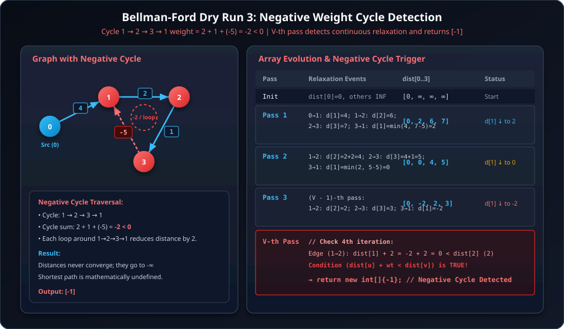

- **Parameters**: $V = 4$, $src = 0$.
- **Edge List Array**:
  ```text
  edges = [
    [0, 1, 4],  // e0: u=0, v=1, wt=4
    [1, 2, 2],  // e1: u=1, v=2, wt=2
    [2, 3, 1],  // e2: u=2, v=3, wt=1
    [3, 1, -5]  // e3: u=3, v=1, wt=-5  <-- Cycle 1->2->3->1 weight = 2 + 1 - 5 = -2 < 0
  ]
  ```

##### Step 1: Initialization
- `dist = [0, 10^8, 10^8, 10^8]`

##### Step 2: Main Relaxation Loop

1. **Pass 1 ($i = 0$)**:
   - `e0 [0, 1, 4]`: $dist[1] = 0 + 4 = 4$.
   - `e1 [1, 2, 2]`: $dist[2] = 4 + 2 = 6$.
   - `e2 [2, 3, 1]`: $dist[3] = 6 + 1 = 7$.
   - `e3 [3, 1, -5]`: $dist[3] + (-5) = 7 - 5 = 2 < dist[1] (4) \implies dist[1] = 2$.
   - `dist` at end of Pass 1 = `[0, 2, 6, 7]`.

2. **Pass 2 ($i = 1$)**:
   - `e0 [0, 1, 4]`: $0 + 4 \not< 2$.
   - `e1 [1, 2, 2]`: $dist[1] + 2 = 2 + 2 = 4 < dist[2] (6) \implies dist[2] = 4$.
   - `e2 [2, 3, 1]`: $dist[2] + 1 = 4 + 1 = 5 < dist[3] (7) \implies dist[3] = 5$.
   - `e3 [3, 1, -5]`: $dist[3] + (-5) = 5 - 5 = 0 < dist[1] (2) \implies dist[1] = 0$.
   - `dist` at end of Pass 2 = `[0, 0, 4, 5]`.

3. **Pass 3 ($i = 2$, which is $V - 1$)**:
   - `e1 [1, 2, 2]`: $dist[1] + 2 = 0 + 2 = 2 < dist[2] (4) \implies dist[2] = 2$.
   - `e2 [2, 3, 1]`: $dist[2] + 1 = 2 + 1 = 3 < dist[3] (5) \implies dist[3] = 3$.
   - `e3 [3, 1, -5]`: $dist[3] + (-5) = 3 - 5 = -2 < dist[1] (0) \implies dist[1] = -2$.
   - `dist` at end of Pass 3 = `[0, -2, 2, 3]`.

##### Step 3: $V$-th Iteration (Negative Cycle Detection)
- Enter the detection loop:
  ```java
  for (int[] edge : edges) {
      int u = edge[0], v = edge[1], wt = edge[2];
      if (dist[u] != INF && dist[u] + wt < dist[v]) {
          return new int[]{-1}; // Negative cycle exists!
      }
  }
  ```
- Evaluating edge `e1 [1, 2, 2]`:
  - $u = 1, v = 2, wt = 2$
  - `dist[1]` is $-2 \ne INF$
  - `dist[1] + wt` = $-2 + 2 = 0$
  - `dist[2]` is $2$
  - Is $0 < 2$? **YES!** (Condition `dist[u] + wt < dist[v]` is TRUE).
- **Control Flow**: Immediately hits `return new int[]{-1};`.
- **Result**: Successfully detected the negative weight cycle!

---

### Complexity Analysis
- **Time Complexity**: $\mathcal{O}(V \times E)$
  - **Reason**:
    1. **Initialization**: Initializing the `dist` array takes $\mathcal{O}(V)$ time.
    2. **Edge Relaxations**: The algorithm performs $(V - 1)$ outer iterations. In each iteration, it loops through all $E$ edges and performs constant-time $\mathcal{O}(1)$ relaxation operations. Total relaxation time = $(V - 1) \times E = \mathcal{O}(V \times E)$.
    3. **Negative Cycle Check**: A final $V$-th pass iterates over all $E$ edges once more in $\mathcal{O}(E)$ time to check if any distance can still be reduced.
    - **Total Time Complexity**: $\mathcal{O}(V) + \mathcal{O}(V \times E) + \mathcal{O}(E) = \mathcal{O}(V \times E)$.
- **Space Complexity**: $\mathcal{O}(V)$
  - **Reason**: We allocate a single 1D array `dist` of size $V$ to store the current shortest distance from the source to every vertex. No additional graph adjacency list or matrix allocation is needed since edge list representation is processed directly in $\mathcal{O}(1)$ auxiliary space.

---


## Q2 LeetCode 1627: Graph Connectivity With Threshold

### Problem Statement
We have $n$ cities labeled from $1$ to $n$. Two different cities with labels $x$ and $y$ are directly connected by a bidirectional road if and only if $x$ and $y$ share a common divisor greater than `threshold` ($\gcd(x, y) > \text{threshold}$).

You are given an integer $n$, an integer `threshold`, and an array `queries` where $\text{queries}[i] = [a_i, b_i]$. Return an array `ans` of booleans where $\text{ans}[i]$ is `true` if there is a path between $a_i$ and $b_i$, or `false` otherwise.


### Examples
**Example 1:**
```text
Input: n = 6, threshold = 2, queries = [[1,4],[2,5],[3,6],[1,2],[3,2]]
Output: [false, false, true, false, false]
Explanation:
Common divisors > 2:
- 3 and 6 have gcd(3, 6) = 3 > 2 -> connected.
- 1, 2, 4, 5 share no gcd > 2.
```

**Example 2:**
```text
Input: n = 6, threshold = 0, queries = [[4,5],[3,4],[3,2],[2,6],[1,3]]
Output: [true, true, true, true, true]
Explanation: Since threshold = 0, any gcd > 0 connects vertices. Since gcd(x, y) >= 1 for all pairs, all vertices 1..6 are connected through 1.
```

### Constraints
- $2 \le n \le 10^4$
- $0 \le \text{threshold} \le n$
- $1 \le \text{queries.length} \le 10^5$
- $\text{queries}[i].\text{length} == 2$
- $1 \le a_i, b_i \le n$, $a_i \neq b_i$

---


### Intuition & Optimal Approach
- **Naive Check**: Checking $\gcd(i, j)$ for all pairs takes $O(n^2 \log n)$ time, which for $n = 10^4$ gives $\approx 10^8 \times 14$ operations $\to$ **TLE**.
- **Sieve-Like Multiples DSU ($O(n \log n)$)**:
  - Instead of pairing numbers, iterate over each potential common divisor $i$ from $\text{threshold} + 1$ up to $n$.
  - For each base factor $i$, connect $i$ with all its multiples: $2i, 3i, 4i \dots \le n$.
  - By transitivity of Disjoint Set Union (DSU), all multiples of $i$ merge into the same connected component.
  - Number of union operations: $\frac{n}{\text{threshold}+1} + \dots + \frac{n}{n} \le n \sum \frac{1}{i} = O(n \log n)$.
  - For each query $(u, v)$, answer is simply `find(u) == find(v)` in $O(\alpha(n))$ time.

---

### Java Implementation
```java
import java.util.*;

class Solution {
    public static class DSU {
        private int[] parent;
        private int[] rank;

        public DSU(int n) {
            parent = new int[n + 1];
            rank = new int[n + 1];
            for (int i = 0; i <= n; i++) {
                parent[i] = i;
                rank[i] = 0;
            }
        }

        public int find(int u) {
            if (parent[u] == u) return u;
            return parent[u] = find(parent[u]); // Path compression
        }

        public void union(int u, int v) {
            int rootU = find(u);
            int rootV = find(v);
            if (rootU != rootV) {
                // Union by rank
                if (rank[rootU] < rank[rootV]) {
                    parent[rootU] = rootV;
                } else if (rank[rootU] > rank[rootV]) {
                    parent[rootV] = rootU;
                } else {
                    parent[rootV] = rootU;
                    rank[rootU]++;
                }
            }
        }
    }

    public List<Boolean> areConnected(int n, int threshold, int[][] queries) {
        DSU dsu = new DSU(n);

        // Sieve-like union of multiples for all divisors > threshold
        for (int i = threshold + 1; i <= n; i++) {
            for (int m = 2 * i; m <= n; m += i) {
                dsu.union(i, m);
            }
        }

        List<Boolean> ans = new ArrayList<>(queries.length);
        for (int[] q : queries) {
            ans.add(dsu.find(q[0]) == dsu.find(q[1]));
        }
        return ans;
    }
}
```

### C++ Implementation
```cpp
#include <vector>
#include <numeric>
using namespace std;

class DSU {
private:
    vector<int> parent;
    vector<int> rank;

public:
    DSU(int n) : parent(n + 1), rank(n + 1, 0) {
        iota(parent.begin(), parent.end(), 0);
    }

    int find(int u) {
        if (parent[u] == u) return u;
        return parent[u] = find(parent[u]);
    }

    void unite(int u, int v) {
        int rootU = find(u);
        int rootV = find(v);
        if (rootU != rootV) {
            if (rank[rootU] < rank[rootV]) {
                parent[rootU] = rootV;
            } else if (rank[rootU] > rank[rootV]) {
                parent[rootV] = rootU;
            } else {
                parent[rootV] = rootU;
                rank[rootU]++;
            }
        }
    }
};

class Solution {
public:
    vector<bool> areConnected(int n, int threshold, vector<vector<int>>& queries) {
        DSU dsu(n);

        // Connect multiples for each common factor > threshold
        for (int i = threshold + 1; i <= n; i++) {
            for (int m = 2 * i; m <= n; m += i) {
                dsu.unite(i, m);
            }
        }

        vector<bool> result;
        result.reserve(queries.size());
        for (const auto& q : queries) {
            result.push_back(dsu.find(q[0]) == dsu.find(q[1]));
        }
        return result;
    }
};
```

### Complexity Analysis
- **Time Complexity**: $\mathcal{O}(N \log N + Q \cdot \alpha(N))$
  - **Reason**:
    1. **DSU Initialization**: Creating `parent` and `rank` arrays of size $N + 1$ takes $\mathcal{O}(N)$ time.
    2. **Connecting Multiples (Sieve-like approach)**: For each base factor $i$ from $(\text{threshold} + 1)$ to $N$, we iterate through its multiples $2i, 3i, 4i, \dots \le N$ and union them with $i$. The total number of pairs processed is:
       $$\sum_{i=\text{threshold}+1}^{N} \frac{N}{i} \le N \sum_{i=1}^{N} \frac{1}{i} = N \cdot H_N = \mathcal{O}(N \log N)$$
       Each `unite` operation takes $\mathcal{O}(\alpha(N))$ nearly constant amortized time (where $\alpha$ is the inverse Ackermann function, $\alpha(N) < 5$).
    3. **Processing Queries**: For each of the $Q$ queries $(a, b)$, we perform `find(a) == find(b)` which takes $\mathcal{O}(\alpha(N))$ time. For $Q$ queries, this takes $\mathcal{O}(Q \cdot \alpha(N))$.
    - **Total Time Complexity**: $\mathcal{O}(N \log N + Q \cdot \alpha(N))$.
- **Space Complexity**: $\mathcal{O}(N)$
  - **Reason**: The Disjoint Set Union (DSU) data structure requires `parent` and `rank` arrays of size $N + 1$, consuming $\mathcal{O}(N)$ auxiliary memory. The boolean result array requires $\mathcal{O}(Q)$ space for the returned output.

---

## 2. Floyd-Warshall Algorithm (All-Pairs Shortest Path - APSP)

### Core Concept & Dynamic Programming Formulation
- Computes shortest distances between **every pair of vertices** $(i, j)$.
- **DP State**: $dist[i][j]$ = shortest path from $i$ to $j$ using a subset of intermediate vertices from $\{0, 1, \dots, k\}$.
- **State Transition**:
  $$dist[i][j] = \min(dist[i][j], dist[i][k] + dist[k][j])$$
- **Crucial Rule on Loop Order**: The intermediate vertex loop ($k$) **MUST be the outermost loop**.
- **Skipping & Optimizations**:
  - Skip when $i == j$ (distance to self is $0$).
  - Skip when $i == k$ or $j == k$ (no intermediate bypass).
  - Skip when $dist[i][k] == \infty$ or $dist[k][j] == \infty$ (no valid path through $k$).
- **Detecting Negative Cycles**: If any diagonal element $dist[i][i] < 0$ after completing all passes, node $i$ is part of a negative weight cycle.
- **When to Use**: Graph size $V \le 400$ ($V^3 \approx 6.4 \times 10^7 \le 10^8$ operations).

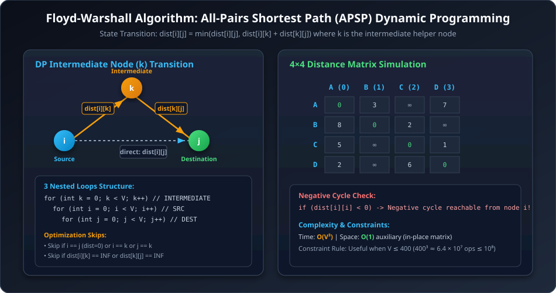

---

## Q3 GFG: Floyd Warshall / Shortest Distance

### Problem Statement
The problem is to find the shortest distances between every pair of vertices in a given edge-weighted directed graph. The graph is represented as an adjacency matrix `matrix` of size $n \times n$. `matrix[i][j]` denotes the weight of the edge from $i$ to $j$. If there is no edge from vertex $i$ to vertex $j$, `matrix[i][j]` is `-1`.
Do the changes **in-place**.

### Examples
**Example 1:**
```text
Input: matrix = [
  [0, 25],
  [-1, 0]
]
Output: [
  [0, 25],
  [-1, 0]
]
```

**Example 2:**
```text
Input: matrix = [
  [0, 1, 43],
  [1, 0, 6],
  [-1, -1, 0]
]
Output: [
  [0, 1, 7],
  [1, 0, 6],
  [-1, -1, 0]
]
```

### Constraints
- $1 \le n \le 100$
- $-1 \le \text{matrix}[i][j] \le 1000$

---

### Java Implementation
```java
class Solution {
    public void shortest_distance(int[][] matrix) {
        int n = matrix.length;
        int INF = (int) 1e9;

        // Step 1: Pre-process - convert -1 (no edge) to INF, except diagonal
        for (int i = 0; i < n; i++) {
            for (int j = 0; j < n; j++) {
                if (matrix[i][j] == -1) {
                    matrix[i][j] = INF;
                }
            }
        }

        // Step 2: Floyd-Warshall 3-nested loops with k as intermediate vertex
        for (int k = 0; k < n; k++) {
            for (int i = 0; i < n; i++) {
                for (int j = 0; j < n; j++) {
                    if (matrix[i][k] != INF && matrix[k][j] != INF) {
                        matrix[i][j] = Math.min(matrix[i][j], matrix[i][k] + matrix[k][j]);
                    }
                }
            }
        }

        // Step 3: Post-process - convert INF back to -1
        for (int i = 0; i < n; i++) {
            for (int j = 0; j < n; j++) {
                if (matrix[i][j] == INF) {
                    matrix[i][j] = -1;
                }
            }
        }
    }
}
```

### C++ Implementation
```cpp
#include <vector>
#include <algorithm>
using namespace std;

class Solution {
public:
    void shortest_distance(vector<vector<int>>& matrix) {
        int n = matrix.size();
        int INF = 1e9;

        // Pre-process: replace -1 with INF
        for (int i = 0; i < n; i++) {
            for (int j = 0; j < n; j++) {
                if (matrix[i][j] == -1) {
                    matrix[i][j] = INF;
                }
            }
        }

        // Floyd-Warshall DP
        for (int k = 0; k < n; k++) {
            for (int i = 0; i < n; i++) {
                for (int j = 0; j < n; j++) {
                    if (matrix[i][k] != INF && matrix[k][j] != INF) {
                        matrix[i][j] = min(matrix[i][j], matrix[i][k] + matrix[k][j]);
                    }
                }
            }
        }

        // Post-process: replace INF with -1
        for (int i = 0; i < n; i++) {
            for (int j = 0; j < n; j++) {
                if (matrix[i][j] == INF) {
                    matrix[i][j] = -1;
                }
            }
        }
    }
};
```

### Complexity Analysis
- **Time Complexity**: $\mathcal{O}(V^3)$ (or $\mathcal{O}(N^3)$ where $N$ is the number of vertices)
  - **Reason**:
    1. **Three Nested Loops**:
       - Outer loop iterates through all intermediate vertices $k \in [0, N-1]$ ($N$ iterations).
       - Middle loop iterates through all source vertices $i \in [0, N-1]$ ($N$ iterations).
       - Inner loop iterates through all destination vertices $j \in [0, N-1]$ ($N$ iterations).
    2. **Constant-Time Transition**: Inside the innermost loop, constant-time $\mathcal{O}(1)$ operations are executed: checking for valid reachability through $k$ (`matrix[i][k] != INF && matrix[k][j] != INF`) and relaxing `matrix[i][j] = min(matrix[i][j], matrix[i][k] + matrix[k][j])`.
    3. **Pre/Post-Processing**: Initializing $-1$ to `INF` and restoring `INF` to $-1$ takes $2 \times \mathcal{O}(N^2)$ time, which is strictly dominated by $\mathcal{O}(N^3)$.
    - **Total Time Complexity**: $\mathcal{O}(N^3)$.
- **Space Complexity**: $\mathcal{O}(1)$ Auxiliary Space (or $\mathcal{O}(N^2)$ for the matrix)
  - **Reason**: All shortest path relaxations and weight updates are performed **in-place** directly within the input $N \times N$ adjacency matrix `matrix`. No additional dynamic programming tables or auxiliary data structures are allocated.

---

## 3. Network Flow & Ford-Fulkerson Algorithm (Edmonds-Karp)

### Core Concepts Explained in Simple Plain English

Imagine a city's water pipe network where water flows from a **Water Tank (Source $S$)** to a **City Tap (Sink $T$)**.

---

#### 1. Flow Network (The Pipes and Capacities)
- **Source ($S$)**: The starting vertex that generates the flow (water reservoir).
- **Sink ($T$)**: The destination vertex where all the flow collects (city drain/tap).
- **Capacity $c(u, v)$**: The maximum amount of water that pipe $(u, v)$ can physically carry per second.
- **Current Flow $f(u, v)$**: The actual amount of water currently flowing through that pipe.
- **Two Golden Rules**:
  1. **Capacity Limit**: You can never pump more water than the pipe's capacity ($0 \le f(u, v) \le c(u, v)$).
  2. **Flow Conservation**: For every intermediate junction (any node other than Source and Sink), the **total water entering = total water leaving**. No water can leak or magically appear in between.

---

#### 2. Residual Graph (`rGraph` — The "Remaining Opportunities" Map)
As we push water through pipes, we need a scratchpad to know **what more can be done**. This scratchpad is called the **Residual Graph**:
1. **Forward Capacity (`rGraph[u][v] = Capacity - Current Flow`)**:
   - *Plain English*: **"How much MORE water can I still push forward through this pipe?"**
   - *Example*: If a pipe has a capacity of $10$ and currently carries $6$ units of water, you can still push $10 - 6 = 4$ more units forward.
2. **Backward / Reverse Capacity (`rGraph[v][u] = Current Flow`)**:
   - *Plain English*: **"How much water did I send that I can CANCEL or REDIRECT backwards if I change my mind later?"**
   - *Example*: Because we sent $6$ units from $u \to v$, we now have the option to cancel up to $6$ units and divert them elsewhere.

---

#### 3. Augmenting Path (Finding an Open Route)
- An **Augmenting Path** is simply any path from Source $S$ to Sink $T$ in the residual graph where every pipe on the path has **unused capacity** (`rGraph[u][v] > 0`).
- If you can still find an augmenting path from $S$ to $T$, it means you can push more water through the network!

---

#### 4. Bottleneck Capacity ($\Delta$ — The Weakest Link)
- If a route consists of 3 pipes in a row with remaining capacities $10$, $3$, and $8$, how much water can you actually send down this route?
- Only $3$ units! The narrowest pipe determines the limit for the entire path:
  $$\Delta = \min(\text{remaining capacities along the path})$$

---

#### 5. Flow Update (Adjusting the Remaining Capacities)
Once an augmenting path with bottleneck $\Delta$ is found:
- **Forward edges on path**: `rGraph[u][v] = rGraph[u][v] - Δ` (we used up $\Delta$ units of forward room).
- **Reverse edges on path**: `rGraph[v][u] = rGraph[v][v] + Δ` (we created an option to cancel $\Delta$ units in the future).
- **Total Flow**: `maxFlow += Δ`.

---

#### 6. Why Reverse Edges Are Essential (The "Undo / Regret" Mechanism)

> [!TIP]
> **Why do we need reverse edges?**  
> Because the algorithm makes greedy choices. If it makes a "bad" initial choice that hogs a pipe, **reverse edges give it the ability to UNDO that choice** and reroute the flow to find the true global maximum!

---

### Step-by-Step Dry Run: The Bridge Graph Example

Let's trace how Ford-Fulkerson resolves the classic bridge graph where a greedy choice traps the network without reverse edges.

#### Graph Specification:
- **Vertices**: $S$ (Source), $A$, $B$, $T$ (Sink)
- **Edges & Capacities**:
  - $S \to A: 1$
  - $S \to B: 1$
  - $A \to B: 1$ (The shared bridge edge)
  - $A \to T: 1$
  - $B \to T: 1$
- **Initial Total Flow**: $0$

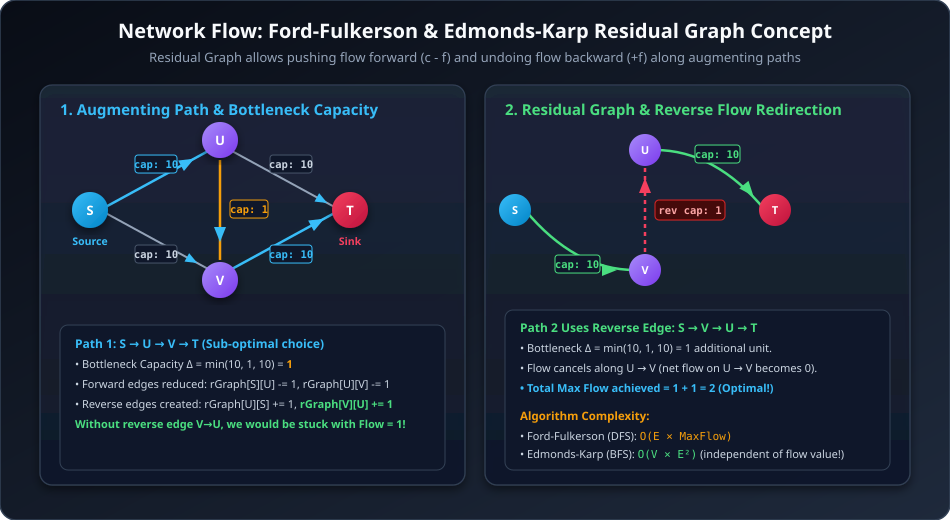

---

#### Iteration 1: The Sub-Optimal Greedy Path

1. **Path Search**: BFS starts from Source $S$ and finds the augmenting path:
   $$\text{Path 1}: S \xrightarrow{1} A \xrightarrow{1} B \xrightarrow{1} T$$
2. **Bottleneck Calculation**:
   $$\Delta_1 = \min(rGraph[S][A], rGraph[A][B], rGraph[B][T]) = \min(1, 1, 1) = 1$$
3. **Residual Graph Updates**:
   - Edge $S \to A$: $rGraph[S][A] = 1 - 1 = 0$, $rGraph[A][S] = 0 + 1 = 1$
   - Edge $A \to B$: $rGraph[A][B] = 1 - 1 = 0$, $rGraph[B][A] = 0 + 1 = 1$ $\leftarrow$ *(Reverse edge created!)*
   - Edge $B \to T$: $rGraph[B][T] = 1 - 1 = 0$, $rGraph[T][B] = 0 + 1 = 1$
4. **Current Flow**: $\text{maxFlow} = 0 + 1 = 1$.

> [!WARNING]
> **The Greedy Trap**:  
> At this moment, edge $A \to B$ is saturated ($rGraph[A][B] = 0$), and edge $B \to T$ is saturated ($rGraph[B][T] = 0$).  
> If we did **NOT** have reverse edges, $S \to B$ cannot reach $T$ (since $B \to T$ is full), and $S \to A$ cannot send another unit to $T$ (since $S \to A$ is full). The algorithm would falsely stop at $\text{Flow} = 1$, missing the true maximum flow of $2$!

---

#### Iteration 2: Unlocking the Maximum Flow via Reverse Edge ($B \to A$)

1. **Path Search**: BFS searches the residual graph again and discovers an augmenting path through the **reverse edge**:
   $$\text{Path 2}: S \xrightarrow{1} B \xrightarrow[\text{Reverse}]{1} A \xrightarrow{1} T$$
   - $S \to B$: Forward edge with available capacity $rGraph[S][B] = 1 > 0$.
   - $B \to A$: **Reverse edge** with capacity $rGraph[B][A] = 1 > 0$.
   - $A \to T$: Forward edge with available capacity $rGraph[A][T] = 1 > 0$.
2. **Bottleneck Calculation**:
   $$\Delta_2 = \min(rGraph[S][B], rGraph[B][A], rGraph[A][T]) = \min(1, 1, 1) = 1$$
3. **Residual Graph Updates (The Cancellation)**:
   - Edge $S \to B$: $rGraph[S][B] = 1 - 1 = 0$, $rGraph[B][S] = 0 + 1 = 1$
   - Edge $B \to A$ (Reverse): $rGraph[B][A] = 1 - 1 = 0$, $rGraph[A][B] = 0 + 1 = 1$  
     *(Pumping flow along reverse edge $B \to A$ restores forward capacity on $A \to B$ to $1$. The net physical flow on $A \to B$ becomes $1 - 1 = 0$!)*
   - Edge $A \to T$: $rGraph[A][T] = 1 - 1 = 0$, $rGraph[T][A] = 0 + 1 = 1$
4. **Current Flow**: $\text{maxFlow} = 1 + 1 = 2$.

---

#### Iteration 3: Algorithm Termination

1. **Path Search**: BFS starts at $S$. All outgoing edges from $S$ in $rGraph$ have $0$ residual capacity:
   - $rGraph[S][A] = 0$
   - $rGraph[S][B] = 0$
2. Sink $T$ is unreachable in $rGraph$. BFS returns `false`.
3. **Final Result**: $\text{Max Flow} = 2$.

---

#### Physical Interpretation: What Actually Happened?

| Edge | Initial Capacity | Flow after Path 1 | Flow after Path 2 (Reverse Undo) | Final Status |
| :--- | :--- | :--- | :--- | :--- |
| $S \to A$ | $1$ | $1$ | $1$ | **Saturated** ($1/1$) |
| $S \to B$ | $1$ | $0$ | $1$ | **Saturated** ($1/1$) |
| $A \to B$ | $1$ | $1$ | $0$ ($1 - 1 = 0$) | **Freed Up / Empty** ($0/1$) |
| $A \to T$ | $1$ | $0$ | $1$ | **Saturated** ($1/1$) |
| $B \to T$ | $1$ | $1$ | $1$ | **Saturated** ($1/1$) |

**In Real Life**:
- No water ever traveled backwards from $B$ to $A$.
- Instead, the $1$ unit of water from $S \to A$ was redirected straight out through $A \to T$.
- The new $1$ unit of water from $S \to B$ filled the pipe $B \to T$.
- This yielded **two completely independent, parallel flow paths**:
  1. $S \to A \to T$ (Flow = $1$)
  2. $S \to B \to T$ (Flow = $1$)
- **Total Max Flow = $2$** (Optimal)!

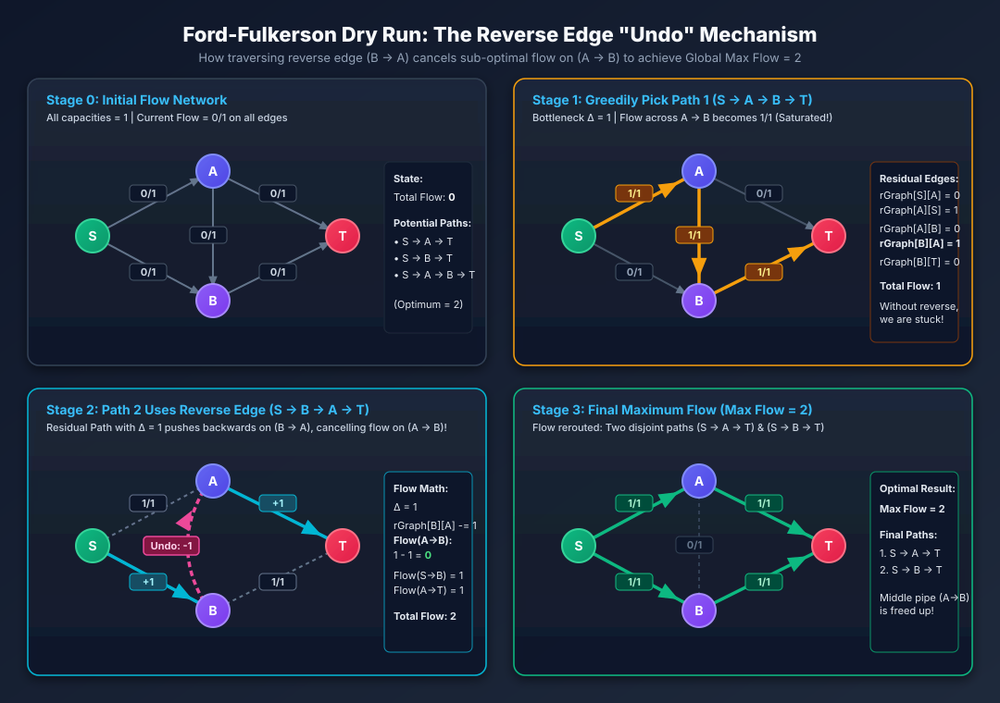

---

## Q4 GFG: Find Maximum Flow / Ford-Fulkerson

### Problem Statement
Given a graph with $N$ vertices numbered $1$ to $N$ and $M$ edges. The source vertex is $1$ and the sink vertex is $N$. Find the maximum flow from the source to the sink.

### Examples
**Example 1:**
```text
Input:
N = 5, M = 4
Edges = [[1, 2, 1], [3, 2, 2], [4, 2, 3], [2, 5, 5]]
Output: 1
Explanation: 
Path 1 -> 2 -> 5 has bottleneck min(1, 5) = 1.
Total Max Flow = 1.
```

### Constraints
- $1 \le N \le 100$
- $1 \le M \le 1000$
- $1 \le u, v \le N$
- $1 \le \text{capacity} \le 1000$

---

### Java Implementation (Edmonds-Karp using BFS)
```java
import java.util.*;

class Solution {
    private boolean bfs(int[][] rGraph, int s, int t, int[] parent, int n) {
        boolean[] visited = new boolean[n + 1];
        Queue<Integer> queue = new LinkedList<>();
        queue.add(s);
        visited[s] = true;
        parent[s] = -1;

        while (!queue.isEmpty()) {
            int u = queue.poll();

            for (int v = 1; v <= n; v++) {
                if (!visited[v] && rGraph[u][v] > 0) {
                    parent[v] = u;
                    visited[v] = true;
                    if (v == t) return true;
                    queue.add(v);
                }
            }
        }
        return false;
    }

    public int findMaxFlow(int N, int M, ArrayList<ArrayList<Integer>> Edges) {
        int[][] rGraph = new int[N + 1][N + 1];

        // Build residual graph with parallel edges handling
        for (ArrayList<Integer> edge : Edges) {
            int u = edge.get(0);
            int v = edge.get(1);
            int cap = edge.get(2);
            rGraph[u][v] += cap;
            rGraph[v][u] += cap; // Bidirectional capacity in undirected/multi graph
        }

        int s = 1;
        int t = N;
        int[] parent = new int[N + 1];
        int maxFlow = 0;

        // While an augmenting path exists from source to sink
        while (bfs(rGraph, s, t, parent, N)) {
            // Find bottleneck capacity along the BFS path
            int pathFlow = Integer.MAX_VALUE;
            for (int v = t; v != s; v = parent[v]) {
                int u = parent[v];
                pathFlow = Math.min(pathFlow, rGraph[u][v]);
            }

            // Update residual capacities of edges and reverse edges
            for (int v = t; v != s; v = parent[v]) {
                int u = parent[v];
                rGraph[u][v] -= pathFlow;
                rGraph[v][u] += pathFlow;
            }

            maxFlow += pathFlow;
        }

        return maxFlow;
    }
}
```

### C++ Implementation
```cpp
#include <vector>
#include <queue>
#include <algorithm>
#include <climits>
using namespace std;

class Solution {
private:
    bool bfs(const vector<vector<int>>& rGraph, int s, int t, vector<int>& parent, int n) {
        vector<bool> visited(n + 1, false);
        queue<int> q;
        q.push(s);
        visited[s] = true;
        parent[s] = -1;

        while (!q.empty()) {
            int u = q.front();
            q.pop();

            for (int v = 1; v <= n; v++) {
                if (!visited[v] && rGraph[u][v] > 0) {
                    parent[v] = u;
                    visited[v] = true;
                    if (v == t) return true;
                    q.push(v);
                }
            }
        }
        return false;
    }

public:
    int findMaxFlow(int N, int M, vector<vector<int>>& Edges) {
        vector<vector<int>> rGraph(N + 1, vector<int>(N + 1, 0));

        for (const auto& edge : Edges) {
            int u = edge[0];
            int v = edge[1];
            int cap = edge[2];
            rGraph[u][v] += cap;
            rGraph[v][u] += cap;
        }

        int s = 1, t = N;
        vector<int> parent(N + 1);
        int maxFlow = 0;

        while (bfs(rGraph, s, t, parent, N)) {
            int pathFlow = INT_MAX;
            for (int v = t; v != s; v = parent[v]) {
                int u = parent[v];
                pathFlow = min(pathFlow, rGraph[u][v]);
            }

            for (int v = t; v != s; v = parent[v]) {
                int u = parent[v];
                rGraph[u][v] -= pathFlow;
                rGraph[v][u] += pathFlow;
            }

            maxFlow += pathFlow;
        }

        return maxFlow;
    }
};
```

---

### Step-by-Step Dry Run of Java Code (`findMaxFlow` with Varied Capacities)

Let's trace the Java Edmonds-Karp implementation line-by-line on an example graph where all cities/edges have **different capacity limits**.

#### Input Graph Specification:
- **Number of Cities ($N$)**: $4$
- **Number of Edges ($M$)**: $5$
- **Source ($s$)**: City $1$ | **Sink ($t$)**: City $4$
- **Edges & Capacities**:
  1. City $1 \to$ City $2$ with capacity **$10$**
  2. City $1 \to$ City $3$ with capacity **$8$**
  3. City $2 \to$ City $3$ with capacity **$4$**
  4. City $2 \to$ City $4$ with capacity **$6$**
  5. City $3 \to$ City $4$ with capacity **$9$**

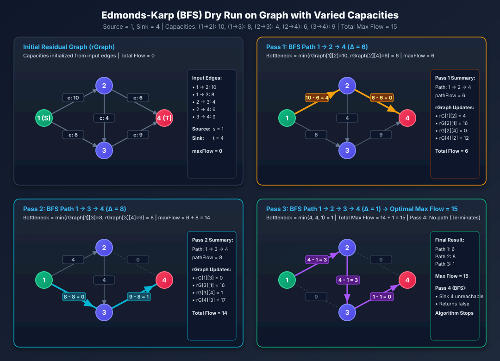

---

#### Step 0: Initialization of Residual Graph (`rGraph`)
```java
int[][] rGraph = new int[N + 1][N + 1];
```
Populated values for bidirectional capacities:
- `rGraph[1][2] = 10`, `rGraph[2][1] = 10`
- `rGraph[1][3] = 8`, `rGraph[3][1] = 8`
- `rGraph[2][3] = 4`, `rGraph[3][2] = 4`
- `rGraph[2][4] = 6`, `rGraph[4][2] = 6`
- `rGraph[3][4] = 9`, `rGraph[4][3] = 9`
- `maxFlow = 0`

---

#### While Loop — Pass 1:

##### 1. `bfs(rGraph, 1, 4, parent, 4)`:
- `queue = [1]`, `visited = [false, true, false, false, false]`, `parent[1] = -1`
- **Poll `u = 1`**:
  - `v = 2`: `!visited[2] && rGraph[1][2] (10) > 0` $\implies parent[2] = 1, visited[2] = true$, `queue.add(2)`
  - `v = 3`: `!visited[3] && rGraph[1][3] (8) > 0` $\implies parent[3] = 1, visited[3] = true$, `queue.add(3)`
- **Poll `u = 2`**:
  - `v = 4`: `!visited[4] && rGraph[2][4] (6) > 0` $\implies parent[4] = 2, visited[4] = true$. Since `v == t (4)`, **returns `true`**!

##### 2. Bottleneck Calculation:
```java
int pathFlow = Integer.MAX_VALUE;
for (int v = 4; v != 1; v = parent[v]) ...
```
- `v = 4, u = parent[4] = 2` $\implies pathFlow = \min(\infty, rGraph[2][4]) = \min(\infty, 6) = 6$
- `v = 2, u = parent[2] = 1` $\implies pathFlow = \min(6, rGraph[1][2]) = \min(6, 10) = 6$
- **Augmenting Path 1**: $1 \xrightarrow{10} 2 \xrightarrow{6} 4$ with **$\text{pathFlow} = 6$**.

##### 3. Updating Residual Capacities:
- `rGraph[2][4] -= 6` $\implies \mathbf{0}$, `rGraph[4][2] += 6` $\implies \mathbf{12}$
- `rGraph[1][2] -= 6` $\implies \mathbf{4}$, `rGraph[2][1] += 6` $\implies \mathbf{16}$
- `maxFlow += 6` $\implies \mathbf{maxFlow = 6}$.

---

#### While Loop — Pass 2:

##### 1. `bfs(rGraph, 1, 4, parent, 4)`:
- `queue = [1]`, `visited = [false, true, false, false, false]`, `parent[1] = -1`
- **Poll `u = 1`**:
  - `v = 2`: `rGraph[1][2] = 4 > 0` $\implies parent[2] = 1, visited[2] = true$, `queue.add(2)`
  - `v = 3`: `rGraph[1][3] = 8 > 0` $\implies parent[3] = 1, visited[3] = true$, `queue.add(3)`
- **Poll `u = 2`**:
  - `v = 4`: `rGraph[2][4] == 0` (Cannot push through full pipe $2 \to 4$).
- **Poll `u = 3`**:
  - `v = 4`: `!visited[4] && rGraph[3][4] (9) > 0` $\implies parent[4] = 3, visited[4] = true$. Since `v == t (4)`, **returns `true`**!

##### 2. Bottleneck Calculation:
- `v = 4, u = parent[4] = 3` $\implies pathFlow = \min(\infty, rGraph[3][4]) = \min(\infty, 9) = 9$
- `v = 3, u = parent[3] = 1` $\implies pathFlow = \min(9, rGraph[1][3]) = \min(9, 8) = 8$
- **Augmenting Path 2**: $1 \xrightarrow{8} 3 \xrightarrow{9} 4$ with **$\text{pathFlow} = 8$**.

##### 3. Updating Residual Capacities:
- `rGraph[3][4] -= 8` $\implies \mathbf{1}$, `rGraph[4][3] += 8` $\implies \mathbf{17}$
- `rGraph[1][3] -= 8` $\implies \mathbf{0}$, `rGraph[3][1] += 8` $\implies \mathbf{16}$
- `maxFlow += 8` $\implies 6 + 8 = \mathbf{14}$.

---

#### While Loop — Pass 3:

##### 1. `bfs(rGraph, 1, 4, parent, 4)`:
- `queue = [1]`, `visited = [false, true, false, false, false]`, `parent[1] = -1`
- **Poll `u = 1`**:
  - `v = 2`: `rGraph[1][2] = 4 > 0` $\implies parent[2] = 1, visited[2] = true$, `queue.add(2)`
  - `v = 3`: `rGraph[1][3] == 0` (Cannot take $1 \to 3$).
- **Poll `u = 2`**:
  - `v = 3`: `!visited[3] && rGraph[2][3] (4) > 0` $\implies parent[3] = 2, visited[3] = true$, `queue.add(3)`
  - `v = 4`: `rGraph[2][4] == 0`.
- **Poll `u = 3`**:
  - `v = 4`: `!visited[4] && rGraph[3][4] (1) > 0` $\implies parent[4] = 3, visited[4] = true$. Since `v == t (4)`, **returns `true`**!

##### 2. Bottleneck Calculation:
- `v = 4, u = parent[4] = 3` $\implies pathFlow = \min(\infty, rGraph[3][4]) = \min(\infty, 1) = 1$
- `v = 3, u = parent[3] = 2` $\implies pathFlow = \min(1, rGraph[2][3]) = \min(1, 4) = 1$
- `v = 2, u = parent[2] = 1` $\implies pathFlow = \min(1, rGraph[1][2]) = \min(1, 4) = 1$
- **Augmenting Path 3**: $1 \xrightarrow{4} 2 \xrightarrow{4} 3 \xrightarrow{1} 4$ with **$\text{pathFlow} = 1$**.

##### 3. Updating Residual Capacities:
- `rGraph[3][4] -= 1` $\implies \mathbf{0}$, `rGraph[4][3] += 1` $\implies \mathbf{18}$
- `rGraph[2][3] -= 1` $\implies \mathbf{3}$, `rGraph[3][2] += 1` $\implies \mathbf{5}$
- `rGraph[1][2] -= 1` $\implies \mathbf{3}$, `rGraph[2][1] += 1` $\implies \mathbf{17}$
- `maxFlow += 1` $\implies 14 + 1 = \mathbf{15}$.

---

#### While Loop — Pass 4 (Termination):
- `bfs(rGraph, 1, 4, parent, 4)`:
  - Queue explores `1 -> 2 -> 3`.
  - At node 3: `rGraph[3][4] == 0`, `rGraph[3][1] = 16` (already visited 1).
  - Sink $4$ is **unreachable**.
  - Queue becomes empty $\implies$ `bfs` returns **`false`**.

---

#### Final Output:
```java
return maxFlow; // Returns 15
```

| Pass | Augmenting Path Found | Path Bottleneck ($\Delta$) | Cumulative Max Flow |
| :--- | :--- | :--- | :--- |
| **Pass 1** | $1 \to 2 \to 4$ | $\min(10, 6) = 6$ | **$6$** |
| **Pass 2** | $1 \to 3 \to 4$ | $\min(8, 9) = 8$ | **$14$** |
| **Pass 3** | $1 \to 2 \to 3 \to 4$ | $\min(4, 4, 1) = 1$ | **$15$** |
| **Pass 4** | None (Sink unreachable) | $0$ | **$15$ (Terminates)** |

---

### Complexity Analysis
- **Time Complexity**: $\mathcal{O}(V \times E^2)$ (using Edmonds-Karp with BFS / Adjacency Matrix)
  - **Reason**:
    1. **Edmonds-Karp Augmentations Bound**: Edmonds-Karp algorithm uses Breadth-First Search (BFS) to discover the shortest augmenting path (in terms of number of edges). It is proven that the length of the shortest augmenting path grows monotonically, which bounds the total number of augmenting path augmentations to at most $\mathcal{O}(V \times E)$.
    2. **BFS Traversal & Bottleneck Update**: Each BFS traversal and path bottleneck update on an $N$-vertex adjacency matrix / residual graph takes $\mathcal{O}(V^2)$ (or $\mathcal{O}(E)$ if implemented with adjacency lists).
    - **Total Time Complexity**: $\mathcal{O}(V \cdot E \times E) = \mathcal{O}(V \times E^2)$ (or $\mathcal{O}(V \cdot E \times V^2) = \mathcal{O}(V^3 \cdot E)$ for dense adjacency matrix BFS).
- **Space Complexity**: $\mathcal{O}(V^2)$
  - **Reason**:
    1. The residual graph capacity matrix `rGraph` of size $(N + 1) \times (N + 1)$ requires $\mathcal{O}(V^2)$ auxiliary space.
    2. The BFS queue, `visited` boolean array, and `parent` backtracking array require $\mathcal{O}(V)$ memory.
    - **Total Space Complexity**: $\mathcal{O}(V^2)$.

---

## Q5 LeetCode 1334: Find the City With the Smallest Number of Neighbors at a Threshold Distance

### Problem Statement
There are $n$ cities numbered from $0$ to $n-1$. Given the array `edges` where $\text{edges}[i] = [from_i, to_i, weight_i]$ represents a bidirectional and weighted edge between cities $from_i$ and $to_i$, and given the integer `distanceThreshold`.

Return the city with the smallest number of cities that are reachable through some path and whose distance is **at most** `distanceThreshold`. If there are multiple such cities, return the city with the greatest number (largest index).

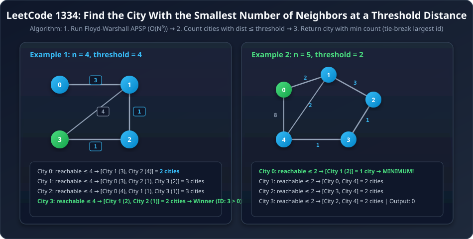

### Examples
**Example 1:**
```text
Input: n = 4, edges = [[0,1,3],[1,2,1],[1,3,4],[2,3,1]], distanceThreshold = 4
Output: 3
Explanation:
Distance matrix gives reachable cities within threshold 4:
City 0 -> [City 1, City 2] (count = 2)
City 1 -> [City 0, City 2, City 3] (count = 3)
City 2 -> [City 0, City 1, City 3] (count = 3)
City 3 -> [City 1, City 2] (count = 2)
Both City 0 and 3 have 2 reachable cities. We choose City 3 as it has the greatest number.
```

**Example 2:**
```text
Input: n = 5, edges = [[0,1,2],[0,4,8],[1,2,3],[1,4,2],[2,3,1],[3,4,1]], distanceThreshold = 2
Output: 0
Explanation:
City 0 has 1 reachable city [City 1] at distance <= 2.
City 1 -> 2 reachable cities
City 2 -> 2 reachable cities
City 3 -> 2 reachable cities
City 4 -> 3 reachable cities
City 0 has the smallest count.
```

### Constraints
- $2 \le n \le 100$
- $1 \le \text{edges.length} \le \frac{n \times (n - 1)}{2}$
- $\text{edges}[i].\text{length} == 3$
- $0 \le from_i < to_i < n$
- $1 \le weight_i, distanceThreshold \le 10^4$
- All pairs $(from_i, to_i)$ are distinct.

---

### Intuition & Logic
1. Since $n \le 100$, Floyd-Warshall $O(n^3)$ runs in $\approx 10^6$ operations $\ll 10^8$.
2. Compute APSP distance matrix $dp[n][n]$.
3. For each city $i$, iterate $j \in [0, n-1]$ ($j \ne i$) and count how many cities have $dp[i][j] \le distanceThreshold$.
4. Maintain `minCount` and `bestCity`. Update `bestCity = i` whenever `count <= minCount` (using `<=` naturally handles the tie-breaker to pick the highest index!).

---

### Java Implementation
```java
import java.util.Arrays;

class Solution {
    public int findTheCity(int n, int[][] edges, int distanceThreshold) {
        int[][] dp = new int[n][n];
        int INF = (int) 1e9;

        for (int[] row : dp) {
            Arrays.fill(row, INF);
        }
        for (int i = 0; i < n; i++) {
            dp[i][i] = 0;
        }

        for (int[] edge : edges) {
            int u = edge[0];
            int v = edge[1];
            int wt = edge[2];
            dp[u][v] = wt;
            dp[v][u] = wt;
        }

        // Floyd-Warshall APSP
        for (int v = 0; v < n; v++) {
            for (int i = 0; i < n; i++) {
                for (int j = 0; j < n; j++) {
                    if (dp[i][v] == INF || dp[v][j] == INF || i == j || i == v || j == v) {
                        continue;
                    }
                    dp[i][j] = Math.min(dp[i][j], dp[i][v] + dp[v][j]);
                }
            }
        }

        int res = -1;
        int minCities = Integer.MAX_VALUE;

        for (int i = 0; i < n; i++) {
            int count = 0;
            for (int j = 0; j < n; j++) {
                if (i != j && dp[i][j] <= distanceThreshold) {
                    count++;
                }
            }
            // <= picks the largest city index on tie
            if (count <= minCities) {
                minCities = count;
                res = i;
            }
        }

        return res;
    }
}
```

### C++ Implementation
```cpp
#include <vector>
#include <algorithm>
#include <climits>
using namespace std;

class Solution {
public:
    int findTheCity(int n, vector<vector<int>>& edges, int distanceThreshold) {
        int INF = 1e9;
        vector<vector<int>> dp(n, vector<int>(n, INF));

        for (int i = 0; i < n; i++) {
            dp[i][i] = 0;
        }

        for (const auto& edge : edges) {
            int u = edge[0];
            int v = edge[1];
            int wt = edge[2];
            dp[u][v] = wt;
            dp[v][u] = wt;
        }

        // Floyd-Warshall APSP
        for (int k = 0; k < n; k++) {
            for (int i = 0; i < n; i++) {
                for (int j = 0; j < n; j++) {
                    if (dp[i][k] != INF && dp[k][j] != INF) {
                        dp[i][j] = min(dp[i][j], dp[i][k] + dp[k][j]);
                    }
                }
            }
        }

        int res = -1;
        int minCities = INT_MAX;

        for (int i = 0; i < n; i++) {
            int count = 0;
            for (int j = 0; j < n; j++) {
                if (i != j && dp[i][j] <= distanceThreshold) {
                    count++;
                }
            }
            if (count <= minCities) {
                minCities = count;
                res = i;
            }
        }

        return res;
    }
};
```

### Complexity Analysis
- **Time Complexity**: $\mathcal{O}(N^3)$
  - **Reason**:
    1. **Matrix Initialization**: Initializing the 2D distance matrix `dp` of size $N \times N$ with $\infty$ and inserting $E$ bidirectional edges takes $\mathcal{O}(N^2 + E)$.
    2. **Floyd-Warshall APSP**: Three nested loops ($k, i, j$) iterate $N$ times each, performing constant-time relaxation $\mathcal{O}(1)$. Total operations $= N \times N \times N = \mathcal{O}(N^3)$.
    3. **Threshold Counting & Selection**: Two nested loops over $N \times N$ count reachable neighbors for every city within `distanceThreshold`, taking $\mathcal{O}(N^2)$ time.
    - **Total Time Complexity**: $\mathcal{O}(N^2) + \mathcal{O}(N^3) + \mathcal{O}(N^2) = \mathcal{O}(N^3)$.
- **Space Complexity**: $\mathcal{O}(N^2)$
  - **Reason**: A 2D distance matrix `dp[N][N]` of size $N \times N$ is maintained to store all-pairs shortest path distances. No recursion stack is used.

---

## Q6 LeetCode 1489: Find Critical and Pseudo-Critical Edges in Minimum Spanning Tree

### Problem Statement
Given a weighted undirected connected graph with $n$ vertices numbered from $0$ to $n-1$, and an array `edges` where $\text{edges}[i] = [a_i, b_i, weight_i]$ represents a bidirectional edge between nodes $a_i$ and $b_i$. A Minimum Spanning Tree (MST) is a subset of the graph's edges that connects all vertices without cycles and with the minimum possible total edge weight.

- An MST edge whose deletion from the graph causes the MST weight to increase (or disconnects the graph) is called a **critical edge**.
- A **pseudo-critical edge** is an edge that can appear in some MSTs but not all MSTs.

Find all the critical and pseudo-critical edges in the given graph. Return a list of two lists containing indices of critical and pseudo-critical edges respectively.

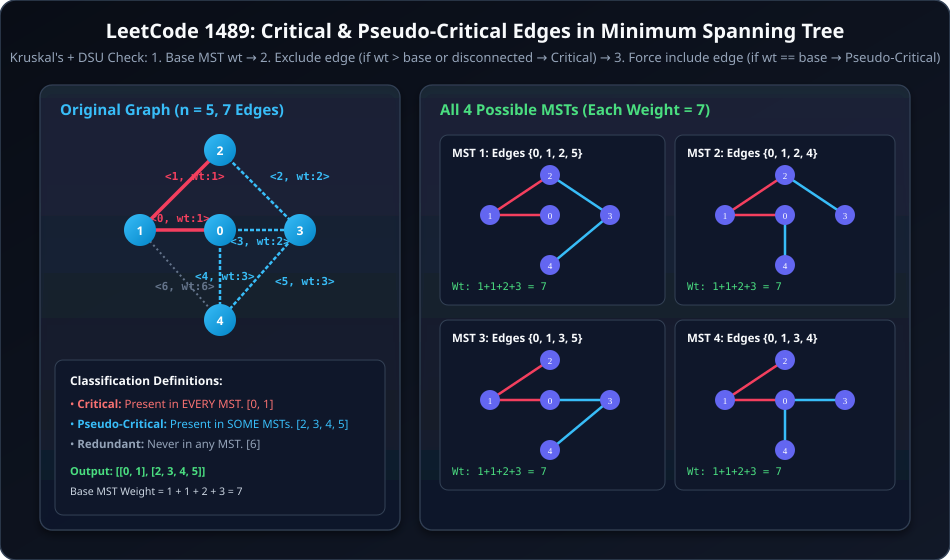

### Examples
**Example 1:**
```text
Input: n = 5, edges = [[0,1,1],[1,2,1],[2,3,2],[0,3,2],[0,4,3],[3,4,3],[1,4,6]]
Output: [[0,1],[2,3,4,5]]
Explanation:
- Base MST weight = 7.
- Edges 0 and 1 appear in every possible MST -> Critical.
- Edges 2, 3, 4, 5 appear in at least one MST -> Pseudo-Critical.
- Edge 6 (wt: 6) never appears in any MST -> Redundant.
```

### Constraints
- $2 \le n \le 100$
- $1 \le \text{edges.length} \le \min(200, \frac{n \times (n - 1)}{2})$
- $\text{edges}[i].\text{length} == 3$
- $0 \le a_i < b_i < n$
- $1 \le weight_i \le 1000$
- All pairs $(a_i, b_i)$ are distinct.

---

### Intuition & Algorithm Breakdown
1. **Base MST**: Calculate standard MST weight `baseMST` using Kruskal's algorithm with DSU.
2. **For each edge $i$**:
   - **Test 1 (Critical Check - Exclude edge $i$)**:
     - Run Kruskal's ignoring edge $i$.
     - If the graph cannot form a connected spanning tree (`components > 1`) OR if `newMST > baseMST`, edge $i$ is **CRITICAL**.
   - **Test 2 (Pseudo-Critical Check - Force include edge $i$)**:
     - If edge $i$ is not critical, force edge $i$ into the spanning tree initially (`dsu.union(u, v)` and `weight += wt`).
     - Run Kruskal's on the remaining edges.
     - If `newMST == baseMST`, edge $i$ is **PSEUDO-CRITICAL**.
     - Otherwise, it is a redundant edge.
3. **Time Complexity**: $O(E \times E \alpha(V)) \approx 200 \times 200 \times 1 = 4 \times 10^4$ ops $\ll 10^8$.

---

### Java Implementation
```java
import java.util.*;

class Solution {
    public static class DSU {
        private int[] par;
        private int[] rank;
        private int components;

        public DSU(int v) {
            par = new int[v];
            rank = new int[v];
            components = v;
            for (int i = 0; i < v; i++) {
                par[i] = i;
                rank[i] = 0;
            }
        }

        public int find(int v) {
            if (par[v] == v) return v;
            return par[v] = find(par[v]);
        }

        public boolean union(int v1, int v2) {
            int p1 = find(v1);
            int p2 = find(v2);
            if (p1 != p2) {
                if (rank[p1] < rank[p2]) {
                    par[p1] = p2;
                } else if (rank[p1] > rank[p2]) {
                    par[p2] = p1;
                } else {
                    par[p2] = p1;
                    rank[p1]++;
                }
                components--;
                return true;
            }
            return false;
        }

        public int getComponents() {
            return components;
        }
    }

    private int kruskalMST(int n, int[][] edges, int skipEdge, int forceEdge) {
        DSU dsu = new DSU(n);
        int wt = 0;

        // Force include edge if specified
        if (forceEdge != -1) {
            dsu.union(edges[forceEdge][0], edges[forceEdge][1]);
            wt += edges[forceEdge][2];
        }

        // Sort edges by weight
        List<int[]> edgeList = new ArrayList<>();
        for (int i = 0; i < edges.length; i++) {
            if (i == skipEdge || i == forceEdge) continue;
            edgeList.add(new int[]{edges[i][0], edges[i][1], edges[i][2], i});
        }
        edgeList.sort(Comparator.comparingInt(a -> a[2]));

        for (int[] e : edgeList) {
            if (dsu.union(e[0], e[1])) {
                wt += e[2];
            }
        }

        return dsu.getComponents() == 1 ? wt : Integer.MAX_VALUE;
    }

    public List<List<Integer>> findCriticalAndPseudoCriticalEdges(int n, int[][] edges) {
        int baseMST = kruskalMST(n, edges, -1, -1);

        List<Integer> critical = new ArrayList<>();
        List<Integer> pseudoCritical = new ArrayList<>();

        for (int i = 0; i < edges.length; i++) {
            // Check Critical: exclude edge i
            int wtWithout = kruskalMST(n, edges, i, -1);
            if (wtWithout > baseMST) {
                critical.add(i);
            } else {
                // Check Pseudo-Critical: force include edge i
                int wtWith = kruskalMST(n, edges, -1, i);
                if (wtWith == baseMST) {
                    pseudoCritical.add(i);
                }
            }
        }

        List<List<Integer>> res = new ArrayList<>();
        res.add(critical);
        res.add(pseudoCritical);
        return res;
    }
}
```

### C++ Implementation
```cpp
#include <vector>
#include <numeric>
#include <algorithm>
#include <climits>
using namespace std;

class DSU {
private:
    vector<int> par;
    vector<int> rank;
    int components;

public:
    DSU(int n) : par(n), rank(n, 0), components(n) {
        iota(par.begin(), par.end(), 0);
    }

    int find(int u) {
        if (par[u] == u) return u;
        return par[u] = find(par[u]);
    }

    bool unite(int u, int v) {
        int rootU = find(u);
        int rootV = find(v);
        if (rootU != rootV) {
            if (rank[rootU] < rank[rootV]) {
                par[rootU] = rootV;
            } else if (rank[rootU] > rank[rootV]) {
                par[rootV] = rootU;
            } else {
                par[rootV] = rootU;
                rank[rootU]++;
            }
            components--;
            return true;
        }
        return false;
    }

    int getComponents() const {
        return components;
    }
};

class Solution {
private:
    int kruskalMST(int n, const vector<vector<int>>& edges, int skipEdge, int forceEdge) {
        DSU dsu(n);
        int totalWeight = 0;

        if (forceEdge != -1) {
            dsu.unite(edges[forceEdge][0], edges[forceEdge][1]);
            totalWeight += edges[forceEdge][2];
        }

        vector<vector<int>> sortedEdges;
        for (int i = 0; i < (int)edges.size(); i++) {
            if (i == skipEdge || i == forceEdge) continue;
            sortedEdges.push_back({edges[i][0], edges[i][1], edges[i][2], i});
        }
        sort(sortedEdges.begin(), sortedEdges.end(), [](const auto& a, const auto& b) {
            return a[2] < b[2];
        });

        for (const auto& e : sortedEdges) {
            if (dsu.unite(e[0], e[1])) {
                totalWeight += e[2];
            }
        }

        return dsu.getComponents() == 1 ? totalWeight : INT_MAX;
    }

public:
    vector<vector<int>> findCriticalAndPseudoCriticalEdges(int n, vector<vector<int>>& edges) {
        int baseMST = kruskalMST(n, edges, -1, -1);

        vector<int> critical;
        vector<int> pseudoCritical;

        for (int i = 0; i < (int)edges.size(); i++) {
            int wtWithout = kruskalMST(n, edges, i, -1);
            if (wtWithout > baseMST) {
                critical.push_back(i);
            } else {
                int wtWith = kruskalMST(n, edges, -1, i);
                if (wtWith == baseMST) {
                    pseudoCritical.push_back(i);
                }
            }
        }

        return {critical, pseudoCritical};
    }
};
```

### Complexity Analysis
- **Time Complexity**: $\mathcal{O}(E^2 \cdot \alpha(V) + E \log E)$
  - **Reason**:
    1. **Edge Sorting**: Sorting the $E$ edges based on edge weights takes $\mathcal{O}(E \log E)$.
    2. **Base MST**: Running Kruskal's algorithm once to compute `baseMST` takes $\mathcal{O}(E \cdot \alpha(V))$, where $\alpha$ is the inverse Ackermann function ($\alpha(V) < 5$).
    3. **Critical & Pseudo-Critical Testing**:
       - For each of the $E$ edges:
         - Execute Kruskal's excluding the $i$-th edge $\implies \mathcal{O}(E \cdot \alpha(V))$. If tree weight exceeds `baseMST` (or graph disconnects), the edge is **critical**.
         - If not critical, execute Kruskal's force-including the $i$-th edge $\implies \mathcal{O}(E \cdot \alpha(V))$. If tree weight equals `baseMST`, the edge is **pseudo-critical**.
       - Testing all $E$ edges takes at most $2 \times E \times \mathcal{O}(E \cdot \alpha(V)) = \mathcal{O}(E^2 \cdot \alpha(V))$.
    - **Total Time Complexity**: $\mathcal{O}(E \log E + E^2 \cdot \alpha(V)) = \mathcal{O}(E^2 \cdot \alpha(V))$.
- **Space Complexity**: $\mathcal{O}(V + E)$
  - **Reason**:
    - Disjoint Set Union (DSU) uses `parent` and `rank` arrays of size $V \implies \mathcal{O}(V)$ space.
    - Storing edge lists with original index mappings and output lists of critical/pseudo-critical indices requires $\mathcal{O}(E)$ auxiliary space.

---

## Q7 LeetCode 841: Keys and Rooms

### Problem Statement
There are $n$ rooms labeled from $0$ to $n - 1$ and all the rooms are locked except for room $0$. Your goal is to visit all the rooms. However, you cannot enter a locked room without having its key.

When you visit a room, you may find a set of **distinct keys** in it. Each key has a number on it, denoting which room it unlocks, and you can take all of them with you to unlock the other rooms.

Given an array `rooms` where `rooms[i]` is the set of keys that you can obtain if you visited room $i$, return `true` if you can visit **all** the rooms, or `false` otherwise.

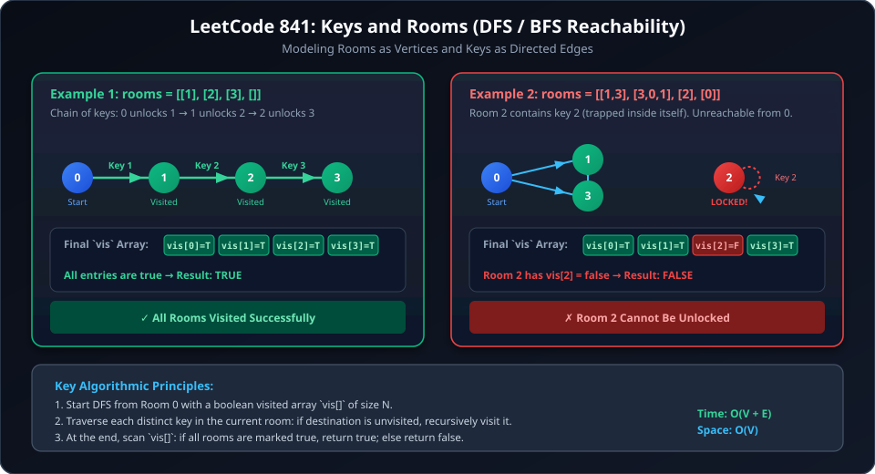

### Examples
**Example 1:**
```text
Input: rooms = [[1],[2],[3],[]]
Output: true
Explanation: 
Visit room 0 -> get key 1.
Visit room 1 -> get key 2.
Visit room 2 -> get key 3.
Visit room 3. All rooms visited -> true.
```

**Example 2:**
```text
Input: rooms = [[1,3],[3,0,1],[2],[0]]
Output: false
Explanation: We cannot enter room number 2 since the only key that unlocks it is inside room 2 itself.
```

### Constraints
- $n == \text{rooms.length}$
- $2 \le n \le 1000$
- $0 \le \text{rooms}[i].\text{length} \le 1000$
- $1 \le \sum \text{rooms}[i].\text{length} \le 3000$
- $0 \le \text{rooms}[i][j] < n$
- All values of `rooms[i]` are unique.

---

### Java Implementation
```java
import java.util.*;

class Solution {
    private void dfs(int v, boolean[] vis, List<List<Integer>> rooms) {
        vis[v] = true;
        for (int nbr : rooms.get(v)) {
            if (!vis[nbr]) {
                dfs(nbr, vis, rooms);
            }
        }
    }

    public boolean canVisitAllRooms(List<List<Integer>> rooms) {
        int n = rooms.size();
        boolean[] vis = new boolean[n];

        dfs(0, vis, rooms);

        for (boolean v : vis) {
            if (!v) return false;
        }
        return true;
    }
}
```

### C++ Implementation
```cpp
#include <vector>
using namespace std;

class Solution {
private:
    void dfs(int u, vector<bool>& vis, const vector<vector<int>>& rooms) {
        vis[u] = true;
        for (int nbr : rooms[u]) {
            if (!vis[nbr]) {
                dfs(nbr, vis, rooms);
            }
        }
    }

public:
    bool canVisitAllRooms(vector<vector<int>>& rooms) {
        int n = rooms.size();
        vector<bool> vis(n, false);

        dfs(0, vis, rooms);

        for (bool visited : vis) {
            if (!visited) return false;
        }
        return true;
    }
};
```

### Complexity Analysis
- **Time Complexity**: $\mathcal{O}(V + E)$ (where $V = N$ is the number of rooms, and $E = \sum \text{rooms}[i].\text{length}$ is the total number of keys)
  - **Reason**:
    1. **Vertex Traversal**: The DFS algorithm visits each room (vertex) at most once because of the `vis` (visited) boolean check.
    2. **Edge Traversal**: For each visited room $u$, every key $v \in \text{rooms}[u]$ (directed edge $u \to v$) is processed exactly once.
    3. **Final Verification**: A single loop through the `vis` array checks room reachability in $\mathcal{O}(N)$ time.
    - **Total Time Complexity**: $\mathcal{O}(V + E)$.
- **Space Complexity**: $\mathcal{O}(V)$
  - **Reason**:
    1. The `vis` boolean array of size $N$ requires $\mathcal{O}(V)$ memory.
    2. In the worst-case scenario (a linear chain of rooms $0 \to 1 \to 2 \dots \to N-1$), the recursive call stack reaches a depth of $N$, using $\mathcal{O}(V)$ stack space.

---

## Q8 LeetCode 1791: Find Center of Star Graph

### Problem Statement
There is an undirected star graph consisting of $n$ nodes labeled from $1$ to $n$. A star graph is a graph where there is one center node and exactly $n - 1$ edges that connect the center node with every other node.

You are given a 2D integer array `edges` where each $\text{edges}[i] = [u_i, v_i]$ indicates that there is an edge between the nodes $u_i$ and $v_i$. Return the center of the given star graph.

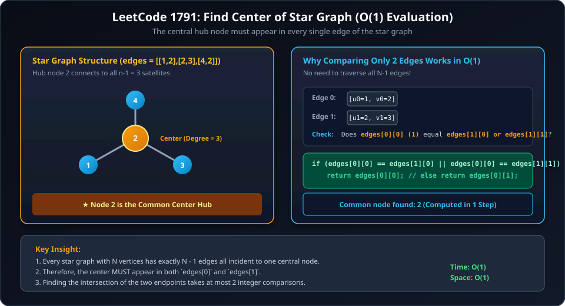

### Examples
**Example 1:**
```text
Input: edges = [[1,2],[2,3],[4,2]]
Output: 2
Explanation: Node 2 is connected to nodes 1, 3, and 4. Node 2 is the center.
```

**Example 2:**
```text
Input: edges = [[1,2],[5,1],[1,3],[1,4]]
Output: 1
```

### Constraints
- $3 \le n \le 10^5$
- $\text{edges.length} == n - 1$
- $\text{edges}[i].\text{length} == 2$
- $1 \le u_i, v_i \le n$, $u_i \ne v_i$
- The given `edges` represent a valid star graph.

---

### Intuition & $O(1)$ Logic
- By definition of a star graph, the center node has a degree of $n - 1$ and **must appear in every single edge**.
- Therefore, we only need to compare the first two edges `edges[0]` and `edges[1]`.
- The common vertex between `edges[0]` and `edges[1]` is guaranteed to be the center node.

---

### Java Implementation
```java
class Solution {
    public int findCenter(int[][] edges) {
        if (edges[0][0] == edges[1][0] || edges[0][0] == edges[1][1]) {
            return edges[0][0];
        }
        return edges[0][1];
    }
}
```

### C++ Implementation
```cpp
#include <vector>
using namespace std;

class Solution {
public:
    int findCenter(vector<vector<int>>& edges) {
        if (edges[0][0] == edges[1][0] || edges[0][0] == edges[1][1]) {
            return edges[0][0];
        }
        return edges[0][1];
    }
};
```

### Complexity Analysis
- **Time Complexity**: $\mathcal{O}(1)$
  - **Reason**:
    - The star graph center must appear as an endpoint in every edge.
    - We only examine the endpoints of the first two edges: `edges[0][0]`, `edges[0][1]`, `edges[1][0]`, and `edges[1][1]`.
    - This requires at most two integer comparisons, which takes strictly $\mathcal{O}(1)$ constant time regardless of $N$ (even for $N = 10^5$).
- **Space Complexity**: $\mathcal{O}(1)$
  - **Reason**: No auxiliary data structures, recursion stack, or additional memory allocations are required.

---

## Summary & Complexity Cheatsheet

| Algorithm / Problem | Purpose | Time Complexity | Space Complexity | Key Concept / Condition |
| :--- | :--- | :--- | :--- | :--- |
| **Bellman-Ford (SSSP)** | Single source shortest path with negative edge weights | $O(V \times E)$ | $O(V)$ | Relax $(V-1)$ times; $V$-th pass detects negative cycles |
| **LC 1627: Graph Connectivity** | Multiples connectivity with gcd threshold | $O(N \log N + Q \cdot \alpha(N))$ | $O(N)$ | Sieve-like DSU union of multiples ($2i, 3i, \dots \le N$) |
| **Floyd-Warshall (APSP)** | All-pairs shortest path dynamic programming | $O(V^3)$ | $O(V^2)$ / $O(1)$ aux | $k$ (intermediate node) is outermost loop; $V \le 400$ |
| **Network Flow (Edmonds-Karp)**| Maximum flow from Source to Sink | $O(V \times E^2)$ | $O(V^2)$ | Residual graph + BFS augmenting path + reverse edge cancellation |
| **LC 1334: City with Smallest Neighbors** | City with minimum reachable neighbors at distance threshold | $O(N^3)$ | $O(N^2)$ | Floyd-Warshall APSP + threshold count with highest index tie-breaker |
| **LC 1489: Critical/Pseudo Edges** | Classify MST edge criticality | $O(E^2 \cdot \alpha(V))$ | $O(V + E)$ | Exclude $\to$ Critical if weight increases; Force Include $\to$ Pseudo-Critical |
| **LC 841: Keys and Rooms** | Visit all rooms reachability | $O(V + E)$ | $O(V)$ | Standard DFS / BFS from room 0 |
| **LC 1791: Center of Star Graph** | Find central node in star graph | $O(1)$ | $O(1)$ | Common vertex in first two edges `edges[0]` & `edges[1]` |
