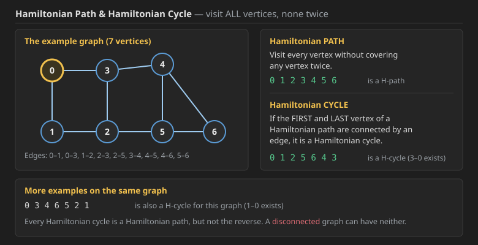
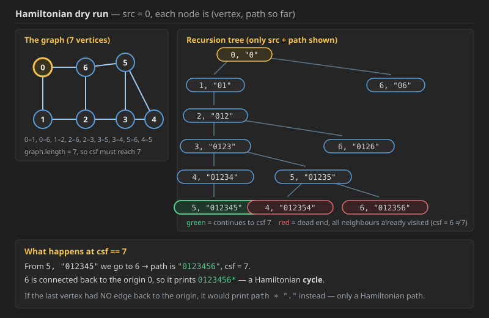
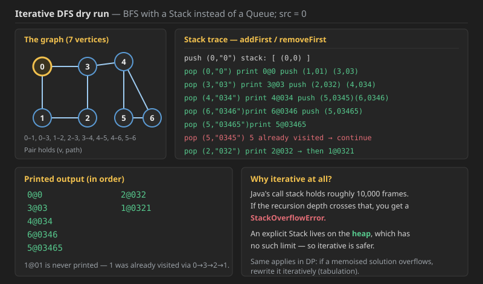
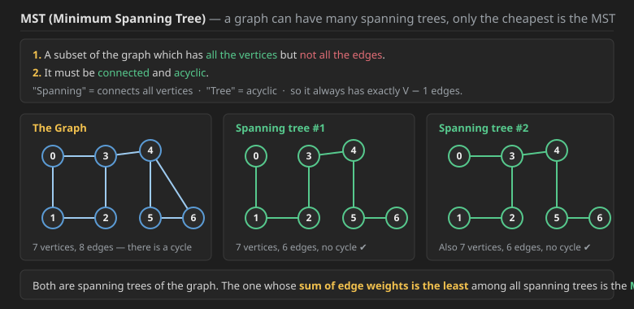
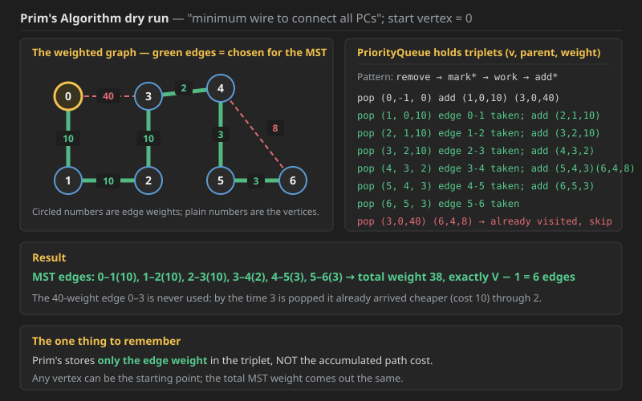
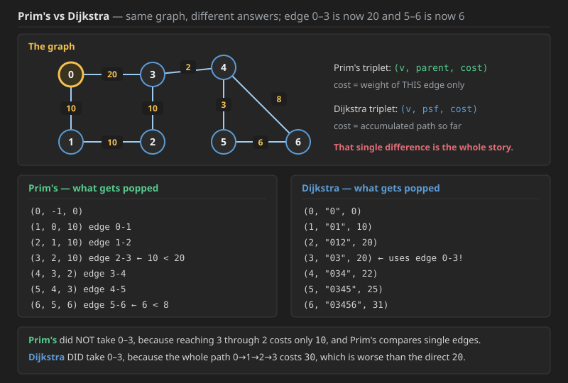

## Q1. Hamiltonian Path & Hamiltonian Cycle

### The definitions

**Hamiltonian path** ⟹ visit all the vertices **without covering any vertex twice**.



For the graph with edges `0-1, 0-3, 1-2, 2-3, 2-5, 3-4, 4-5, 4-6, 5-6`:

* `0 1 2 3 4 5 6` is a **Hamiltonian path**.
* `0 1 2 5 6 4 3` is a **Hamiltonian cycle**, because `3` and `0` are connected by an edge.
* `0 3 4 6 5 2 1` is also a Hamiltonian cycle for this graph.

> **If the 1st vertex and the last vertex of a Hamiltonian path are connected by an edge, then it is a Hamiltonian cycle.**
>
> **Hamiltonian ⟹ visit ALL vertices.**

### The Problem

**Q → Print all Hamiltonian paths and Hamiltonian cycles in lexicographically increasing order.**

Solution notes:

* Generally the lexicographically increasing order comes out on its own, because the adjacency list is already built in increasing order of vertex number.
* All the paths have to be printed, which means:
  * **un-visit in the post** (backtrack — set `vis[src] = false` on the way out)
  * this is `printAllPaths`-style code
  * **stop when all the vertices are visited**


**The hint:** have a variable **`csf` (count so far)** which tells how many vertices are visited, and the **base case** will be `if (csf == graph.length)`, since we print our path when all of the vertices are visited.

###  with `csf` (this one is good)

```java
public static void print_hp_and_c(ArrayList<Edge>[] graph, int src,
                                  int csf, boolean[] vis, String path, int origin) {
    if (csf == graph.length) {
        System.out.println(path);
        return;
    }

    vis[src] = true;
    for (Edge e : graph[src]) {
        if (vis[e.nbr] == false) {
            print_hp_and_c(graph, e.nbr, csf + 1, vis, path + e.nbr, src);
        }
    }
    vis[src] = false;
}
```

Called from `main()` as:

```java
int src = Integer.parseInt(br.readLine());

boolean[] vis = new boolean[vtces];
print_hp_and_c(graph, src, 1, vis, src + "", src);
```

### Now, how do we differentiate between a Hamiltonian path and a Hamiltonian cycle?

For that we pass the **origin**, which is `src` every time. So if the last vertex has a child that is the origin, then it is a **Hamiltonian cycle**, else it is a **Hamiltonian path**. In the base case:

```java
for (var val : graph[src]) {
    if (val == origin) {
        print cycle;
        return;
    }
}
print path;
return;
```

**A critical detail about the `origin` parameter.** Look at what happens if `src` is passed as the origin on every recursive call instead of the fixed starting vertex:

```text
(g, 0, 1, vis, 0)        origin = 0
        ↓
(g, 1, 1+1, vis, 0)      origin still 0   ← correct
        ↓
(g, 2, 2+1, vis, 0)      origin still 0   ← correct
```

But if you pass `src` there instead, the origin will keep changing and become the same as `src`:

```text
(g, 0, 1, vis, 0)
        ↓
(g, 1, 2, vis, 0)
        ↓
(g, 2, 3, vis, 1)      ← origin has become the parent!
        ↓
(g, 3, 4, vis, 2)      ← now at the base case, 2 (the marked one) will be
                          a neighbour of 3, as it is coming from there only.
                          It would ALWAYS print a cycle. That's why.
```

**So the origin must be kept fixed** — that is why it is explained here, so this mistake never happens.

### The final code

```java
public static void print_hp_and_c(ArrayList<Edge>[] graph, int src,
                                  int csf, boolean[] vis, String path, int origin) {
    if (csf == graph.length) {
        for (var e : graph[src]) {
            int v = e.nbr;
            if (v == origin) {              // cycle condition
                System.out.println(path + "*");
                return;
            }
        }
        System.out.println(path + ".");     // this is only a path
        return;
    }

    vis[src] = true;
    for (Edge e : graph[src]) {
        if (vis[e.nbr] == false) {
            print_hp_and_c(graph, e.nbr, csf + 1, vis, path + e.nbr, origin);
        }
    }
    vis[src] = false;
}
```

Called from `main()`:

```java
boolean[] vis = new boolean[vtces];
print_hp_and_c(graph, src, 1, vis, src + "", src);
```

### Why `vis[src] = false` in the post?

In "print all paths" style code you have to also do `vis[src] = false` on the way back out, because when the visits keep piling up, one path gets travelled and then `vis[src]` stays `true`, so a second path will never be travelled at all. That is why doing `vis[src] = false` in the post of the recursion is a **must**.

### The equivalent code written a different way

This is the same thing, just a different shape — a `closingEdgeFound` flag instead of an early `return`:

```java
// from main:
boolean[] visited = new boolean[vtces];
travelAround(graph, visited, src, 1, src + "", src);

static void travelAround(ArrayList<Edge>[] graph, boolean[] visited,
                         int src, int csf, String psf, int orig) {
    if (csf == graph.length) {
        System.out.print(psf);

        boolean closingEdgeFound = false;
        for (Edge e : graph[src]) {
            if (e.nbr == orig) {
                closingEdgeFound = true;
                break;
            }
        }

        if (closingEdgeFound) {
            System.out.println("*");
        } else {
            System.out.println(".");
        }

        return;
    }

    visited[src] = true;

    for (Edge e : graph[src]) {
        if (visited[e.nbr] == false) {
            travelAround(graph, visited, e.nbr, csf + 1, psf + e.nbr + "", orig);
        }
    }

    visited[src] = false;
}
```

### Dry run of the code



Take the 7-vertex graph with edges `0-1, 0-6, 1-2, 2-6, 2-3, 3-5, 3-4, 5-6, 4-5` and `src = 0`. The call is `(0, graph, 0)` — showing only `src` and `path`:

```text
                    (0, "0")
                   /         \
            (1, "01")        (6, "06")
                |
           (2, "012")
           /         \
   (3, "0123")      (6, "0126")
     /       \
(4,"01234")  (5,"01235")
     |          /        \
(5,"012345") (4,"012354") (6,"012356")
     |
(6,"0123456")
```

Step by step:

* `2` is visited, so mark `vis[2] = true`.
* `3` is visited here, so `vis[3] = true`.
* Now we see `4`, so mark `vis[4] = true`.
* Now we are on `6`: `csf == length of graph`, so the base case is now hit. `6` is connected to `0`, so it is a **Hamiltonian cycle** → prints `0123456*`.
* In the **post** of `6`, `return`. In the **post** of `5`, `vis[5] = false`. In the **post** of `4`, `vis[4] = false`.
* Now we go left to right, and after that we do `(5, "01235")`.

Continuing on that branch:

* Now at `4` we see both of its neighbours are visited, so there is nothing to visit — the recursion dies for `4`.
* At `(6, "012356")` we make `vis[5] = false`, and here we mark `vis[3] = false` too.
* Now we explore the path of `6` from the top: `(0,"0") → (6,"06")`.

### The three conditions to remember

At the base case we find out whether our last edge is connected to the 1st vertex — the **origin**. If they are connected then it is a **Hamiltonian cycle**, else it is a **Hamiltonian path**.

1. **If the last vertex and the origin are connected**, then it is a Hamiltonian cycle in the base case, else it is a Hamiltonian path.
2. **The last node is never visited.** It is never marked as `true` — look specially at the algorithm here.
3. **`csf = 1` initially**, and it says "1 vertex has already gone in — it is not here right now", which is why the base case is `if (csf == graph.length)`.
   * If you instead set `csf = 0`, that says "0 vertices have been visited", and then the base case must be `if (csf == graph.length - 1)`, meaning `graph.length - 1` vertices have been visited so now the print will happen.
   * The last vertex is never visited, `visit[v] = true` is never done for it — it is printed directly.

### Why a disconnected graph can never have a Hamiltonian path

In a disconnected graph a Hamiltonian path is impossible, because the very definition of Hamiltonian is "travel all the vertices from `src`". If it is disconnected, how would a path even be found from one vertex to a vertex sitting outside its component?


### C++ Code for Q1 (was missing — same logic as the Java above)

```cpp
struct Edge {
    int src;
    int nbr;
    Edge(int src, int nbr) : src(src), nbr(nbr) {}
};

void print_hp_and_c(vector<vector<Edge>>& graph, int src,
                    int csf, vector<bool>& vis, string path, int origin) {
    if (csf == (int) graph.size()) {
        for (Edge& e : graph[src]) {
            int v = e.nbr;
            if (v == origin) {                 // cycle condition
                cout << path << "*" << endl;
                return;
            }
        }
        cout << path << "." << endl;           // this is only a path
        return;
    }

    vis[src] = true;
    for (Edge& e : graph[src]) {
        if (vis[e.nbr] == false) {
            print_hp_and_c(graph, e.nbr, csf + 1, vis,
                           path + to_string(e.nbr), origin);
        }
    }
    vis[src] = false;                          // un-visit in the post
}

// call from main:
//   vector<bool> vis(vtces, false);
//   print_hp_and_c(graph, src, 1, vis, to_string(src), src);
```

**Complexity (Q1 — Hamiltonian paths and cycles):**

* **Time — `O(V!)`** in the worst case (more precisely `O(V · V!)` if you count the cost of building each path string). This is **not** a `O(V+E)` traversal: because `vis[src]` is set back to `false` in the post, every vertex can be revisited on a different branch, so the recursion explores every possible **permutation** of the vertices. On a complete graph, from the start vertex there are `V-1` choices, then `V-2`, then `V-3`… giving `(V-1)!` root-to-leaf paths. Deciding whether *any* Hamiltonian path exists is **NP-complete**, so there is no known polynomial algorithm — brute-force backtracking is the expected answer.
* **Space — `O(V)`.** The `vis` array is `V` booleans, and the recursion depth is at most `V` (a path can never repeat a vertex, so the call stack cannot exceed the vertex count). The `path` string is also at most `V` characters — but note that in Java `path + e.nbr` creates a **new string at every call**, so if you count the transient strings the working space climbs to `O(V²)`; a `StringBuilder` with add/remove around the recursive call avoids that.
* **Why the un-visit matters for complexity:** a normal DFS marks a vertex once and never returns, which is what makes it linear. Removing that guarantee is exactly what turns this into factorial time — it is the price of enumerating *all* paths rather than just reaching every vertex once.

---

## Q2. Knight's Tour

**Knight's Tour → a virtual graph question, and a question of the Hamiltonian path.**

The knight should move over **all the cells of the board**, and you have to **print the board**.

* **Every cell is a vertex**, and the **edges are all the places the knight can reach with its 2.5 move** (the L-shape).
* It is a "virtual" graph because no adjacency list is ever built — the neighbours are computed on the fly from the 8 knight moves.

> **Whenever there is a "path" question, we need to un-mark it (backtrack), as we need to get all the paths.**

**Do it yourself** *(already done in Recursion — you should revisit it.)*

---

## Q3. Iterative DFS

> *Is Dijkstra DP or greedy? It's a fight — don't think about it, nobody asks that.*

**Iterative DFS → in BFS, in place of the Queue just use a Stack. Nothing else at all.**



### The code (accepted, perfect)

```java
static class Edge {
    int src;
    int nbr;

    Edge(int src, int nbr) {
        this.src = src;
        this.nbr = nbr;
    }
}

static class Pair {
    int v;
    String path;

    Pair(int v, String path) {
        this.v = v;
        this.path = path;
    }
}

// inside main:
int src = Integer.parseInt(br.readLine());
boolean[] vis = new boolean[vtces];
LinkedList<Pair> stk = new LinkedList<>();
stk.addFirst(new Pair(src, src + ""));
while (stk.size() > 0) {
    Pair removed = stk.removeFirst();
    if (vis[removed.v] == true) continue;
    vis[removed.v] = true;
    System.out.println(removed.v + "@" + removed.path);
    for (Edge e : graph[removed.v]) {
        if (vis[e.nbr] == false) {
            stk.addFirst(new Pair(e.nbr, removed.path + e.nbr));
        }
    }
}
```

> Note it is `e.nbr` that is pushed, **not** `e.v` — that is the small trap here.

### The BFS pattern, and how it changes here

**A way to remember BFS → `remove`, `mark*`, `work`, `add*`.**

The **reverse order** comes out in this one, because it is a stack: whatever goes in last comes out first.

### Dry run

Take the 7-vertex graph with edges `0-1, 0-3, 1-2, 2-3, 3-4, 4-5, 4-6, 5-6`, starting from `src = 0`:

```text
(0,"0") is added to the stack
```

* Pop `(0,"0")` → **output: `0@0`**. Push `(1,"01")` and `(3,"03")`.
  This is a stack, so `(1,"01")` sits at the bottom and `(3,"03")` is on top — so `(3,"03")` comes out first.
* Pop `(3,"03")` → **output: `3@03`**. Push `(2,"032")` and `(4,"034")`.
* Pop `(4,"034")` → **output: `4@034`**. Push `(5,"0345")` and `(6,"0346")`.
* Pop `(6,"0346")` — this is the top of the stack → **output: `6@0346`**. Push `(5,"03465")`. `4` is not added, as it is already visited.
* Pop `(5,"03465")` → **output: `5@03465`**.
* Pop `(5,"0345")` — when it gets here it sees `5` is already visited, **so it will just be removed** (the `continue`).
* Pop `(2,"032")` → **output: `2@032`**. Push `(1,"0321")`.
* Pop `(1,"0321")` → **output: `1@0321`**.

`1@01` will **never** be printed, as `1` is already visited by then.

### Why iterative at all?

Roughly **10,000 items** can go into Java's stack, so recursion calls can go to about 10,000 — after that you get a **StackOverflow** in Java. That is why we have to use iterative sometimes: this Stack is allocated in the **heap** and the heap has no such limit, so iterative is better.

The same thing happens in **DP**: if you write a solution and it doesn't work and there is a stack overflow, then you need to write it iteratively.

Whenever you get stuck in recursion in Java, always go for the iterative solution, as you might be dying by stack overflow. **Not only in graphs but wherever there is a stack overflow, use the iterative solution.**

### C++ Code for Q3 (was missing — same logic as the Java above)

```cpp
struct Edge {
    int src;
    int nbr;
    Edge(int src, int nbr) : src(src), nbr(nbr) {}
};

struct Pair {
    int v;
    string path;
    Pair(int v, string path) : v(v), path(path) {}
};

void iterativeDFS(vector<vector<Edge>>& graph, int src) {
    int vtces = graph.size();
    vector<bool> vis(vtces, false);

    list<Pair> stk;                                 // used as a stack
    stk.push_front(Pair(src, to_string(src)));

    while (!stk.empty()) {
        Pair removed = stk.front();
        stk.pop_front();

        if (vis[removed.v] == true) continue;
        vis[removed.v] = true;

        cout << removed.v << "@" << removed.path << endl;

        for (Edge& e : graph[removed.v]) {
            if (vis[e.nbr] == false) {
                stk.push_front(Pair(e.nbr, removed.path + to_string(e.nbr)));
            }
        }
    }
}
```

**Complexity (Q3 — Iterative DFS):**

* **Time — `O(V + E)`.** Every vertex is *printed* exactly once, guarded by the `if (vis[removed.v]) continue;` check, and when it is popped we scan its adjacency list once — summed over all vertices that walks every edge once. The subtlety is that a vertex can be **pushed** more than once (once per unvisited neighbour that sees it), so the stack can hold up to `O(E)` entries; those duplicates are discarded in `O(1)` each by the `continue`, so they do not change the bound.
* **Space — `O(V + E)`.** The `vis` array is `O(V)`, but the stack itself can grow to `O(E)` because of those duplicate pushes. On top of that, each `Pair` carries a path string of length up to `O(V)`, so if you store paths the real memory is `O(E · V)` — drop the path field and it collapses back to `O(E)`.
* **The whole point:** this is asymptotically identical to recursive DFS, but the storage moved from the **call stack (a few MB, hard limit ~10⁴ frames in Java)** to the **heap (gigabytes)**. Same complexity, no `StackOverflowError`.

---

## MST — Minimum Spanning Tree

### The categories

```text
Minimum wire to connect all PCs   →   Prim's Algorithm

Minimum Spanning Tree  ─┬─→  Kruskal   
                        └─→  Prim's    

Shortest Path  ─┬─→  BFS               (Level 1)
                ├─→  Dijkstra          (Level 1)
                ├─→  Bellman-Ford      (Level 2)
                └─→  Floyd-Warshall    (Level 2)
```

> **Prim's is like Dijkstra, and you must know it.**

### What is an MST?



**MST (Minimum Spanning Tree) →**

1. A **subset of the graph** which has **all the vertices** and **not all the edges**.
2. It must be **connected** and **acyclic**.

A graph can have several spanning trees. **The one whose sum of edge weights is the least among all the spanning trees is the Minimum Spanning Tree.**

---

## Q4. Prim's Algorithm (Minimum Spanning Tree)

### The problem

We have laptops and LAN cable, and we need to **connect all of the laptops using the minimum amount of LAN cable**.



The graph: 7 vertices with edges `0-3 @ 40`, `0-1 @ 10`, `1-2 @ 10`, `2-3 @ 10`, `3-4 @ 2`, `4-5 @ 3`, `4-6 @ 8`, `5-6 @ 3`.
*(In the diagram the circled numbers are weights and the non-circled ones are vertices.)*

**Two algorithms for this → Prim's and Kruskal.** Prim's is like Dijkstra, so we study it in Level 1.

### The approach

Here we can assume **any vertex** as the starting point. Let's assume `0` is the starting point.

We use a **priority queue** and put a triplet in it: **`(vertex v, parent v, weight wt)`**.

In Dijkstra we have `psf` (path so far); here we have, in place of `psf`, the **parent** in the triplet.

The BFS pattern still applies: **`remove`, `mark*`, `work`, `add*`**.

### The dry run

```text
Start:   (0, -1, 0)        v=0, parent=-1, weight=0 (nothing is acquiring 0)
```

* **Pop `(0, -1, 0)`.** Add its neighbours: `(1, 0, 10)` and `(3, 0, 40)`.
* **Pop `(1, 0, 10)`** — it is the minimum weight. The edge `1-2` is added next: push `(2, 1, 10)`.
  `0` is **not** added back, as it is already visited.
* **Pop `(2, 1, 10)`.** Push `(3, 2, 10)`.
* **Pop `(3, 2, 10)`** — chosen because it is the minimum weight it has (`10` beats the `40` sitting in `(3, 0, 40)`). Push `(4, 3, 2)`.
  The old entry for edge `4-3`… i.e. `(3, 0, 40)`, is **deleted** when it eventually comes out, since `3` is already visited.
* **Pop `(4, 3, 2)`.** Mark `4` visited and then add its neighbours: `(5, 4, 3)` and `(6, 4, 8)`.
* **Pop `(5, 4, 3)`.** Push `(6, 5, 3)`.
* **Pop `(6, 5, 3)`.** Done.

Now the rest of the nodes in the recursion tree will not be visited, as all the nodes of the graph are already visited.

**MST edges: `0-1(10)`, `1-2(10)`, `2-3(10)`, `3-4(2)`, `4-5(3)`, `5-6(3)` → total weight 38.**

### The difference between Dijkstra and Prim's



Prim's puts **`(v, parent, cost)`** into the queue; Dijkstra puts **`(v, psf, cost)`** into it.

> **Dijkstra has "cost so far", but Prim's has only the cost (of this one edge).**

Take a slightly modified version of the same graph: `0-3` is now **20** and `5-6` is now **6**.

**Prim's** pops, in order:

```text
(0, -1,  0)
(1,  0, 10)   edge 0-1
(2,  1, 10)   edge 1-2
(3,  2, 10)   edge 2-3     ← 10 < 20, so 0-3 is skipped
(4,  3,  2)   edge 3-4
(5,  4,  3)   edge 4-5
(6,  5,  6)   edge 5-6     ← 6 < 8, so 4-6 is skipped
```

**Dijkstra** pops, in order:

```text
(0, "0",      0)
(1, "01",    10)
(2, "012",   20)
(3, "03",    20)   ← takes the direct edge 0-3
(4, "034",   22)
(5, "0345",  25)
(6, "03456", 31)
```

> **Prim's did not take `0-3`**, because reaching `3` via `2-3` costs only `10`, which is less than `20`.
> **Dijkstra did take `0-3`**, because for Dijkstra `psf = "0123"` gives `csf = 30`, whereas going directly gives `csf = 20`.

The rest gets deleted and stuck at `continue` (all pre-marked).

**Prim's is like: in the priority queue, put in whatever is connected, and whatever is connected and minimum will come out.**
**Dijkstra is shortest path, so in that we need to add the current path + edge weight.**

*Dijkstra and Prim's both create confusion, which is why this is written down.*

The **cost of an MST** can be found even for a **disconnected graph** — the code below just sums whatever it can reach; run the outer loop over all components if you need the full forest.

> The code for Prim's is in the **Prims** section further down, and the Dijkstra code is in the section right below.

### Java Code for Q4 — printing the actual MST edges (was missing; the section below only returns the total weight)

```java
class Solution {
    static class Trip {
        int v;
        int parent;
        int wt;

        Trip(int v, int parent, int wt) {
            this.v = v;
            this.parent = parent;
            this.wt = wt;
        }
    }

    public static void primsMST(int V, List<List<int[]>> adj) {
        PriorityQueue<Trip> pq = new PriorityQueue<>((a, b) -> a.wt - b.wt);
        pq.add(new Trip(0, -1, 0));
        boolean[] vis = new boolean[V];
        int total = 0;

        while (pq.size() > 0) {
            Trip rem = pq.remove();
            if (vis[rem.v] == true) continue;   // stale entry, skip
            vis[rem.v] = true;

            if (rem.parent != -1) {
                System.out.println(rem.parent + "-" + rem.v + "@" + rem.wt);
                total += rem.wt;
            }

            for (int[] itr : adj.get(rem.v)) {
                int nbr = itr[0];
                int w = itr[1];
                if (vis[nbr] == false) {
                    pq.add(new Trip(nbr, rem.v, w));   // only the edge weight
                }
            }
        }
        System.out.println("MST weight = " + total);
    }
}
```

### C++ Code for Q4 — printing the actual MST edges

```cpp
struct Trip {
    int v;
    int parent;
    int wt;
    Trip(int v, int parent, int wt) : v(v), parent(parent), wt(wt) {}
};

void primsMST(int V, vector<vector<pair<int,int>>>& adj) {
    auto cmp = [](const Trip& a, const Trip& b) { return a.wt > b.wt; };  // min-heap
    priority_queue<Trip, vector<Trip>, decltype(cmp)> pq(cmp);

    pq.push(Trip(0, -1, 0));
    vector<bool> vis(V, false);
    int total = 0;

    while (!pq.empty()) {
        Trip rem = pq.top();
        pq.pop();

        if (vis[rem.v] == true) continue;      // stale entry, skip
        vis[rem.v] = true;

        if (rem.parent != -1) {
            cout << rem.parent << "-" << rem.v << "@" << rem.wt << endl;
            total += rem.wt;
        }

        for (auto& itr : adj[rem.v]) {
            int nbr = itr.first;
            int w = itr.second;
            if (vis[nbr] == false) {
                pq.push(Trip(nbr, rem.v, w));  // only the edge weight
            }
        }
    }
    cout << "MST weight = " << total << endl;
}
```

**Complexity (Q4 — Prim's Algorithm):**

* **Time — `O(E log E)`, which is the same as `O(E log V)`.** Each edge can be pushed into the priority queue at most once from each of its two endpoints, so the heap holds up to `O(E)` entries and every push/pop costs `log E`. Since `E ≤ V²`, `log E ≤ log V² = 2 log V`, so the two forms are interchangeable. The `if (vis[rem.v]) continue;` guard makes the stale duplicates free — they are discarded in `O(1)`.
* **Space — `O(E + V)`.** In the worst case the min-heap stores all `E` edges, and the `visited` array takes `O(V)`. The adjacency list itself is `O(V + E)` but that is the input.
* **Why it is the *same* shape as Dijkstra:** both are "pop the cheapest frontier item, mark it, push its unvisited neighbours". The **only** difference is what number goes into the heap — Prim's pushes `w` (the single edge), Dijkstra pushes `dist[u] + w` (the accumulated path). That one token is what turns a shortest-path algorithm into a minimum-spanning-tree algorithm, and it costs nothing in complexity.
* **Versus Kruskal (`O(E log E)` too):** Kruskal sorts *all* edges up front and uses DSU; Prim's grows a single tree from one vertex. Prefer Prim's on **dense** graphs (many edges) and Kruskal on **sparse** ones.

---

### Q5. Dijkstara

#### java


```java
class Solution
{
    static class trip{
        int v;
        int wt;
        trip(int v,int wt){
            this.v=v;
            this.wt=wt;
        }
    }
    public  int[] dijkstra(int V, ArrayList<ArrayList<ArrayList<Integer>>> adj, int S)
    {
        PriorityQueue<trip> pq=new PriorityQueue<>((trip a,trip b)-> (a.wt-b.wt));
        pq.add(new trip(S ,0));
        boolean[] vis=new boolean[V];
        int[] res=new int[V];

        // if nit reachable return infinity
        Arrays.fill(res, (int)1e9);
        while(pq.size()>0){
            trip rem=pq.remove();
            if(vis[rem.v]==true) continue;
            vis[rem.v]=true;
            res[rem.v]=rem.wt;
            for(var itr:adj.get(rem.v)){
                int nbr=itr.get(0);
                int w=itr.get(1);
                if(vis[nbr]==false){
                    pq.add(new trip(nbr,rem.wt+w));
                }
            }
        }
        
       return res;
    }
}

```

----
#### java2

```java
// Online Java Compiler
// Use this editor to write, compile and run your Java code online
import java.util.*;
class Main {
    static class trip{
        int v;
        int wt;
        String psf;
        trip(int v,int wt,String psf){
            this.v=v;
            this.wt=wt;
            this.psf=psf;
        }
        
        @Override
        public String toString() {
            return "shortest path to src to "+ v + " path = " + wt + " path=" + psf;
        }
    }
    public static void printShortestPaths(List<List<int[]>> g,int src){
        PriorityQueue<trip> pq=new PriorityQueue<>((trip a,trip b)-> (a.wt-b.wt));
        pq.add(new trip(src ,0, src +""));
        boolean[] vis=new boolean[g.size()];
        
        while(pq.size()>0){
            trip rem=pq.remove();
            if(vis[rem.v]==true) continue;
            vis[rem.v]=true;
            System.out.println(rem);
            for(int[] itr:g.get(rem.v)){
                int nbr=itr[0];
                int w=itr[1];
                if(vis[nbr]==false){
                    pq.add(new trip(nbr,rem.wt+w,rem.psf+","+nbr));
                }
            }
        }
        
        
    }
    public static void main(String[] args) {
        // ===== TEST CASE 1 =====
        // Graph from example:
        // A(0) -4- B(1) -1- C(2) -3- E(4)
        //  \15/         \2/   \1/
        //    C(2)       D(3)---E(4)
        int n1 = 5; // A=0, B=1, C=2, D=3, E=4
        List<List<int[]>> graph1 = new ArrayList<>();
        for (int i = 0; i < n1; i++) graph1.add(new ArrayList<>());
        addEdge(graph1, 0, 1, 4);
        addEdge(graph1, 0, 2, 15);
        addEdge(graph1, 1, 2, 1);
        addEdge(graph1, 1, 3, 2);
        addEdge(graph1, 2, 4, 3);
        addEdge(graph1, 3, 4, 1);

        System.out.println("Test Case 1:");
        printShortestPaths(graph1, 0);

        // ===== TEST CASE 2 =====
        // Simple triangle
        // A(0) -5- B(1)
        // B(1) -2- C(2)
        // A(0) -9- C(2)
        int n2 = 3;
        List<List<int[]>> graph2 = new ArrayList<>();
        for (int i = 0; i < n2; i++) graph2.add(new ArrayList<>());
        addEdge(graph2, 0, 1, 5);
        addEdge(graph2, 1, 2, 2);
        addEdge(graph2, 0, 2, 9);

        System.out.println("\nTest Case 2:");
        printShortestPaths(graph2, 0);

        // ===== TEST CASE 3 =====
        // Linear chain: A -2- B -2- C -2- D
        int n3 = 4;
        List<List<int[]>> graph3 = new ArrayList<>();
        for (int i = 0; i < n3; i++) graph3.add(new ArrayList<>());
        addEdge(graph3, 0, 1, 2);
        addEdge(graph3, 1, 2, 2);
        addEdge(graph3, 2, 3, 2);

        System.out.println("\nTest Case 3:");
        printShortestPaths(graph3, 0);
    }

    // Helper: add undirected edge
    static void addEdge(List<List<int[]>> graph, int u, int v, int w) {
        graph.get(u).add(new int[]{v, w});
        graph.get(v).add(new int[]{u, w});
    }
}


/*
Test Case 1:
shortest path to src to 0 path = 0 path=0
shortest path to src to 1 path = 4 path=0,1
shortest path to src to 2 path = 5 path=0,1,2
shortest path to src to 3 path = 6 path=0,1,3
shortest path to src to 4 path = 7 path=0,1,3,4

Test Case 2:
shortest path to src to 0 path = 0 path=0
shortest path to src to 1 path = 5 path=0,1
shortest path to src to 2 path = 7 path=0,1,2

Test Case 3:
shortest path to src to 0 path = 0 path=0
shortest path to src to 1 path = 2 path=0,1
shortest path to src to 2 path = 4 path=0,1,2
shortest path to src to 3 path = 6 path=0,1,2,3

=== Code Execution Successful ===
*/
```
#### Cpp
```cpp
#include <bits/stdc++.h>
using namespace std;

class Solution {
public:
    struct Trip {
        int v;
        int wt;
        Trip(int v, int wt) : v(v), wt(wt) {}
    };

    vector<int> dijkstra(int V, vector<vector<vector<int>>>& adj, int S) {
        auto cmp = [](const Trip &a, const Trip &b) {
            return a.wt > b.wt; // min-heap
        };
        priority_queue<Trip, vector<Trip>, decltype(cmp)> pq(cmp);

        pq.push(Trip(S, 0));
        vector<bool> vis(V, false);
        vector<int> res(V, (int)1e9);

        while (!pq.empty()) {
            Trip rem = pq.top();
            pq.pop();

            if (vis[rem.v]) continue;
            vis[rem.v] = true;
            res[rem.v] = rem.wt;

            for (auto &itr : adj[rem.v]) {
                int nbr = itr[0];
                int w = itr[1];
                if (!vis[nbr]) {
                    pq.push(Trip(nbr, rem.wt + w));
                }
            }
        }

        return res;
    }
};

int main() {
    Solution sol;

    // Example: Graph with 5 vertices
    int V = 5;
    vector<vector<vector<int>>> adj(V);

    // Adding edges: u -> v (weight)
    adj[0].push_back({1, 2});
    adj[0].push_back({2, 4});
    adj[1].push_back({2, 1});
    adj[1].push_back({3, 7});
    adj[2].push_back({4, 3});
    adj[3].push_back({4, 1});

    int source = 0;
    vector<int> dist = sol.dijkstra(V, adj, source);

    cout << "Shortest distances from source " << source << ":\n";
    for (int d : dist) cout << d << " ";
    cout << endl;

    return 0;
}

```

#### Cpp — path-printing version (was missing this is the C++ of the "java2" code above)

```cpp
#include <bits/stdc++.h>
using namespace std;

struct Trip {
    int v;
    int wt;
    string psf;
    Trip(int v, int wt, string psf) : v(v), wt(wt), psf(psf) {}

    string toString() const {
        return "shortest path to src to " + to_string(v) +
               " path = " + to_string(wt) + " path=" + psf;
    }
};

void printShortestPaths(vector<vector<pair<int,int>>>& g, int src) {
    auto cmp = [](const Trip& a, const Trip& b) { return a.wt > b.wt; };  // min-heap
    priority_queue<Trip, vector<Trip>, decltype(cmp)> pq(cmp);

    pq.push(Trip(src, 0, to_string(src)));
    vector<bool> vis(g.size(), false);

    while (!pq.empty()) {
        Trip rem = pq.top();
        pq.pop();

        if (vis[rem.v] == true) continue;
        vis[rem.v] = true;
        cout << rem.toString() << endl;

        for (auto& itr : g[rem.v]) {
            int nbr = itr.first;
            int w = itr.second;
            if (vis[nbr] == false) {
                pq.push(Trip(nbr, rem.wt + w, rem.psf + "," + to_string(nbr)));
            }
        }
    }
}

// Helper: add undirected edge
void addEdge(vector<vector<pair<int,int>>>& graph, int u, int v, int w) {
    graph[u].push_back({v, w});
    graph[v].push_back({u, w});
}
```

**Complexity (Q5 — Dijkstra's Algorithm):**

* **Time — `O(E log V)`.** Every edge can trigger at most one push into the priority queue (one per relaxation that improves a distance), so the heap holds up to `O(E)` entries; each push and pop costs `log E`, and `log E ≤ log V² = 2 log V = O(log V)`. Hence `O(E log V)`. The `if (vis[rem.v]) continue;` line is what keeps the stale duplicates cheap — without it you would re-expand already-finalised vertices.
* **Space — `O(V + E)`.** The `dist`/`vis` arrays are `O(V)`, and the priority queue can grow to `O(E)` because of those duplicate entries. Iterative, so no recursion stack. **In the path-printing version each queue entry also carries a `psf` string of length up to `O(V)`, pushing the real memory to `O(E · V)`** — that is the cost of remembering routes, not just distances.
* **The constraint that matters:** Dijkstra requires **non-negative** edge weights. Once a vertex is popped and marked, its distance is treated as final; a negative edge could later offer a cheaper route, and there is no mechanism to un-finalise it. For negative weights you need Bellman-Ford.

### Prims — the code for Q4

#### java

```java
class Solution {
    static class trip{
        int v;
        int wt;
        trip(int v,int wt){
            this.v=v;
            this.wt=wt;
        }
    }
    public int spanningTree(int V, List<List<List<Integer>>> adj) {
        PriorityQueue<trip> pq=new PriorityQueue<>((trip a,trip b)-> (a.wt-b.wt));
        pq.add(new trip(0 ,0));
        boolean[] vis=new boolean[V];
        int wt=0;
        while(pq.size()>0){
            trip rem=pq.remove();
            if(vis[rem.v]==true) continue;
            vis[rem.v]=true;
            wt+=rem.wt;
            for(var itr:adj.get(rem.v)){
                int nbr=itr.get(0);
                int w=itr.get(1);
                if(vis[nbr]==false){
                    pq.add(new trip(nbr,w));
                }
            }
        }
        
       return wt;
    }
}


```

#### Cpp
```cpp
#include <bits/stdc++.h>
using namespace std;

/*
Time Complexity: O(ElogE) (where E is the number of edges in the graph)
In the worst case, the min-heap will store all the E edges, and insertion 
operation on the min-heap takes O(logE) time taking overall O(ElogE) time.

Space Complexity: O(E + V) (where V is the number of nodes in the graph)
The min-heap will store all edges in worst-case taking O(E) space and the
 visited array takes O(V) space.
*/
#define P pair<int,int>

class Solution{
public:

    // Function to get the sum of weights of edges in MST
    int spanningTree(int V, vector<vector<int>> adj[]) {
        priority_queue <P, vector<P>, greater<P>> pq;
        vector<int> visited(V, 0);
        pq.push({0,0});
    
        int sum = 0;
        while(!pq.empty()) {
            
            auto p = pq.top();
            pq.pop();
            
            int node = p.second; // Get the node
            int wt = p.first; // Get the edge weight
            if(visited[node] == 1) continue;

            visited[node] = 1;
            
            sum += wt;

            for(auto it : adj[node]) {
                int adjNode = it[0]; 
                int edgeWt = it[1];
                if(visited[adjNode] == 0) {
                    pq.push({edgeWt, adjNode});
                }
            }
        }
        
        // Return the weight of MST
        return sum;
    }
};


int main() {
    int V = 4;
    vector<vector<int>> edges = {
        {0, 1, 1},
        {1, 2, 2},
        {2, 3, 3},
        {0, 3, 4}
    };
    
    // Forming the adjacency list from edges
    vector<vector<int>> adj[4];
    for(auto it : edges) {
        int u = it[0];
        int v = it[1];
        int wt = it[2];
        
        adj[u].push_back({v, wt});
        adj[v].push_back({u, wt});
    }
    
    // Creating instance of Solution class
    Solution sol;
    
    /* Function call to get the sum 
    of weights of edges in MST */
    int ans = sol.spanningTree(V, adj);
    
    cout << "The sum of weights of edges in MST is: " << ans;
    
    return 0;
}
```