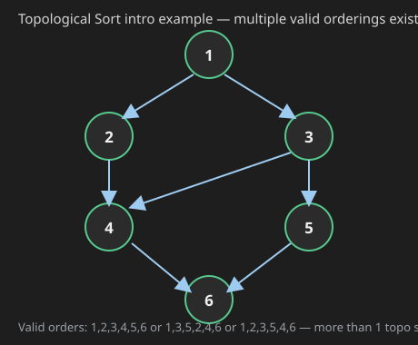
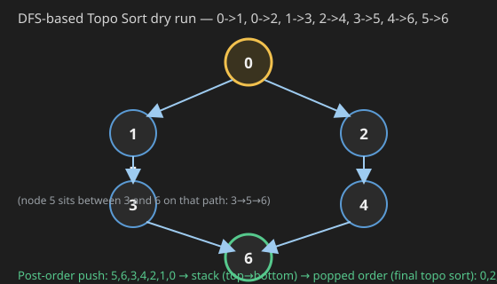

**Implementation of Prim's Algo done in previous class.**

```java
static class trip implements Comparable<trip> {
    int v;
    int par;
    int wt;
    trip(int v, int par, int wt) {
        this.v = v;
        this.par = par;
        this.wt = wt;
    }
    public int compareTo(trip o) {
        if (this.wt > o.wt) return 1;
        else if (this.wt < o.wt) return -1;
        else return 0;
    }
}

PriorityQueue<trip> pq = new PriorityQueue<>();
boolean[] vis = new boolean[vtces];
pq.add(new trip(0, -1, 0));
while (pq.size() > 0) {
    trip removed = pq.remove();
    int vtx = removed.v;
    int parent = removed.par;
    int weight = removed.wt;
    if (vis[vtx] == true) continue;
    vis[vtx] = true;
    if (parent != -1) {
        System.out.println("[" + vtx + "-" + parent + "@" + weight + "]");
    }
    for (Edge e : graph[vtx]) {
        int neibr = e.nbr;
        if (vis[neibr] == false) {
            pq.add(new trip(neibr, vtx, e.wt));
        }
    }
}
// Perfect — My code
```

*(Jaise parent `-1` toh use print nahi karne — the use print vhi karne the as given in question & sample input & output.)*


## Q1. Topological Sort (DFS-based & Kahn's / BFS-based)


**It is only applied to Directed Acyclic Graph. We will first see what is Directed Acyclic Graph.**

**Prim's mein source nahi hota generally** (there's no fixed "source" concept in Prim's) — `0` se start hota hai as we have graph vertices from `0` to `n-1`.


### What is Topological Sort?

**Topological Sort is a permutation of vertices such that if we have edge from `u` to `v`, then `u` comes first & `v` in Topo Sort.** `[Topo Sort -> Topological Sort]`



Possible valid orderings for the graph above:
```
1, 2, 3, 4, 5, 6
1, 3, 5, 2, 4, 6      } More than 1 Topo Sort possible
1, 2, 3, 5, 4, 6
```

**Used where we need to find out in which order we should complete task.**

**Topo sort is used where we have dependencies:** every task like here — before `2`, `1` needs to be done, & so on, & we need to still find in which order we should complete the task.

**Topo sort is only valid for acyclic & directed graph.**

Simple way to fill Topo sort is we going to see on next page. That will make you write topo sort, but not the algo (Algo is different).

### Kahn's-style Vertex-Removal Intuition (preview)

**Remove vertex & corresponding edges. Output → `0`.**

New out of `1` & `2`, we can take out — any results in 2 different topo sort, as `1` & `2` are not dependent on any other — we remove `2` first (or `1` first).

```
Remove 0 -> O/P: 0
Remove 2 -> O/P: 0,2       (1 & 4 are now candidates)
Remove 4 -> O/P: 0,2,4     (New: only 1 remains as candidate, since 4's only outgoing edge was to 1)
Remove 1 -> O/P: 0,2,4,1   (1 is the only independent one here, remove 1)
Remove 3 -> O/P: 0,2,4,1,3
Remove 5 -> O/P: 0,2,4,1,3,5
```

*(This vertex-by-vertex removal of independent nodes is exactly the intuition behind Kahn's Algorithm, covered fully below.)*

### DFS-based Approach — Hint

**For algo → Hint → Post-order mein Stack mein push karte hai [need to have External Stack].**

**DFS ke post-order mein Stack mein push hoga.**

```java
LinkedList<Integer> stk = new LinkedList<>();
boolean[] vis = new boolean[vtces];

for (int i = 0; i < vtces; i++) {
    if (vis[i] == false) {
        toposort(graph, vis, i, stk);
    }
}

while (stk.size() > 0) {
    System.out.println(stk.removeFirst());
}
// main() code

public static void toposort(ArrayList<Edge>[] graph, boolean[] vis, int i, LinkedList<Integer> stk) {
    vis[i] = true;
    for (Edge e : graph[i]) {
        int vtx = e.nbr;
        if (vis[vtx] == false) {
            toposort(graph, vis, vtx, stk);
        }
    }
    stk.addFirst(i);
}
// fn code — No need of base case here
```

### Dry Run — Post Order mein Stack mein bhar do

Example graph: `0->1, 0->2, 1->3, 2->4, 3->5, 4->6, 5->6`.



```
vis[0] = true
  -> go to 1: vis[1] = true
     -> go to 3: vis[3] = true
        -> go to 5: vis[5] = true
           -> go to 6: vis[6] = true (no further children, post & add 6 to stack)
           post 5, push 5 to stack
        post 3, push 3 to stack
     post 1, push 1 to stack
  -> go to 2: vis[2] = true
     -> go to 4: vis[4] = true
        -> 6 is already visited, so we don't add that (stack is: 6,5,3,1)
        post 4, push 4 to stack
     post 2, push 2 to stack
post 0, push 0 to stack
```

Stack (bottom→top) after all pushes: `6, 5, 3, 1, 4, 2, 0` — **stack filled with all nodes.**

Now from TOS (Top of Stack) delete & print, so: **`0, 2, 4, 1, 3, 5, 6` is printed, that is Topological Order.**

**Why it works?** Jinke vertex ki dependency hai, voh already visit ho gaye & last-dependent vertex is already done. TOS → Top of Stack.

*(Better way to understand — Read it as: `0` needs `1` & `2`. `1` needs `3` to compile. Aise hi → `6` is independent. So when we visit `5` in post, `6` is already in stack → `6` is already compiled. So now we can compile `5`. That's why we add vertex in post order. Also read topological sort in reverse order — e.g. our order was `0,2,4,1,3,5,6`. `6` compiled first, then `5`, then `3`, then `1`, then `4`, then `2`, & then at start `0`.)*

### Why Don't You Print in Preorder?

```
Example: 0->1, 0->2, 2->4, 1->3, 3->5, 4->5, 5->1
```

Preorder gives: `0, 1, 3, 5, 6, 2, 4` — `4` compiled 1st but it is dependent on `6`, so **wrong**. See this:

```
0 -> 1
2 -> 1 (2 also points into 1)
```

Print `0, 1` & then we print `2` → we print `0, 1, 2` but see `2` is printed 1st without satisfying its dependency, i.e. `1` — if we have done with stack:

```
stack:
2
0
1
```

`2, 0, 1` is o/p — dependency is satisfied 1st & then rest.

### Full Code (DFS-based)

```java

public static void dfs_topo(int src, boolean[] vis, Stack<Integer> st) {
    vis[src] = true;
    for (Edge e : graph[src]) {
        if (!vis[e.v])
            dfs_topo(e.v, vis, st);
    }
    // Post-order: Add to stack after all dependencies are visited
    st.push(src);
}

public static void topologicalSort() {
    boolean[] vis = new boolean[N];
    Stack<Integer> st = new Stack<>();
    for (int i = 0; i < N; i++) {
        if (!vis[i]) {
            dfs_topo(i, vis, st);
        }
    }

    // Print or collect the result
    while (!st.isEmpty()) {
        System.out.print(st.pop() + " ");
    }
}
```
or 

```java
    public static void dfs_topo(int src, boolean[] vis, ArrayList<Integer> ans) {
        vis[src] = true;
        for (Edge e : graph[src]) {
            if (!vis[e.v])
                dfs_topo(e.v, vis, ans);
        }

        ans.add(src);
    }

    public static void topologicalSort() {
        boolean[] vis = new boolean[N];
        ArrayList<Integer> ans = new ArrayList<>();
        for (int i = 0; i < N; i++) {
            if (!vis[i]) {
                dfs_topo(i, vis, ans);
            }
        }

        Collections.reverse(ans);
    }

```
## Kahns algo or BFS topo sort

```java

public static ArrayList<Integer> kahnTopo(int N, ArrayList<Edge>[] graph) {
    int[] inDegree = new int[N];
    ArrayList<Integer> ans = new ArrayList<>();
    Queue<Integer> q = new LinkedList<>();

    // 1. Calculate In-degrees
    for (int i = 0; i < N; i++) {
        for (Edge e : graph[i]) {
            inDegree[e.v]++;
        }
    }

    // 2. Add nodes with 0 in-degree to Queue
    for (int i = 0; i < N; i++) {
        if (inDegree[i] == 0) q.add(i);
    }

    // 3. Standard BFS
    while (!q.isEmpty()) {
        int curr = q.poll();
        ans.add(curr);

        for (Edge e : graph[curr]) {
            inDegree[e.v]--; // "Remove" the dependency
            if (inDegree[e.v] == 0) {
                q.add(e.v);
            }
        }
    }

    // Cycle Check: If ans doesn't contain all nodes, there's a cycle
    if (ans.size() != N) return new ArrayList<>(); 

    return ans;
}
```

Topological Sort (whether via DFS or Kahn's) only exists for DAGs. If a graph has even one cycle, a complete topological ordering is mathematically impossible.

Which one should you use?
- Use DFS if you need a quick, recursive solution and you are 100% sure the graph is a DAG.

- Use Kahn's if you need to detect cycles easily or if you want the "lexicographically smallest" topological sort (by using a PriorityQueue instead of a regular Queue)

### C++ Code — DFS-based Topo Sort

```cpp
void dfs_topo(int src, vector<vector<Edge>>& graph, vector<bool>& vis, list<int>& stk) {
    vis[src] = true;
    for (Edge& e : graph[src]) {
        if (!vis[e.v])
            dfs_topo(e.v, graph, vis, stk);
    }
    // Post-order: push after all dependencies are visited
    stk.push_front(src);
}

list<int> topologicalSort(int N, vector<vector<Edge>>& graph) {
    vector<bool> vis(N, false);
    list<int> stk;
    for (int i = 0; i < N; i++) {
        if (!vis[i]) {
            dfs_topo(i, graph, vis, stk);
        }
    }
    return stk;   // already in topological order, front to back
}
```

### C++ Code — Kahn's Algorithm (BFS-based)

```cpp
vector<int> kahnTopo(int N, vector<vector<Edge>>& graph) {
    vector<int> inDegree(N, 0);
    vector<int> ans;
    queue<int> q;

    // 1. Calculate In-degrees
    for (int i = 0; i < N; i++) {
        for (Edge& e : graph[i]) {
            inDegree[e.v]++;
        }
    }

    // 2. Add nodes with 0 in-degree to Queue
    for (int i = 0; i < N; i++) {
        if (inDegree[i] == 0) q.push(i);
    }

    // 3. Standard BFS
    while (!q.empty()) {
        int curr = q.front();
        q.pop();
        ans.push_back(curr);

        for (Edge& e : graph[curr]) {
            inDegree[e.v]--;   // "Remove" the dependency
            if (inDegree[e.v] == 0) {
                q.push(e.v);
            }
        }
    }

    // Cycle Check: If ans doesn't contain all nodes, there's a cycle
    if ((int)ans.size() != N) return {};

    return ans;
}
```

**Complexity:**
- **Time:** `O(V + E)` for both approaches — the DFS version visits every vertex and every edge exactly once across all the recursive calls combined (standard DFS traversal cost), and pushing to the stack is `O(1)` per vertex. Kahn's algorithm computes in-degrees with one pass over all edges (`O(E)`), then each vertex is enqueued/dequeued exactly once (`O(V)`) and each edge is examined exactly once when decrementing in-degrees (`O(E)`), giving `O(V+E)` total.
- **Space:** `O(V)` for both — the DFS version needs the `vis` array + the stack (each holding at most `V` entries), plus `O(V)` recursion-stack depth in the worst case (a graph that's one long chain). Kahn's needs the `inDegree` array + the queue + the `ans` list, each `O(V)`.

## Unrelated Asides (leftover from other lecture topics)

*(The remaining images in this recording are leftover content from earlier/other lecture topics — number-of-islands-style matrix traversal, adjacency-matrix path printing, the handshake/degree-sum theorem, and Dijkstra's algorithm complexity — none of it is actually about Topological Sort. Transcribed here for completeness, faithfully, since they were part of the same image set.)*

### Aside — Print All Paths using Adjacency Matrix

Only neighbour ke loop badalega: `graph[src][i] != 0 && vis[i] == false`.

```java
public static void printAllPaths(Integer[][] graph, boolean[] visited, int src, int dest, String psf) {
    if (src == dest) {
        System.out.println(psf);
        return;
    }

    visited[src] = true;
    for (int nbr = 0; nbr < graph.length; nbr++) {
        if (graph[src][nbr] != null && visited[nbr] == false) {
            printAllPaths(graph, visited, nbr, dest, psf + nbr);
        }
    }

    visited[src] = false;
}
```

*(BC if `src == dest`, print `psf` — that's the base case that was originally missing from the draft version of this function.)*

### Aside — "Number of Islands"-style Matrix DFS (flood-fill via Stack)

```java
int count = 0;
for (int i = 0; i < m; i++) {
    for (int j = 0; j < n; j++) {
        if (arr[i][j] == 0) {
            count++;
            visit(arr, i, j);
        }
    }
}
System.out.println(count);

public static void visit(int[][] arr, int i, int j) {
    LinkedList<Pair> stk = new LinkedList<>();
    stk.addFirst(new Pair(i, j));

    while (stk.size() > 0) {
        Pair removed = stk.removeFirst();
        int ri = removed.i;
        int rj = removed.j;
        if (ri < 0 || ri >= arr.length || rj < 0 || rj >= arr[0].length || arr[ri][rj] == 1)
            continue;
        arr[ri][rj] = 1;
        stk.addFirst(new Pair(ri + 1, rj));
        stk.addFirst(new Pair(ri - 1, rj));
        stk.addFirst(new Pair(ri, rj + 1));
        stk.addFirst(new Pair(ri, rj - 1));
    }
}
// Avoid revisit
```

```java
static class Pair {
    int i;
    int j;
    Pair(int i, int j) {
        this.i = i;
        this.j = j;
    }
}
```

Iterative DFS in Adjacency Matrix — see previous code & you will be able to understand done day before, or even before just give it a check.

### Aside — BFS Traversal & the Handshake Theorem (`E = O(V²)`)

```java
ArrayDeque<Pair> queue = new ArrayDeque<>();
queue.add(new Pair(src, src + ""));
boolean[] visited = new boolean[vtces];
while (queue.size() > 0) {
    Pair rem = queue.remove();

    if (visited[rem.v] == true) {
        continue;
    }
    visited[rem.v] = true;
    System.out.println(rem.v + "@" + rem.psf);

    for (Edge e : graph[rem.v]) {
        if (visited[e.nbr] == false) {
            queue.add(new Pair(e.nbr, rem.psf + e.nbr));
        }
    }
}
```

`E -> 0` to `V²` — Edges can go from `0` to `O(V²)`, so we write `E = O(V²)`.

Also must know theorem: **Sum of degree of a graph `= 2E`**.

Example: 4-node square graph, each node degree `2` → sum of degrees `= 4 x 2 = 8 = 2(4) = 2(no. of edges)`.

Graph ki TC diagram se nikalti hai: `O(1)` (remove) + `O(no. of neighbours)` (the for-loop) per vertex. Summing over all vertices: `n0 + n1 + n2 + ... = O(no. of Edges)` where `n0, n1,...` are each vertex's own neighbour count — since `2 baar` addition ho jata hai (each edge gets counted from both its endpoints), total elements added to the queue over all time `= O(no. of Edges)`.

**So TC → `O(V + E)`.** (`O(V+V²) = O(V²)` if needed only in terms of `V`, else tell `O(V+E)`.)

**If we have Adjacency Matrix** then loop from `graph[src][i] != 0` runs for whole row of Matrix, so TC of that loop gets `O(V)` & before that we have done some constant work.

```
TC for 1 vertex   -> O(1 + V)                  } Adjacency Matrix
TC for V vertices -> O(V(1+V)) = O(V²) for n
```

### Aside — Dijkstra's Algorithm Complexity (`O((V+E) log V)`)

```java
while (pq.size() > 0) {
    pair peek = pq.remove();

    if (visited[peek.vertex])
        continue;
    visited[peek.vertex] = true;
    System.out.println(peek.vertex + " via " + peek.psf + " @ " + peek.wt);

    for (Edge e : graph[peek.vertex]) {
        if (visited[e.nbr] == false) {
            int wt = peek.wt + e.wt;
            String psf = peek.psf + e.nbr;
            pair np = new pair(e.nbr, wt, psf);
            pq.add(np);
        }
    }
}
```

Priority Queue add`s` & remove takes `O(log n)`. TC of Priority Queue has `n` elements — no. of elements in PQ at any time `= O(No. of Edges)`, as jab jab cycle hoti hai, uh uh 2 baar addition bhi ho jata hai, so elements in PQ at any time `= O(No. of Edges)`. (PQ → Priority Queue.)

```
E log E  =>  E log V²  =>  2 E log V  =>  O(E log V)
```

Basically we say `O((V+E) log E)` to be precise.

To remember: `(BFS TC) x log E`.

Another way: BFS TC is `O(V+E)` — there we have queue & add/remove takes `O(1)` time; here we have PQ so add/remove takes `O(log E)` time.

**So TC → `O((V+E) log E)`.** `O(V²)` later.