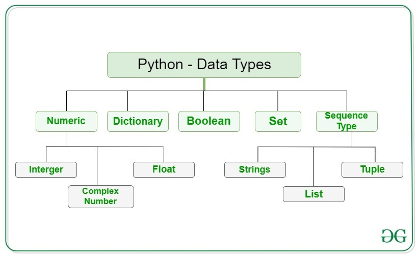

LANGUAGE FEATURES
 
* Interpreted
    * There are no separate compilation and execution steps like C and C++.
    * Directly run the program from the source code.
    * Internally, Python converts the source code into an intermediate form called bytecodes which is then translated into native language of specific computer to run it.
    * No need to worry about linking and loading with libraries, etc.
* Platform Independent
    * Python programs can be developed and executed on multiple operating system platforms.
    * Python can be used on Linux, Windows, Macintosh, Solaris and many more.
* Free and Open Source
    * Redistributable
* High-level Language
    * In Python, no need to take care about low-level details such as managing the memory used by the program.
* Simple
    * Closer to English language;Easy to Learn
    * More emphasis on the solution to the problem rather than the syntax
* Embeddable
    * Python can be used within C/C++ program to give scripting capabilities for the program's users.
* Robust
    * Exceptional handling features
    * Memory management techniques in built
* Rich Library Support
    * The Python Standard Library is very vast.
    * Known as the "batteries included" philosophy of Python ;It can help do various things involving regular expressions, documentation generation, unit testing, threading, databases, web browsers, CGI, email, XML, HTML, WAV files, cryptography, GUI and many more.
    * Besides the standard library, there are various other high-quality libraries such as the Python Imaging Library which is an amazingly simple image manipulation library.
* Dynamically Typed 
    * No need to declare anything. An assignment statement binds a name to an object, and the object can be of any type.
    * No type casting is  required when using container objects   
 > Note:
Statically Typed
    All variable names (along with their types) must be explicitly declared. Attempting to assign an object of the wrong type to a variable name triggers a type exception.
    Type casting is required when using container objects.   

[view Example 1](./001conditions.py)